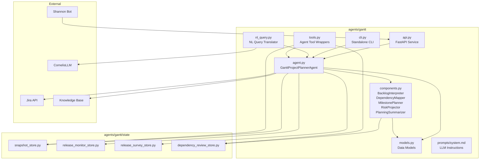
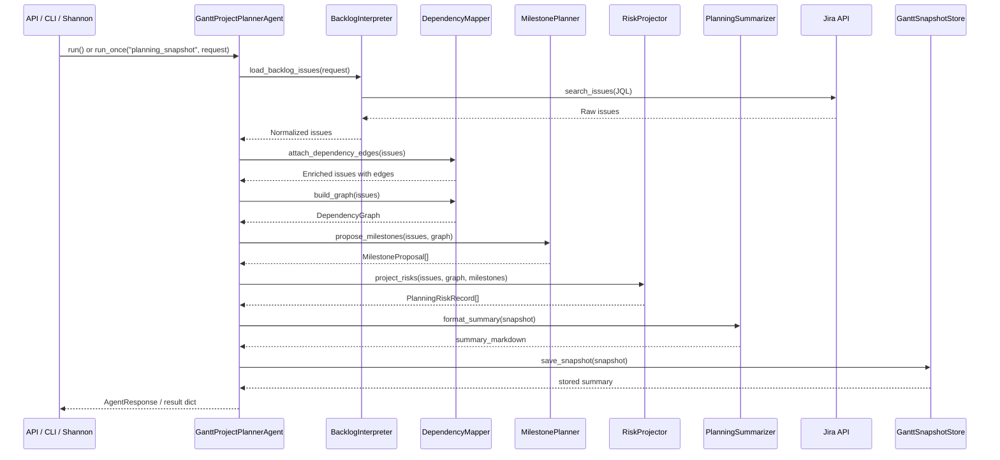
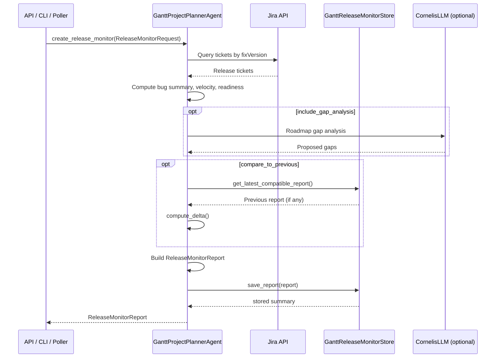
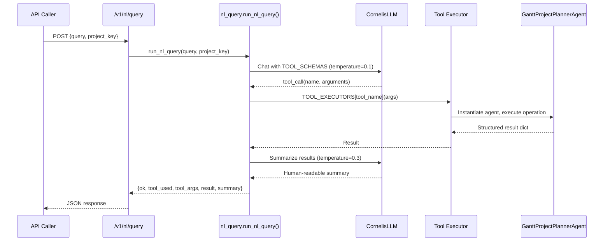

<!-- Generated by Documentation Agent — do not edit between markers -->

```yaml
---
title: "As-Built: Gantt Project Planner Agent"
date: "2026-04-03"
status: "draft"
---
```

# Module Overview

Gantt is the project-planning agent for the Cornelis Networks agent workforce platform. It consumes Jira work state — epics, stories, bugs, priorities, assignees, workflow statuses, and release targets — cross-references that data with technical evidence from other platform agents, and produces structured planning outputs: durable planning snapshots, release health monitoring reports, release execution surveys, dependency graphs, milestone proposals, and risk signals. The agent is deterministic-first: core planning logic runs through specialized component classes (`BacklogInterpreter`, `DependencyMapper`, `MilestonePlanner`, `RiskProjector`, `PlanningSummarizer`) without LLM involvement, while optional LLM-powered features (roadmap gap analysis, natural language query translation) are isolated behind explicit opt-in paths. Gantt is accessible through a FastAPI REST API (port 8202), a standalone CLI (`gantt-agent`), the unified `agent-cli`, and the Shannon Teams bot.

# What Changed

- **Before:** Gantt operated as a structured tool-call and CLI-driven agent. Users interacted through explicit commands specifying exact tool names, parameters, and release versions. There was no way to ask a plain-English question and have it translated into the appropriate Gantt operation.

- **After:** A new natural language query interface was added via `agents/gantt/nl_query.py` and exposed at `POST /v1/nl/query`. This module uses OpenAI function-calling to translate plain English questions (e.g., "how healthy is release 12.2?") into structured Gantt tool calls, executes them, and returns both raw results and an LLM-generated summary. The API layer gained the `NLQueryRequest` Pydantic model and the `/v1/nl/query` endpoint in `api.py`.

- **Impact:** Shannon and any API consumer can now route free-form planning questions to Gantt without requiring the caller to know the exact tool name or parameter format. The NL layer depends on `CornelisLLM` with the `developer-sonnet` model and makes two LLM calls per query (one for tool selection, one for result summarization), which introduces token cost for this path. All other Gantt operations remain deterministic and unaffected.

# Component Diagram



# Key Flows

## Flow 1: Planning Snapshot Creation

The primary flow. A user requests a planning snapshot for a Jira project. The agent queries Jira, normalizes issues, builds a dependency graph, proposes milestones, projects risks, and produces a durable snapshot with Markdown summary.



The `BacklogInterpreter.load_backlog_issues()` method builds JQL from the `PlanningRequest` (defaulting to `project = "X" AND issuetype != "Sub-task" AND statusCategory != Done ORDER BY updated DESC`) and normalizes each issue via `normalize_issue()`, which computes `age_days`, `is_stale`, `is_done`, and extracts `_issue_links` for downstream dependency processing.

## Flow 2: Release Monitor Report

Tracks the health of active releases by analyzing bug counts, velocity trends, readiness, and optionally running roadmap gap analysis.



The store's `get_latest_compatible_report()` method matches on project key, sorted release names, and scope label to find the most recent prior report for delta comparison.

## Flow 3: Natural Language Query

The newly added NL interface translates plain English into a structured Gantt tool call via LLM function-calling, executes it, and summarizes the results.



The `NL_SYSTEM_PROMPT` in `nl_query.py` encodes Cornelis-specific conventions (e.g., "user says '12.2' → use '12.2.0.x'") and maps question types to the five available tools: `gantt_release_health`, `gantt_release_tasks`, `gantt_planning_snapshot`, `gantt_release_survey`, and `gantt_plan_export`.

# Data Model

The core data structures are defined as Python dataclasses in `agents/gantt/models.py`. All models implement `to_dict()` for JSON serialization.

**Planning Domain:**

| Dataclass | Purpose | Key Fields |
|-----------|---------|------------|
| `PlanningRequest` | Input parameters for snapshot creation | `project_key`, `planning_horizon_days`, `limit`, `include_done`, `backlog_jql`, `policy_profile`, `evidence_paths` |
| `PlanningSnapshot` | Durable snapshot of project state | `snapshot_id` (8-char UUID), `project_key`, `created_at`, `backlog_overview`, `milestones`, `dependency_graph`, `risks`, `issues`, `summary_markdown` |
| `DependencyEdge` | Single directed dependency between two issues | `source_key`, `target_key`, `relationship`, `inferred`, `confidence`, `rule_id`, `review_state`, `rationale` |
| `DependencyGraph` | Full dependency graph for a backlog | `nodes`, `edges`, `blocked_keys`, `unscheduled_keys`, `cycle_paths`, `depth_by_key`, `blocker_chains`, `root_blockers`, `review_summary`, `suppressed_edges` |
| `MilestoneProposal` | Proposed milestone grouping | `name`, `source`, `target_date`, `issue_keys`, `total_issues`, `open_issues`, `done_issues`, `blocked_issues`, `confidence`, `risk_level` |
| `PlanningRiskRecord` | Identified planning risk | `risk_type`, `severity`, `title`, `description`, `issue_keys`, `evidence`, `recommendation` |

**Roadmap Domain:**

| Dataclass | Purpose | Key Fields |
|-----------|---------|------------|
| `RoadmapRequest` | Input for roadmap analysis | `project_key`, `scope_label`, `initiative_keys`, `fix_versions`, `hierarchy_depth`, `include_gap_analysis` |
| `RoadmapItem` | Single Jira ticket in the roadmap | `key`, `summary`, `issue_type`, `status`, `depth`, `source` ("Jira" or "Proposed") |
| `RoadmapGap` | LLM-identified missing work item | `summary`, `issue_type`, `priority`, `suggested_component`, `acceptance_criteria`, `dependencies` |
| `RoadmapSection` | Logical grouping of items and gaps | `title`, `items`, `gaps` |
| `RoadmapSnapshot` | Durable roadmap analysis output | `project_key`, `scope_label`, `snapshot_id`, `sections`, `summary_markdown` |

**Release Domain** (referenced in agent.py imports but defined later in models.py):

| Dataclass | Purpose |
|-----------|---------|
| `ReleaseMonitorRequest` / `ReleaseMonitorReport` | Release health monitoring input/output |
| `ReleaseSurveyRequest` / `ReleaseSurveyReport` | Release execution survey input/output |
| `BugSummary` | Bug status and priority breakdown |

**Persistence Layout:**

All stores use JSON-file-based persistence under `data/`:

```
data/gantt_snapshots/<PROJECT>/<SNAPSHOT_ID>/snapshot.json + summary.md
data/gantt_release_monitors/<PROJECT>/<REPORT_ID>/report.json + summary.md [+ .xlsx]
data/gantt_release_surveys/<PROJECT>/<SURVEY_ID>/survey.json + summary.md [+ .xlsx]
data/gantt_dependency_reviews/<PROJECT>.json
```

# Dependencies

| Dependency | Purpose | Version |
|------------|---------|---------|
| `agents.base` (internal) | `BaseAgent`, `AgentConfig`, `AgentResponse` base classes | — |
| `llm.base` / `llm.cornelis_llm` (internal) | `Message`, `CornelisLLM` for LLM interactions | — |
| `core.evidence` (internal) | `EvidenceBundle`, `load_evidence_bundle` for technical evidence | — |
| `core.release_tracking` (internal) | `ReleaseSnapshot`, `build_snapshot`, `compute_delta`, `compute_velocity`, `compute_cycle_time_stats`, `assess_readiness` | — |
| `core.tickets` (internal) | `issue_to_dict` for Jira issue normalization | — |
| `tools.jira_tools` (internal) | `JiraTools`, `get_jira`, `get_project_info`, `search_tickets`, `get_children_hierarchy`, `get_releases` | — |
| `tools.knowledge_tools` (internal) | `search_knowledge`, `list_knowledge_files`, `read_knowledge_file` | — |
| `tools.base` (internal) | `BaseTool`, `ToolResult`, `tool` decorator | — |
| `agents.pm_runtime` (internal) | `normalize_csv_list`, `notify_shannon` | — |
| `excel_utils` (internal) | `STATUS_FILL_COLORS`, `PRIORITY_FILL_COLORS`, header/formatting helpers | — |
| `config.env_loader` (internal) | `load_env` for environment bootstrapping | — |
| `FastAPI` (external) | REST API framework | — |
| `Pydantic` (external) | Request/response validation models | — |
| `openpyxl` (external) | Excel workbook generation | — |
| `python-dotenv` (external) | `.env` file loading in CLI | — |

# Configuration

| Variable / File | Purpose | Default |
|-----------------|---------|---------|
| `GANTT_SNAPSHOT_DIR` | Override storage directory for planning snapshots | `data/gantt_snapshots` |
| `GANTT_RELEASE_MONITOR_DIR` | Override storage directory for release monitor reports | `data/gantt_release_monitors` |
| `GANTT_RELEASE_SURVEY_DIR` | Override storage directory for release survey reports | `data/gantt_release_surveys` |
| `GANTT_DEPENDENCY_REVIEW_DIR` | Override storage directory for dependency review decisions | `data/gantt_dependency_reviews` |
| `GANTT_EXPORT_DIR` | Override directory for plan exports | `data/gantt_exports` |
| `CONFLUENCE_JIRA_SERVER` | Jira server name for Confluence links | `System Jira` |
| `CONFLUENCE_JIRA_SERVER_ID` / `JIRA_SERVER_ID` | Jira server ID for Confluence integration | `332fe428-27be-3c06-ad09-b2cd4d269bee` |
| `agents/gantt/prompts/system.md` | LLM system prompt — **required** at startup | No fallback; `FileNotFoundError` raised if missing |
| `--env FILE` (CLI flag) | Alternate `.env` file path | `.env` |
| `--poll-interval SECS` | Polling interval for scheduled mode | `300` |
| `--planning-horizon DAYS` | Planning horizon for snapshots | `90` |
| `--limit N` | Maximum issues to query | `200` |
| `--survey-mode MODE` | Survey mode: `feature_dev` or `bug` | `feature_dev` |

The API service listens on port **8202** (configured via uvicorn startup: `--port 8202`).

# Error Handling

**Agent-level:** The `run()` method wraps `create_snapshot()` in a try/except and returns `AgentResponse.error_response(str(e))` on any exception. The `run_once()` method raises `TypeError` for mismatched request types and `ValueError` for unsupported `task_type` values.

**Prompt loading:** `_load_prompt_file()` raises `FileNotFoundError` if `prompts/system.md` is missing — there is no hardcoded fallback prompt. This is an intentional fail-fast design:

```python
instruction = self._load_prompt_file()
if not instruction:
    raise FileNotFoundError(
        'agents/gantt/prompts/system.md is required but not found. '
        'The Gantt Project Planner Agent has no hardcoded fallback prompt.'
    )
```

**API-level:** Each endpoint catches exceptions and returns `{'ok': False, 'error': str(e)}`. The `/v1/status/decisions/{record_id}` endpoint raises `HTTPException(404)` when a record is not found.

**Store-level:** All four stores (`GanttSnapshotStore`, `GanttReleaseMonitorStore`, `GanttReleaseSurveyStore`, `GanttDependencyReviewStore`) handle file I/O errors with `log.warning()` and return `None` or skip the unreadable record. `save_*` methods raise `ValueError` for missing required fields (`snapshot_id`, `project_key`, etc.).

**NL Query:** `run_nl_query()` catches tool execution exceptions and returns `{'ok': False, 'error': str(e), 'tool_used': ..., 'tool_args': ...}`. If the LLM does not select a tool, the text response is returned directly.

**Dependency inference:** The `DependencyMapper` applies review-state filtering — edges with `review_state == 'rejected'` are moved to `suppressed_edges` rather than discarded, preserving audit trail.

# Known Limitations / Technical Debt

1. **God class risk — `GanttProjectPlannerAgent`:** The `agent.py` file is very large (the provided source is truncated well past 500 lines). The class handles planning snapshots, release monitoring, release surveys, roadmap analysis, Excel export, plan import, polling, Shannon notification payload construction, and release survey manager alias resolution. This is a candidate for further decomposition.

2. **Hardcoded Jira base URL:** `JIRA_BASE_URL` is hardcoded to `'https://cornelisnetworks.atlassian.net'` in `agent.py` rather than being read from configuration:
   ```python
   JIRA_BASE_URL = 'https://cornelisnetworks.atlassian.net'
   ```

3. **Hardcoded Confluence server ID:** `CONFLUENCE_JIRA_SERVER_ID` falls back to a hardcoded UUID `'332fe428-27be-3c06-ad09-b2cd4d269bee'` if no environment variable is set.

4. **NL query uses a separate Jira connection path:** `_exec_gantt_release_tasks()` in `nl_query.py` imports `jira_utils.connect_to_jira()` directly rather than going through the agent's `JiraTools` or `get_jira()` provider, creating an inconsistent Jira access pattern.

5. **NL query result truncation is lossy:** `_summarize_results()` truncates large payloads to 8000 characters and keeps only the first 10 items in list fields. The truncation flag (`{key}_truncated`) is passed to the LLM but the summarizer has no way to request the full data.

6. **No token tracking in NL query path:** The `run_nl_query()` function makes two LLM calls but does not log token usage to any tracking system, despite the agent's design plan specifying per-call token logging.

7. **File-based persistence only:** All four stores use JSON files on the local filesystem. There is no database backend, no locking for concurrent writes, and no cleanup/retention policy for old artifacts.

8. **Manager alias cache is class-level mutable:** `_release_survey_manager_lookup_cache` is defined as `Optional[Dict[str, str]] = None` on the class, meaning it is shared across all instances and persists for the process lifetime without invalidation.

9. **Missing error handling on Shannon notifications:** The `tick()` method calls `notify_shannon()` but the notification error handling path is not visible in the provided source (the method is truncated). Based on the pattern, notification failures may silently fail.

10. **Stale days threshold is hardcoded:** `STALE_DAYS = 30` is a class constant with no configuration override mechanism.

11. **`_EXCLUDED_TYPES` and `_DONE_STATUSES` are module-level sets** that cannot be configured per-project or per-request, limiting flexibility for projects with non-standard workflows.

<!-- End Documentation Agent generated content -->