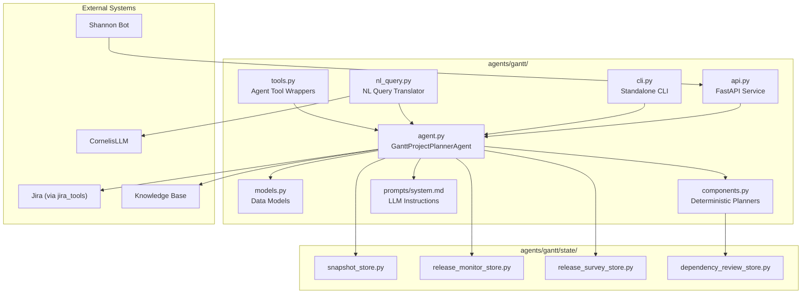
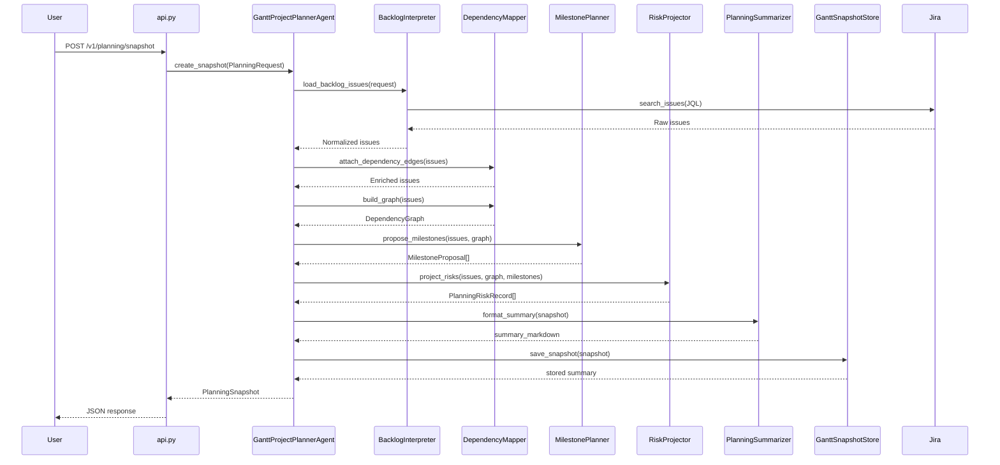
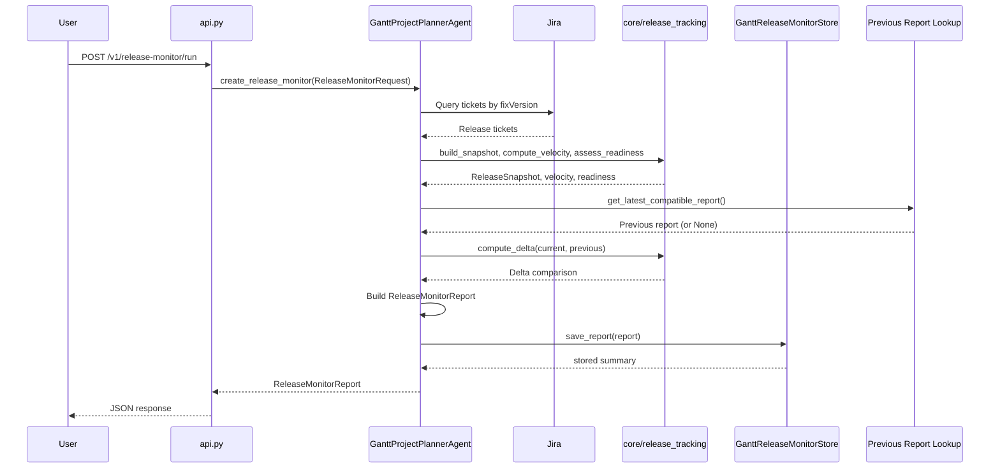
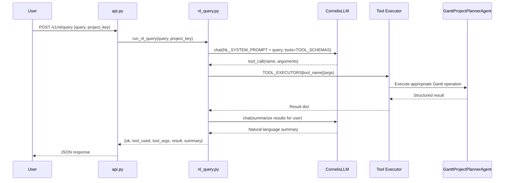

<!-- Generated by Documentation Agent — do not edit between markers -->

```yaml
---
title: "As-Built: Gantt Project Planner Agent"
date: "2026-04-03"
status: "draft"
---
```

## 1. Module Overview

Gantt is the project-planning agent for the Cornelis Networks agent workforce platform. It reads Jira epics, stories, bugs, priorities, and workflow states, cross-references them with technical evidence from other agents (build results, test outcomes, release readiness), and produces structured planning outputs: durable planning snapshots, dependency graphs, milestone proposals, risk signals, release health monitoring reports, release execution surveys, and roadmap gap analyses. The agent is deterministic-first — specialized planner components handle backlog interpretation, dependency mapping, milestone planning, risk projection, and summary formatting without LLM involvement. LLM usage is reserved for roadmap gap analysis and the newly added natural language query interface. Gantt is accessible through a FastAPI REST API (port 8202), a standalone CLI (`gantt-agent`), the unified `agent-cli`, and the Shannon Teams bot. All artifacts are persisted to JSON+Markdown file stores under `data/`.

## 2. What Changed

**Before:** Gantt operated as a deterministic planning and release monitoring service. Users interacted through the REST API, CLI commands, or Shannon bot commands. All queries required structured parameters — project keys, release names, and explicit flags.

**After:** A natural language query interface was added via `agents/gantt/nl_query.py` and a new `POST /v1/nl/query` API endpoint. Users can now ask plain English questions (e.g., "how healthy is release 12.2?") which are translated into structured Gantt tool calls using LLM function calling, executed, and summarized back in natural language.

**Impact:** The API surface gained one new endpoint (`/v1/nl/query`) and one new Pydantic request model (`NLQueryRequest`). The `info` endpoint now advertises this capability. Shannon and CLI consumers are not yet wired to the NL query path — it is currently API-only. The NL query module introduces a dependency on `CornelisLLM` with the `developer-sonnet` model and on `jira_utils` for the release-tasks executor path.

## 3. Component Diagram



## 4. Key Flows

### 4.1 Planning Snapshot Creation

The primary flow: a user requests a planning snapshot for a Jira project. The agent queries Jira, normalizes issues, builds a dependency graph, proposes milestones, projects risks, and produces a durable snapshot.



The `BacklogInterpreter.load_backlog_issues()` method in `components.py` builds JQL from the `PlanningRequest`, queries Jira, and normalizes each issue via `normalize_issue()`. This adds computed fields like `is_stale`, `age_days`, `is_done`, and `_issue_links`. The `DependencyMapper` then consumes `_issue_links` to extract explicit edges and infers additional edges from text references in summaries and descriptions. The `MilestonePlanner` groups issues by `fixVersions` into `MilestoneProposal` objects. The `RiskProjector` flags blocked, stale, unassigned, and unscheduled work.

### 4.2 Release Monitor Report

Produces a release health report with bug breakdowns, velocity metrics, readiness assessment, and optional roadmap gap analysis.



The agent uses `_RELEASE_TICKET_QUERY_FIELDS` (defined in `agent.py`) to fetch specific Jira fields. The `core.release_tracking` module provides `build_snapshot()`, `compute_velocity()`, `compute_cycle_time_stats()`, `assess_readiness()`, and `compute_delta()`. The `GanttReleaseMonitorStore.get_latest_compatible_report()` method finds the most recent stored report with matching project, releases, and scope label for delta comparison.

### 4.3 Natural Language Query (New)

Translates plain English questions into structured Gantt tool calls via LLM function calling, executes them, and summarizes results.



The `run_nl_query()` function in `nl_query.py` makes two LLM calls: the first uses `TOOL_SCHEMAS` (five function definitions) with `NL_SYSTEM_PROMPT` to select and parameterize a tool call; the second summarizes the execution results. The five tool executors are:

- `_exec_gantt_release_health` — delegates to `GanttProjectPlannerAgent.create_release_monitor()`
- `_exec_gantt_release_tasks` — queries Jira directly via `jira_utils`
- `_exec_gantt_planning_snapshot` — delegates to `GanttProjectPlannerAgent.create_snapshot()`
- `_exec_gantt_release_survey` — delegates to `GanttProjectPlannerAgent.create_release_survey()`
- `_exec_gantt_plan_export` — exports to Excel via `excel_utils` or `jira_utils`

## 5. Data Model

The core data structures are defined as Python dataclasses in `agents/gantt/models.py`. All include `to_dict()` serialization methods.

### Planning Domain

| Dataclass | Purpose | Key Fields |
|-----------|---------|------------|
| `PlanningRequest` | Input for snapshot generation | `project_key`, `planning_horizon_days`, `limit`, `include_done`, `backlog_jql`, `policy_profile`, `evidence_paths` |
| `PlanningSnapshot` | Durable snapshot output | `snapshot_id` (8-char UUID), `project_key`, `created_at`, `backlog_overview`, `milestones`, `dependency_graph`, `risks`, `issues`, `evidence_summary`, `summary_markdown` |
| `DependencyEdge` | Single dependency relationship | `source_key`, `target_key`, `relationship`, `inferred`, `confidence`, `rule_id`, `review_state`, `rationale` |
| `DependencyGraph` | Full project dependency graph | `nodes`, `edges`, `blocked_keys`, `unscheduled_keys`, `cycle_paths`, `depth_by_key`, `blocker_chains`, `root_blockers`, `review_summary`, `suppressed_edges` |
| `MilestoneProposal` | Proposed milestone grouping | `name`, `source`, `target_date`, `issue_keys`, `total_issues`, `open_issues`, `done_issues`, `blocked_issues`, `confidence`, `risk_level` |
| `PlanningRiskRecord` | Identified planning risk | `risk_type`, `severity`, `title`, `description`, `issue_keys`, `evidence`, `recommendation` |

### Release Monitoring Domain

| Dataclass | Purpose |
|-----------|---------|
| `ReleaseMonitorRequest` | Input for release health monitoring |
| `ReleaseMonitorReport` | Output with bug counts, velocity, readiness, gap analysis |
| `ReleaseSurveyRequest` | Input for release execution survey |
| `ReleaseSurveyReport` | Output with done/in-progress/remaining/blocked counts |
| `BugSummary` | Bug status and priority breakdown |

### Roadmap Domain

| Dataclass | Purpose |
|-----------|---------|
| `RoadmapRequest` | Input for roadmap analysis |
| `RoadmapItem` | Single Jira ticket or proposed item in roadmap |
| `RoadmapGap` | LLM-identified missing Epic or Story |
| `RoadmapSection` | Logical grouping of items and gaps |
| `RoadmapSnapshot` | Durable roadmap analysis output |

### Persistence Layout

All stores use JSON files organized by project key:

```
data/gantt_snapshots/<PROJECT>/<SNAPSHOT_ID>/snapshot.json + summary.md
data/gantt_release_monitors/<PROJECT>/<REPORT_ID>/report.json + summary.md [+ .xlsx]
data/gantt_release_surveys/<PROJECT>/<SURVEY_ID>/survey.json + summary.md [+ .xlsx]
data/gantt_dependency_reviews/<PROJECT>.json
```

## 6. Dependencies

| Dependency | Purpose | Version |
|------------|---------|---------|
| `agents.base` (internal) | `BaseAgent`, `AgentConfig`, `AgentResponse` base classes | — |
| `llm.base`, `llm.cornelis_llm` (internal) | `Message`, `CornelisLLM` for LLM interactions | — |
| `core.evidence` (internal) | `EvidenceBundle`, `load_evidence_bundle` for technical evidence | — |
| `core.release_tracking` (internal) | `ReleaseSnapshot`, `build_snapshot`, `compute_delta`, `compute_velocity`, `assess_readiness` | — |
| `core.tickets` (internal) | `issue_to_dict` for Jira issue normalization | — |
| `tools.jira_tools` (internal) | `JiraTools`, `get_jira`, `search_tickets`, `get_children_hierarchy`, `get_releases` | — |
| `tools.knowledge_tools` (internal) | `search_knowledge`, `list_knowledge_files`, `read_knowledge_file` | — |
| `tools.base` (internal) | `BaseTool`, `ToolResult`, `tool` decorator | — |
| `agents.pm_runtime` (internal) | `normalize_csv_list`, `notify_shannon` | — |
| `excel_utils` (internal) | Excel formatting helpers, `build_excel_map` | — |
| `jira_utils` (internal) | `connect_to_jira`, `run_jql_query`, `dump_tickets_to_file` (used by NL query) | — |
| `config.env_loader` (internal) | `load_env` for environment bootstrapping | — |
| `FastAPI` (external) | REST API framework | — |
| `Pydantic` (external) | Request/response validation models | — |
| `openpyxl` (external) | Excel workbook generation | — |
| `python-dotenv` (external) | `.env` file loading in CLI | — |

## 7. Configuration

### Environment Variables

| Variable | Default | Purpose |
|----------|---------|---------|
| `GANTT_SNAPSHOT_DIR` | `data/gantt_snapshots` | Storage directory for planning snapshots |
| `GANTT_RELEASE_MONITOR_DIR` | `data/gantt_release_monitors` | Storage directory for release monitor reports |
| `GANTT_RELEASE_SURVEY_DIR` | `data/gantt_release_surveys` | Storage directory for release survey reports |
| `GANTT_DEPENDENCY_REVIEW_DIR` | `data/gantt_dependency_reviews` | Storage directory for dependency review decisions |
| `GANTT_EXPORT_DIR` | `data/gantt_exports` | Directory for plan export files |
| `CONFLUENCE_JIRA_SERVER` | `System Jira` | Jira server name for Confluence links |
| `CONFLUENCE_JIRA_SERVER_ID` / `JIRA_SERVER_ID` | `332fe428-27be-3c06-ad09-b2cd4d269bee` | Jira server ID for Confluence integration |

### Configuration Files

| File | Purpose |
|------|---------|
| `agents/gantt/prompts/system.md` | **Required.** LLM system prompt loaded at agent initialization. Agent raises `FileNotFoundError` if missing. |
| `.env` | Standard dotenv file loaded by CLI and API |

### Key Constants (in `agent.py`)

```python
STALE_DAYS = 30                          # Issues unchanged for 30+ days flagged as stale
JIRA_BASE_URL = 'https://cornelisnetworks.atlassian.net'
_DONE_STATUSES = {'Closed', 'Done', 'Resolved'}
_EXCLUDED_TYPES = {'Bug', 'bug'}         # Excluded from roadmap items
```

### API Port

The FastAPI service runs on port **8202** as documented in the README:

```bash
uvicorn agents.gantt.api:app --host 0.0.0.0 --port 8202
```

## 8. Error Handling

### Agent Layer (`agent.py`)

The `run()` method wraps `create_snapshot()` in a try/except and returns `AgentResponse.error_response(str(e))` on failure. The `run_once()` method raises `TypeError` for mismatched request types and `ValueError` for unsupported `task_type` values. The `tick()` method catches exceptions per-task and accumulates them in an `errors` list, allowing partial success across planning, release monitoring, and survey tasks within a single polling cycle.

```python
# From agent.py — tick() error accumulation pattern
try:
    snapshot = self.create_snapshot(request)
except Exception as e:
    errors.append(f'planning_snapshot: {e}')
```

### API Layer (`api.py`)

API endpoints catch exceptions from agent operations and return `{'ok': False, 'error': str(e)}` rather than raising HTTP exceptions. The `status_decision_detail` endpoint is the exception — it raises `HTTPException(status_code=404)` when a record is not found.

### Store Layer (`state/*.py`)

All store classes handle file I/O errors gracefully:
- `_load_project_reviews()` in `GanttDependencyReviewStore` returns an empty dict on read failure
- `get_snapshot()`, `get_report()`, `get_survey()` return `None` on read failure
- `list_*()` methods skip unreadable files with `log.warning()` and continue
- `save_*()` methods raise `ValueError` for missing required fields (`snapshot_id`, `project_key`)

### NL Query Layer (`nl_query.py`)

Tool execution failures are caught and returned as `{'ok': False, 'error': str(e), 'tool_used': ..., 'tool_args': ...}`. If the LLM does not produce a tool call, the text response is returned directly. Large result payloads (>8000 chars) are truncated before the summarization LLM call, with list fields like `tickets` capped at 10 items.

### Component Layer (`components.py`)

The `BacklogInterpreter.parse_jira_datetime()` method tries multiple datetime formats and returns `None` on failure rather than raising. The `DependencyMapper` silently skips edges that reference unknown keys or fail review lookup.

## 9. Known Limitations / Technical Debt

1. **`agent.py` is a god class.** `GanttProjectPlannerAgent` exceeds 500 lines and contains snapshot creation, release monitoring, release survey, roadmap analysis, Excel export, plan import, polling, notification payload building, and release survey manager alias resolution. It has well over 10 public methods. The class should be decomposed into focused service classes.

2. **Hardcoded Jira URL.** `JIRA_BASE_URL = 'https://cornelisnetworks.atlassian.net'` is hardcoded in `agent.py` (line ~89). This should be an environment variable.

3. **Hardcoded Jira server ID.** `CONFLUENCE_JIRA_SERVER_ID` falls back to a hardcoded UUID `'332fe428-27be-3c06-ad09-b2cd4d269bee'` in `agent.py`.

4. **NL query uses `jira_utils` directly.** The `_exec_gantt_release_tasks()` function in `nl_query.py` imports `jira_utils.connect_to_jira()` and `jira_utils.run_jql_query()` directly, bypassing the agent's `JiraTools` abstraction. Similarly, `_exec_gantt_plan_export()` uses both `excel_utils` and `jira_utils` directly. This creates a parallel Jira access path that does not go through the agent's tool registration.

5. **No error handling on NL query LLM calls.** The `run_nl_query()` function in `nl_query.py` does not wrap the two `llm.chat()` calls in try/except. Network failures or LLM service outages will propagate as unhandled exceptions to the API layer.

6. **File-based persistence only.** All four stores (`GanttSnapshotStore`, `GanttReleaseMonitorStore`, `GanttReleaseSurveyStore`, `GanttDependencyReviewStore`) use JSON files on the local filesystem. The `PLAN.md` mentions PostgreSQL for audit and decision logging, but this is not implemented. File-based storage has no concurrency protection.

7. **Truncated source files.** Several source files provided are truncated (`agent.py` `tick()` method, `api.py` endpoint handlers, `cli.py` survey commands, `models.py` `RoadmapSnapshot` properties, `nl_query.py` plan export, `tools.py` roadmap tools). The documentation covers the visible code; additional functionality may exist beyond the truncation points.

8. **`_release_survey_manager_lookup_cache` is a mutable class variable.** In `agent.py`, `_release_survey_manager_lookup_cache: Optional[Dict[str, str]] = None` is defined as a class-level attribute, meaning it is shared across all instances. This is intentional caching but could cause subtle issues in testing or multi-tenant scenarios.

9. **NL query model is hardcoded.** `run_nl_query()` instantiates `CornelisLLM(model='developer-sonnet')` with no configuration override. The model selection should be configurable.

10. **Missing `RoadmapSnapshotStore` import in tools.** The `create_roadmap_snapshot` tool in `tools.py` imports `from agents.gantt.state.snapshot_store import RoadmapSnapshotStore`, but the provided `snapshot_store.py` only defines `GanttSnapshotStore`. The `RoadmapSnapshotStore` class likely exists beyond the truncation point of `snapshot_store.py`.

11. **API module-level side effects.** `api.py` calls `load_env()` and instantiates all three stores at module import time (before `create_app()` is called), which can cause import-time failures if the environment is not configured.

<!-- End Documentation Agent generated content -->