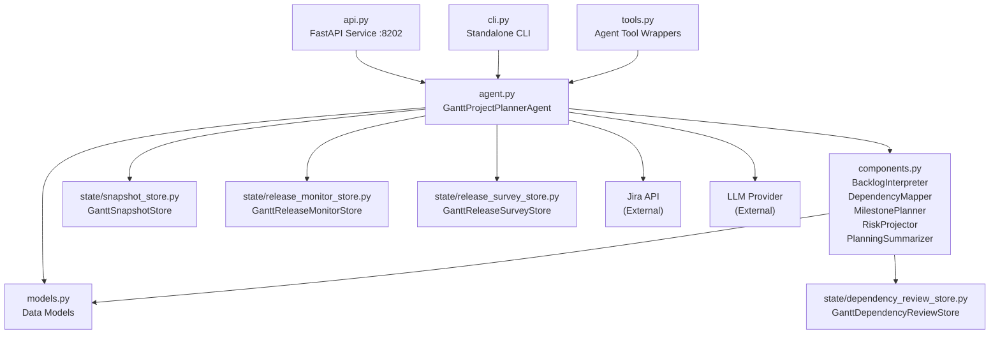
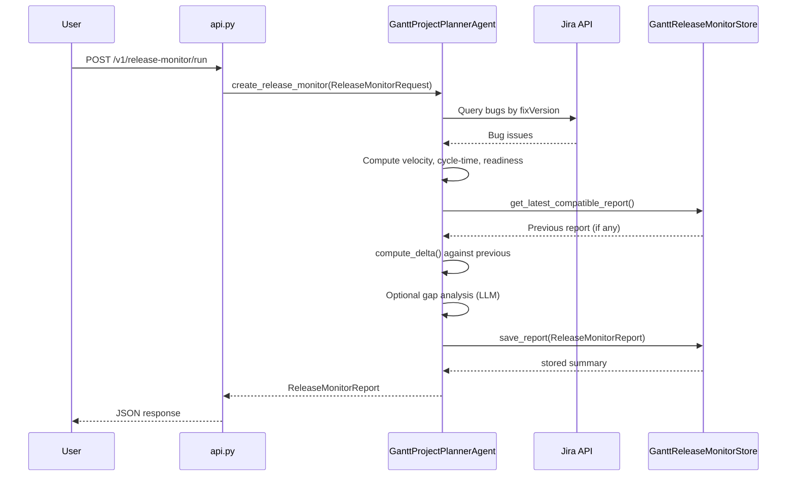
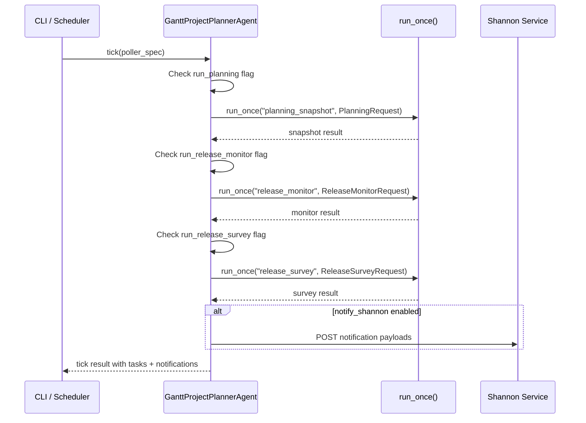

<!-- Generated by Documentation Agent — do not edit between markers -->

```yaml
---
title: "As-Built: Gantt Project Planner Agent"
date: "2026-04-02"
status: "draft"
---
```

## 1. Module Overview

Gantt is the project-planning agent for the Cornelis Networks agent workforce platform. It reads Jira work state — epics, stories, bugs, priorities, assignees, workflow statuses, and release targets — and cross-references that data with technical evidence from builds, tests, and releases to produce durable planning artifacts. Its three primary outputs are **planning snapshots** (point-in-time backlog analysis with milestones, dependencies, and risks), **release monitor reports** (bug-trend, velocity, and readiness health checks for active releases), and **release execution surveys** (delivery-progress assessments per release scope). Gantt is deterministic-first: the core planning pipeline uses algorithmic components (`BacklogInterpreter`, `DependencyMapper`, `MilestonePlanner`, `RiskProjector`, `PlanningSummarizer`) and reserves LLM calls exclusively for roadmap gap analysis. The agent is accessible through a FastAPI REST API on port 8202, a standalone CLI (`gantt-agent`), the unified `agent-cli gantt` subcommand, and the Shannon Teams bot.

## 2. What Changed

**Before:** The roadmap gap analysis in `_run_gap_analysis` used `_run_with_tools()`, which sent tool schemas to the LLM. This caused the model to make tool calls instead of returning the expected JSON gap-proposal block. The API was at version 1.0.0 and lacked endpoints for querying release tickets, exporting plans to Excel, and importing plan files into Jira.

**After:** Gap analysis now calls `self.llm.chat()` directly with an explicit system prompt instructing the model to return only a JSON block and never invoke tools (`agents/gantt/agent.py`, `_run_gap_analysis`). The API version is now 1.1.0 (`agents/gantt/api.py`, `info()` endpoint). Three new API endpoints were added: `POST /v1/query/release-tasks`, `POST /v1/plan/export`, and `POST /v1/plan/import`. Corresponding Pydantic request models (`ReleaseTasksQueryRequest`, `PlanExportRequest`, `PlanImportRequest`) and Shannon commands (`/release-tasks`, `/plan-export`, `/plan-import`) were registered.

**Impact:** Any consumer of the gap analysis flow now receives reliable JSON output instead of spurious tool-call responses. Shannon bot users and API consumers gain access to release-task querying, plan export, and plan import capabilities. The plan import endpoint introduces an optional write path into Jira via `FeaturePlanningOrchestrator`, gated behind an `execute` flag with dry-run as the default.

## 3. Component Diagram



## 4. Key Flows

### 4.1 Planning Snapshot Creation

The most central flow: a user requests a planning snapshot for a Jira project, and Gantt produces a durable, evidence-linked record of project state.


The `BacklogInterpreter.load_backlog_issues()` method constructs JQL from the `PlanningRequest` (or uses a custom `backlog_jql`), queries Jira, and normalizes each issue via `normalize_issue()`. This adds computed fields like `is_stale`, `age_days`, `is_done`, and `_issue_links`. The `DependencyMapper` then consumes the `_issue_links` field to extract explicit edges and scans summary/description text for inferred edges using regex patterns defined in `PREDECESSOR_PATTERNS` and `SUCCESSOR_PATTERNS`.

### 4.2 Release Monitor Report

Tracks the health of active releases with bug trends, velocity, and readiness assessment.



The release monitor leverages `core.release_tracking` functions (`build_snapshot`, `compute_delta`, `compute_velocity`, `compute_cycle_time_stats`, `assess_readiness`) for deterministic analysis. The `GanttReleaseMonitorStore.get_latest_compatible_report()` method finds the most recent stored report matching the same project, release set, and scope label to enable delta comparison. The optional gap analysis reuses the roadmap analysis LLM path.

### 4.3 Scheduled Polling Cycle

Gantt supports always-on operation via the `tick()` method, which executes one scheduled cycle of planning and monitoring tasks.



The `tick()` method in `agent.py` reads the `poller_spec` dictionary for flags like `run_planning`, `run_release_monitor`, and `run_release_survey`. Each enabled task is dispatched through `run_once()`, which delegates to the appropriate `create_*` method and optionally persists the result. Notification payloads are built by static helper methods (`_build_snapshot_notification_payload`, `_build_release_monitor_notification_payload`, `_build_release_survey_notification_payload`) and sent via `notify_shannon()` from `agents.pm_runtime`.

## 5. Data Model

The core data structures are defined as Python dataclasses in `agents/gantt/models.py`. All models implement `to_dict()` for JSON serialization.

### Planning Domain

| Dataclass | Purpose | Key Fields |
|-----------|---------|------------|
| `PlanningRequest` | Input parameters for snapshot creation | `project_key`, `planning_horizon_days`, `limit`, `include_done`, `backlog_jql`, `policy_profile`, `evidence_paths` |
| `PlanningSnapshot` | Durable point-in-time project state record | `snapshot_id` (8-char UUID), `project_key`, `created_at`, `backlog_overview`, `milestones: List[MilestoneProposal]`, `dependency_graph: DependencyGraph`, `risks: List[PlanningRiskRecord]`, `issues`, `summary_markdown` |
| `DependencyEdge` | Single directed dependency between two issues | `source_key`, `target_key`, `relationship`, `inferred: bool`, `confidence`, `rule_id`, `review_state` |
| `DependencyGraph` | Full dependency graph for a backlog | `nodes`, `edges: List[DependencyEdge]`, `blocked_keys`, `cycle_paths`, `depth_by_key`, `blocker_chains`, `root_blockers`, `review_summary`, `suppressed_edges` |
| `MilestoneProposal` | Proposed milestone grouping | `name`, `source`, `target_date`, `issue_keys`, `total_issues`, `open_issues`, `blocked_issues`, `confidence`, `risk_level` |
| `PlanningRiskRecord` | Identified planning risk | `risk_type`, `severity`, `title`, `description`, `issue_keys`, `evidence`, `recommendation` |

### Release Monitoring Domain

| Dataclass | Purpose |
|-----------|---------|
| `ReleaseMonitorRequest` | Input for release health monitoring |
| `ReleaseMonitorReport` | Bug trends, velocity, readiness, and gap analysis |
| `ReleaseSurveyRequest` | Input for release execution survey |
| `ReleaseSurveyReport` | Delivery progress per release scope |
| `BugSummary` | Bug count breakdown by status and priority |

### Roadmap Analysis Domain

| Dataclass | Purpose |
|-----------|---------|
| `RoadmapRequest` | Input for roadmap gap analysis |
| `RoadmapItem` | Single Jira ticket in the roadmap hierarchy |
| `RoadmapGap` | LLM-proposed missing Epic or Story |
| `RoadmapSection` | Logical grouping of items and gaps |
| `RoadmapSnapshot` | Durable roadmap analysis output |

### Persistence Layout

All stores use JSON-file-based persistence under `data/`:

```
data/gantt_snapshots/<PROJECT>/<SNAPSHOT_ID>/snapshot.json + summary.md
data/gantt_release_monitors/<PROJECT>/<REPORT_ID>/report.json + summary.md [+ .xlsx]
data/gantt_release_surveys/<PROJECT>/<SURVEY_ID>/survey.json + summary.md [+ .xlsx]
data/gantt_dependency_reviews/<PROJECT>.json
```

## 6. Dependencies

| Dependency | Purpose | Version |
|------------|---------|---------|
| `agents.base` (internal) | `BaseAgent`, `AgentConfig`, `AgentResponse` base classes | — |
| `llm.base` (internal) | `Message` class for direct LLM chat calls | — |
| `core.evidence` (internal) | `EvidenceBundle`, `load_evidence_bundle` for technical evidence | — |
| `core.release_tracking` (internal) | `build_snapshot`, `compute_delta`, `compute_velocity`, `assess_readiness` | — |
| `core.tickets` (internal) | `issue_to_dict` for Jira issue normalization | — |
| `tools.jira_tools` (internal) | `JiraTools`, `get_jira`, `search_tickets`, `get_children_hierarchy` | — |
| `tools.knowledge_tools` (internal) | `search_knowledge`, `list_knowledge_files`, `read_knowledge_file` | — |
| `tools.base` (internal) | `BaseTool`, `ToolResult`, `@tool` decorator | — |
| `agents.pm_runtime` (internal) | `normalize_csv_list`, `notify_shannon` | — |
| `excel_utils` (internal) | Excel formatting helpers, conditional formatting | — |
| `config.env_loader` (internal) | `load_env()` for environment bootstrapping | — |
| `fastapi` (external) | REST API framework | — |
| `pydantic` (external) | Request/response model validation | — |
| `openpyxl` (external) | Excel workbook generation | — |
| `dotenv` (external) | `.env` file loading in CLI | — |

## 7. Configuration

### Environment Variables

| Variable | Default | Purpose |
|----------|---------|---------|
| `GANTT_SNAPSHOT_DIR` | `data/gantt_snapshots` | Storage root for planning snapshots |
| `GANTT_RELEASE_MONITOR_DIR` | `data/gantt_release_monitors` | Storage root for release monitor reports |
| `GANTT_RELEASE_SURVEY_DIR` | `data/gantt_release_surveys` | Storage root for release survey reports |
| `GANTT_DEPENDENCY_REVIEW_DIR` | `data/gantt_dependency_reviews` | Storage root for dependency review decisions |
| `GANTT_EXPORT_DIR` | `data/gantt_exports` | Output directory for plan export files |
| `CONFLUENCE_JIRA_SERVER` | `System Jira` | Jira server name for Confluence links |
| `CONFLUENCE_JIRA_SERVER_ID` / `JIRA_SERVER_ID` | `332fe428-27be-3c06-ad09-b2cd4d269bee` | Jira server ID for Confluence integration |

### Configuration Files

| File | Purpose |
|------|---------|
| `agents/gantt/prompts/system.md` | **Required.** LLM system prompt defining Gantt's persona, planning rules, roadmap analysis rules, ticket naming conventions, and gap proposal JSON schema. Agent initialization fails with `FileNotFoundError` if missing. |
| `.env` | Standard dotenv file loaded by CLI (`--env` flag overrides path) |

### Key Constants (in `agent.py`)

```python
STALE_DAYS = 30                          # Issues unchanged for 30+ days are flagged stale
JIRA_BASE_URL = 'https://cornelisnetworks.atlassian.net'
_EXCLUDED_TYPES = {'Bug', 'bug'}         # Excluded from roadmap views
_DONE_STATUSES = {'Closed', 'Done', 'Resolved'}
```

## 8. Error Handling

### Agent-Level Pattern

The `run()` method in `GanttProjectPlannerAgent` wraps `create_snapshot()` in a try/except and returns `AgentResponse.error_response(str(e))` on failure:

```python
try:
    snapshot = self.create_snapshot(request)
except Exception as e:
    log.error(f'Gantt planning snapshot failed: {e}')
    return AgentResponse.error_response(str(e))
```

The `run_once()` method raises `TypeError` for mismatched request types and `ValueError` for unsupported task types, propagating exceptions to the caller.

### API-Level Pattern

API endpoints catch exceptions from the agent and return `{'ok': False, 'error': str(e)}` dictionaries rather than raising HTTP exceptions. The `status_decision_detail` endpoint is the exception — it raises `HTTPException(status_code=404)` when a record is not found.

### Store-Level Pattern

All four persistence stores (`GanttSnapshotStore`, `GanttReleaseMonitorStore`, `GanttReleaseSurveyStore`, `GanttDependencyReviewStore`) raise `ValueError` on missing required fields (e.g., `snapshot_id`, `project_key`). Read operations return `None` on missing records and log warnings on I/O failures rather than raising.

### CLI-Level Pattern

CLI commands print errors to `sys.stderr` and call `sys.exit(1)`:

```python
if not result.success:
    print(f'ERROR: {result.error}', file=sys.stderr)
    sys.exit(1)
```

### LLM Gap Analysis

The refactored `_run_gap_analysis` wraps the direct `self.llm.chat()` call in a try/except, logging the error and returning silently (no gap results) on failure:

```python
try:
    llm_response = self.llm.chat(messages=messages, temperature=0.3, ...)
    # ... parse and assign gaps
except Exception as e:
    log.error(f'Gap analysis failed: {e}')
```

## 9. Known Limitations / Technical Debt

1. **Hardcoded Jira base URL.** `JIRA_BASE_URL` is hardcoded to `'https://cornelisnetworks.atlassian.net'` in `agent.py` (line-level constant). This should be an environment variable for portability.

2. **Hardcoded Jira server ID fallback.** `CONFLUENCE_JIRA_SERVER_ID` falls back to a hardcoded UUID `'332fe428-27be-3c06-ad09-b2cd4d269bee'` when environment variables are unset.

3. **File-based persistence only.** All four state stores (`snapshot_store.py`, `release_monitor_store.py`, `release_survey_store.py`, `dependency_review_store.py`) use local JSON files. There is no database backend, which limits concurrent access and scalability. The `PLAN.md` mentions PostgreSQL for audit and decision logs, but this is not yet implemented.

4. **`agent.py` is a large file.** The `GanttProjectPlannerAgent` class contains snapshot creation, release monitoring, release survey, roadmap analysis, Excel export, polling, notification payload building, and gap analysis — well exceeding 500 lines with more than 10 public methods. This is a god-class candidate. The `PLAN.md` architecture section describes a cleaner separation of concerns that is partially but not fully realized.

5. **Missing error handling on Jira connection in `query_release_tasks`.** The new `query_release_tasks` endpoint in `api.py` imports `jira_utils` at call time and catches connection errors, but individual release queries inside the loop silently produce empty error entries rather than failing the request. This could mask systemic Jira connectivity issues.

6. **Plan import depends on optional module.** The `POST /v1/plan/import` endpoint with `execute=True` requires `agents.feature_planning_orchestrator.FeaturePlanningOrchestrator`, which may not be available in all deployments. The `ImportError` is caught and reported, but the capability is advertised unconditionally in the `/v1/info` response.

7. **Token tracking is stubbed.** The `/v1/status/tokens` endpoint returns hardcoded zeros for `token_usage_today` and `token_usage_cumulative`. The `PLAN.md` specifies per-call token logging to PostgreSQL, but this is not implemented.

8. **No structured event emission.** The `PLAN.md` specifies structured events like `planning.snapshot_created` and `planning.dependency_risk_detected`, but the codebase uses only Python `logging` — no event bus or structured event system exists.

9. **Manager alias cache is class-level mutable.** `_release_survey_manager_lookup_cache` is declared as `Optional[Dict[str, str]] = None` on the class, meaning it is shared across all instances. This is intentional for caching but could cause subtle issues in testing or multi-tenant scenarios.

10. **Incomplete source files in review.** The `agent.py` `tick()` method, `cli.py` survey commands, `models.py` roadmap snapshot properties, and `tools.py` roadmap tool functions are truncated in the provided source. The documentation above covers the visible code; additional methods and models exist beyond the truncation points.

<!-- End Documentation Agent generated content -->