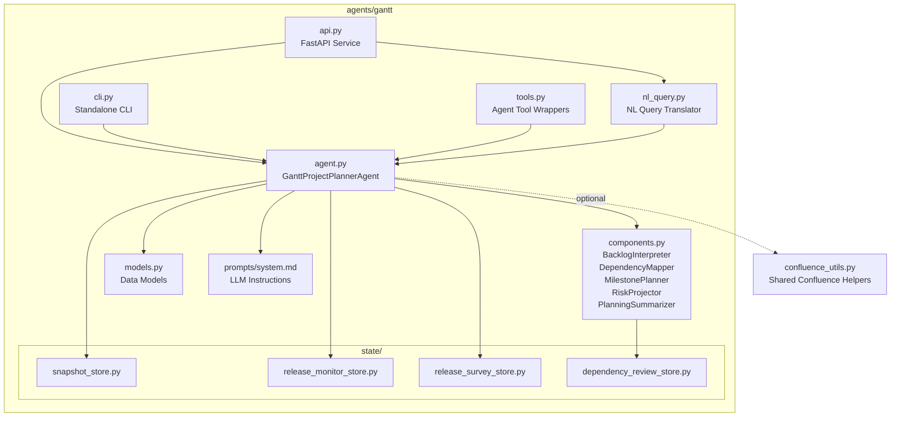
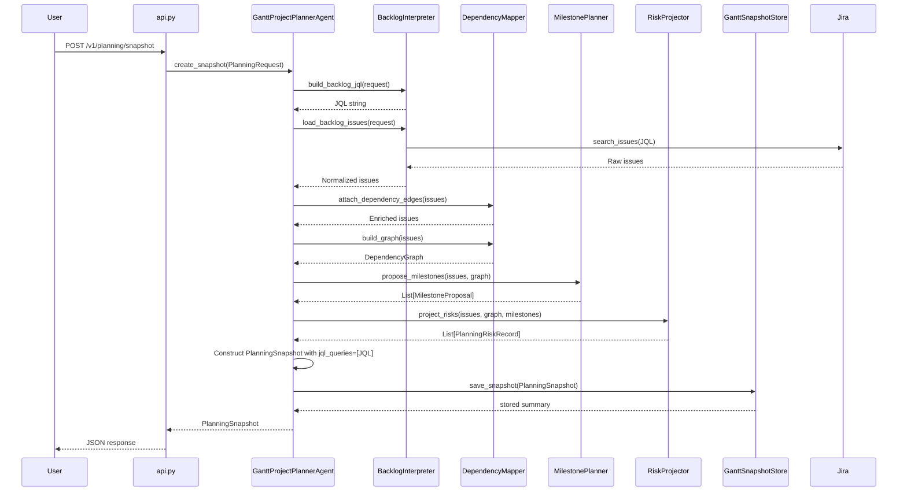
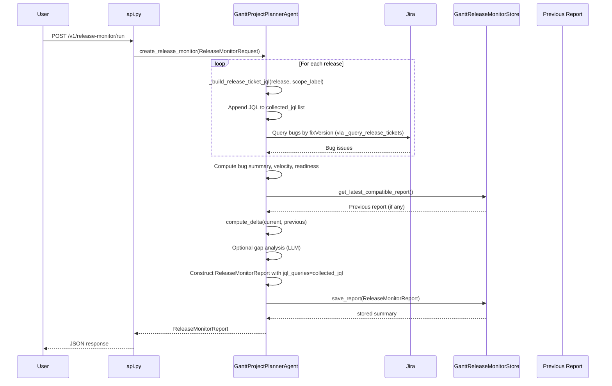
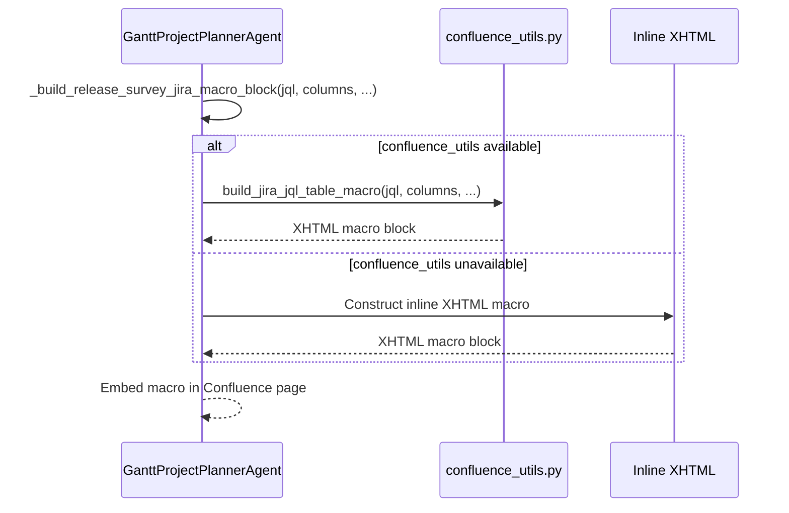

<!-- Generated by Documentation Agent — do not edit between markers -->

```yaml
---
title: "As-Built: Gantt Project Planner Agent"
date: "2026-04-06"
status: "draft"
---
```

# Module Overview

Gantt is the project-planning agent for the Cornelis Networks agent workforce platform. It reads Jira backlogs—epics, stories, bugs, priorities, assignees, and workflow states—and cross-references them with technical evidence from builds, tests, and releases to produce durable planning artifacts: **planning snapshots**, **release health monitor reports**, **release execution surveys**, **roadmap gap analyses**, and **dependency graphs**. The agent is deterministic-first: specialized planner components (`BacklogInterpreter`, `DependencyMapper`, `MilestonePlanner`, `RiskProjector`, `PlanningSummarizer`) handle the core logic without LLM calls, while an optional LLM path is used only for roadmap gap analysis and the new natural-language query interface. Gantt is accessible through a FastAPI REST API (port 8202), a standalone CLI (`gantt-agent`), the unified `agent-cli`, and the Shannon Teams bot.

# What Changed

- **Before:** Planning snapshots, release monitors, and release surveys stored their output but did not preserve the JQL queries used to generate them. Confluence integration for live Jira issue tables was hardcoded inline in the agent. The natural-language query interface was added in a prior change but is now fully integrated.
- **After:** All three report types (`PlanningSnapshot`, `ReleaseMonitorReport`, `ReleaseSurveyReport`) now include a `jql_queries: List[str]` field that captures the exact JQL used to fetch tickets. The `_build_release_ticket_jql()` method was extracted from `_query_release_tickets()` to enable JQL collection without executing queries. Confluence Jira macro generation was refactored to delegate to a shared `confluence_utils.build_jira_jql_table_macro()` function with a fallback to inline XHTML if the utility is unavailable.
- **Impact:** Stored reports are now fully reproducible—users can re-run the exact JQL to verify or refresh data. Confluence page generation is now consistent across agents and easier to maintain. The natural-language query interface (`nl_query.py`) remains unchanged but benefits from the improved JQL traceability in the underlying reports it generates.

# Component Diagram



# Key Flows

## 1. Planning Snapshot Creation with JQL Capture

The primary flow: a user requests a planning snapshot for a Jira project. The agent queries Jira, normalizes issues, maps dependencies, proposes milestones, projects risks, and persists the result **along with the JQL used**.



**Key Change:** The `create_snapshot()` method now calls `BacklogInterpreter.build_backlog_jql(request)` to construct the JQL string before executing the query. This JQL is stored in the `PlanningSnapshot.jql_queries` list. The `BacklogInterpreter.load_backlog_issues()` method still builds and executes the JQL internally, but the agent now captures it explicitly for traceability.

## 2. Release Monitor Report with JQL Collection

Tracks the health of active releases with bug trends, velocity metrics, readiness assessment, and optional roadmap gap analysis. **Now captures the JQL for each release queried.**



**Key Change:** The `create_release_monitor()` method now maintains a `collected_jql: List[str]` list. For each release, it calls `_build_release_ticket_jql(release, scope_label)` to construct the JQL string and appends it to the list before executing the query via `_query_release_tickets()`. The final `ReleaseMonitorReport` includes `jql_queries=collected_jql`.

## 3. Confluence Page Generation with Shared Macro Builder

When generating Confluence pages with live Jira issue tables, the agent now delegates to a shared utility function.



**Key Change:** The `_build_release_survey_jira_macro_block()` method now checks if `confluence_utils.build_jira_jql_table_macro` is available (imported at module load with a try/except). If available, it delegates to the shared function. If not, it falls back to the original inline XHTML construction. This makes Confluence integration consistent across agents and easier to maintain.

# Data Model

The core data structures are defined as Python dataclasses in `agents/gantt/models.py`. All models implement `to_dict()` for JSON serialization.

**Planning Domain:**

| Dataclass | Purpose | Key Fields | Recent Change |
|-----------|---------|------------|---------------|
| `PlanningRequest` | Input for snapshot generation | `project_key`, `planning_horizon_days`, `limit`, `include_done`, `backlog_jql`, `policy_profile`, `evidence_paths` | No change |
| `PlanningSnapshot` | Durable snapshot of project state | `snapshot_id` (8-char UUID), `project_key`, `created_at`, `backlog_overview`, `milestones`, `dependency_graph`, `risks`, `issues`, `evidence_summary`, `jql_queries`, `summary_markdown` | **Added `jql_queries: List[str]`** |
| `DependencyEdge` | Single dependency between two issues | `source_key`, `target_key`, `relationship`, `inferred`, `confidence`, `rule_id`, `review_state`, `rationale` | No change |
| `DependencyGraph` | Full dependency graph for a backlog | `nodes`, `edges`, `blocked_keys`, `unscheduled_keys`, `cycle_paths`, `depth_by_key`, `blocker_chains`, `root_blockers`, `review_summary`, `suppressed_edges` | No change |
| `MilestoneProposal` | Proposed milestone grouping | `name`, `source`, `target_date`, `issue_keys`, `total_issues`, `open_issues`, `done_issues`, `blocked_issues`, `confidence`, `risk_level` | No change |
| `PlanningRiskRecord` | Identified planning risk | `risk_type`, `severity`, `title`, `description`, `issue_keys`, `evidence`, `recommendation` | No change |

**Release Domain:**

| Dataclass | Purpose | Key Fields | Recent Change |
|-----------|---------|------------|---------------|
| `ReleaseMonitorRequest` | Input for release health monitoring | `project_key`, `releases`, `scope_label`, `include_gap_analysis`, `include_bug_report`, `include_velocity`, `include_readiness`, `compare_to_previous`, `output_file` | No change |
| `ReleaseMonitorReport` | Durable release health report | `report_id`, `project_key`, `created_at`, `releases_monitored`, `scope_label`, `bug_summaries`, `readiness`, `velocity`, `cycle_time_stats`, `gap_analysis`, `delta`, `jql_queries`, `summary_markdown`, `output_file` | **Added `jql_queries: List[str]`** |
| `ReleaseSurveyRequest` | Input for release execution survey | `project_key`, `releases`, `scope_label`, `survey_mode`, `output_file` | No change |
| `ReleaseSurveyReport` | Durable release survey output | `survey_id`, `project_key`, `created_at`, `scope_label`, `survey_mode`, `releases_surveyed`, `release_summaries`, `jql_queries`, `summary_markdown`, `output_file` | **Added `jql_queries: List[str]`** |
| `BugSummary` | Bug status/priority breakdown | `release`, `total_bugs`, `by_status`, `by_priority`, `p0_open`, `p1_open`, `p2_open`, `p3_open` | No change |

**Persistence Layout:**

```
data/
├── gantt_snapshots/<PROJECT>/<SNAPSHOT_ID>/
│   ├── snapshot.json          # Now includes jql_queries field
│   └── summary.md
├── gantt_release_monitors/<PROJECT>/<REPORT_ID>/
│   ├── report.json            # Now includes jql_queries field
│   ├── summary.md
│   └── *.xlsx (optional)
├── gantt_release_surveys/<PROJECT>/<SURVEY_ID>/
│   ├── survey.json            # Now includes jql_queries field
│   ├── summary.md
│   └── *.xlsx (optional)
├── gantt_dependency_reviews/<PROJECT>.json
└── gantt_exports/
```

# Dependencies

| Dependency | Purpose | Version | Notes |
|------------|---------|---------|-------|
| `agents.base` (internal) | `BaseAgent`, `AgentConfig`, `AgentResponse` base classes | — | No change |
| `llm.base` / `llm.cornelis_llm` (internal) | `Message`, `CornelisLLM` for LLM chat and function-calling | — | No change |
| `tools.jira_tools` (internal) | `JiraTools`, `get_jira`, `search_tickets`, `get_children_hierarchy`, `get_releases` | — | No change |
| `tools.knowledge_tools` (internal) | `search_knowledge`, `list_knowledge_files`, `read_knowledge_file` for org data | — | No change |
| `tools.base` (internal) | `BaseTool`, `ToolResult`, `@tool` decorator | — | No change |
| `core.evidence` (internal) | `EvidenceBundle`, `load_evidence_bundle` for build/test evidence | — | No change |
| `core.release_tracking` (internal) | `ReleaseSnapshot`, `build_snapshot`, `compute_delta`, `compute_velocity`, `assess_readiness` | — | No change |
| `core.tickets` (internal) | `issue_to_dict` for Jira issue normalization | — | No change |
| `agents.pm_runtime` (internal) | `normalize_csv_list`, `notify_shannon` shared PM utilities | — | No change |
| `excel_utils` (internal) | Excel formatting helpers (`STATUS_FILL_COLORS`, `_apply_header_style`, etc.) | — | No change |
| `config.env_loader` (internal) | `load_env()` for environment bootstrapping | — | No change |
| `jira_utils` (internal) | `connect_to_jira`, `run_jql_query`, `dump_tickets_to_file` (used by NL query executors) | — | No change |
| `confluence_utils` (internal) | `build_jira_jql_table_macro()` for Confluence Jira macro generation | — | **New optional dependency** (lazy import with fallback) |
| `fastapi` (external) | REST API framework | — | No change |
| `pydantic` (external) | Request/response model validation | — | No change |
| `openpyxl` (external) | Excel workbook generation for exports and reports | — | No change |
| `dotenv` (external) | Environment file loading in CLI | — | No change |

# Configuration

| Variable / File | Purpose | Default | Notes |
|-----------------|---------|---------|-------|
| `GANTT_SNAPSHOT_DIR` | Override storage directory for planning snapshots | `data/gantt_snapshots` | No change |
| `GANTT_RELEASE_MONITOR_DIR` | Override storage directory for release monitor reports | `data/gantt_release_monitors` | No change |
| `GANTT_RELEASE_SURVEY_DIR` | Override storage directory for release survey reports | `data/gantt_release_surveys` | No change |
| `GANTT_DEPENDENCY_REVIEW_DIR` | Override storage directory for dependency review decisions | `data/gantt_dependency_reviews` | No change |
| `GANTT_EXPORT_DIR` | Override directory for plan exports | `data/gantt_exports` | No change |
| `CONFLUENCE_JIRA_SERVER` | Jira server name for Confluence integration | `'System Jira'` | No change |
| `CONFLUENCE_JIRA_SERVER_ID` / `JIRA_SERVER_ID` | Jira server ID for Confluence links | `'332fe428-27be-3c06-ad09-b2cd4d269bee'` | No change |
| `agents/gantt/prompts/system.md` | LLM system prompt for the Gantt agent | Required — agent raises `FileNotFoundError` if missing | No change |
| `.env` (or `--env` CLI flag) | Standard dotenv file for Jira credentials, LLM keys, etc. | `.env` | No change |

**Key Agent Constants** (in `agent.py`):

```python
STALE_DAYS = 30                          # Issues unchanged for 30+ days are flagged stale
JIRA_BASE_URL = 'https://cornelisnetworks.atlassian.net'
_EXCLUDED_TYPES = {'Bug', 'bug'}         # Excluded from roadmap views
_DONE_STATUSES = {'Closed', 'Done', 'Resolved'}
```

**NL Query Configuration** (in `nl_query.py`):

The `NL_SYSTEM_PROMPT` constant hardcodes project conventions (default project `STL`, version format rules, tool selection guidance). The LLM model is hardcoded to `'developer-sonnet'` in `run_nl_query()`.

# Error Handling

The agent uses a layered error handling pattern:

1. **Agent-level try/catch in `run()`**: The `GanttProjectPlannerAgent.run()` method wraps `create_snapshot()` in a try/except block and returns `AgentResponse.error_response(str(e))` on failure.

2. **Task dispatcher in `run_once()`**: Each task type (`planning_snapshot`, `release_monitor`, `release_survey`) validates the request type with explicit `TypeError` raises. Unsupported task types raise `ValueError`.

3. **Component-level validation**: The `BacklogInterpreter`, `DependencyMapper`, and other components validate inputs and raise `ValueError` for missing required fields (e.g., `project_key`).

4. **Store-level error handling**: The persistence stores (`GanttSnapshotStore`, `GanttReleaseMonitorStore`, `GanttReleaseSurveyStore`) log warnings for unreadable files and return `None` or empty lists on failure rather than raising exceptions.

5. **Confluence integration fallback**: The `_build_release_survey_jira_macro_block()` method gracefully falls back to inline XHTML if `confluence_utils.build_jira_jql_table_macro` is unavailable (import fails). This ensures Confluence page generation never fails due to a missing utility module.

6. **Natural-language query error handling**: The `nl_query.py` module wraps LLM calls and tool executions in try/except blocks, returning structured error responses with `ok: False` and an `error` field.

**Exception Hierarchy:**

- `ValueError`: Invalid input (missing required fields, unsupported task type)
- `TypeError`: Wrong request type for a task (e.g., `ReleaseMonitorRequest` passed to `planning_snapshot`)
- `FileNotFoundError`: Missing system prompt file (`agents/gantt/prompts/system.md`)
- `json.JSONDecodeError`: Corrupted stored snapshot/report files (logged as warnings, not raised)

# Known Limitations / Technical Debt

## JQL Capture Limitations

1. **Backlog JQL duplication**: The `create_snapshot()` method calls `BacklogInterpreter.build_backlog_jql(request)` to capture the JQL, but `BacklogInterpreter.load_backlog_issues()` also builds the same JQL internally. This duplication is intentional for backward compatibility but could be refactored to build the JQL once and pass it to both methods.

2. **JQL not captured for roadmap snapshots**: The `create_roadmap_snapshot()` method does not yet capture the JQL queries used to fetch initiatives, epics, and stories. This should be added in a future change for consistency.

3. **JQL not captured for plan export/import**: The `query_release_tasks()` and `export_plan()` methods do not capture the JQL they execute. These are one-shot operations without durable storage, so JQL capture is less critical, but it would improve auditability.

## Confluence Integration

4. **Hardcoded Jira server ID**: The `CONFLUENCE_JIRA_SERVER_ID` constant is hardcoded to Cornelis Networks' Jira instance. This should be configurable per deployment.

5. **Confluence macro fallback is untested**: The inline XHTML fallback in `_build_release_survey_jira_macro_block()` is not covered by tests. If `confluence_utils` is unavailable, the fallback may produce incorrect XHTML.

6. **No validation of Confluence macro output**: The agent does not validate that the generated XHTML is well-formed or that the Jira macro will render correctly in Confluence.

## Natural-Language Query Interface

7. **Hardcoded LLM model**: The `run_nl_query()` function in `nl_query.py` hardcodes the LLM model to `'developer-sonnet'`. This should be configurable.

8. **No query history or caching**: The natural-language query interface does not cache results or maintain a query history. Repeated identical queries will re-execute the full tool chain.

9. **Limited tool coverage**: The NL query interface only exposes five tools (`gantt_release_health`, `gantt_release_tasks`, `gantt_planning_snapshot`, `gantt_release_survey`, `gantt_plan_export`). Other Gantt capabilities (dependency review, roadmap analysis) are not yet accessible via natural language.

## Dependency Inference

10. **Inferred dependencies are not validated**: The `DependencyMapper` infers dependencies from text references in issue summaries and descriptions, but these inferences are not validated against actual Jira issue links or parent relationships. False positives are possible.

11. **Dependency review store is project-scoped only**: The `GanttDependencyReviewStore` stores review decisions per project, not per snapshot or report. This means a rejected dependency in one snapshot will be suppressed in all future snapshots for that project, even if the context changes.

## Release Monitoring

12. **Cycle time stats require prior snapshots**: The `compute_cycle_time_stats()` function in `core/release_tracking.py` requires historical snapshots to compute meaningful cycle time metrics. If no prior snapshots exist, cycle time stats will be empty.

13. **Velocity metrics are not normalized**: The velocity metrics in release monitor reports (daily open rate, close rate, net burn rate) are not normalized by team size or project scope. Comparing velocity across projects or releases may be misleading.

14. **Readiness assessment is heuristic-based**: The `assess_readiness()` function uses hardcoded heuristics (e.g., "P0/P1 bugs must be zero") to determine release readiness. These heuristics may not match the actual release criteria for all projects.

## Roadmap Analysis

15. **Gap analysis is LLM-dependent**: The roadmap gap analysis feature requires an LLM and will fail if the LLM is unavailable or returns malformed JSON. There is no deterministic fallback.

16. **Proposed gaps are not validated**: The LLM-proposed gaps in roadmap analysis are not validated against existing Jira tickets or org structure. Duplicate or infeasible proposals are possible.

17. **Roadmap snapshots are not versioned**: The `RoadmapSnapshotStore` does not track versions or deltas between roadmap snapshots. Comparing two roadmap snapshots requires manual diff.

## General

18. **No rate limiting on Jira queries**: The agent does not implement rate limiting or backoff for Jira API calls. High-frequency snapshot generation could hit Jira API rate limits.

19. **No support for multi-project snapshots**: The agent can only generate snapshots for one Jira project at a time. Cross-project planning requires multiple snapshot runs and manual aggregation.

20. **No support for custom Jira fields**: The agent hardcodes the Jira fields it queries (`_RELEASE_TICKET_QUERY_FIELDS`). Custom fields used by specific projects are not captured unless explicitly added to the field list.

<!-- End Documentation Agent generated content -->