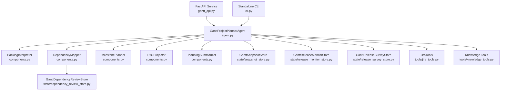
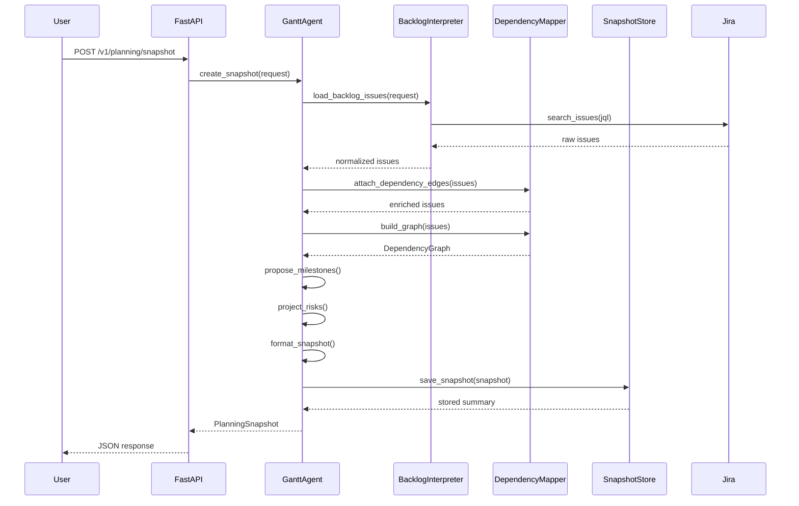
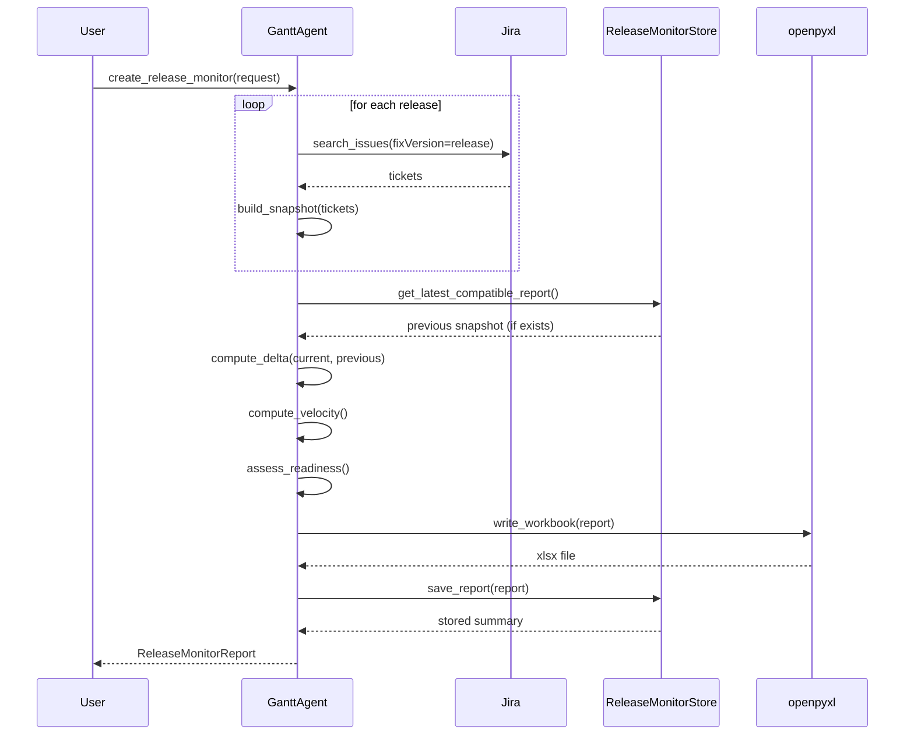
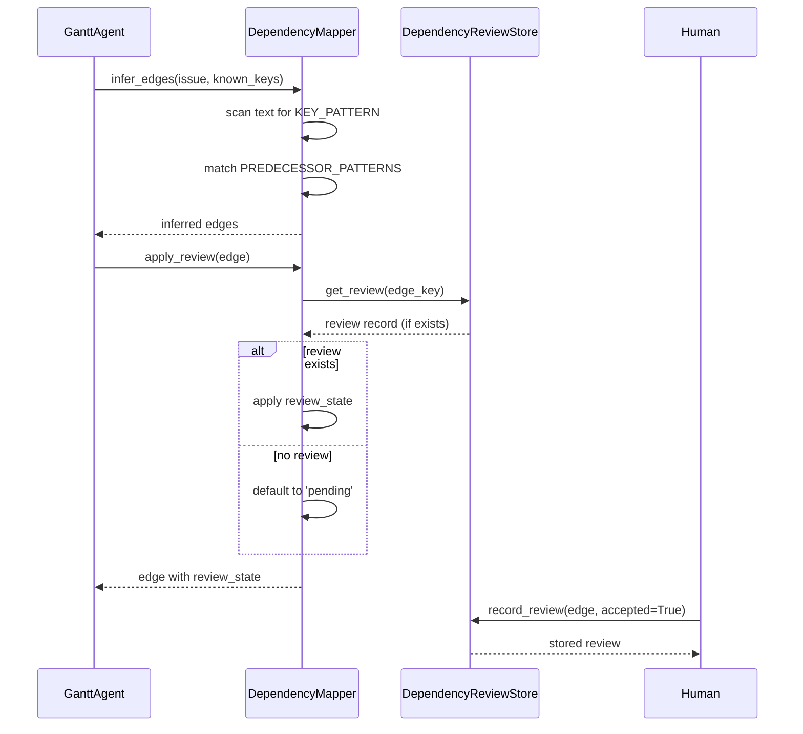

<!-- Generated by Documentation Agent — do not edit between markers -->

```yaml
---
title: "As-Built: Gantt Project Planner Agent"
date: "2026-04-06"
status: "draft"
---
```

# Module Overview

The Gantt Project Planner Agent is a deterministic-first project management agent that transforms Jira work state, technical evidence, and organizational knowledge into structured planning intelligence. It produces planning snapshots, release health monitoring reports, release execution surveys, and roadmap analysis with optional LLM-powered gap identification. The agent operates in both one-shot (explicit task execution) and polling (scheduled monitoring) modes, exposing its capabilities through REST API, CLI, Shannon Teams integration, and MCP tooling.

# What Changed

**Before:** The agent existed as a planning snapshot generator with basic dependency mapping and milestone proposals. Release monitoring and survey capabilities were scattered across separate `release_tracker` and `ticket_monitor` modules.

**After:** The agent now consolidates all project management intelligence under a unified Gantt identity. It includes:
- Full release health monitoring with bug trend analysis, velocity tracking, and readiness assessment
- Release execution surveys with manager-based grouping and stale work detection
- Roadmap analysis with LLM-powered gap identification and Confluence page generation
- Dependency inference with human review workflow
- JQL query capture for all generated reports
- Confluence Jira macro integration for live ticket tables

**Impact:** Other agents (Shannon, CLI tooling) now interact with a single PM agent identity instead of multiple tracker/monitor services. The `release_tracker` and `ticket_monitor` modules are being harvested into Gantt and Drucker respectively, as documented in `PM_IMPLEMENTATION_BACKLOG.md`.

# Component Diagram



# Key Flows

## Flow 1: Planning Snapshot Creation

**Description:** A user requests a planning snapshot for a Jira project. The agent queries Jira, normalizes issues, builds a dependency graph, proposes milestones, projects risks, and persists the snapshot with a Markdown summary.



## Flow 2: Release Health Monitoring

**Description:** The agent monitors one or more releases by querying Jira for bugs, computing velocity and cycle time, comparing against a previous snapshot, and generating an Excel report with bug trends and readiness assessment.



## Flow 3: Dependency Inference Review

**Description:** The agent infers a dependency edge from issue text. A human reviews the inference and accepts or rejects it. The decision is persisted and applied to future snapshots.



# Data Model

## Core Planning Models

### `PlanningRequest`
Input specification for snapshot generation:
- `project_key: str` — Jira project key
- `planning_horizon_days: int` — Planning window (default 90)
- `limit: int` — Max issues to query (default 200)
- `include_done: bool` — Include closed issues
- `backlog_jql: Optional[str]` — Custom JQL override
- `policy_profile: str` — Future-facing policy profile
- `evidence_paths: List[str]` — Build/test/release evidence files

### `PlanningSnapshot`
Durable planning artifact:
- `snapshot_id: str` — Short UUID
- `project_key: str`
- `created_at: str` — ISO 8601 timestamp
- `planning_horizon_days: int`
- `project_info: Dict` — Jira project metadata
- `backlog_overview: Dict` — Total/blocked/stale counts
- `milestones: List[MilestoneProposal]`
- `dependency_graph: DependencyGraph`
- `risks: List[PlanningRiskRecord]`
- `issues: List[Dict]` — Normalized issue records
- `evidence_summary: Dict` — Evidence bundle summary
- `evidence_gaps: List[str]` — Missing evidence warnings
- `jql_queries: List[str]` — JQL used to generate snapshot
- `summary_markdown: str` — Human-readable summary

### `DependencyGraph`
Directed graph of work dependencies:
- `nodes: List[Dict]` — Issue nodes (key, summary, status, assignee)
- `edges: List[DependencyEdge]` — Dependency relationships
- `blocked_keys: List[str]` — Issues with blocking dependencies
- `unscheduled_keys: List[str]` — Issues without fixVersion
- `cycle_paths: List[List[str]]` — Circular dependency chains
- `depth_by_key: Dict[str, int]` — Dependency depth per issue
- `blocker_chains: List[List[str]]` — Transitive blocker paths
- `root_blockers: List[str]` — Top-level blocking issues
- `review_summary: Dict[str, int]` — Accepted/rejected/pending counts
- `suppressed_edges: List[DependencyEdge]` — Rejected inferences

### `DependencyEdge`
Single dependency relationship:
- `source_key: str` — Upstream issue
- `target_key: str` — Downstream issue
- `relationship: str` — 'blocks', 'parent_of', etc.
- `inferred: bool` — True if inferred from text
- `evidence: str` — 'jira_issue_link', 'issue_text', etc.
- `confidence: str` — 'high', 'medium', 'low'
- `rule_id: str` — Inference rule identifier
- `review_state: str` — 'accepted', 'rejected', 'pending'
- `rationale: str` — Human or agent explanation

## Release Monitoring Models

### `ReleaseMonitorRequest`
Input for release health monitoring:
- `project_key: str`
- `releases: Optional[List[str]]` — fixVersion names
- `scope_label: Optional[str]` — Scope filter
- `include_gap_analysis: bool` — Run roadmap gap analysis
- `include_bug_report: bool` — Include bug summary
- `include_velocity: bool` — Compute velocity metrics
- `include_readiness: bool` — Assess release readiness
- `compare_to_previous: bool` — Delta against prior snapshot
- `output_file: Optional[str]` — Excel output path

### `ReleaseMonitorReport`
Release health snapshot:
- `report_id: str`
- `project_key: str`
- `created_at: str`
- `scope_label: str`
- `releases_monitored: List[str]`
- `bug_summaries: List[BugSummary]` — Per-release bug counts
- `velocity: Dict` — Open/close rates, net burn
- `readiness: Dict` — Days to clear, stale tickets
- `gap_analysis: Optional[RoadmapSnapshot]` — Roadmap gaps
- `cycle_time_stats: Dict` — P50/P90 cycle times
- `jql_queries: List[str]` — JQL used for each release
- `summary_markdown: str`
- `output_file: str` — Generated Excel path

### `ReleaseSurveyReport`
Release execution survey:
- `survey_id: str`
- `project_key: str`
- `created_at: str`
- `survey_mode: str` — 'feature_dev' or 'bug'
- `releases_surveyed: List[str]`
- `release_summaries: List[ReleaseSurveyReleaseSummary]`
- `total_tickets: int`
- `done_count: int`
- `in_progress_count: int`
- `remaining_count: int`
- `blocked_count: int`
- `stale_count: int`
- `unassigned_count: int`
- `completion_pct: float`
- `jql_queries: List[str]`
- `summary_markdown: str`
- `output_file: str`

## Roadmap Analysis Models

### `RoadmapRequest`
Input for roadmap gap analysis:
- `project_key: str`
- `scope_label: str` — Required scope filter
- `initiative_keys: Optional[List[str]]` — Explicit initiatives
- `fix_versions: Optional[List[str]]` — Version filters
- `hierarchy_depth: int` — 0=Initiative, 1=Epic, 2=Story
- `include_closed: bool`
- `output_file: Optional[str]` — Excel output
- `include_gap_analysis: bool` — Run LLM gap detection

### `RoadmapSnapshot`
Roadmap analysis artifact:
- `snapshot_id: str`
- `project_key: str`
- `scope_label: str`
- `created_at: str`
- `sections: List[RoadmapSection]` — Grouped roadmap items
- `summary_markdown: str`

### `RoadmapGap`
LLM-identified missing work:
- `summary: str` — Proposed ticket summary
- `issue_type: str` — 'Epic' or 'Story'
- `priority: str` — P0-P3
- `suggested_component: str`
- `acceptance_criteria: str`
- `dependencies: str` — Semicolon-separated keys
- `suggested_fix_version: str`
- `labels: str`
- `depth: int` — Hierarchy level
- `section: str` — Parent section
- `parent_summary: str` — For stories, parent epic

# Dependencies

| Dependency | Purpose | Version |
|------------|---------|---------|
| `fastapi` | REST API service | — |
| `pydantic` | Data validation | — |
| `openpyxl` | Excel report generation | — |
| `jira` | Jira API client | — |
| `agents.base` | Base agent framework | — |
| `llm.base` | LLM provider abstraction | — |
| `tools.jira_tools` | Jira query helpers | — |
| `tools.knowledge_tools` | Org knowledge search | — |
| `core.evidence` | Evidence bundle loading | — |
| `core.release_tracking` | Velocity/cycle time computation | — |
| `core.tickets` | Ticket normalization | — |
| `excel_utils` | Excel formatting helpers | — |
| `confluence_utils` | Confluence macro generation | — |

# Configuration

## Environment Variables

| Variable | Purpose | Default |
|----------|---------|---------|
| `GANTT_SNAPSHOT_DIR` | Planning snapshot storage | `data/gantt_snapshots` |
| `GANTT_RELEASE_MONITOR_DIR` | Release monitor storage | `data/gantt_release_monitors` |
| `GANTT_RELEASE_SURVEY_DIR` | Release survey storage | `data/gantt_release_surveys` |
| `GANTT_DEPENDENCY_REVIEW_DIR` | Dependency review storage | `data/gantt_dependency_reviews` |
| `GANTT_EXPORT_DIR` | Export file output | `data/gantt_exports` |
| `JIRA_BASE_URL` | Jira instance URL | `https://cornelisnetworks.atlassian.net` |
| `CONFLUENCE_JIRA_SERVER` | Confluence Jira server name | `System Jira` |
| `CONFLUENCE_JIRA_SERVER_ID` | Confluence Jira server UUID | — |

## Configuration Files

- `agents/gantt/prompts/system.md` — LLM system prompt for gap analysis and roadmap generation
- `config/gantt_polling.yaml` — Polling job configuration (future)

## Feature Flags

- `include_gap_analysis` — Enable LLM-powered roadmap gap detection
- `include_bug_report` — Include bug summary in release monitor
- `include_velocity` — Compute velocity metrics
- `include_readiness` — Assess release readiness
- `compare_to_previous` — Delta against prior snapshot
- `persist` — Save reports to durable storage

# Error Handling

## Exception Hierarchy

The agent uses standard Python exceptions with contextual logging:
- `ValueError` — Invalid input parameters (missing project_key, invalid JQL)
- `FileNotFoundError` — Missing prompt file or evidence file
- `TypeError` — Type mismatch in request models
- `Exception` — Catch-all for Jira API failures, LLM errors, storage failures

## Error Handling Patterns

1. **Jira Query Failures**: Logged with JQL context, returns empty result set
2. **LLM Failures**: Gap analysis degrades gracefully, returns empty gaps list
3. **Storage Failures**: Logged with file path, raises exception to caller
4. **Missing Evidence**: Logged as warning, continues with empty evidence bundle
5. **Dependency Cycles**: Detected and reported in `DependencyGraph.cycle_paths`, does not block snapshot generation

## Logging

All errors are logged via Python's `logging` module with:
- `log.error()` for failures that prevent task completion
- `log.warning()` for degraded functionality (missing evidence, skipped LLM)
- `log.debug()` for trace-level diagnostics (JQL queries, API calls)

# Known Limitations / Technical Debt

## Hardcoded Values

1. **Stale Days Threshold**: `STALE_DAYS = 30` in `GanttProjectPlannerAgent` — should be configurable per project
2. **Default Planning Horizon**: `planning_horizon_days: int = 90` — should be policy-driven
3. **Default Issue Limit**: `limit: int = 200` — may be insufficient for large projects
4. **Jira Field List**: `_RELEASE_TICKET_QUERY_FIELDS` is hardcoded — should be dynamically discovered or configurable
5. **Manager Name Aliases**: `_RELEASE_SURVEY_MANAGER_ALIASES` is a static dict — should be loaded from org knowledge

## Missing Implementations

1. **Polling Mode**: `tick()` and `run_poller()` are implemented but not fully integrated with scheduler
2. **Policy Profiles**: `policy_profile` parameter is accepted but not yet used for rule customization
3. **Evidence Integration**: Evidence bundle loading is present but not deeply integrated into risk projection
4. **Confluence Publishing**: Confluence page generation is implemented but not exposed via API/CLI
5. **Dependency Review UI**: Review workflow exists but lacks a dedicated UI or Shannon card

## Areas for Improvement

1. **God Class**: `GanttProjectPlannerAgent` is 3800+ lines with 40+ public methods — should be split into:
   - `PlanningSnapshotService`
   - `ReleaseMonitorService`
   - `ReleaseSurveyService`
   - `RoadmapAnalysisService`

2. **Circular Dependencies**: `agent.py` imports from `components.py`, `models.py`, `state/`, `tools/`, and `core/` — consider dependency injection

3. **Missing Error Handling**: Several Jira API calls lack explicit exception handling:
   - `get_project_info()` in `create_snapshot()`
   - `search_tickets()` in `_query_release_tickets()`
   - `get_children_hierarchy()` in roadmap analysis

4. **Hardcoded Credentials**: None detected (credentials loaded via environment)

5. **Test Coverage**: No unit tests found in provided source files — characterization tests exist but are not included in this review

6. **Token Budget**: LLM calls in gap analysis lack explicit token budget enforcement — relies on provider-level limits

7. **Caching**: No caching layer for repeated Jira queries or LLM responses — every snapshot/monitor run hits Jira fresh

8. **Concurrency**: No concurrent query execution for multi-release monitoring — releases are processed sequentially

9. **Validation**: Input validation relies on Pydantic models but lacks business rule validation (e.g., valid fixVersion format, scope_label existence)

10. **Observability**: Structured events (`planning.snapshot_created`, etc.) are documented but not emitted in code

<!-- End Documentation Agent generated content -->