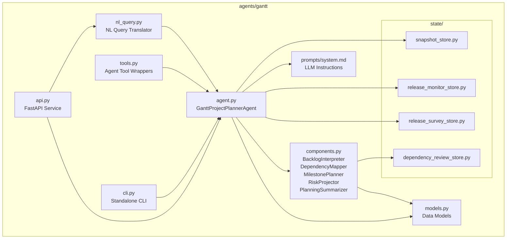
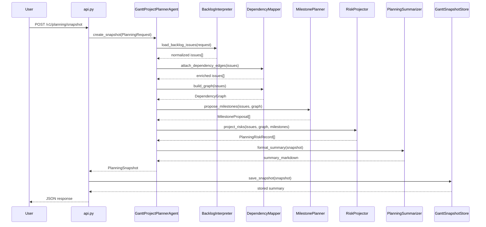
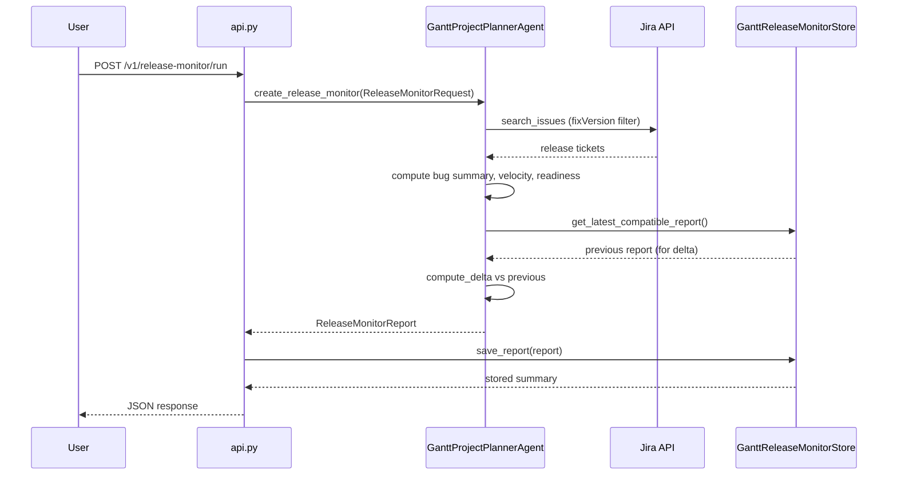
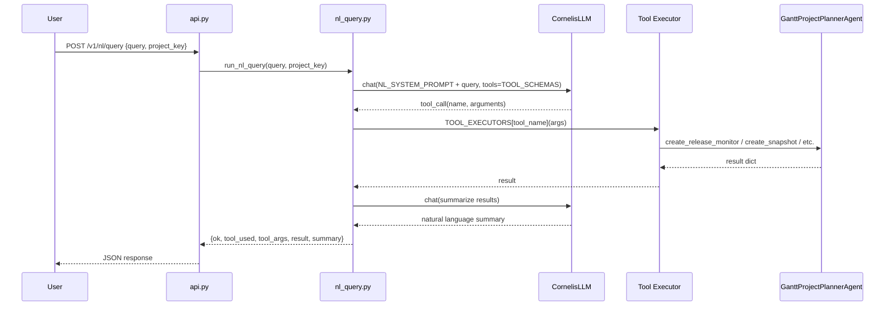

<!-- Generated by Documentation Agent — do not edit between markers -->

```yaml
---
title: "As-Built: Gantt Project Planner Agent"
date: "2026-04-03"
status: "draft"
---
```

# Gantt Project Planner Agent — Design Reference

## 1. Module Overview

Gantt is the project-planning agent for the Cornelis Networks agent workforce platform. It reads Jira work state — epics, stories, bugs, priorities, assignees, workflow statuses, and release targets — and cross-references that data with technical evidence from other agents (build results, test outcomes, release readiness, meeting decisions) to produce structured planning intelligence. Its primary outputs are **planning snapshots**, **release health monitor reports**, **release execution surveys**, **dependency graphs**, **milestone proposals**, and **risk signals**. Gantt is deterministic-first: the core planning pipeline uses algorithmic components (`BacklogInterpreter`, `DependencyMapper`, `MilestonePlanner`, `RiskProjector`, `PlanningSummarizer`) with LLM usage reserved for roadmap gap analysis and the natural-language query interface. The agent is accessible through a FastAPI REST API (port 8202), a standalone CLI (`gantt-agent`), the unified `agent-cli`, and the Shannon Teams bot.

## 2. What Changed

**Before:** The Gantt API supported planning snapshots, release monitoring, release surveys, release-task queries, plan export, and plan import — all via deterministic tool calls or direct agent invocation. Users interacted through the REST API, CLI, or Shannon commands.

**After:** A new natural-language query interface was added. The module `agents/gantt/nl_query.py` translates plain English questions into structured Gantt tool calls using OpenAI function-calling, executes the selected tool, and summarizes results with a second LLM call. The API gained a `POST /v1/nl/query` endpoint (in `api.py`) backed by a new `NLQueryRequest` Pydantic model, and the `/v1/info` endpoint now advertises this capability.

**Impact:** Users can now ask free-form questions like "how healthy is release 12.2?" through the API and receive both structured data and a natural-language summary. This adds an LLM dependency (`CornelisLLM` with model `developer-sonnet`) to the query path. Existing deterministic workflows are unaffected. Shannon integration for the NL query surface is not yet wired.

## 3. Component Diagram



## 4. Key Flows

### 4.1 Planning Snapshot Creation

The most fundamental flow: a user requests a planning snapshot for a Jira project, and Gantt produces a durable record of backlog state, dependencies, milestones, and risks.



The `BacklogInterpreter.load_backlog_issues()` method queries Jira via `jira.search_issues()` using a constructed JQL query (or a user-supplied override via `backlog_jql`). Each issue is normalized through `normalize_issue()`, which extracts parent keys, due dates, status categories, staleness flags, and raw issue links. The `DependencyMapper` then processes these normalized issues in two passes: `extract_edges()` reads explicit Jira issue links and parent relationships, while `infer_edges()` scans summary and description text for key references with contextual phrases like "blocked by" or "depends on". Inferred edges are checked against the `GanttDependencyReviewStore` for prior accept/reject decisions. The resulting `DependencyGraph` includes cycle detection, depth computation, blocker chain analysis, and a review summary.

### 4.2 Release Monitor Report

Tracks the health of active releases by analyzing bug counts, velocity trends, readiness, and optionally roadmap gaps.



The release monitor queries Jira for tickets matching the specified `fixVersions`, computes bug status/priority breakdowns (`BugSummary`), velocity metrics via `core.release_tracking.compute_velocity()`, cycle-time statistics via `compute_cycle_time_stats()`, and readiness assessment via `assess_readiness()`. When `compare_to_previous` is enabled, the store's `get_latest_compatible_report()` finds the most recent report with matching project/release/scope parameters, and `compute_delta()` produces a trend comparison. The report is persisted as JSON + Markdown + optional xlsx in the directory structure `data/gantt_release_monitors/<PROJECT>/<REPORT_ID>/`.

### 4.3 Natural Language Query

A new flow where plain English questions are translated into structured tool calls via LLM function-calling.



The `run_nl_query()` function in `nl_query.py` sends the user's question to `CornelisLLM` (model `developer-sonnet`) with `TOOL_SCHEMAS` — five function definitions covering release health, release tasks, planning snapshots, release surveys, and plan export. The LLM selects exactly one tool and returns structured arguments. The `TOOL_EXECUTORS` dispatch table maps tool names to executor functions (`_exec_gantt_release_health`, `_exec_gantt_release_tasks`, etc.) that instantiate the appropriate agent and request objects. After execution, a second LLM call via `_summarize_results()` produces a human-readable summary. The `NL_SYSTEM_PROMPT` includes Cornelis-specific conventions such as version format normalization (e.g., user says "12.2" → tool uses "12.2.0.x").

## 5. Data Model

The core data structures are defined as Python dataclasses in `agents/gantt/models.py`. All models implement `to_dict()` for JSON serialization.

**Planning Domain:**

| Dataclass | Purpose | Key Fields |
|-----------|---------|------------|
| `PlanningRequest` | Input parameters for snapshot creation | `project_key`, `planning_horizon_days`, `limit`, `include_done`, `backlog_jql`, `policy_profile`, `evidence_paths` |
| `PlanningSnapshot` | Durable snapshot of project state | `snapshot_id` (8-char UUID), `project_key`, `created_at`, `backlog_overview`, `milestones: List[MilestoneProposal]`, `dependency_graph: DependencyGraph`, `risks: List[PlanningRiskRecord]`, `issues`, `evidence_summary`, `summary_markdown` |
| `DependencyEdge` | Single directed dependency | `source_key`, `target_key`, `relationship`, `inferred: bool`, `confidence`, `rule_id`, `review_state` |
| `DependencyGraph` | Full dependency graph for a backlog | `nodes`, `edges: List[DependencyEdge]`, `blocked_keys`, `cycle_paths`, `depth_by_key`, `blocker_chains`, `root_blockers`, `review_summary`, `suppressed_edges` |
| `MilestoneProposal` | Proposed milestone grouping | `name`, `source`, `target_date`, `issue_keys`, `total_issues`, `open_issues`, `blocked_issues`, `confidence`, `risk_level` |
| `PlanningRiskRecord` | Identified planning risk | `risk_type`, `severity`, `title`, `description`, `issue_keys`, `evidence`, `recommendation` |

**Roadmap Domain:**

| Dataclass | Purpose | Key Fields |
|-----------|---------|------------|
| `RoadmapRequest` | Input for roadmap analysis | `project_key`, `scope_label`, `initiative_keys`, `fix_versions`, `hierarchy_depth`, `include_gap_analysis` |
| `RoadmapItem` | Single Jira ticket in roadmap | `key`, `summary`, `issue_type`, `status`, `depth`, `source` ("Jira" or "Proposed") |
| `RoadmapGap` | LLM-identified missing work | `summary`, `issue_type`, `priority`, `suggested_component`, `acceptance_criteria`, `dependencies` |
| `RoadmapSection` | Logical grouping of items + gaps | `title`, `items: List[RoadmapItem]`, `gaps: List[RoadmapGap]` |
| `RoadmapSnapshot` | Durable roadmap analysis output | `project_key`, `scope_label`, `snapshot_id`, `sections: List[RoadmapSection]`, `summary_markdown` |

**Release Domain** (referenced in agent.py imports but defined later in models.py — source truncated):

`ReleaseMonitorReport`, `ReleaseMonitorRequest`, `ReleaseSurveyReport`, `ReleaseSurveyRequest`, `BugSummary`, `ReleaseSurveyReleaseSummary`.

**Persistence Layout:**

All stores use a `data/<store_name>/<PROJECT>/<ID>/` directory structure with `*.json` + `summary.md` + optional `*.xlsx` files. No database is used; state is file-based JSON.

```
data/gantt_snapshots/<PROJECT>/<SNAPSHOT_ID>/snapshot.json
data/gantt_snapshots/<PROJECT>/<SNAPSHOT_ID>/summary.md
data/gantt_release_monitors/<PROJECT>/<REPORT_ID>/report.json
data/gantt_release_monitors/<PROJECT>/<REPORT_ID>/summary.md
data/gantt_release_surveys/<PROJECT>/<SURVEY_ID>/survey.json
data/gantt_release_surveys/<PROJECT>/<SURVEY_ID>/summary.md
data/gantt_dependency_reviews/<PROJECT>.json
```

## 6. Dependencies

| Dependency | Purpose | Version |
|------------|---------|---------|
| `agents.base` (internal) | `BaseAgent`, `AgentConfig`, `AgentResponse` base classes | — |
| `llm.base`, `llm.cornelis_llm` (internal) | `Message`, `CornelisLLM` for LLM interactions | — |
| `core.evidence` (internal) | `EvidenceBundle`, `load_evidence_bundle` for technical evidence | — |
| `core.release_tracking` (internal) | `build_snapshot`, `compute_delta`, `compute_velocity`, `compute_cycle_time_stats`, `assess_readiness` | — |
| `core.tickets` (internal) | `issue_to_dict` for Jira issue normalization | — |
| `tools.jira_tools` (internal) | `JiraTools`, `get_jira`, `search_tickets`, `get_children_hierarchy`, `get_releases` | — |
| `tools.knowledge_tools` (internal) | `search_knowledge`, `list_knowledge_files`, `read_knowledge_file` | — |
| `tools.base` (internal) | `BaseTool`, `ToolResult`, `@tool` decorator | — |
| `agents.pm_runtime` (internal) | `normalize_csv_list`, `notify_shannon` | — |
| `excel_utils` (internal) | Excel formatting helpers, conditional formatting, `build_excel_map` | — |
| `config.env_loader` (internal) | `load_env()` for environment bootstrapping | — |
| `FastAPI` (external) | REST API framework | — |
| `Pydantic` (external) | Request/response model validation | — |
| `openpyxl` (external) | Excel workbook generation | — |
| `python-dotenv` (external) | `.env` file loading in CLI | — |
| `jira` (external, via `jira_utils`) | Jira REST API client | — |
| OpenAI API (external, via `CornelisLLM`) | Function-calling for NL query translation and gap analysis | model: `developer-sonnet` |

## 7. Configuration

| Variable / File | Purpose | Default |
|-----------------|---------|---------|
| `GANTT_SNAPSHOT_DIR` | Override storage directory for planning snapshots | `data/gantt_snapshots` |
| `GANTT_RELEASE_MONITOR_DIR` | Override storage directory for release monitor reports | `data/gantt_release_monitors` |
| `GANTT_RELEASE_SURVEY_DIR` | Override storage directory for release survey reports | `data/gantt_release_surveys` |
| `GANTT_DEPENDENCY_REVIEW_DIR` | Override storage directory for dependency review decisions | `data/gantt_dependency_reviews` |
| `GANTT_EXPORT_DIR` | Override directory for plan exports | `data/gantt_exports` |
| `CONFLUENCE_JIRA_SERVER` | Jira server name for Confluence integration | `'System Jira'` |
| `CONFLUENCE_JIRA_SERVER_ID` / `JIRA_SERVER_ID` | Jira server ID for Confluence macros | `'332fe428-27be-3c06-ad09-b2cd4d269bee'` |
| `agents/gantt/prompts/system.md` | LLM system prompt — **required**, no hardcoded fallback | — |
| `.env` (or `--env` CLI flag) | Standard environment file for Jira credentials, API keys, etc. | `.env` |

**Feature Flags (CLI/API parameters):**

| Flag | Effect |
|------|--------|
| `--no-gap-analysis` / `include_gap_analysis=False` | Disables LLM-powered roadmap gap analysis |
| `--no-bug-report` / `include_bug_report=False` | Disables bug status/priority summary in release monitor |
| `--no-velocity` / `include_velocity=False` | Disables velocity metrics |
| `--no-readiness` / `include_readiness=False` | Disables readiness assessment |
| `--no-compare-previous` / `compare_to_previous=False` | Disables delta comparison against previous report |
| `--include-done` / `include_done=True` | Includes done/closed issues in backlog queries |
| `--notify-shannon` | Posts summaries to Shannon after polling cycles |

## 8. Error Handling

**Agent-level:** The `run()` method in `GanttProjectPlannerAgent` wraps `create_snapshot()` in a try/except and returns `AgentResponse.error_response(str(e))` on failure. The `run_once()` method raises `TypeError` for mismatched request types and `ValueError` for unsupported task types — these propagate to the caller.

```python
# From agent.py — run() error handling
try:
    snapshot = self.create_snapshot(request)
except Exception as e:
    log.error(f'Gantt planning snapshot failed: {e}')
    return AgentResponse.error_response(str(e))
```

**API-level:** Each FastAPI endpoint catches exceptions and returns `{'ok': False, 'error': str(e)}` rather than raising HTTP errors. The `/v1/status/decisions/{record_id}` endpoint is the exception — it raises `HTTPException(status_code=404)` when a record is not found.

**Store-level:** All four persistence stores (`GanttSnapshotStore`, `GanttReleaseMonitorStore`, `GanttReleaseSurveyStore`, `GanttDependencyReviewStore`) use try/except around file I/O operations, logging warnings for read failures and returning `None` or empty lists. The `save_*` methods raise `ValueError` for missing required fields (`snapshot_id`, `project_key`, etc.).

**NL Query:** The `run_nl_query()` function catches tool execution failures and returns `{'ok': False, 'error': str(e), 'tool_used': tool_name}`. If the LLM does not select a tool, the text response is returned directly.

**CLI-level:** CLI commands print errors to `sys.stderr` and call `sys.exit(1)` on failure.

**Prompt loading:** `_load_prompt_file()` raises `FileNotFoundError` if `prompts/system.md` is missing — there is no hardcoded fallback prompt, making this a hard dependency.

## 9. Known Limitations / Technical Debt

1. **God class risk — `GanttProjectPlannerAgent`:** The `agent.py` file is very large (source truncated well past 500 lines). The agent class handles planning snapshots, release monitoring, release surveys, roadmap analysis, polling, notification payload construction, Excel export, plan import, and release-task queries. While it delegates to component classes, the surface area of the agent itself is extensive. Consider extracting release monitoring and survey logic into dedicated service classes.

2. **Hardcoded Jira base URL:**
   ```python
   JIRA_BASE_URL = 'https://cornelisnetworks.atlassian.net'
   ```
   This is defined as a module-level constant in `agent.py` rather than being sourced from configuration.

3. **Hardcoded Confluence server ID:**
   ```python
   CONFLUENCE_JIRA_SERVER_ID = (
       os.getenv('CONFLUENCE_JIRA_SERVER_ID')
       or os.getenv('JIRA_SERVER_ID')
       or '332fe428-27be-3c06-ad09-b2cd4d269bee'
   )
   ```
   Falls back to a hardcoded UUID when environment variables are not set.

4. **NL query uses `jira_utils` directly:** The `_exec_gantt_release_tasks()` and `_exec_gantt_plan_export()` functions in `nl_query.py` import `jira_utils` directly rather than going through the agent's tool infrastructure, creating a parallel Jira access path that bypasses the agent's abstraction layer.

5. **File-based persistence without locking:** All four state stores write JSON files without file locking. Concurrent writes from multiple processes (e.g., parallel polling workers) could cause data corruption. The stores also perform full-file rewrites on every save.

6. **No pagination in store listing:** `list_snapshots()`, `list_reports()`, and `list_surveys()` load all JSON files from disk into memory before sorting and truncating. For projects with many stored artifacts, this could become a performance issue.

7. **Truncated source files:** Several source files (`agent.py`, `api.py`, `cli.py`, `models.py`, `nl_query.py`, `components.py`, `tools.py`) are truncated in the provided source. Key methods like `create_snapshot()`, `create_release_monitor()`, `create_release_survey()`, `tick()` (the polling body), and several model definitions (`ReleaseMonitorReport`, `ReleaseSurveyReport`, `BugSummary`) are not fully visible. This documentation is based on the visible portions.

8. **Missing error handling on LLM calls in NL query:** The `run_nl_query()` function does not wrap the initial LLM `chat()` call in a try/except. Network failures or API errors from the LLM provider would propagate as unhandled exceptions.

9. **Token tracking not implemented:** The `/v1/status/tokens` endpoint returns hardcoded zeros for `token_usage_today` and `token_usage_cumulative`, with a note that Gantt is "deterministic-first." Now that the NL query interface adds real LLM usage, token tracking should be implemented.

10. **Manager alias cache is class-level mutable state:** `_release_survey_manager_lookup_cache` is defined as `Optional[Dict]` at the class level, which means it is shared across all instances and persists for the lifetime of the process without invalidation.

11. **Shannon NL query command not yet registered:** The `/v1/info` endpoint's `shannon_commands` list does not include a command for the natural-language query interface, and no Shannon routing for NL queries is visible in the source.

<!-- End Documentation Agent generated content -->