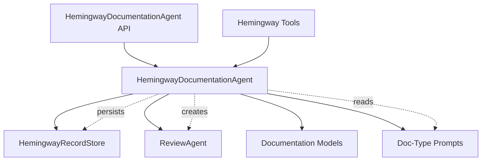
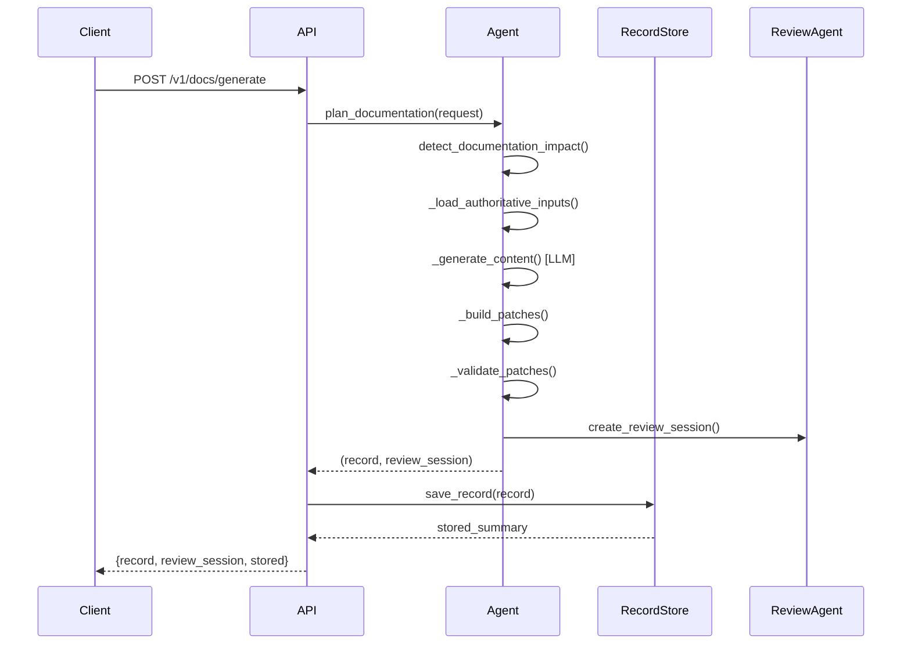
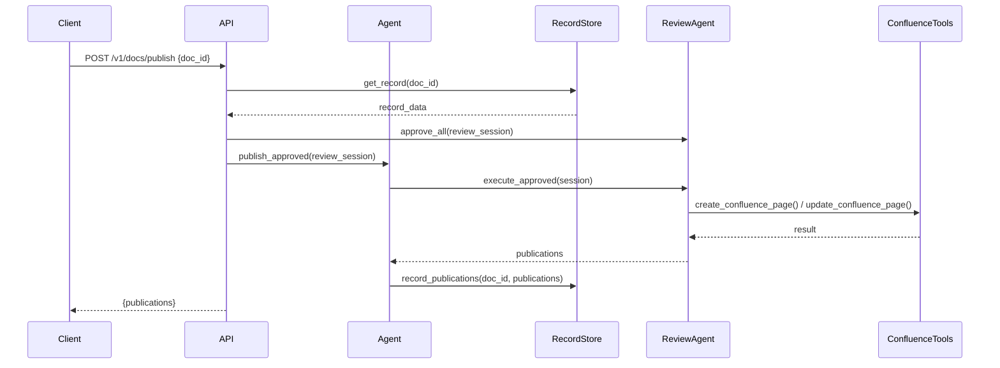
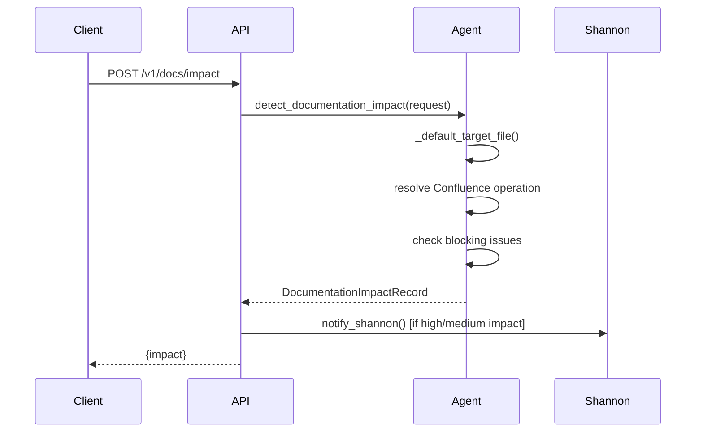

<!-- Generated by Documentation Agent — do not edit between markers -->

```yaml
---
title: "As-Built: Hemingway Documentation Agent"
date: "2026-04-06"
status: "draft"
---
```

## Module Overview

Hemingway is the documentation agent for the Cornelis Networks platform. It transforms source code, build artifacts, test results, release context, and meeting-derived clarifications into durable, source-grounded engineering and user-facing documentation. The agent operates as a deterministic-first coordinator that analyzes documentation impact, synthesizes authoritative inputs, validates structural integrity, and stages review-gated publication to repo Markdown and Confluence targets. Hemingway does not generate speculative prose — every claim traces to an actual source artifact, record, or approved meeting summary.

## What Changed

**Before:** Documentation generation was manual, ad-hoc, and often detached from implementation truth. Engineers wrote docs after the fact, leading to drift between code and documentation.

**After:** Hemingway automates documentation generation from authoritative system records (code, builds, tests, releases, meetings). It produces candidate documentation updates that are validated, reviewed, and published through a gated workflow.

**Impact:** Engineering teams now have a systematic way to keep documentation synchronized with code changes. The review-gated publication model ensures human oversight while reducing manual documentation burden. Other agents (Linus, Josephine, Faraday, Hedy, Linnaeus, Herodotus) supply inputs to Hemingway, creating a documentation pipeline grounded in actual system state.

## Component Diagram



## Key Flows

### Flow 1: Documentation Generation



**Description:** The client submits a 'DocumentationRequest' specifying title, doc type, source paths, and publication targets. The agent detects impact, loads source materials and evidence, invokes the LLM to generate content using a doc-type-specific prompt, builds candidate patches, validates them, and creates a review session. The record is persisted to disk as JSON + Markdown. No publication occurs until explicit approval.

### Flow 2: Review-Gated Publication



**Description:** The client requests publication of an approved documentation record. The API loads the stored record, approves all review items, and delegates to 'publish_approved()'. The 'ReviewAgent' executes approved actions (writing repo Markdown, creating/updating Confluence pages). Publication results are appended to the stored record. Shannon is notified of successful publication.

### Flow 3: Documentation Impact Detection



**Description:** The client submits an impact detection request. The agent resolves affected targets (repo Markdown, Confluence pages), identifies blocking issues (e.g., missing Confluence space for page creation), and assigns a confidence level. If impact is high or medium, Shannon is notified via 'notify_shannon()'. The impact record is returned without persistence.

## Data Model

### Core Data Structures

**DocumentationRequest** ('agents/hemingway/models.py'):
- 'title': Document title
- 'doc_type': One of 'as_built', 'engineering_reference', 'user_guide', 'how_to', 'release_note_support'
- 'project_key': Jira project key (optional)
- 'source_paths': List of source file paths to document
- 'evidence_paths': List of evidence files (JSON, YAML, Markdown)
- 'target_file': Repo-owned Markdown target path
- 'confluence_title', 'confluence_page', 'confluence_space', 'confluence_parent_id': Confluence publication parameters
- 'validation_profile': One of 'default', 'strict', 'sphinx'

**DocumentationRecord** ('agents/hemingway/models.py'):
- 'doc_id': Unique identifier (8-char UUID prefix)
- 'title', 'doc_type', 'project_key': Metadata
- 'request': Original 'DocumentationRequest' as dict
- 'impact': 'DocumentationImpactRecord' as dict
- 'source_refs': List of source references (file paths, commit SHAs, build IDs)
- 'evidence_summary': Evidence bundle summary
- 'content_markdown': Generated documentation content
- 'summary_markdown': Human-readable summary of the record
- 'patches': List of 'DocumentationPatch' objects
- 'validation': Validation result dict ('valid': bool, 'blocking_issues': list)
- 'warnings': List of warning messages
- 'confidence': 'low', 'medium', or 'high'
- 'publication_records': List of 'PublicationRecord' objects

**DocumentationPatch** ('agents/hemingway/models.py'):
- 'patch_id': Unique identifier
- 'target_type': 'repo_markdown' or 'confluence_page'
- 'operation': 'create' or 'update'
- 'title': Patch title
- 'target_ref': File path or Confluence page ID/title
- 'content_markdown': Patch content
- 'preview': Preview metadata (line count, word count, etc.)
- 'validation': Patch-level validation result
- 'source_refs': Source references for this patch

**PublicationRecord** ('agents/hemingway/models.py'):
- 'publication_id': Unique identifier
- 'doc_id', 'patch_id': Parent record identifiers
- 'target_type', 'operation', 'target_ref': Publication target metadata
- 'status': 'pending', 'published', or 'failed'
- 'published_at': ISO 8601 timestamp
- 'result': Publication result dict (e.g., Confluence page URL)
- 'error': Error message if status is 'failed'

### Persistence

Records are stored at 'data/hemingway_docs/<DOC_ID>/':
- 'record.json': Full 'DocumentationRecord' as JSON
- 'summary.md': Human-readable summary Markdown

The 'HemingwayRecordStore' class ('agents/hemingway/state/record_store.py') provides CRUD operations and search.

## Dependencies

| Dependency | Purpose | Version |
|------------|---------|---------|
| 'agents.base' | Base agent framework ('BaseAgent', 'AgentConfig', 'AgentResponse') | internal |
| 'agents.review_agent' | Review-gated execution ('ReviewAgent', 'ReviewSession', 'ReviewItem') | internal |
| 'core.evidence' | Evidence bundle loading ('EvidenceBundle', 'load_evidence_bundle') | internal |
| 'tools.confluence_tools' | Confluence page creation/update ('create_confluence_page', 'update_confluence_page', 'get_confluence_page') | internal |
| 'tools.file_tools' | File reading ('read_file') | internal |
| 'agents.pm_runtime' | Shannon notification ('notify_shannon') | internal |
| 'fastapi' | REST API framework | 0.115.6 |
| 'pydantic' | Request/response validation | 2.10.5 |

## Configuration

### Environment Variables

| Variable | Required | Default | Description |
|----------|----------|---------|-------------|
| 'HEMINGWAY_DOC_DIR' | No | 'data/hemingway_docs' | Storage directory for documentation records |
| 'CONFLUENCE_URL' | Yes (for Confluence publication) | - | Atlassian Confluence base URL |
| 'CONFLUENCE_USER' | Yes (for Confluence publication) | - | Confluence username |
| 'CONFLUENCE_API_TOKEN' | Yes (for Confluence publication) | - | Confluence API token |
| 'LLM_PROVIDER' | No | 'openai' | LLM provider for content generation |
| 'LLM_MODEL' | No | 'gpt-4' | LLM model for content generation |
| 'DRY_RUN' | No | 'true' | Global dry-run gate (overridden by per-request 'dry_run' parameter) |

### Configuration Files

- 'agents/hemingway/prompts/system.md': Core agent behavior prompt
- 'agents/hemingway/prompts/as-built-design.md': As-built/engineering reference prompt (3-pass methodology)
- 'agents/hemingway/prompts/user-guide.md': User guide/how-to prompt (man-page style)
- 'agents/hemingway/prompts/traceability.md': Traceability/RTM prompt (requirements → implementation → test mapping)

### Feature Flags

- 'dry_run' (per-request): When 'true', preview mode — no LLM invocation, no persistence, no publication. Resolved via 'config.env_loader.resolve_dry_run()'.
- 'persist' (per-request): When 'false', skip record persistence (used for ephemeral generation).

## Error Handling

### Error Handling Patterns

1. **Validation Errors**: Raised as 'ValueError' when required fields are missing or invalid (e.g., missing 'doc_id', unknown 'doc_type'). Caught by API endpoints and returned as HTTP 400.

2. **File I/O Errors**: Logged as warnings when source files or evidence files cannot be read. The agent continues with available inputs and lowers confidence. Missing files are recorded in 'warnings'.

3. **LLM Errors**: Caught during '_generate_content()'. If LLM invocation fails, the agent returns an error response with the exception message. No partial content is persisted.

4. **Publication Errors**: Caught during 'publish_approved()'. Each publication attempt is wrapped in a try/except. Failed publications are recorded as 'PublicationRecord' with 'status="failed"' and 'error' message. Successful publications proceed independently.

5. **Confluence Errors**: Handled by 'tools.confluence_tools'. Errors (e.g., page not found, permission denied) are returned as 'ToolResult.failure()'. The agent logs the error and includes it in the publication record.

6. **Shannon Notification Errors**: Logged as warnings (non-fatal). If 'notify_shannon()' fails, the agent continues without interruption.

### Exception Hierarchy

- 'ValueError': Invalid input parameters
- 'FileNotFoundError': Missing prompt files or source files
- 'HTTPException' (FastAPI): HTTP-level errors (404, 400, 500)
- Generic 'Exception': Catch-all for unexpected errors during LLM invocation, file I/O, or publication

## Known Limitations / Technical Debt

1. **Hardcoded Prompt Paths**: Prompt files are loaded from 'agents/hemingway/prompts/' using hardcoded relative paths. If the module is moved, prompt loading will fail. Consider using 'importlib.resources' for package-relative resource loading.

2. **Missing Confluence URL Parsing Validation**: The '_parse_confluence_url()' function in 'api.py' uses a simple regex to extract space and page ID from Confluence URLs. It does not validate the domain or handle all Confluence URL formats (e.g., legacy URLs, custom domains). This could lead to silent failures when users paste unsupported URL formats.

3. **No Token Budget Tracking**: The agent invokes the LLM for content generation but does not track token usage. The plan document specifies token tracking as a requirement, but no implementation exists. Add token logging to '_generate_content()' and expose cumulative totals via '/v1/status/tokens'.

4. **Incomplete Validation Profiles**: The 'validation_profile' parameter ('default', 'strict', 'sphinx') is accepted but not fully implemented. The '_validate_patches()' method does not differentiate between profiles. Implement profile-specific validation rules (e.g., 'strict' requires all source refs to resolve, 'sphinx' validates RST syntax).

5. **No Circular Dependency Detection**: The agent does not detect circular dependencies between documentation targets. If doc A references doc B and doc B references doc A, the agent will not flag this as a warning.

6. **God Class**: 'HemingwayDocumentationAgent' ('agents/hemingway/agent.py') is 1,200+ lines with 20+ public methods. This violates the single-responsibility principle. Consider splitting into:
   - 'DocImpactAnalyzer' (impact detection)
   - 'SourceSynthesizer' (input loading)
   - 'DocGenerator' (LLM invocation)
   - 'DocValidator' (validation)
   - 'PublicationCoordinator' (publication)

7. **Missing Error Handling on External Calls**: The 'notify_shannon()' call in 'api.py' is wrapped in a try/except, but other external calls (e.g., 'load_evidence_bundle()', 'read_file()') are not. If these fail, the agent will crash instead of degrading gracefully.

8. **Hardcoded Default Doc Type**: The default 'doc_type' is hardcoded to 'engineering_reference' in multiple places ('DocumentationRequest', 'GenerateDocRequest', 'ImpactDetectRequest'). This should be a configurable default.

9. **No Retry Logic for LLM Calls**: If the LLM invocation fails due to a transient error (e.g., rate limit, network timeout), the agent does not retry. Add exponential backoff retry logic to '_generate_content()'.

10. **Incomplete PR Review Workflow**: The '/v1/docs/pr-review' endpoint is partially implemented but not fully tested. The 'diff_context' and 'branch' parameters are accepted but not used in all code paths. The PR review workflow should be completed or removed.

<!-- End Documentation Agent generated content -->