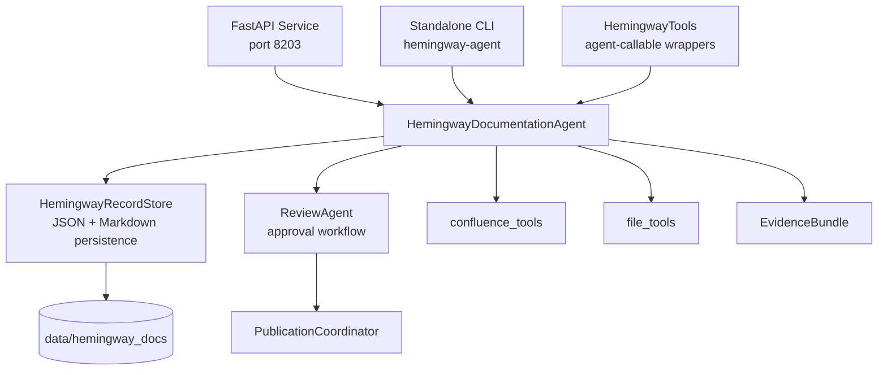
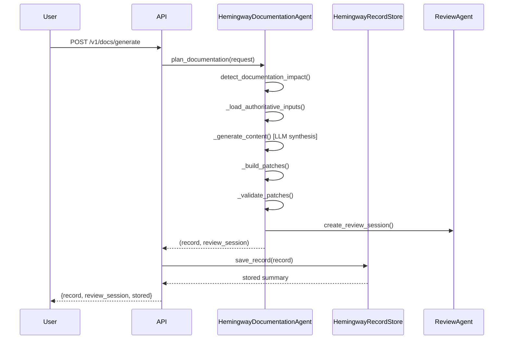
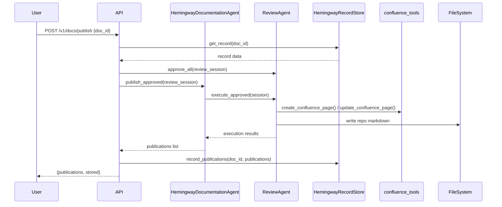
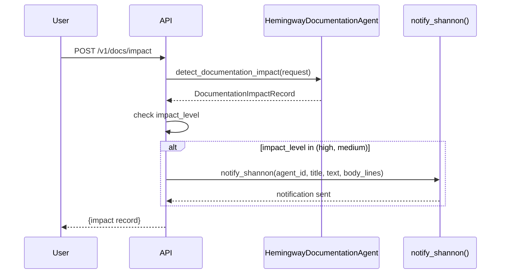

<!-- Generated by Documentation Agent — do not edit between markers -->

```yaml
---
title: "As-Built: Hemingway Documentation Agent"
date: "2026-04-06"
status: "draft"
---
```

## Module Overview

Hemingway is the documentation agent for the Cornelis Networks platform. It transforms source code, build artifacts, test results, release context, and meeting-derived clarifications into source-grounded, validation-gated internal documentation. The agent operates as a deterministic-first coordinator that produces reviewable documentation patches for repo-owned Markdown and Confluence targets, with all publication gated through explicit human approval.

## What Changed

**Before:** Documentation generation was manual, disconnected from source truth, and lacked structured validation or traceability to authoritative inputs.

**After:** Hemingway automates documentation generation from authoritative system records (code, builds, tests, releases, meetings), validates all claims against source artifacts, and produces review-gated publication patches with full audit trails.

**Impact:** Engineering teams now have a deterministic path from source changes to durable documentation updates. All documentation claims are traceable to source artifacts. Publication requires explicit approval, preventing speculative or unsupported content from reaching internal or external targets.

## Component Diagram



## Key Flows

### Flow 1: Documentation Generation



**Description:** User submits a documentation request with source paths, evidence files, and target configuration. The agent detects impact, loads authoritative inputs (source files, existing docs, evidence bundles), synthesizes content via LLM using doc-type-specific prompts, builds candidate patches, validates them, and creates a review session. The record is persisted to 'data/hemingway_docs/<DOC_ID>/' as JSON + Markdown. No publication occurs without explicit approval.

### Flow 2: Review-Gated Publication



**Description:** User requests publication of an approved documentation record. The agent retrieves the stored record, approves all review items, and executes the approved patches. For Confluence targets, it calls 'create_confluence_page()' or 'update_confluence_page()' with diagram rendering. For repo targets, it writes Markdown files. All publication results are appended to the stored record as 'PublicationRecord' objects with status, timestamps, and error details.

### Flow 3: Shannon Notification on Impact Detection



**Description:** When documentation impact is detected at 'high' or 'medium' levels, the API posts a notification to Shannon with the impact level, affected sections, and document title. This ensures engineering teams are alerted to significant documentation changes in real time. The notification is non-blocking — failures are logged as warnings but do not abort the impact detection workflow.

## Data Model

### Core Data Structures

**DocumentationRequest** ('agents/hemingway/models.py'):
- 'title': Document title
- 'doc_type': One of 'as_built', 'engineering_reference', 'user_guide', 'how_to', 'release_note_support'
- 'project_key': Jira project key (optional)
- 'source_paths': List of source file paths to analyze
- 'evidence_paths': List of evidence files (JSON, YAML, Markdown)
- 'target_file': Repo-owned Markdown target path
- 'confluence_title', 'confluence_page', 'confluence_space', 'confluence_parent_id': Confluence publication targets
- 'validation_profile': One of 'default', 'strict', 'sphinx'
- 'diff_context': PR diff/patch for context during PR-review generation
- 'branch': Git branch to fetch sources from
- 'pr_number': PR number for fork-aware ref resolution

**DocumentationRecord** ('agents/hemingway/models.py'):
- 'doc_id': Unique 8-character UUID
- 'title', 'doc_type', 'project_key': Metadata
- 'request': Original 'DocumentationRequest' as dict
- 'impact': 'DocumentationImpactRecord' as dict
- 'source_refs': List of source file references
- 'evidence_summary': 'EvidenceBundle.to_summary()' output
- 'content_markdown': Full generated Markdown content
- 'summary_markdown': Human-readable summary for review
- 'patches': List of 'DocumentationPatch' objects
- 'validation': Validation results dict with 'valid' boolean and 'blocking_issues' list
- 'warnings': List of warning strings
- 'confidence': One of 'low', 'medium', 'high'
- 'publication_records': List of 'PublicationRecord' objects

**DocumentationPatch** ('agents/hemingway/models.py'):
- 'patch_id': Unique 8-character UUID
- 'target_type': 'repo_markdown' or 'confluence_page'
- 'operation': 'create' or 'update'
- 'title': Patch title
- 'target_ref': File path or Confluence page ID/title
- 'content_markdown': Markdown content to publish
- 'preview': Dict with preview metadata
- 'validation': Validation results for this patch
- 'source_refs': Source file references for this patch
- 'metadata': Additional metadata (e.g., 'space', 'parent_id', 'version_message')

**PublicationRecord** ('agents/hemingway/models.py'):
- 'publication_id': Unique 8-character UUID
- 'doc_id', 'patch_id': Parent record and patch IDs
- 'target_type', 'operation', 'target_ref': Publication target details
- 'status': 'pending', 'published', or 'failed'
- 'published_at': ISO 8601 timestamp
- 'result': Dict with publication result data (e.g., Confluence page URL)
- 'error': Error message if status is 'failed'

### Persistence Schema

Records are stored at 'data/hemingway_docs/<DOC_ID>/':
- 'record.json': Full 'DocumentationRecord' as JSON
- 'summary.md': 'summary_markdown' field as Markdown

## Dependencies

| Dependency | Purpose | Version |
|------------|---------|---------|
| 'agents.base' | 'BaseAgent', 'AgentConfig', 'AgentResponse' | internal |
| 'agents.review_agent' | 'ReviewAgent', 'ReviewItem', 'ReviewSession' | internal |
| 'core.evidence' | 'EvidenceBundle', 'load_evidence_bundle' | internal |
| 'tools.confluence_tools' | 'create_confluence_page', 'update_confluence_page', 'get_confluence_page' | internal |
| 'tools.file_tools' | 'read_file' | internal |
| 'agents.pm_runtime' | 'notify_shannon' | internal |
| 'fastapi' | REST API framework | external |
| 'pydantic' | Request/response models | external |

## Configuration

### Environment Variables

| Variable | Required | Default | Description |
|----------|----------|---------|-------------|
| 'HEMINGWAY_DOC_DIR' | No | 'data/hemingway_docs' | Storage directory for documentation records |
| 'DRY_RUN' | No | 'true' | Global dry-run gate for mutation endpoints |
| 'CONFLUENCE_URL' | Yes (for Confluence) | — | Atlassian Confluence base URL |
| 'CONFLUENCE_USER' | Yes (for Confluence) | — | Confluence username |
| 'CONFLUENCE_API_TOKEN' | Yes (for Confluence) | — | Confluence API token |

### Prompt Files

| File | Purpose |
|------|---------|
| 'prompts/system.md' | Core agent behavior prompt (required) |
| 'prompts/as-built-design.md' | As-built/engineering reference prompt (3-pass methodology) |
| 'prompts/user-guide.md' | User guide/how-to prompt (man-page style) |
| 'prompts/traceability.md' | Traceability/RTM prompt (requirements → implementation → test mapping) |

### Validation Profiles

| Profile | Description |
|---------|-------------|
| 'default' | Standard validation: required sections, no empty sections, source refs present |
| 'strict' | Adds: all links must resolve, no placeholders, all facts must have source refs |
| 'sphinx' | Adds: Sphinx-compatible RST/MD structure validation |

## Error Handling

### Error Handling Patterns

1. **API-level errors**: FastAPI 'HTTPException' with status codes (404 for missing records, 400 for invalid requests).
2. **Agent-level errors**: 'AgentResponse.error_response(str(e))' for workflow failures.
3. **Tool-level errors**: 'ToolResult.failure(error_message)' for tool execution failures.
4. **Validation errors**: Stored in 'DocumentationRecord.validation["blocking_issues"]' and 'DocumentationRecord.warnings'.
5. **Publication errors**: Stored in 'PublicationRecord.error' with 'status="failed"'.

### Exception Hierarchy

- 'FileNotFoundError': Raised when required prompt files are missing ('agents/hemingway/agent.py:__init__').
- 'ValueError': Raised when 'DocumentationRecord' is missing 'doc_id' ('agents/hemingway/state/record_store.py:save_record').
- 'HTTPException': Raised by FastAPI endpoints for client errors (404, 400).

### Missing Error Handling

- **External API calls**: Confluence tool calls ('create_confluence_page', 'update_confluence_page') do not have explicit try/except blocks in 'agents/hemingway/agent.py'. Errors propagate to the caller.
- **File I/O**: 'read_file()' calls in '_load_authoritative_inputs()' do not have explicit error handling. Missing files are logged as warnings but do not abort the workflow.

## Known Limitations / Technical Debt

### Hardcoded Values

- **Default storage directory**: 'data/hemingway_docs' is hardcoded in 'HemingwayRecordStore.__init__()' when 'HEMINGWAY_DOC_DIR' is not set.
- **Default doc type**: 'engineering_reference' is hardcoded in 'DocumentationRequest', 'GenerateDocRequest', and 'ImpactDetectRequest'.
- **Default validation profile**: 'default' is hardcoded in 'DocumentationRequest' and 'GenerateDocRequest'.
- **Default port**: 8203 is hardcoded in 'agents/hemingway/README.md' and deployment instructions.

### Missing Implementations

- **Token tracking**: The '/v1/status/tokens' endpoint returns placeholder data ('token_usage_today': 0, 'token_usage_cumulative': 0). Actual LLM token usage is not tracked.
- **Confluence URL parsing**: '_parse_confluence_url()' in 'agents/hemingway/api.py' only supports '/wiki/spaces/SPACE/pages/PAGE_ID' format. Other Confluence URL formats are not handled.
- **PR diff context**: 'DocumentationRequest.diff_context' is defined but not used in the agent workflow. PR-review generation does not yet incorporate diff context.

### Technical Debt

- **God class**: 'HemingwayDocumentationAgent' has 15+ public methods and >500 lines. Consider splitting into 'DocImpactAnalyzer', 'SourceSynthesizer', 'DocGenerator', 'DocValidator', 'PublicationCoordinator' as described in 'docs/PLAN.md'.
- **Circular dependency risk**: 'agents/hemingway/__init__.py' uses lazy imports to avoid circular dependency with 'agents.base → tools'. This is a workaround, not a fix.
- **Duplicate tool definitions**: 'generate_hypatia_documentation', 'get_hypatia_record', 'list_hypatia_records', 'search_hypatia_records' are aliases for Hemingway tools. This duplication should be removed once the Hypatia → Hemingway rename is complete.
- **Missing error handling on external calls**: Confluence tool calls and file I/O operations lack explicit try/except blocks. Errors propagate to the caller, which may not handle them gracefully.
- **Incomplete validation**: 'strict' and 'sphinx' validation profiles are defined but not fully implemented. The agent does not enforce link resolution or Sphinx-compatible structure.

### Anti-patterns Detected

- **Missing error handling on external calls**: 'create_confluence_page()', 'update_confluence_page()', and 'read_file()' calls in 'agents/hemingway/agent.py' lack explicit error handling. Failures propagate to the caller.
- **Hardcoded credentials**: No hardcoded credentials detected. Confluence credentials are loaded from environment variables ('CONFLUENCE_USER', 'CONFLUENCE_API_TOKEN').
- **Hardcoded URLs**: No hardcoded URLs detected. Confluence URL is loaded from 'CONFLUENCE_URL' environment variable.

<!-- End Documentation Agent generated content -->