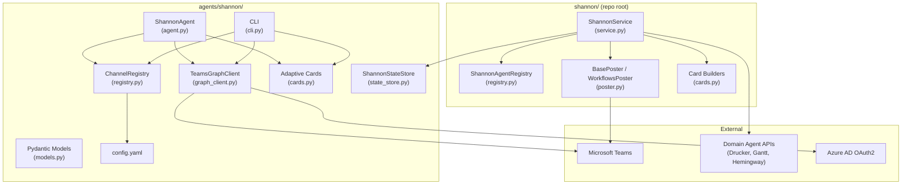
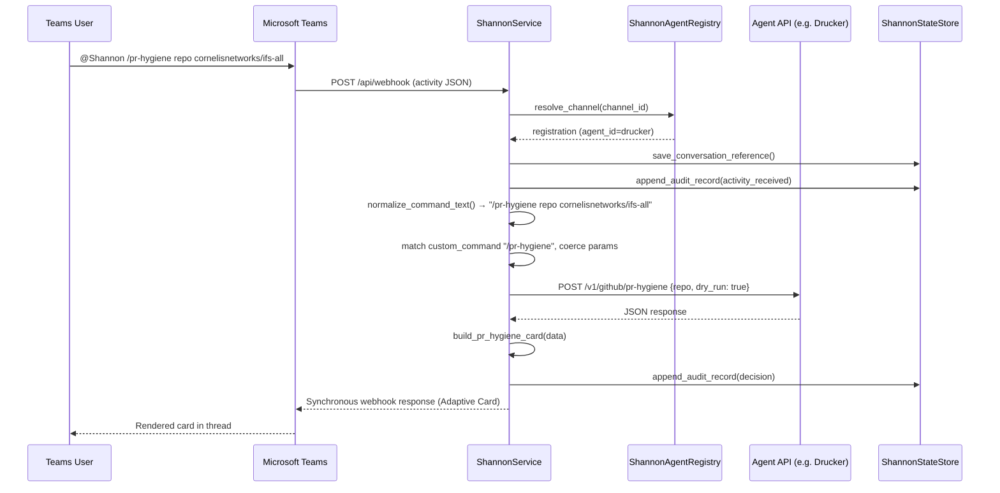
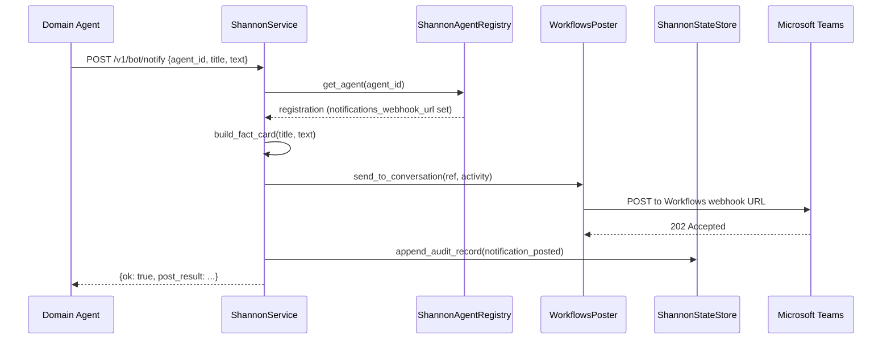
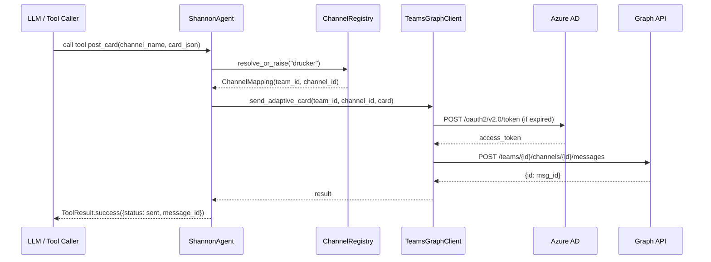

<!-- Generated by Documentation Agent — do not edit between markers -->

```yaml
---
title: "As-Built: Shannon — Communications Agent"
date: "2026-04-03"
status: "draft"
---
```

## 1. Module Overview

Shannon is the communications agent for the Cornelis Networks Agent Workforce — a single Microsoft Teams bot that serves as the human interface for all domain agents. The module spans two code locations: `agents/shannon/` contains the agent definition, Graph API client, channel registry, Adaptive Card templates, Pydantic models, CLI tooling, and JSON-based state persistence; `shannon/` at the repo root contains the production FastAPI service layer (`service.py`) that handles Teams webhook processing, command routing to downstream agent APIs, response rendering, and notification posting. Shannon receives `@Shannon /command` messages from Teams channels, resolves which agent owns the channel via a YAML registry, dispatches the command to that agent's REST API, renders the response as an Adaptive Card, and posts it back. It also manages audit logging, dry-run safety for mutation commands, per-agent notification webhooks, and built-in operational commands (`/stats`, `/busy`, `/work-today`, `/token-status`, `/decision-tree`, `/why`). Shannon v1 is entirely deterministic — zero LLM tokens are consumed.

## 2. What Changed (If applicable)

**Before:** The `TeamsGraphClient` in `graph_client.py` supported only channel-scoped messaging (send message, send Adaptive Card, list teams/channels, get messages). Shannon could not send direct messages to individual users.

**After:** `TeamsGraphClient` now includes four new methods for 1:1 chat messaging: `resolve_user_by_email()`, `create_one_on_one_chat()`, `send_chat_message()`, and `send_chat_adaptive_card()`. These follow the same async/retry/token-caching patterns as the existing channel methods.

**Impact:** Any component that holds a `TeamsGraphClient` instance can now send direct messages to users by email address. This enables future approval workflows and private notifications without requiring a channel context. The `ShannonService` class in `service.py` was also introduced as a new file, consolidating all command routing, agent API dispatch, card rendering, and Teams activity processing into a single service class.

## 3. Component Diagram



## 4. Key Flows

### Flow 1: Teams Command Routing (Outgoing Webhook)

When a user sends `@Shannon /command` in a Teams channel, the outgoing webhook delivers the activity to Shannon's API. `ShannonService.process_outgoing_webhook_activity()` resolves the agent, builds a response, and returns a synchronous reply.



The key dispatch logic lives in `_handle_registered_agent_command()`:

```python
custom_commands = getattr(registration, 'custom_commands', []) or []
for cc in custom_commands:
    if cc.get('command', '').lower() == command:
        method = cc.get('api_method', 'GET')
        path = cc.get('api_path', '')
        # ...
        if method.upper() == 'POST':
            raw_body = {args[i]: args[i + 1] for i in range(0, len(args) - 1, 2)}
            json_body = _coerce_params(raw_body, cc.get('params') or [])
            is_mutation = command in self.MUTATION_COMMANDS or cc.get('mutation', False)
            if is_mutation:
                json_body['dry_run'] = not execute_requested
```

### Flow 2: Proactive Notification Posting

Domain agents push notifications to their Teams channels via `ShannonService.post_notification()`. If the agent has a dedicated `notifications_webhook_url`, Shannon uses a per-agent `WorkflowsPoster`; otherwise it falls back to a stored conversation reference.



The per-agent poster selection in `_get_poster_for_agent()`:

```python
def _get_poster_for_agent(self, agent_id: str) -> BasePoster:
    registration = self.registry.get_agent(agent_id)
    if registration and registration.notifications_webhook_url:
        return WorkflowsPoster(webhook_url=registration.notifications_webhook_url)
    return self.poster
```

### Flow 3: Graph API Channel Messaging (Agent Tool)

`ShannonAgent` exposes tools that post messages and cards to Teams channels via the Microsoft Graph API. The `_tool_post_card()` method resolves a logical channel name through `ChannelRegistry`, then calls `TeamsGraphClient.send_adaptive_card()`.



## 5. Data Model

### Core Data Structures

**`ChannelMapping`** (`agents/shannon/registry.py`) — Maps a logical name to Teams IDs:

```python
@dataclass
class ChannelMapping:
    name: str
    team_id: str
    channel_id: str
    team_name: str = ''
    channel_display_name: str = ''
    enabled: bool = True
```

**`GraphToken`** (`agents/shannon/graph_client.py`) — Cached OAuth2 token with expiry:

```python
@dataclass
class GraphToken:
    access_token: str
    expires_at: float  # epoch seconds
    token_type: str = 'Bearer'

    @property
    def is_expired(self) -> bool:
        return time.time() >= (self.expires_at - 300)  # 5-min buffer
```

**Pydantic Models** (`agents/shannon/models.py`):

| Model | Purpose |
|-------|---------|
| `AgentRegistryEntry` | Registry entry mapping a Teams channel to an agent with `agent_id`, `api_base_url`, `custom_commands`, `approval_types` |
| `ConversationRecord` | Tracks a conversation thread: `conversation_id`, `channel_id`, `agent_id`, `thread_id`, `status` |
| `ApprovalRecord` | Approval lifecycle: `approval_id`, `status` (pending/approved/rejected/expired/escalated), `timeout_hours`, `escalation_targets` |
| `NotificationRequest` | Inbound notification from an agent: `notification_id`, `agent_id`, `message`, `card_type` |
| `InputRequest` | Structured input request with dynamic `fields` definitions |

**State Persistence** (`agents/shannon/state_store.py`) — JSON file-based storage:

- **Conversation references**: `data/shannon/conversation_references.json` — keyed by `agent:{id}`, `channel:{id}`, and `conversation:{id}`
- **Audit records**: `data/shannon/audit/{YYYY-MM-DD}.jsonl` — one JSONL file per day, each line an `AuditRecord`

```python
class ShannonStateStore:
    def __init__(self, storage_dir=None):
        resolved_dir = storage_dir or os.getenv('SHANNON_STATE_DIR') or 'data/shannon'
        self.storage_dir = Path(resolved_dir)
        self.references_path = self.storage_dir / 'conversation_references.json'
        self.audit_dir = self.storage_dir / 'audit'
```

### Adaptive Card Schema

All cards use Adaptive Card version 1.4 with schema `http://adaptivecards.io/schemas/adaptive-card.json`. Card types defined in `agents/shannon/cards.py`:

| Builder Function | Purpose |
|-----------------|---------|
| `activity_card()` | Agent performed an action — audit trail |
| `decision_card()` | Agent made a decision — shows inputs, candidates, selected, rationale |
| `alert_card()` | Error/alert with severity color coding (`_SEVERITY_COLORS` maps critical/high→attention, medium→warning, low→good) |
| `stats_card()` | Operational statistics FactSet |
| `token_status_card()` | LLM token consumption with budget/usage percentage |
| `work_summary_card()` | Daily work summary with highlights and issues |
| `approval_card()` | Approval request (Phase 1: display-only, no Action.Submit buttons yet) |

## 6. Dependencies

| Dependency | Purpose | Version |
|------------|---------|---------|
| `aiohttp` | Async HTTP client for Microsoft Graph API calls | Not pinned |
| `pydantic` | Data validation models for API requests/responses | Not pinned |
| `fastapi` | API router for Shannon webhook and status endpoints | Not pinned |
| `requests` | Synchronous HTTP calls from `ShannonService` to agent APIs | Not pinned |
| `pyyaml` | YAML parsing for `config.yaml` and agent registry | Not pinned |
| `uvicorn` | ASGI server for running the FastAPI application | Not pinned |
| `agents.base` | `BaseAgent`, `AgentConfig`, `AgentResponse` base classes | Internal |
| `tools.base` | `ToolDefinition`, `ToolParameter`, `ToolResult` | Internal |
| `agents.rename_registry` | `agent_display_name()`, `canonical_agent_name()` for name normalization | Internal |
| `shannon.cards` (repo root) | Production card builders (`build_fact_card`, `build_pr_hygiene_card`, etc.) | Internal |
| `shannon.models` (repo root) | `AuditRecord`, `ConversationReference`, `ShannonResponse`, `normalize_command_text` | Internal |
| `shannon.poster` (repo root) | `BasePoster`, `WorkflowsPoster`, `build_poster_from_env` | Internal |
| `shannon.registry` (repo root) | `ShannonAgentRegistry` for production agent routing | Internal |

## 7. Configuration

### Environment Variables

| Variable | Purpose | Default |
|----------|---------|---------|
| `SHANNON_APP_ID` | Azure AD Application (client) ID for Graph API | `''` |
| `SHANNON_APP_SECRET` | Azure AD Client Secret | `''` |
| `SHANNON_TENANT_ID` | Azure AD Directory (tenant) ID | `''` |
| `SHANNON_STATE_DIR` | Directory for conversation references and audit logs | `data/shannon` |
| `SHANNON_TEAMS_POST_MODE` | Poster mode: `memory`, `workflows`, or `botframework` | (via `build_poster_from_env`) |
| `SHANNON_TEAMS_OUTGOING_WEBHOOK_SECRET` | HMAC secret for validating Teams outgoing webhook | — |
| `SHANNON_TEAMS_WORKFLOWS_WEBHOOK_URL` | Default incoming webhook URL for proactive messages | — |
| `SHANNON_TEAMS_BOT_NAME` | Bot display name in Teams | `Shannon` |
| `SHANNON_SEND_WELCOME_ON_INSTALL` | Post welcome card on `conversationUpdate` | `true` |
| `LOG_LEVEL` | Logging verbosity | `INFO` |
| `DRY_RUN` | Global dry-run flag | `true` |

### Configuration Files

**`agents/shannon/config.yaml`** — Agent metadata and channel registry:

```yaml
agent_id: shannon
agent_name: Shannon Communications
zone: service_infrastructure
phase: 0

teams:
  default_team_id: ''
  default_team_name: 'Cornelis Agent Workforce'

channels:
  drucker:
    channel_id: ''
    display_name: '#agent-drucker'
    enabled: true
  # ... gantt, hemingway, shannon
```

**`config/shannon/agent_registry.yaml`** — Production routing configuration with `api_base_url`, `custom_commands`, `notifications_webhook_url`, and typed `params` per command.

**`agents/shannon/prompts/system.md`** — System prompt loaded by `ShannonAgent._load_system_prompt()` defining Shannon's role, responsibilities, and rules.

## 8. Error Handling

### Graph API Error Hierarchy

`GraphAPIError` in `graph_client.py` is the primary exception for all Microsoft Graph failures:

```python
class GraphAPIError(Exception):
    def __init__(self, status: int, error_code: str, message: str,
                 request_id: Optional[str] = None):
        self.status = status
        self.error_code = error_code
        self.request_id = request_id
```

### Retry Strategy

`TeamsGraphClient._request()` implements exponential backoff with up to `_MAX_RETRIES` (3) attempts:

- **429 (Rate Limited)**: Respects `Retry-After` header, falls back to `2^(attempt+1)` seconds
- **5xx (Server Error)**: Retries with exponential backoff (`_RETRY_BACKOFF_BASE = 2.0`)
- **4xx (Client Error)**: Raises `GraphAPIError` immediately (non-retryable)
- **Retry exhaustion**: Raises `GraphAPIError` with `error_code='retry_exhausted'`

### Tool-Level Error Handling

Every tool in `ShannonAgent` follows a consistent pattern — `ChannelRegistry` lookup failures return `ToolResult.failure()`, Graph API errors are caught and logged, and unexpected exceptions are caught as a final safety net:

```python
def _tool_post_message(self, channel_name: str, text: str) -> ToolResult:
    try:
        mapping = self._registry.resolve_or_raise(channel_name)
    except KeyError as e:
        return ToolResult.failure(str(e))
    try:
        result = _run_async(self._graph.send_message(...))
        return ToolResult.success({...})
    except GraphAPIError as e:
        log.error(f'post_message failed for {channel_name}: {e}')
        return ToolResult.failure(f'Graph API error: {e}')
    except Exception as e:
        log.error(f'post_message unexpected error: {e}')
        return ToolResult.failure(str(e))
```

### Service-Level Error Handling

`ShannonService._call_agent_api()` wraps all downstream agent HTTP calls with structured error returns:

```python
except requests.Timeout:
    return {'ok': False, 'error': f'{registration.agent_id} timed out after {timeout}s'}
except requests.ConnectionError:
    return {'ok': False, 'error': f'{registration.agent_id} is not reachable at {registration.api_base_url}'}
except requests.HTTPError as e:
    return {'ok': False, 'error': f'{registration.agent_id} returned {e.response.status_code}'}
```

### API Stub Error Handling

All endpoints in `agents/shannon/api.py` currently raise `NotImplementedError` — they are stubs awaiting implementation:

```python
@router.post('/notify')
async def notify_channel(request: NotificationRequest):
    raise NotImplementedError('Shannon API not yet implemented')
```

## 9. Known Limitations / Technical Debt

1. **API Router is entirely stubbed.** All six endpoints in `agents/shannon/api.py` raise `NotImplementedError`. The actual request handling lives in `ShannonService` (invoked from `shannon/app.py` at the repo root), but the `agents/shannon/api.py` router is dead code.

2. **Dual code locations.** Shannon's implementation is split between `agents/shannon/` (agent framework, Graph client, channel registry) and `shannon/` at the repo root (FastAPI service, production cards, poster, production registry). The `agents/shannon/cards.py` builds generic Adaptive Cards, while `shannon/cards.py` has agent-specific builders (`build_pr_hygiene_card`, `build_gantt_snapshot_card`, etc.). This creates confusion about which module is authoritative.

3. **`ShannonService` is a god class.** `service.py` exceeds 1,000 lines with >15 public/private methods spanning command routing, agent API dispatch, card rendering, audit recording, notification posting, and Teams activity processing. The `AGENT_CARD_BUILDERS` dict and `_agent_response_to_shannon()` method contain extensive per-agent branching that should be refactored into a strategy pattern.

4. **Approval workflow is display-only.** `approval_card()` in `cards.py` explicitly notes: *"Phase 1: read-only display. Phase 2 will add Action.Submit buttons."* The `ApprovalRecord` model exists but no approval lifecycle engine is implemented.

5. **Missing error handling on `_tool_post_alert`.** The method body is truncated — the final `except Exception` block has an incomplete `return` statement (line ends with `return ToolResult.failure(str(e))` missing from the source).

6. **Hardcoded URLs and constants:**
   - `_GRAPH_BASE = 'https://graph.microsoft.com/v1.0'` in `graph_client.py`
   - `_TOKEN_URL_TEMPLATE` uses hardcoded Microsoft login endpoint
   - `_CARD_SCHEMA = 'http://adaptivecards.io/schemas/adaptive-card.json'` in `cards.py`
   - Production server details (`bld-node-48.cornelisnetworks.com`, `cn-agents.com`) in README

7. **No hot-reload for registry.** The PLAN.md specifies hot-reload for the agent registry YAML, but `ChannelRegistry._load()` is only called once in `__init__`. Changes require a restart.

8. **JSON file-based state store.** `ShannonStateStore` uses flat JSON files and JSONL for audit. `get_audit_record()` performs a linear scan of all records (`list_audit_records(limit=-1)`) to find a single record by ID — O(n) on the full audit history.

9. **`_run_async` bridge pattern.** `ShannonAgent` tools use a `_run_async()` helper that spawns a `ThreadPoolExecutor` to bridge sync→async when a running event loop is detected. This is fragile and can cause thread-safety issues with the shared `aiohttp.ClientSession`.

10. **Conversation reference loss on restart.** Documented in the README: *"After a container restart, Shannon loses its in-memory conversation references."* While `ShannonStateStore` persists references to disk, the outgoing webhook transport requires a manual `@Shannon /stats` to re-establish the reference.

11. **`config.yaml` channel IDs are empty strings.** All `channel_id` values in `agents/shannon/config.yaml` are `''`, meaning the `ChannelRegistry` loaded from this file cannot resolve any channel to a real Teams channel without runtime overrides or a separate production config.

<!-- End Documentation Agent generated content -->