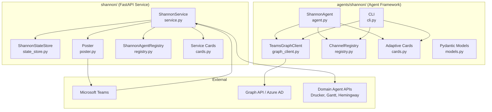
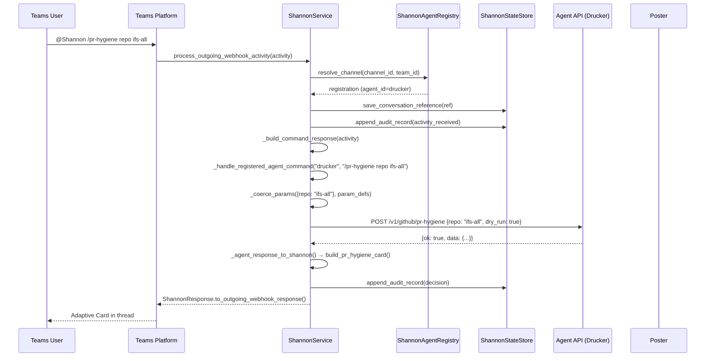
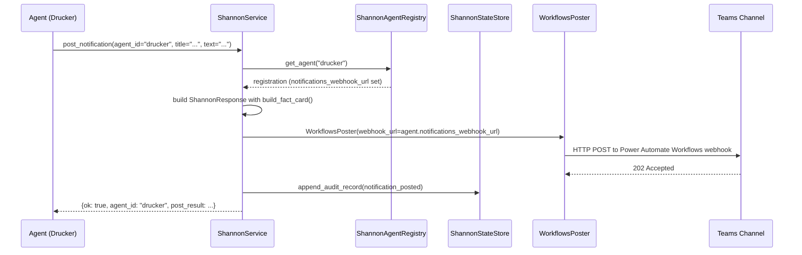
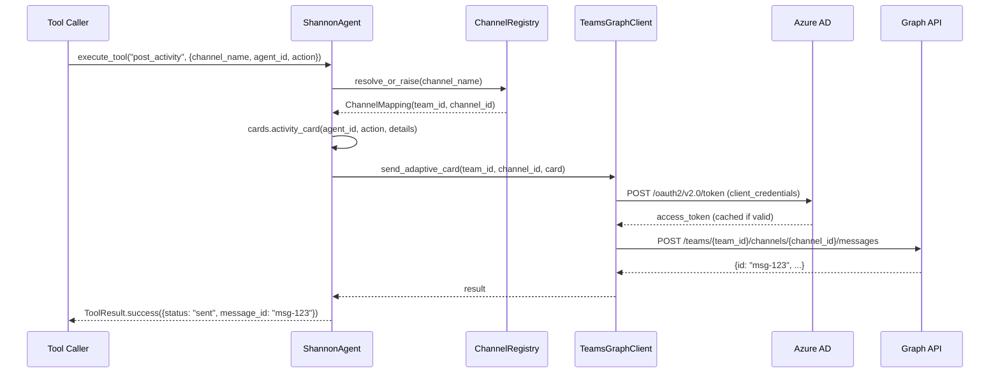

<!-- Generated by Documentation Agent — do not edit between markers -->

```yaml
---
title: "As-Built: Shannon — Communications Agent"
date: "2026-04-03"
status: "draft"
---
```

## 1. Module Overview

Shannon is the communications agent for the Cornelis Networks Agent Workforce — a single Microsoft Teams bot that serves as the human interface for all domain agents. The module spans two directory trees: `agents/shannon/` contains the agent-framework integration (tool-based `BaseAgent` subclass, Graph API client, channel registry, Pydantic models, Adaptive Card templates, CLI, and configuration), while `shannon/` at the repository root contains the production FastAPI service layer (`service.py`, `poster.py`, `registry.py`, `cards.py`, `models.py`, `app.py`) that handles Teams webhook ingestion, command routing, response rendering, and audit logging. Shannon receives `@Shannon /command` messages from Teams channels, resolves the target agent via a YAML-driven registry, dispatches HTTP calls to agent APIs, renders responses as Adaptive Cards, manages dry-run/execute workflows for mutations, posts proactive notifications, and persists every interaction to a JSON-based audit log. It is deterministic by design — zero LLM tokens are consumed in v1.

## 2. What Changed (If applicable)

**Before:** The `TeamsGraphClient` in `agents/shannon/graph_client.py` supported only channel-scoped messaging (team → channel → messages). `agents/shannon/service.py` did not exist; command routing lived elsewhere or was incomplete.

**After:** `TeamsGraphClient` now includes full 1:1 direct-message support: `resolve_user_by_email()`, `create_one_on_one_chat()`, `send_chat_message()`, and `send_chat_adaptive_card()`. The `agents/shannon/service.py` module was introduced as a comprehensive ~1000-line command router that handles Shannon built-in commands, standard agent command forwarding, custom command dispatch with typed parameter coercion, dry-run previews, natural-language query fallback, per-agent notification webhooks, and full audit recording.

**Impact:** Any agent can now send direct messages to individual users via the Graph client. The service layer is the central orchestration point for all Teams interactions — changes to command routing, card rendering, or audit logging affect every agent channel.

## 3. Component Diagram



## 4. Key Flows

### Flow 1: Teams Command Routing (Outgoing Webhook)

A user sends `@Shannon /pr-hygiene repo cornelisnetworks/ifs-all` in a Teams channel. Shannon parses the command, resolves the agent, calls the agent API, and returns an Adaptive Card.



The method `process_outgoing_webhook_activity()` in `service.py` is the entry point. It calls `_resolve_activity_agent()` to map the channel to an agent via the registry, then `_build_command_response()` which delegates to `_handle_registered_agent_command()`. Custom commands are matched against the registry's `custom_commands` list. POST commands go through `_coerce_params()` for type conversion. The response is rendered via agent-specific card builders in the `AGENT_CARD_BUILDERS` dispatch table.

### Flow 2: Proactive Notification Posting

An agent calls Shannon's `/v1/bot/notify` endpoint to post a notification to its dedicated Teams channel.



The `post_notification()` method in `ShannonService` checks whether the agent has a dedicated `notifications_webhook_url`. If so, it instantiates a `WorkflowsPoster` targeting that URL. Otherwise, it falls back to a stored conversation reference and the default poster. This enables per-agent notification channels as described in the configuration.

### Flow 3: Graph API Channel Messaging (Agent Framework Path)

The `ShannonAgent` tool-based path uses the `TeamsGraphClient` to post Adaptive Cards directly via the Microsoft Graph API.



The `_run_async()` bridge in `agent.py` handles the sync-to-async boundary since `BaseAgent.execute_tool` is synchronous but `TeamsGraphClient` is fully async via `aiohttp`. Token acquisition uses OAuth2 client credentials flow with a 5-minute expiry buffer (`GraphToken.is_expired`). Rate-limited (429) and server error (5xx) responses are retried with exponential backoff up to `_MAX_RETRIES` (3) attempts.

## 5. Data Model

### Agent Framework Models (`agents/shannon/models.py`)

The Pydantic models define the data contracts:

```python
class AgentRegistryEntry(BaseModel):
    agent_id: str
    agent_name: str
    channel_id: str
    channel_name: str
    api_base_url: str
    approval_types: List[str] = []
    custom_commands: List[Dict[str, Any]] = []
    enabled: bool = True

class ApprovalRecord(BaseModel):
    approval_id: str
    agent_id: str
    approval_type: str
    status: str = 'pending'  # pending | approved | rejected | expired | escalated
    timeout_hours: Optional[int] = None
    escalation_targets: List[str] = []

class NotificationRequest(BaseModel):
    notification_id: str
    agent_id: str
    message: str
    card_type: Optional[str] = None  # activity | decision | error | stats

class InputRequest(BaseModel):
    request_id: str
    agent_id: str
    fields: List[Dict[str, Any]]
    status: str = 'pending'  # pending | received | expired
```

### Channel Registry (`agents/shannon/registry.py`)

```python
@dataclass
class ChannelMapping:
    name: str           # Logical name, e.g. 'drucker'
    team_id: str        # Azure AD team/group ID
    channel_id: str     # Teams channel ID
    team_name: str = ''
    channel_display_name: str = ''
    enabled: bool = True

@dataclass
class RegistryConfig:
    default_team_id: str = ''
    default_team_name: str = ''
    channels: Dict[str, ChannelMapping] = field(default_factory=dict)
```

### Graph Client (`agents/shannon/graph_client.py`)

```python
@dataclass
class GraphToken:
    access_token: str
    expires_at: float   # epoch seconds
    token_type: str = 'Bearer'

    @property
    def is_expired(self) -> bool:
        return time.time() >= (self.expires_at - 300)  # 5-min buffer

@dataclass
class GraphMessage:
    id: str
    body_content: str
    body_content_type: str
    from_user: Optional[str] = None
    created_datetime: Optional[str] = None
```

### State Store (`agents/shannon/state_store.py`)

Persistence is JSON-file-based:

- **Conversation references**: `data/shannon/conversation_references.json` — keyed by `agent:{id}`, `channel:{id}`, and `conversation:{id}`.
- **Audit records**: `data/shannon/audit/{YYYY-MM-DD}.jsonl` — one JSON line per event, partitioned by day.

The `ShannonStateStore` class provides `compute_stats()` which aggregates across all audit files to produce counters for `messages_today`, `commands_today`, `notifications_today`, `errors_today`, and `messages_last_hour`.

### Service-Layer Models (referenced from `shannon/models.py`)

The service layer uses `AuditRecord`, `ConversationReference`, and `ShannonResponse` (imported from `shannon.models`, not shown in provided files). `ShannonResponse` carries `text`, `card`, `command`, `decision`, and `metadata` fields and provides `to_message_activity()` and `to_outgoing_webhook_response()` serialization methods.

## 6. Dependencies

| Dependency | Purpose | Version |
|---|---|---|
| `aiohttp` | Async HTTP client for Microsoft Graph API calls | Not pinned |
| `pydantic` | Data validation models for API contracts | v2 (BaseModel) |
| `fastapi` | API router for `/v1/bot/*` endpoints | Not pinned |
| `requests` | Synchronous HTTP calls from `ShannonService` to agent APIs | Not pinned |
| `pyyaml` | YAML parsing for `config.yaml` and agent registry | Not pinned |
| `uvicorn` | ASGI server for production deployment | Not pinned |
| `agents.base` | `BaseAgent`, `AgentConfig`, `AgentResponse` base classes | Internal |
| `tools.base` | `ToolDefinition`, `ToolParameter`, `ToolResult` | Internal |
| `agents.rename_registry` | `agent_display_name()`, `canonical_agent_name()` | Internal |
| `shannon.cards` | Service-layer Adaptive Card builders (30+ builders) | Internal |
| `shannon.models` | `AuditRecord`, `ConversationReference`, `ShannonResponse` | Internal |
| `shannon.poster` | `BasePoster`, `WorkflowsPoster`, `build_poster_from_env()` | Internal |
| `shannon.registry` | `ShannonAgentRegistry` (service-layer registry) | Internal |

## 7. Configuration

### Environment Variables

| Variable | Purpose | Default |
|---|---|---|
| `SHANNON_APP_ID` | Azure AD Application (client) ID for Graph API | `''` (warns) |
| `SHANNON_APP_SECRET` | Azure AD Client Secret | `''` (warns) |
| `SHANNON_TENANT_ID` | Azure AD Directory (tenant) ID | `''` (warns) |
| `SHANNON_STATE_DIR` | Directory for conversation refs and audit logs | `data/shannon` |
| `SHANNON_TEAMS_POST_MODE` | Poster mode: `memory`, `workflows`, `botframework` | `memory` |
| `SHANNON_TEAMS_OUTGOING_WEBHOOK_SECRET` | HMAC secret for Teams outgoing webhook validation | — |
| `SHANNON_TEAMS_WORKFLOWS_WEBHOOK_URL` | Power Automate Workflows incoming webhook URL | — |
| `SHANNON_TEAMS_BOT_NAME` | Bot display name in Teams | `Shannon` |
| `SHANNON_SEND_WELCOME_ON_INSTALL` | Post welcome card on `conversationUpdate` | `true` |
| `LOG_LEVEL` | Logging verbosity | `INFO` |
| `DRY_RUN` | Global dry-run flag | `true` |
| `AZURE_CLIENT_ID` / `AZURE_CLIENT_SECRET` / `AZURE_TENANT_ID` | Bot Framework OAuth (when `POST_MODE=botframework`) | — |

### Configuration Files

| File | Purpose |
|---|---|
| `agents/shannon/config.yaml` | Agent metadata, LLM settings, event declarations, channel registry skeleton |
| `config/shannon/agent_registry.yaml` | Production agent routing: agent IDs, API URLs, custom commands with typed params, per-agent webhook URLs |
| `agents/shannon/prompts/system.md` | System prompt loaded by `ShannonAgent._load_system_prompt()` |
| `deploy/env/shared.env` | Non-sensitive shared configuration |
| `deploy/env/teams.env` | Teams-specific credentials and webhook URLs |

### Agent Registry YAML Structure

From `config.yaml`, the channel registry follows this schema:

```yaml
teams:
  default_team_id: ''
  default_team_name: 'Cornelis Agent Workforce'

channels:
  drucker:
    channel_id: ''
    display_name: '#agent-drucker'
    enabled: true
```

The production `agent_registry.yaml` extends this with `api_base_url`, `custom_commands` (with `params` including `name`, `type`, `required`, `label`), `notifications_webhook_url`, and `mutation` flags.

## 8. Error Handling

### Graph API Error Hierarchy

The `GraphAPIError` exception in `graph_client.py` captures structured error information:

```python
class GraphAPIError(Exception):
    def __init__(self, status: int, error_code: str, message: str,
                 request_id: Optional[str] = None):
        self.status = status
        self.error_code = error_code
        self.request_id = request_id
```

The `_request()` method implements a tiered retry strategy:
- **429 (Rate Limited)**: Retries using the `Retry-After` header or exponential backoff (`2^(attempt+1)` seconds), up to `_MAX_RETRIES` (3).
- **5xx (Server Error)**: Retries with exponential backoff.
- **4xx (Client Error)**: Raises `GraphAPIError` immediately (non-retryable).
- **Retry exhaustion**: Raises `GraphAPIError` with `error_code='retry_exhausted'`.

### Tool-Level Error Handling

Every tool method in `ShannonAgent` follows a consistent pattern:

```python
def _tool_post_message(self, channel_name: str, text: str) -> ToolResult:
    try:
        mapping = self._registry.resolve_or_raise(channel_name)
    except KeyError as e:
        return ToolResult.failure(str(e))
    try:
        result = _run_async(self._graph.send_message(...))
        return ToolResult.success({...})
    except GraphAPIError as e:
        log.error(f'post_message failed for {channel_name}: {e}')
        return ToolResult.failure(f'Graph API error: {e}')
    except Exception as e:
        log.error(f'post_message unexpected error: {e}')
        return ToolResult.failure(str(e))
```

Channel resolution failures return `ToolResult.failure` with available channel names. Graph API errors and unexpected exceptions are caught separately, logged, and returned as structured failures.

### Service-Layer Error Handling

`ShannonService._call_agent_api()` wraps all `requests` calls with specific exception handling:

```python
except requests.Timeout:
    return {'ok': False, 'error': f'{agent_id} timed out after {timeout}s'}
except requests.ConnectionError:
    return {'ok': False, 'error': f'{agent_id} is not reachable at {api_base_url}'}
except requests.HTTPError as e:
    return {'ok': False, 'error': f'{agent_id} returned {e.response.status_code}'}
```

Failed agent calls are rendered as text responses with `decision='agent_call_failed'` and recorded in the audit log.

### Credential Validation

`TeamsGraphClient.__init__()` checks for the presence of all three credentials and logs a warning if any are missing, but does not raise — allowing the client to be instantiated in environments without credentials (e.g., testing, card rendering).

## 9. Known Limitations / Technical Debt

1. **API endpoints are stubs.** All six routes in `agents/shannon/api.py` raise `NotImplementedError`. The actual request handling lives in `ShannonService.process_teams_activity()` and `process_outgoing_webhook_activity()`, which are wired through `shannon/app.py` (not provided). The `api.py` router is dead code.

    ```python
    @router.post('/notify')
    async def notify_channel(request: NotificationRequest):
        raise NotImplementedError('Shannon API not yet implemented')
    ```

2. **God class: `ShannonService`** (`service.py`). At ~1000+ lines with 20+ public/private methods, this class handles command parsing, routing, card building dispatch, agent API calls, audit recording, notification posting, and Teams activity processing. It should be decomposed into separate router, renderer, and audit components.

3. **Truncated source in `_tool_post_alert`.** The `agent.py` file's `_tool_post_alert` method is truncated — the final `return ToolResult.failure(str(e))` line is missing, and `_tool_get_channels` is not shown. This suggests incomplete source or a copy artifact.

4. **Hardcoded URLs and constants.**
   - `_GRAPH_BASE = 'https://graph.microsoft.com/v1.0'` and `_TOKEN_URL_TEMPLATE` in `graph_client.py`.
   - `_DEFAULT_SCOPE = 'https://graph.microsoft.com/.default'`.
   - Production server details (`bld-node-48.cornelisnetworks.com`, `10.228.209.81`) and domain (`cn-agents.com`) are documented in the README.
   - `_RETRY_BACKOFF_BASE = 2.0` and `_MAX_RETRIES = 3` are module-level constants, not configurable.

5. **No persistent storage for approvals.** `ApprovalRecord` is defined in models but the approval workflow is display-only (Phase 1). The approval card says "Reply in this thread with **approve** or **reject**" — there is no automated response tracking, timeout detection, or escalation engine.

6. **JSON-file state store.** `ShannonStateStore` uses flat JSON files and JSONL for audit. The `compute_stats()` method reads *all* audit files (`limit=-1`) on every call, and `get_audit_record()` performs a linear scan across all records. This will degrade with volume. The planned PostgreSQL backend (per PLAN.md) is not implemented.

7. **Conversation reference loss on restart.** Documented in the README: after container restart, Shannon loses in-memory references. The JSON persistence mitigates this partially, but the README still instructs users to send `@Shannon /stats` to re-establish.

8. **Dual registry implementations.** `agents/shannon/registry.py` (`ChannelRegistry`) and `shannon/registry.py` (`ShannonAgentRegistry`) serve overlapping purposes. The agent framework path uses `ChannelRegistry`; the service layer uses `ShannonAgentRegistry`. This creates a maintenance burden and potential configuration drift.

9. **Missing error handling on `_tool_get_channels`.** The tool function body is not present in the provided source, so its error handling cannot be verified.

10. **`_run_async` thread-pool bridge.** When an event loop is already running, `_run_async` spawns a `ThreadPoolExecutor` thread and calls `asyncio.run()` inside it. This is a known anti-pattern that can cause issues with shared state and is not safe for high-concurrency scenarios.

11. **Empty channel IDs in config.yaml.** All `channel_id` values in `agents/shannon/config.yaml` are empty strings. These must be populated from the Azure portal or via the `shannon discover` CLI command before the agent framework path is functional.

<!-- End Documentation Agent generated content -->