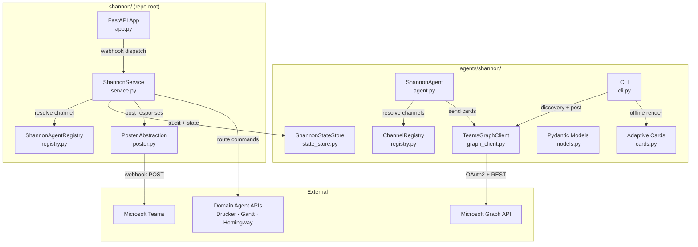
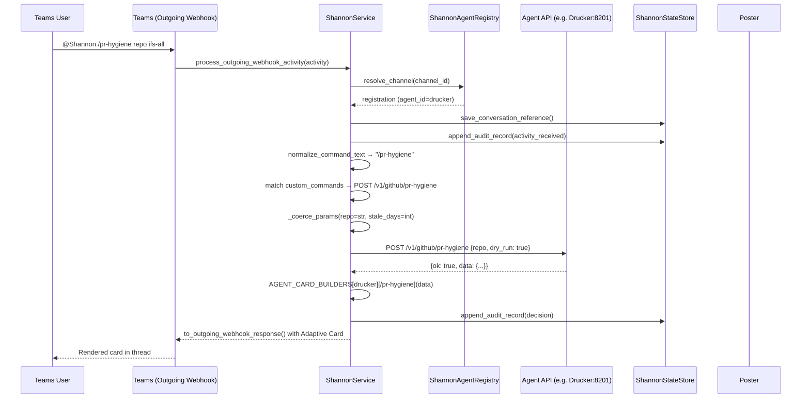
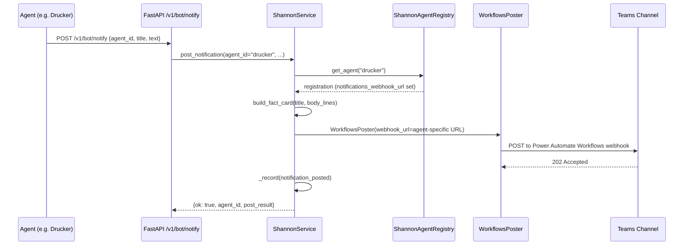
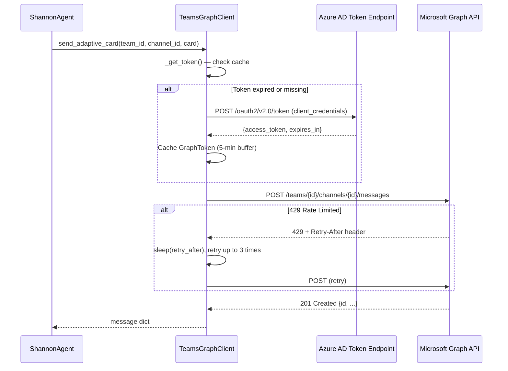

<!-- Generated by Documentation Agent — do not edit between markers -->

```yaml
---
title: "As-Built: Shannon — Communications Agent"
date: "2026-04-03"
status: "draft"
---
```

## 1. Module Overview

Shannon is the communications agent for the Cornelis Networks Agent Workforce — a single Microsoft Teams bot that serves as the human interface for all domain agents. It receives commands from Teams channels (via outgoing webhooks), routes them to the correct agent's REST API based on a YAML-driven registry, renders responses as Adaptive Cards, manages approval workflows, posts proactive notifications, and logs every interaction to a JSON-based audit trail. The implementation is split across two directory trees: `agents/shannon/` contains the agent class, Graph API client, channel registry, Pydantic models, card templates, CLI, and state store; `shannon/` at the repo root contains the FastAPI application, production service logic, poster abstraction, and production-grade card builders. Shannon is deterministic by design — command parsing, routing, and card rendering consume zero LLM tokens.

## 2. What Changed

**Before:** The Graph client (`agents/shannon/graph_client.py`) supported only channel-scoped messaging — `send_message`, `send_adaptive_card`, `get_messages`, and team/channel discovery. The service layer (`agents/shannon/service.py`) did not exist.

**After:** The Graph client now includes full 1:1 chat (DM) support: `resolve_user_by_email`, `create_one_on_one_chat`, `send_chat_message`, and `send_chat_adaptive_card`. The `ShannonService` class was introduced as the core command router and notification service, handling Teams activity processing, agent API dispatch, dry-run mutation previews, per-agent card rendering, natural-language query fallback, and per-agent notification webhook routing.

**Impact:** Any agent can now send direct messages to individual users via the Graph client. The `ShannonService` is the central orchestrator consumed by the FastAPI webhook endpoints — all Teams command handling flows through it. Downstream agents (Drucker, Gantt, Hemingway) benefit from dedicated card builders and per-agent notification channels.

## 3. Component Diagram



## 4. Key Flows

### Flow 1: Teams Command → Agent API → Adaptive Card Response

This is the primary flow. A user sends `@Shannon /command args` in a Teams channel; Shannon parses, routes, and replies.



The routing logic in `ShannonService._handle_registered_agent_command` first checks if the command matches one of the six standard routes (`STANDARD_COMMAND_ROUTES`), then iterates `custom_commands` from the registry entry. For POST mutations, `_coerce_params` converts flat string key-value pairs into typed JSON using the `params` metadata:

```python
def _coerce_params(raw: Dict[str, str], param_defs: List[Dict[str, Any]]) -> Dict[str, Any]:
    type_map = {p['name']: p.get('type', 'str') for p in param_defs}
    result: Dict[str, Any] = {}
    for key, value in raw.items():
        ptype = type_map.get(key, 'str')
        if ptype == 'list':
            result[key] = [v.strip() for v in value.split(',') if v.strip()]
        elif ptype == 'int':
            try:
                result[key] = int(value)
            except ValueError:
                result[key] = value
        elif ptype == 'bool':
            result[key] = value.lower() in ('true', '1', 'yes', 'on')
        else:
            result[key] = value
    return result
```

Mutation commands always send `dry_run=true` first. The user must append `execute` to confirm, which sets `dry_run=false`.

### Flow 2: Agent Proactive Notification → Teams Channel

Domain agents push notifications to their channels via `ShannonService.post_notification`.



When an agent has a `notifications_webhook_url` in the registry, `_get_poster_for_agent` creates a dedicated `WorkflowsPoster` targeting that agent's channel. Otherwise, it falls back to the default Shannon poster and uses a stored conversation reference.

### Flow 3: Graph API Authentication and Channel Messaging

The `TeamsGraphClient` handles OAuth2 client credentials flow with token caching and rate-limit retry.



The retry logic in `_request` handles both 429 (rate-limited) and 5xx (transient server errors) with exponential backoff:

```python
if resp.status == 429:
    retry_after = int(
        resp.headers.get('Retry-After', _RETRY_BACKOFF_BASE ** (attempt + 1))
    )
    await asyncio.sleep(retry_after)
    continue
```

## 5. Data Model

### Core Pydantic Models (`agents/shannon/models.py`)

| Model | Purpose | Key Fields |
|-------|---------|------------|
| `AgentRegistryEntry` | Maps a Teams channel to an agent | `agent_id`, `channel_id`, `api_base_url`, `custom_commands`, `enabled` |
| `ConversationRecord` | Tracks a conversation thread | `conversation_id`, `channel_id`, `agent_id`, `thread_id`, `user_id`, `status` |
| `ApprovalRecord` | Approval lifecycle state | `approval_id`, `agent_id`, `status` (pending/approved/rejected/expired/escalated), `timeout_hours`, `escalation_targets` |
| `NotificationRequest` | Inbound notification from an agent | `notification_id`, `agent_id`, `message`, `card_type`, `metadata` |
| `InputRequest` | Structured human input request | `request_id`, `agent_id`, `fields` (dynamic form schema), `status`, `response` |

### Graph Client Data Classes (`agents/shannon/graph_client.py`)

| Class | Purpose |
|-------|---------|
| `GraphToken` | Cached OAuth2 token with `is_expired` property (5-minute buffer before actual expiry) |
| `GraphMessage` | Parsed Teams channel message with `id`, `body_content`, `from_user`, `web_url` |

### Channel Registry Data Classes (`agents/shannon/registry.py`)

| Class | Purpose |
|-------|---------|
| `ChannelMapping` | Maps logical name → `team_id` + `channel_id` pair |
| `RegistryConfig` | Top-level config: `default_team_id`, `default_team_name`, dict of `ChannelMapping` |

### State Store Persistence (`agents/shannon/state_store.py`)

The `ShannonStateStore` uses file-based JSON persistence:

- **Conversation references:** `data/shannon/conversation_references.json` — keyed by `agent:{id}`, `channel:{id}`, and `conversation:{id}` for triple-indexed lookup.
- **Audit records:** `data/shannon/audit/{YYYY-MM-DD}.jsonl` — one JSONL file per day, append-only.

```python
def append_audit_record(self, record: AuditRecord) -> None:
    day = str(record.timestamp or '')[:10] or datetime.now(timezone.utc).date().isoformat()
    path = self.audit_dir / f'{day}.jsonl'
    with open(path, 'a', encoding='utf-8') as handle:
        handle.write(json.dumps(record.to_dict(), default=str) + '\n')
```

### Agent Registry YAML (`agents/shannon/config.yaml`)

```yaml
teams:
  default_team_id: ''
  default_team_name: 'Cornelis Agent Workforce'

channels:
  drucker:
    channel_id: ''
    display_name: '#agent-drucker'
    enabled: true
  gantt:
    channel_id: ''
    display_name: '#agent-gantt'
    enabled: true
  # ... hemingway, shannon
```

## 6. Dependencies

| Dependency | Purpose | Version |
|------------|---------|---------|
| `aiohttp` | Async HTTP client for Microsoft Graph API calls | Not pinned in source |
| `pydantic` | Data validation for models (`NotificationRequest`, `ApprovalRecord`, etc.) | v2 (BaseModel usage) |
| `fastapi` | API router for `/v1/bot/*` endpoints | Not pinned in source |
| `requests` | Synchronous HTTP calls from `ShannonService._call_agent_api` to domain agents | Not pinned in source |
| `pyyaml` | YAML parsing for `config.yaml` and agent registry | Not pinned in source |
| `agents.base` | `BaseAgent`, `AgentConfig`, `AgentResponse` base classes | Internal |
| `tools.base` | `ToolDefinition`, `ToolParameter`, `ToolResult` for tool registration | Internal |
| `shannon.cards` | Production card builders (`build_fact_card`, `build_pr_hygiene_card`, etc.) | Internal (repo root) |
| `shannon.models` | `AuditRecord`, `ConversationReference`, `ShannonResponse`, `normalize_command_text` | Internal (repo root) |
| `shannon.poster` | `BasePoster`, `WorkflowsPoster`, `build_poster_from_env` | Internal (repo root) |
| `shannon.registry` | `ShannonAgentRegistry` (production registry, distinct from `agents/shannon/registry.py`) | Internal (repo root) |
| `agents.rename_registry` | `agent_display_name`, `canonical_agent_name` for agent name normalization | Internal |

## 7. Configuration

### Environment Variables

| Variable | Required | Default | Description |
|----------|----------|---------|-------------|
| `SHANNON_APP_ID` | Yes (for Graph API) | `''` | Azure AD Application (client) ID |
| `SHANNON_APP_SECRET` | Yes (for Graph API) | `''` | Azure AD Client Secret |
| `SHANNON_TENANT_ID` | Yes (for Graph API) | `''` | Azure AD Directory (tenant) ID |
| `SHANNON_TEAMS_POST_MODE` | No | `memory` | Poster mode: `memory`, `workflows`, `botframework` |
| `SHANNON_TEAMS_OUTGOING_WEBHOOK_SECRET` | Yes (production) | — | HMAC secret from Teams outgoing webhook config |
| `SHANNON_TEAMS_WORKFLOWS_WEBHOOK_URL` | Yes (if `workflows` mode) | — | Power Automate Workflows incoming webhook URL |
| `SHANNON_TEAMS_BOT_NAME` | No | `Shannon` | Bot display name in Teams |
| `SHANNON_STATE_DIR` | No | `data/shannon` | Directory for conversation references and audit logs |
| `SHANNON_SEND_WELCOME_ON_INSTALL` | No | `true` | Post welcome card on `conversationUpdate` events |
| `LOG_LEVEL` | No | `INFO` | Logging verbosity |
| `DRY_RUN` | No | `true` | Global dry-run flag |
| `AZURE_CLIENT_ID` | Conditional | — | Required for `botframework` post mode |
| `AZURE_CLIENT_SECRET` | Conditional | — | Required for `botframework` post mode |
| `AZURE_TENANT_ID` | Conditional | — | Required for `botframework` post mode |

### Configuration Files

| File | Purpose |
|------|---------|
| `agents/shannon/config.yaml` | Channel-to-agent mapping, default team ID, event declarations, LLM settings |
| `config/shannon/agent_registry.yaml` | Production agent registry with `api_base_url`, `custom_commands`, `notifications_webhook_url` |
| `agents/shannon/prompts/system.md` | System prompt loaded by `ShannonAgent._load_system_prompt()` |
| `deploy/env/shared.env` | Non-sensitive shared config |
| `deploy/env/teams.env` | Teams webhook secrets and post mode |

### Feature Flags

| Flag | Location | Effect |
|------|----------|--------|
| `mutation: true` | Per-command in `agent_registry.yaml` | Enables dry-run-first behavior for that command |
| `enabled: true/false` | Per-channel in `config.yaml` | Disables channel routing without removing config |
| `send_welcome_on_install` | Env var or constructor arg | Controls whether Shannon posts a welcome card on bot install |

## 8. Error Handling

### Exception Hierarchy

```
GraphAPIError (agents/shannon/graph_client.py)
├── status: int          — HTTP status code
├── error_code: str      — Graph API error code (e.g. 'user_not_found')
├── message: str         — Human-readable error description
└── request_id: str      — Graph API request correlation ID
```

`GraphAPIError` is the sole custom exception. It is raised by `TeamsGraphClient._request` for non-retryable Graph API errors and by `_get_token` for authentication failures.

### Error Handling Patterns

**Graph client retry with backoff:** `_request` retries on HTTP 429 (rate-limited) and 5xx (server errors) up to `_MAX_RETRIES` (3) times with exponential backoff (`_RETRY_BACKOFF_BASE = 2.0`). Non-retryable errors (4xx except 429) raise `GraphAPIError` immediately.

**Tool-level error containment:** Every tool in `ShannonAgent` wraps Graph API calls in try/except blocks, catching both `GraphAPIError` and generic `Exception`, returning `ToolResult.failure(...)` instead of propagating:

```python
try:
    result = _run_async(
        self._graph.send_adaptive_card(...)
    )
    return ToolResult.success({...})
except GraphAPIError as e:
    log.error(f'post_card failed for {channel_name}: {e}')
    return ToolResult.failure(f'Graph API error: {e}')
except Exception as e:
    log.error(f'post_card unexpected error: {e}')
    return ToolResult.failure(str(e))
```

**Agent API call error handling:** `ShannonService._call_agent_api` catches `requests.Timeout`, `requests.ConnectionError`, `requests.HTTPError`, and generic `Exception`, returning `{'ok': False, 'error': ...}` dicts rather than raising:

```python
except requests.Timeout:
    return {'ok': False, 'error': f'{registration.agent_id} timed out after {timeout}s'}
except requests.ConnectionError:
    return {'ok': False, 'error': f'{registration.agent_id} is not reachable at {registration.api_base_url}'}
```

**Channel resolution:** `ChannelRegistry.resolve_or_raise` raises `KeyError` with a message listing available channels when a logical name is not found or is disabled.

**Async-to-sync bridge:** `_run_async` handles the case where a running event loop already exists by dispatching to a `ThreadPoolExecutor`, preventing "cannot run nested event loop" errors.

## 9. Known Limitations / Technical Debt

1. **API endpoints are stubs.** All six routes in `agents/shannon/api.py` raise `NotImplementedError`. The actual request handling lives in `ShannonService` (invoked by the FastAPI app at `shannon/app.py`), but the `agents/shannon/api.py` router is dead code:

   ```python
   @router.post('/notify')
   async def notify_channel(request: NotificationRequest):
       raise NotImplementedError('Shannon API not yet implemented')
   ```

2. **Dual registry implementations.** `agents/shannon/registry.py` (`ChannelRegistry`) and `shannon/registry.py` (`ShannonAgentRegistry`) serve overlapping purposes. `ShannonService` uses the latter; `ShannonAgent` uses the former. This creates a maintenance burden and potential configuration drift.

3. **Approval workflow is display-only.** The `approval_card` function in `agents/shannon/cards.py` explicitly notes: *"Phase 1: read-only display. Phase 2 will add Action.Submit buttons."* The `ApprovalRecord` model exists but no engine processes approval state transitions.

4. **No PostgreSQL or Redis.** The plan (`PLAN.md`) specifies PostgreSQL for audit/conversation state and Redis for rate limiting/caching. The actual implementation uses JSON files (`conversation_references.json`) and append-only JSONL (`audit/*.jsonl`). Rate limiting is noted as `'rate_limit_headroom': 'unbounded-v1'`.

5. **`ShannonService` is a god class.** `service.py` exceeds 1000 lines with more than 10 public methods (`get_health`, `get_stats`, `get_load`, `get_work_summary`, `get_token_status`, `get_decisions`, `get_decision`, `process_teams_activity`, `process_outgoing_webhook_activity`, `post_notification`, plus numerous private builders). It handles command parsing, agent dispatch, card selection, audit recording, and notification posting.

6. **Hardcoded card builder mapping.** `AGENT_CARD_BUILDERS` in `service.py` is a static dict mapping agent IDs and commands to card builder functions. Adding a new agent's card builders requires modifying this dict rather than being driven by configuration.

7. **Truncated source in `_tool_post_alert`.** The `_tool_post_alert` method in `agent.py` appears truncated — the final `except Exception` block has an incomplete `return` statement, and `_tool_get_channels` is referenced in `_build_tool_definitions` but its implementation is not present in the provided source.

8. **Conversation reference loss on restart.** Documented in the README: *"After a container restart, Shannon loses its in-memory conversation references."* While references are persisted to JSON, the `ConversationReference` objects used by the poster must be re-established by sending `@Shannon /stats` in the channel.

9. **Missing HMAC signature validation.** The plan specifies JWT/HMAC validation on inbound webhooks, and `SHANNON_TEAMS_OUTGOING_WEBHOOK_SECRET` is configured, but no signature verification logic is visible in the provided source files.

10. **Hardcoded URLs in Graph client.** The Microsoft identity platform endpoints are hardcoded constants:
    ```python
    _TOKEN_URL_TEMPLATE = 'https://login.microsoftonline.com/{tenant_id}/oauth2/v2.0/token'
    _GRAPH_BASE = 'https://graph.microsoft.com/v1.0'
    ```
    These are standard Microsoft endpoints and unlikely to change, but they prevent use in sovereign cloud environments without code modification.

<!-- End Documentation Agent generated content -->