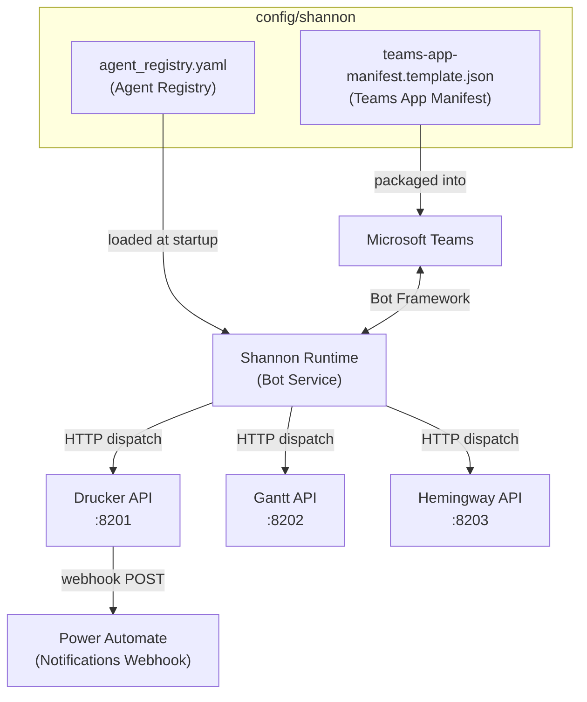
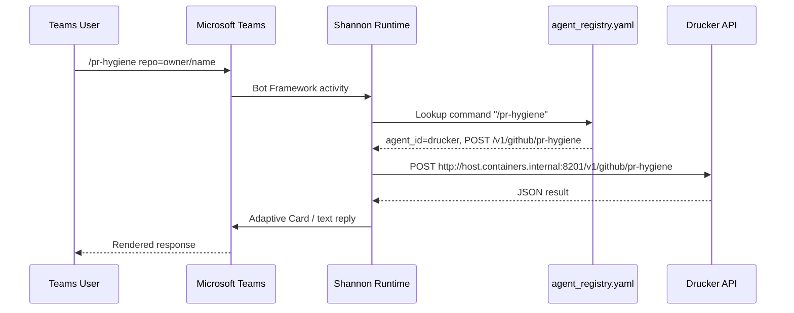
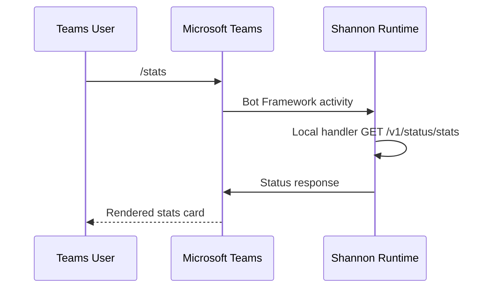
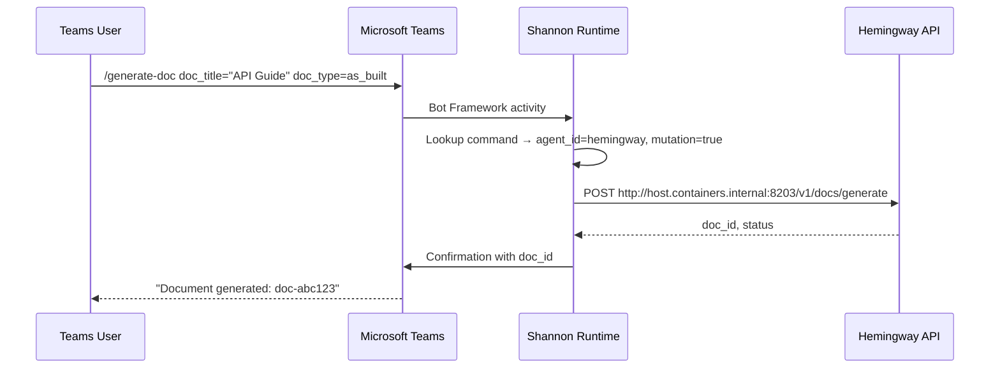

<!-- Generated by Documentation Agent — do not edit between markers -->

```yaml
---
title: "As-Built: Shannon — Design Reference"
date: "2026-04-02"
status: "draft"
---
```

## 1. Module Overview

Shannon is the centralized communications configuration layer for the Cornelis agent workforce. The `config/shannon/` directory defines two artifacts: an **agent registry** (`agent_registry.yaml`) that declares every agent in the workforce — their identity, Teams channel bindings, API base URLs, and the full catalog of slash-commands each agent exposes — and a **Teams app manifest template** (`teams-app-manifest.template.json`) that configures Shannon as a Microsoft Teams bot. Shannon itself is not a backend service in this directory; it is the **routing surface** — the single Teams bot through which all user-facing commands are dispatched to the appropriate agent API. The registry is the source of truth that Shannon's runtime reads to know which agents exist, where they live, and what commands they accept.

## 2. What Changed

- **Before:** The `api_base_url` for agents `drucker` and `gantt` pointed to `http://localhost:8201` and `http://localhost:8202` respectively, suitable only for bare-metal or same-host development.
- **After:** Both URLs now use `http://host.containers.internal:8201` and `http://host.containers.internal:8202`, the Docker/Podman DNS name that resolves to the container host's loopback interface.
- **Impact:** Shannon can now route commands to Drucker and Gantt when all services run in separate containers on the same host. Any developer running agents outside containers on `localhost` must either update the registry or set up equivalent DNS. No schema or command changes were introduced.

## 3. Component Diagram



## 4. Key Flows

### 4.1 Command Routing — User Issues a Slash Command

When a user types a command like `/pr-hygiene` in a Teams channel, Shannon's runtime looks up the command in the registry, resolves the target agent, and proxies the request.



The registry entry that drives this flow:

```yaml
- command: /pr-hygiene
  description: Full PR hygiene scan — stale PRs and missing reviews
  api_method: POST
  api_path: /v1/github/pr-hygiene
  mutation: false
  params:
    - name: repo
      type: str
      required: true
      label: GitHub repo (owner/name)
    - name: stale_days
      type: int
      required: false
      label: Days threshold (default 5)
```

### 4.2 Shannon Self-Status — Introspection Commands

Shannon exposes its own operational commands (e.g., `/stats`, `/busy`, `/work-today`) that do not proxy to an external agent. The `api_base_url` for Shannon is intentionally empty (`""`), signaling the runtime to handle these locally.



The empty `api_base_url` is the key indicator:

```yaml
- agent_id: shannon
  api_base_url: ""
  custom_commands:
    - command: /stats
      api_method: GET
      api_path: /v1/status/stats
```

### 4.3 Documentation Generation via Hemingway

A user requests documentation generation through Shannon, which proxies the mutation to Hemingway's API.



Hemingway commands include a `mutation: true` flag, which Shannon can use to enforce approval gates or confirmation prompts before dispatch:

```yaml
- command: /generate-doc
  api_method: POST
  api_path: /v1/docs/generate
  mutation: true
```

## 5. Data Model

The registry defines a flat list of agent records under the top-level `agents` key. Each agent record follows this schema:

| Field | Type | Description |
|---|---|---|
| `agent_id` | string | Unique identifier (e.g., `shannon`, `drucker`) |
| `display_name` | string | Human-readable name |
| `role` | string | Functional role label |
| `description` | string | One-line purpose statement |
| `zone` | string | Logical zone: `service_infrastructure`, `planning_delivery`, `intelligence_knowledge` |
| `channel_name` | string | Teams channel slug |
| `channel_id` | string | Teams channel GUID |
| `team_id` | string | Teams team GUID |
| `api_base_url` | string | Base URL for HTTP dispatch; empty string means local handling |
| `notifications_webhook_url` | string (optional) | Power Automate webhook for push notifications |
| `approval_types` | list | Reserved; currently empty for all agents |
| `custom_commands` | list | Command definitions (see below) |
| `timeout_seconds` | int | Per-agent HTTP timeout |

Each **custom command** record:

| Field | Type | Description |
|---|---|---|
| `command` | string | Slash-command trigger (e.g., `/pr-hygiene`) |
| `description` | string | Help text |
| `api_method` | string | HTTP method (`GET` or `POST`) |
| `api_path` | string | URL path appended to `api_base_url` |
| `mutation` | bool (optional) | Whether the command mutates state; defaults to `false` |
| `params` | list (optional) | Parameter definitions with `name`, `type`, `required`, `label` |

The **Teams manifest template** uses `${VAR}` placeholders for environment-specific values:

```json
"id": "${SHANNON_TEAMS_APP_ID}",
"botId": "${SHANNON_TEAMS_APP_ID}",
"validDomains": ["${SHANNON_PUBLIC_DOMAIN}"]
```

## 6. Dependencies

| Dependency | Purpose | Version |
|---|---|---|
| Microsoft Teams Bot Framework | Bot registration and message transport | v1.19 manifest schema |
| Drucker API | Engineering hygiene command dispatch target | Internal, port 8201 |
| Gantt API | Project planning command dispatch target | Internal, port 8202 |
| Hemingway API | Documentation generation command dispatch target | Internal, port 8203 |
| Power Automate | Notification webhook for Drucker alerts | Cloud service (URL in registry) |
| Docker/Podman DNS (`host.containers.internal`) | Container-to-host networking | Runtime dependency |

## 7. Configuration

### Environment Variables (Manifest Template)

| Variable | Purpose | Required |
|---|---|---|
| `SHANNON_TEAMS_APP_ID` | Azure AD app registration ID for the bot; used as both the manifest `id` and `botId` | Yes |
| `SHANNON_PUBLIC_DOMAIN` | Public domain added to `validDomains` for Teams message endpoint validation | Yes |

### Configuration Files

| File | Purpose |
|---|---|
| `config/shannon/agent_registry.yaml` | Declares all agents, their endpoints, and command catalogs. Read by Shannon runtime at startup. |
| `config/shannon/teams-app-manifest.template.json` | Template for the Teams app package. Must be rendered with environment variables and zipped for sideloading or publication. |

### Key Configuration Values

- **Agent timeouts:** Shannon self-commands use `timeout_seconds: 15`; all backend agents use `timeout_seconds: 30`.
- **Zones:** Three logical zones are defined — `service_infrastructure`, `planning_delivery`, `intelligence_knowledge` — which can drive routing policy or dashboard grouping.
- **All agents share a single `team_id`:** `19:z9bBTJk_jgiLI4kxvTIRgTuqqfBRZGvjCz7jCbUle481@thread.tacv2`.

## 8. Error Handling

Error handling is not implemented in these configuration files — they are declarative data. However, the registry encodes several patterns that the Shannon runtime is expected to enforce:

- **Timeout enforcement:** Each agent declares `timeout_seconds`. Shannon should abort and return an error card if the backend does not respond within this window.
- **Mutation gating:** Commands with `mutation: true` (e.g., `/generate-doc`, `/publish-doc`, `/pr-review`, `/confluence-publish`) signal that Shannon should require confirmation or approval before dispatch.
- **Required parameter validation:** Each command's `params` list includes `required: true/false`, enabling Shannon to reject malformed commands before making any HTTP call.
- **Empty `api_base_url`:** Shannon must detect this and route to its own internal handlers rather than attempting an HTTP call to an empty URL.

## 9. Known Limitations / Technical Debt

1. **Hardcoded webhook URL (credentials in config):** Drucker's `notifications_webhook_url` contains a full Power Automate URL with a `sig` query parameter — effectively an API key stored in plain text in the registry:
   ```yaml
   notifications_webhook_url: "https://...&sig=DX5rVpdRL5wpv_H9huN668nWIvrhGTWwe97q6NGpxh4"
   ```
   This should be externalized to a secrets manager or environment variable.

2. **Hardcoded Teams channel and team IDs:** All `channel_id` and `team_id` values are hardcoded GUIDs. Environment-specific deployments (staging, production) would require maintaining separate registry files or introducing variable substitution similar to the manifest template.

3. **Gantt `channel_id` is empty:** The Gantt agent has `channel_id: ""`, meaning Shannon cannot post proactive notifications to a Gantt-specific channel. This is either a placeholder awaiting channel creation or an intentional omission.

4. **`approval_types` unused:** Every agent declares `approval_types: []`. The field exists in the schema but has no active implementation, suggesting a planned but unbuilt approval workflow.

5. **Hemingway registry entry is truncated:** The `confluence-publish` command's `params` list is cut off mid-definition (the `parent_id` parameter has no `required` or `label` fields). This will cause a parse error or silent default depending on the YAML loader:
   ```yaml
          - name: parent_id
            type: str
            required: false
            label: Confluence parent page ID
   ```
   The file as provided ends before closing this parameter fully.

6. **No schema validation file:** There is no JSON Schema or equivalent for `agent_registry.yaml`. Adding one would catch structural errors (like the truncation above) before runtime.

7. **Single-host networking assumption:** The `host.containers.internal` DNS name assumes all agent containers run on the same Docker/Podman host. Multi-host or Kubernetes deployments will require service discovery or DNS overrides.

<!-- End Documentation Agent generated content -->