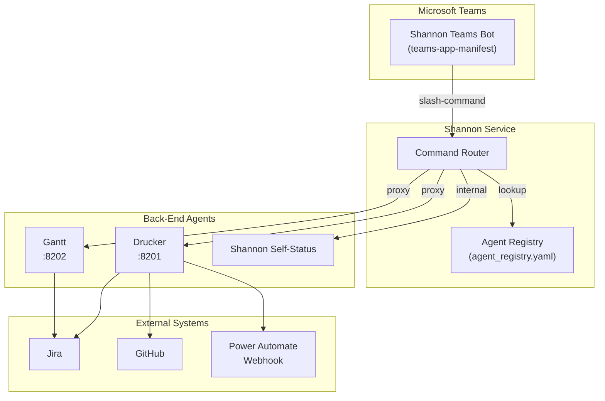
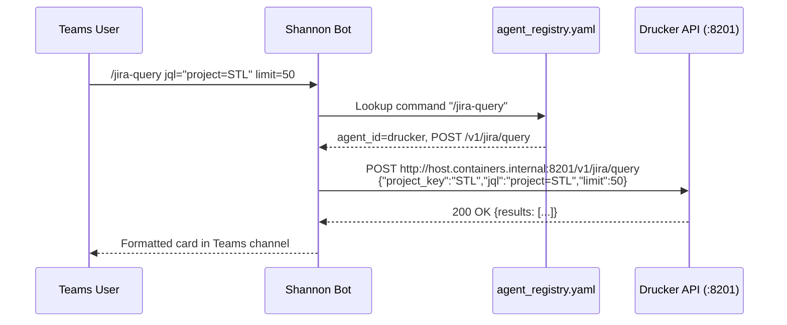
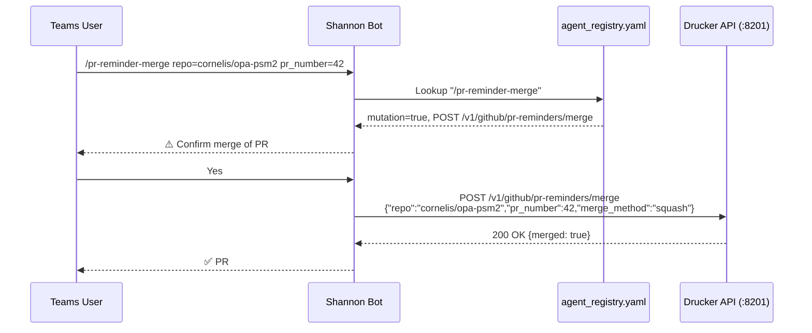
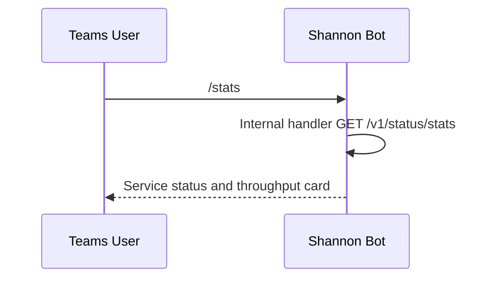

<!-- Generated by Documentation Agent — do not edit between markers -->

```yaml
---
title: "As-Built: Shannon — Configuration & Agent Registry"
date: "2026-04-03"
status: "draft"
---
```

# Module Overview

Shannon is the single Microsoft Teams bot and command-routing surface for the Cornelis agent workforce. Rather than each agent maintaining its own Teams presence, Shannon acts as a unified gateway: it receives slash-commands from Teams channels, resolves which back-end agent should handle the request, proxies the call to that agent's API, and returns the formatted result. The configuration layer documented here — `config/shannon/agent_registry.yaml` and `config/shannon/teams-app-manifest.template.json` — defines the complete roster of agents Shannon knows about, every command those agents expose, and the Teams application identity Shannon uses to operate as a bot.

# What Changed

**Before:** The Drucker agent entry in the registry contained Jira hygiene commands (`/issue-check`, `/intake-report`, `/hygiene-run`, etc.) and core GitHub PR hygiene commands (`/pr-hygiene`, `/pr-stale`, `/pr-reviews`, `/pr-list`, `/naming-compliance`, `/merge-conflicts`, `/ci-failures`, `/stale-branches`, `/extended-hygiene`). There were no Jira ad-hoc query commands, no natural-language query capability, and no PR reminder lifecycle commands.

**After:** Two new command groups were added to the `drucker` agent entry:

1. **Jira query & reporting commands** — seven new commands: `/jira-query`, `/jira-tickets`, `/jira-release-status`, `/jira-ticket-counts`, `/jira-status-report`, and `/ask` (LLM-powered natural-language query via `/v1/nl/query`).
2. **PR reminder commands** — seven new commands: `/pr-reminder-scan`, `/pr-reminder-process`, `/pr-reminders-active`, `/pr-reminder-history`, `/pr-reminder-snooze`, `/pr-reminder-merge`. The last two are the first `mutation: true` commands in the registry, meaning they alter state (snoozing reminders, merging PRs).

**Impact:** Shannon's command router must now recognize and dispatch 14 additional slash-commands to Drucker's API. Any command-help or auto-complete surface that Shannon renders in Teams will show a significantly larger Drucker command set. The introduction of `mutation: true` commands means Shannon (or its consumers) should enforce confirmation flows before executing `/pr-reminder-snooze` and `/pr-reminder-merge`.

# Component Diagram



# Key Flows

## Flow 1 — Slash-Command Dispatch (e.g., `/jira-query`)

A user types a command in a Teams channel. Shannon resolves the target agent from the registry, builds the HTTP request from the command definition, proxies it to the agent's API, and returns the response.



The registry entry for `/jira-query` specifies `api_method: POST`, `api_path: /v1/jira/query`, and three parameters (`project_key`, `jql`, `limit`). Shannon uses `api_base_url: http://host.containers.internal:8201` from the `drucker` agent definition to construct the full URL.

## Flow 2 — Mutation Command with Confirmation (e.g., `/pr-reminder-merge`)

Mutation commands carry `mutation: true` in the registry. This signals Shannon to require user confirmation before executing.



The two mutation commands in the registry are:

```yaml
- command: /pr-reminder-snooze
  mutation: true
  params: [repo, pr_number, snooze_days]

- command: /pr-reminder-merge
  mutation: true
  params: [repo, pr_number, merge_method]
```

## Flow 3 — Shannon Self-Status Query

Shannon exposes its own operational commands (`/stats`, `/busy`, `/work-today`, `/token-status`, `/decision-tree`, `/why`). These have no `api_base_url` — they are handled internally.



Shannon's own entry in the registry has `api_base_url: ""`, indicating these commands are served by Shannon itself rather than proxied to an external service.

# Data Model

The registry is a single YAML file with one top-level key `agents`, containing a list of agent definition objects. The core schema:

| Field | Type | Description |
|---|---|---|
| `agent_id` | `str` | Unique identifier (e.g., `shannon`, `drucker`, `gantt`) |
| `display_name` | `str` | Human-readable name shown in Teams |
| `role` | `str` | Functional role label |
| `description` | `str` | One-line description |
| `zone` | `str` | Deployment zone (`service_infrastructure`, `planning_delivery`) |
| `channel_name` | `str` | Teams channel name for this agent |
| `channel_id` | `str` | Teams channel ID |
| `team_id` | `str` | Teams team ID |
| `api_base_url` | `str` | Base URL for proxied commands; empty string for self-handled |
| `notifications_webhook_url` | `str` | Power Automate webhook for outbound notifications (Drucker only) |
| `approval_types` | `list` | Approval workflow types (currently empty for all agents) |
| `timeout_seconds` | `int` | HTTP timeout for proxied calls |
| `custom_commands` | `list[Command]` | Slash-commands this agent exposes |

Each **Command** object:

| Field | Type | Description |
|---|---|---|
| `command` | `str` | Slash-command string (e.g., `/jira-query`) |
| `description` | `str` | Help text |
| `api_method` | `str` | HTTP method (`GET` or `POST`) |
| `api_path` | `str` | URL path appended to `api_base_url` |
| `mutation` | `bool` | Whether the command mutates state (default `false` / absent) |
| `params` | `list[Param]` | Parameter definitions |

Each **Param** object:

| Field | Type | Description |
|---|---|---|
| `name` | `str` | Parameter key |
| `type` | `str` | Data type: `str`, `int`, `list` |
| `required` | `bool` | Whether the parameter is mandatory |
| `label` | `str` | Human-readable label with default hint |

The Teams app manifest (`teams-app-manifest.template.json`) uses environment-variable placeholders:

```json
{
  "id": "${SHANNON_TEAMS_APP_ID}",
  "bots": [{ "botId": "${SHANNON_TEAMS_APP_ID}", "scopes": ["team"] }],
  "validDomains": ["${SHANNON_PUBLIC_DOMAIN}"]
}
```

# Dependencies

| Dependency | Purpose | Version |
|---|---|---|
| Microsoft Teams Bot Framework | Bot registration, message receive/send | Manifest v1.19 |
| Drucker API | Jira hygiene, Jira query, GitHub PR hygiene, PR reminders | Internal `:8201` |
| Gantt API | Planning snapshots, release monitoring, release surveys | Internal `:8202` |
| Power Automate (webhook) | Drucker outbound notifications | SaaS |
| Jira (via Drucker/Gantt) | Ticket data, project queries | Transitive |
| GitHub (via Drucker) | PR data, branch data, merge operations | Transitive |

# Configuration

| Variable / Setting | Source | Description |
|---|---|---|
| `SHANNON_TEAMS_APP_ID` | Environment variable | Azure AD app registration ID used as both the manifest `id` and `botId` |
| `SHANNON_PUBLIC_DOMAIN` | Environment variable | Public domain added to `validDomains` for Teams message routing |
| `agent_registry.yaml` | Config file | Full agent roster, command definitions, and routing metadata |
| `api_base_url` per agent | Registry | Determines where Shannon proxies each agent's commands; `""` = self-handled |
| `timeout_seconds` per agent | Registry | Per-agent HTTP timeout (Shannon: 15s, Drucker: 30s, Gantt: inherits default) |
| `notifications_webhook_url` | Registry (Drucker) | Power Automate webhook URL for push notifications |
| `channel_id` / `team_id` | Registry | Teams channel targeting for agent-specific posts |

# Error Handling

Error handling patterns are implicit in the configuration layer:

- **Timeout enforcement**: Each agent specifies `timeout_seconds` (15 for Shannon, 30 for Drucker). Shannon's router should abort proxied calls that exceed this threshold.
- **Required parameter validation**: Each command's `params` list marks parameters as `required: true/false`. Shannon must validate presence of required parameters before dispatching. For example, `/jira-query` requires `jql` but `project_key` and `limit` are optional.
- **Mutation gating**: Commands with `mutation: true` signal that Shannon should require explicit user confirmation before execution, preventing accidental merges or state changes.
- **Empty `api_base_url`**: Shannon's own commands have `api_base_url: ""`. The router must detect this and handle internally rather than attempting an HTTP proxy call to an empty URL.

# Known Limitations / Technical Debt

1. **Hardcoded webhook URL**: Drucker's `notifications_webhook_url` contains a full Power Automate URL with embedded API key (`sig=DX5rVpdRL5wpv_H9huN668nWIvrhGTWwe97q6NGpxh4`). This is a **hardcoded credential** in a configuration file checked into source control. It should be moved to a secrets manager or environment variable.

   ```yaml
   notifications_webhook_url: "https://default4dbdb7da74ee4b458747ef5ce5ebe6...&sig=DX5rVpdRL5wpv_H9huN668nWIvrhGTWwe97q6NGpxh4"
   ```

2. **Hardcoded internal hostnames**: All `api_base_url` values use `host.containers.internal`, which is a Docker/Podman-specific DNS name. This couples the configuration to a specific container runtime.

   ```yaml
   api_base_url: http://host.containers.internal:8201
   ```

3. **Gantt agent incomplete**: The `gantt` agent has `channel_id: ""`, indicating it is not yet wired to a Teams channel. Several of its commands (`/release-survey-reports`) are missing `api_method` and `api_path` fields entirely — the YAML entry is truncated.

4. **No schema validation**: The registry is a plain YAML file with no JSON Schema or validation layer. Malformed entries (missing `api_path`, wrong `type` values) would only be caught at runtime.

5. **`approval_types` unused**: All three agents declare `approval_types: []`. The approval workflow mechanism is defined in the schema but has no active implementations.

6. **`mutation` field inconsistency**: Most non-mutating commands explicitly set `mutation: false`, but some commands omit the field entirely. The router must treat absent `mutation` as `false`, but this implicit convention is fragile.

7. **Growing command surface**: Drucker now exposes **31 commands** through Shannon. This is a large command set for a single slash-command interface and may benefit from command grouping or sub-command namespacing to improve discoverability.

8. **No rate limiting configuration**: There is no per-agent or per-command rate limiting defined in the registry. High-frequency commands like `/jira-ticket-counts` could overwhelm back-end APIs.

<!-- End Documentation Agent generated content -->