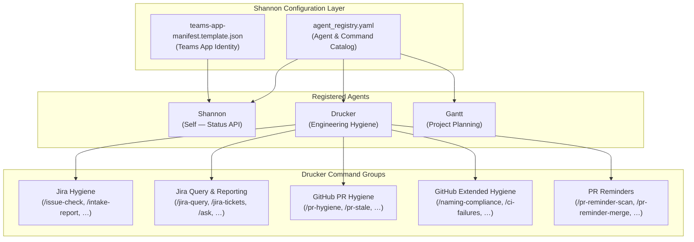
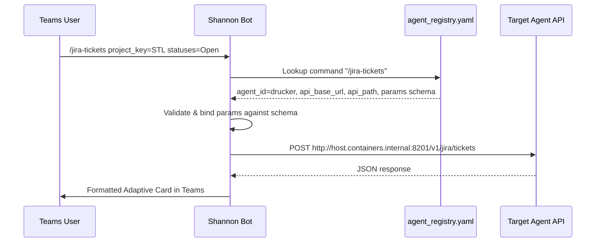
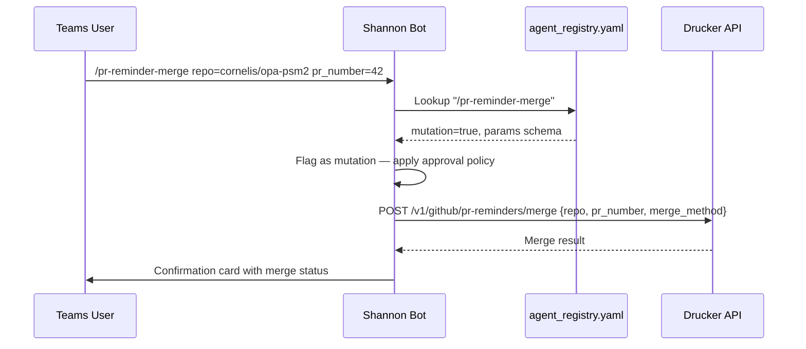
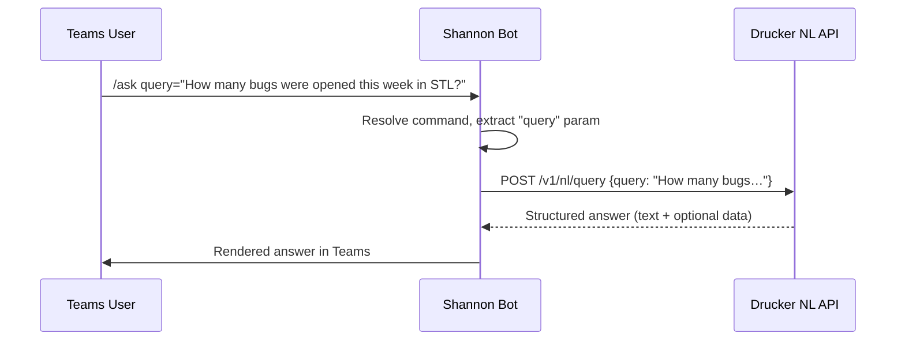

<!-- Generated by Documentation Agent — do not edit between markers -->

```yaml
---
title: "As-Built: Shannon — Configuration & Agent Registry"
date: "2026-04-03"
status: "draft"
---
```

# Module Overview

Shannon is the single Microsoft Teams bot and command-routing surface for the Cornelis agent workforce. Rather than each agent maintaining its own Teams presence, Shannon acts as a unified gateway: it receives slash-commands from Teams channels, resolves which back-end agent should handle the request, proxies the call to that agent's API, and returns the formatted result. The configuration layer documented here — `config/shannon/agent_registry.yaml` and `config/shannon/teams-app-manifest.template.json` — defines the complete command catalog, agent routing table, Teams application identity, and per-agent connection parameters that Shannon uses at runtime.

# What Changed

**Before:** The Drucker agent entry in `agent_registry.yaml` exposed Jira hygiene commands (`/issue-check`, `/intake-report`, `/hygiene-run`, etc.) and a core set of GitHub PR hygiene commands (`/pr-hygiene`, `/pr-stale`, `/pr-reviews`, `/pr-list`, `/naming-compliance`, `/merge-conflicts`, `/ci-failures`, `/stale-branches`, `/extended-hygiene`). There were no Jira ad-hoc query commands, no natural-language query support, and no PR reminder lifecycle commands.

**After:** Two new command groups were added to the Drucker agent definition:

1. **Jira query & reporting commands** — seven new commands: `/jira-query`, `/jira-tickets`, `/jira-release-status`, `/jira-ticket-counts`, `/jira-status-report`, and `/ask` (LLM-powered natural-language query). These route to Drucker's `/v1/jira/*` and `/v1/nl/query` API endpoints.
2. **PR reminder commands** — seven new commands: `/pr-reminder-scan`, `/pr-reminder-process`, `/pr-reminders-active`, `/pr-reminder-history`, `/pr-reminder-snooze`, and `/pr-reminder-merge`. These route to Drucker's `/v1/github/pr-reminders/*` endpoints. Notably, `/pr-reminder-snooze` and `/pr-reminder-merge` are the first commands in the registry marked `mutation: true`.

**Impact:** Any component that reads the agent registry to build help text, validate commands, or render Adaptive Cards will now see the expanded Drucker command set. Teams users gain direct access to ad-hoc Jira querying, project status dashboards, natural-language questions, and a full PR reminder lifecycle (scan → notify → snooze → merge) without leaving the Teams channel.

# Component Diagram



# Key Flows

## Flow 1 — Slash-Command Routing via the Agent Registry

When a user types a slash-command in Teams, Shannon's runtime looks up the command in the registry, resolves the target agent, constructs the HTTP request, and proxies it.



Shannon resolves the target by scanning each agent's `custom_commands` list for a matching `command` string. The `api_base_url` from the agent entry is concatenated with the command's `api_path` to form the full URL. Parameters are validated against the `params` list — each param specifies `name`, `type`, `required`, and `label`.

## Flow 2 — Mutation Command with Approval Gate (PR Reminder Merge)

Commands marked `mutation: true` represent state-changing operations. The `/pr-reminder-merge` command is a representative example.



The `mutation` flag on the command definition (`mutation: true`) signals Shannon's runtime to apply any configured approval or confirmation gates before forwarding the request. Currently, two Drucker commands carry this flag: `/pr-reminder-snooze` and `/pr-reminder-merge`.

## Flow 3 — Natural-Language Query Routing

The `/ask` command routes a free-text question to Drucker's LLM-powered natural-language endpoint.



This is the only command in the registry that delegates to an LLM-backed endpoint (`/v1/nl/query`). It accepts a single required `query` parameter of type `str`.

# Data Model

The agent registry defines a hierarchical data model expressed in YAML:

### Agent Entry

| Field | Type | Description |
|---|---|---|
| `agent_id` | `str` | Unique identifier (e.g., `shannon`, `drucker`, `gantt`) |
| `display_name` | `str` | Human-readable name |
| `role` | `str` | Functional role description |
| `description` | `str` | Full-text description |
| `zone` | `str` | Deployment zone (`service_infrastructure`, `planning_delivery`) |
| `channel_name` | `str` | Teams channel name for this agent |
| `channel_id` | `str` | Teams channel ID |
| `team_id` | `str` | Teams team ID |
| `api_base_url` | `str` | Base URL for the agent's HTTP API (empty for Shannon itself) |
| `notifications_webhook_url` | `str` | Power Automate webhook for outbound notifications (Drucker only) |
| `approval_types` | `list` | Approval workflow types (currently empty for all agents) |
| `custom_commands` | `list[Command]` | Ordered list of command definitions |
| `timeout_seconds` | `int` | HTTP timeout for proxied calls |

### Command Entry

| Field | Type | Description |
|---|---|---|
| `command` | `str` | Slash-command trigger (e.g., `/jira-query`) |
| `description` | `str` | Help text shown to users |
| `api_method` | `str` | HTTP method (`GET` or `POST`) |
| `api_path` | `str` | URL path appended to `api_base_url` |
| `mutation` | `bool` | Whether the command mutates state (optional, defaults to `false`) |
| `params` | `list[Param]` | Parameter definitions (optional) |

### Param Entry

| Field | Type | Description |
|---|---|---|
| `name` | `str` | Parameter key |
| `type` | `str` | Data type: `str`, `int`, or `list` |
| `required` | `bool` | Whether the parameter is mandatory |
| `label` | `str` | Human-readable label with default hint |

### Teams App Manifest

The `teams-app-manifest.template.json` defines the Teams application identity using template variables:

```json
{
  "id": "${SHANNON_TEAMS_APP_ID}",
  "packageName": "com.cornelis.agentworkforce.shannon",
  "bots": [
    {
      "botId": "${SHANNON_TEAMS_APP_ID}",
      "scopes": ["team"],
      "isNotificationOnly": false
    }
  ],
  "validDomains": ["${SHANNON_PUBLIC_DOMAIN}"]
}
```

The manifest declares a single bot scoped to `team` (not personal or group chat), with permissions for `identity` and `messageTeamMembers`.

# Dependencies

| Dependency | Purpose | Version |
|---|---|---|
| Microsoft Teams Bot Framework | Bot registration and message handling | Manifest v1.19 |
| Drucker API | Back-end for all Jira hygiene, Jira query, GitHub hygiene, and PR reminder commands | `http://host.containers.internal:8201` |
| Gantt API | Back-end for planning snapshot and release monitoring commands | `http://host.containers.internal:8202` |
| Power Automate | Outbound notification webhook for Drucker | Workflow endpoint (hardcoded URL) |
| Microsoft Teams Platform | Channel and team identity resolution | Teams API v2 (tacv2 thread format) |

# Configuration

### Environment Variables (Template Substitution)

| Variable | Used In | Purpose |
|---|---|---|
| `SHANNON_TEAMS_APP_ID` | `teams-app-manifest.template.json` | Azure AD app registration ID for the bot |
| `SHANNON_PUBLIC_DOMAIN` | `teams-app-manifest.template.json` | Public domain for webhook/messaging endpoint validation |

### Registry Configuration Constants

| Constant | Value | Location |
|---|---|---|
| Shannon timeout | `15` seconds | `agent_registry.yaml` → `shannon.timeout_seconds` |
| Drucker timeout | `30` seconds | `agent_registry.yaml` → `drucker.timeout_seconds` |
| Drucker API base | `http://host.containers.internal:8201` | `agent_registry.yaml` → `drucker.api_base_url` |
| Gantt API base | `http://host.containers.internal:8202` | `agent_registry.yaml` → `gantt.api_base_url` |
| Default Jira project | `STL` | Implied by param labels (e.g., "Jira project key (default STL)") |
| Default stale days (PR) | `5` | Param labels on PR hygiene commands |
| Default stale days (branch) | `30` | Param labels on stale-branches commands |

### Teams Manifest Settings

| Setting | Value |
|---|---|
| Manifest schema version | `1.19` |
| App version | `0.1.0` |
| Bot scopes | `team` only |
| Accent color | `#004b87` |
| File support | `false` |
| Notification-only | `false` |

# Error Handling

Error handling in this configuration layer is implicit rather than explicit:

- **Timeout enforcement:** Each agent entry specifies a `timeout_seconds` value (15s for Shannon, 30s for Drucker). Shannon's runtime is expected to enforce these as HTTP client timeouts when proxying commands.
- **Required parameter validation:** Each command's `params` list marks parameters as `required: true` or `required: false`. Shannon's runtime should reject commands with missing required parameters before making the API call.
- **Mutation gating:** Commands with `mutation: true` signal that additional confirmation or approval should be required. The `approval_types` field on each agent is currently an empty list `[]`, meaning no formal approval workflow is configured yet — mutation gating behavior depends on Shannon's runtime implementation.
- **No retry or circuit-breaker configuration** is present in the registry. Resilience patterns must be implemented in Shannon's runtime code.

# Known Limitations / Technical Debt

1. **Hardcoded URLs:**
   - Drucker's `api_base_url` is hardcoded to `http://host.containers.internal:8201` — this is a container-local address that assumes a specific deployment topology (Podman/Docker with host networking).
   - Gantt's `api_base_url` is hardcoded to `http://host.containers.internal:8202`.
   - Drucker's `notifications_webhook_url` contains a full Power Automate webhook URL with embedded API key (`sig=DX5rVpdRL5wpv_H9huN668nWIvrhGTWwe97q6NGpxh4`). **This is a hardcoded credential** that should be externalized to a secrets manager or environment variable.

2. **Gantt agent incomplete:** The Gantt agent entry has an empty `channel_id: ""`, indicating the Teams channel has not been provisioned or linked. Several Gantt commands (`/release-survey-reports`) are missing `api_method` and `api_path` fields — the YAML entry appears truncated.

3. **Shannon self-reference has no `api_base_url`:** Shannon's own agent entry sets `api_base_url: ""`. The five Shannon status commands (`/stats`, `/busy`, `/work-today`, `/token-status`, `/decision-tree`) presumably resolve to Shannon's own internal handlers, but this routing convention is implicit and undocumented in the registry schema.

4. **`approval_types` unused:** All three agents declare `approval_types: []`. The mutation flag on `/pr-reminder-snooze` and `/pr-reminder-merge` has no corresponding approval workflow definition, meaning mutation gating may be a no-op.

5. **No schema versioning:** The `agent_registry.yaml` file has no version field or schema reference. As the command catalog grows (Drucker alone now has 28 commands), a schema validation mechanism would prevent malformed entries.

6. **Shared `team_id` across agents:** All three agents share the same `team_id` value (`19:z9bBTJk_jgiLI4kxvTIRgTuqqfBRZGvjCz7jCbUle481@thread.tacv2`), and Shannon's `channel_id` is identical to its `team_id`. This may be intentional (single-team deployment) but could cause confusion if the workforce expands to multiple teams.

7. **Parameter type `list` lacks delimiter specification:** Several params use `type: list` with labels like "comma-separated", but the delimiter convention is encoded only in the human-readable label, not as a machine-readable field.

<!-- End Documentation Agent generated content -->