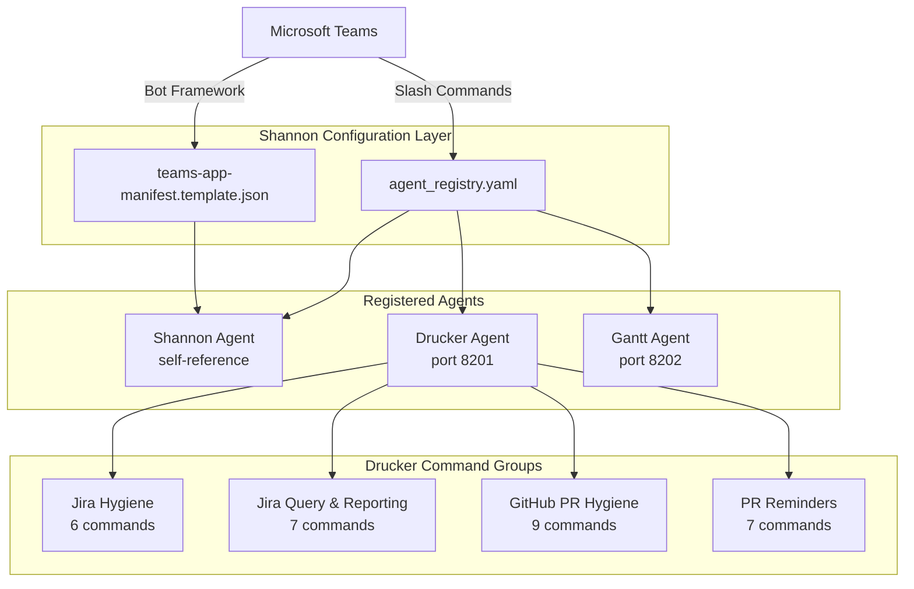
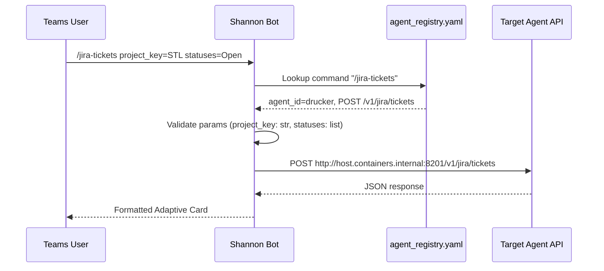
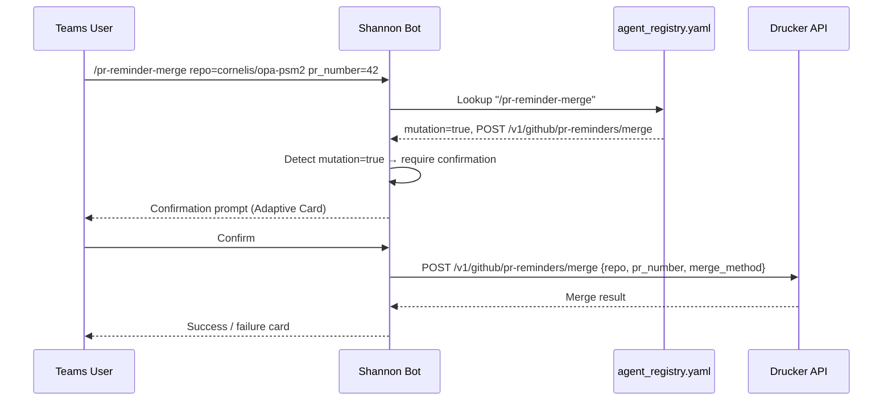
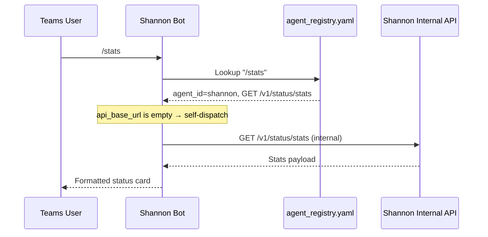

<!-- Generated by Documentation Agent — do not edit between markers -->

```yaml
---
title: "As-Built: Shannon — Configuration & Agent Registry"
date: "2026-04-03"
status: "draft"
---
```

# Module Overview

Shannon is the single Microsoft Teams bot and command-routing surface for the Cornelis agent workforce. Rather than each agent maintaining its own Teams presence, Shannon acts as a unified gateway: it receives slash-commands from Teams channels, resolves which back-end agent should handle the request, proxies the call to that agent's API, and returns the formatted result. The configuration layer documented here — `config/shannon/agent_registry.yaml` and `config/shannon/teams-app-manifest.template.json` — defines the complete command catalog, agent routing table, Teams application identity, and per-agent connection parameters that Shannon uses at runtime.

# What Changed

**Before:** The Drucker agent entry in `agent_registry.yaml` exposed Jira hygiene commands (`/issue-check`, `/intake-report`, `/hygiene-run`, etc.) and a core set of GitHub PR hygiene commands (`/pr-hygiene`, `/pr-stale`, `/pr-reviews`, `/pr-list`, `/naming-compliance`, `/merge-conflicts`, `/ci-failures`, `/stale-branches`, `/extended-hygiene`). There were no Jira ad-hoc query commands, no natural-language query capability, and no PR reminder lifecycle commands.

**After:** Two new command groups were added to the Drucker agent definition:

1. **Jira query & reporting commands** — seven new commands: `/jira-query`, `/jira-tickets`, `/jira-release-status`, `/jira-ticket-counts`, `/jira-status-report`, and `/ask` (LLM-powered natural-language query). These route to Drucker's `/v1/jira/*` and `/v1/nl/query` API endpoints.
2. **PR reminder commands** — seven new commands: `/pr-reminder-scan`, `/pr-reminder-process`, `/pr-reminders-active`, `/pr-reminder-history`, `/pr-reminder-snooze`, and `/pr-reminder-merge`. These route to Drucker's `/v1/github/pr-reminders/*` endpoints. Notably, `/pr-reminder-snooze` and `/pr-reminder-merge` are the first commands in the registry marked `mutation: true`.

**Impact:** Any component that reads `agent_registry.yaml` to build help text, validate commands, or render Adaptive Cards now sees 14 additional command definitions under the `drucker` agent. The two mutation commands (`/pr-reminder-snooze`, `/pr-reminder-merge`) may trigger confirmation flows in Shannon's routing layer if mutation guards are implemented. The `/ask` command introduces the first LLM-backed endpoint in the registry, which may carry different latency and cost characteristics.

# Component Diagram



# Key Flows

## Flow 1: Command Resolution and Routing

When a user types a slash-command in a Teams channel, Shannon's runtime reads the agent registry to resolve which agent owns the command, what HTTP method and path to use, and what parameters are required.



The registry entry for `/jira-tickets` specifies `api_method: POST`, `api_path: /v1/jira/tickets`, and `mutation: false`. Shannon constructs the request body from the parsed parameters, forwards it to Drucker's `api_base_url` (`http://host.containers.internal:8201`), and formats the response for Teams.

## Flow 2: Mutation Command with Confirmation Guard

The `/pr-reminder-merge` and `/pr-reminder-snooze` commands are the only entries in the registry with `mutation: true`. This signals Shannon to potentially require user confirmation before executing.



The `mutation` flag on the command definition is the mechanism by which the registry communicates write-side intent to Shannon's routing logic. The `merge_method` parameter defaults to `squash` per its label.

## Flow 3: Self-Status Introspection

Shannon registers itself as an agent (`agent_id: shannon`) with five status commands that query its own internal state rather than proxying to an external service.



The Shannon agent entry has `api_base_url: ""`, which signals that these commands are handled internally. Commands like `/decision-tree` and `/why` expose Shannon's routing decision audit trail.

# Data Model

The registry defines three core data structures implicitly through its YAML schema:

### Agent Entry

Each top-level item under `agents` represents a registered agent:

```yaml
- agent_id: drucker                    # Unique identifier, used for routing
  display_name: Drucker                # Human-readable name for Teams cards
  role: Engineering Hygiene            # Functional role label
  description: "..."                   # Full description
  zone: service_infrastructure         # Deployment zone classification
  channel_name: agent-drucker          # Teams channel name
  channel_id: "19:966aaa..."           # Teams channel ID (thread address)
  team_id: "19:z9bBTJ..."             # Teams team ID (shared across agents)
  api_base_url: http://host.containers.internal:8201  # Agent API endpoint
  notifications_webhook_url: "https://..."  # Power Automate webhook (Drucker only)
  approval_types: []                   # Reserved for future approval workflows
  custom_commands: [...]               # Command catalog
  timeout_seconds: 30                  # Per-agent request timeout
```

### Command Definition

Each entry in `custom_commands` defines a routable slash-command:

```yaml
- command: /jira-query              # Slash-command trigger string
  description: "Run an ad-hoc JQL query against Jira"
  api_method: POST                  # HTTP method for the proxied call
  api_path: /v1/jira/query          # Path appended to agent's api_base_url
  mutation: false                   # Whether this command modifies state
  params:                           # Parameter definitions (optional)
    - name: jql
      type: str                     # Type hint: str, int, list
      required: true
      label: JQL query string       # Human-readable label for prompts
```

### Parameter Definition

Parameters use three types: `str`, `int`, and `list`. The `list` type is documented as "comma-separated" in labels, implying Shannon parses comma-delimited input into arrays before forwarding.

### Teams App Manifest

The `teams-app-manifest.template.json` uses environment variable placeholders (`${SHANNON_TEAMS_APP_ID}`, `${SHANNON_PUBLIC_DOMAIN}`) that are resolved at deployment time:

```json
{
  "id": "${SHANNON_TEAMS_APP_ID}",
  "bots": [
    {
      "botId": "${SHANNON_TEAMS_APP_ID}",
      "scopes": ["team"],
      "isNotificationOnly": false
    }
  ],
  "validDomains": ["${SHANNON_PUBLIC_DOMAIN}"]
}
```

The bot is scoped to `team` (not `personal` or `groupChat`), and `isNotificationOnly: false` enables bidirectional conversation.

# Dependencies

| Dependency | Purpose | Version |
|---|---|---|
| Microsoft Teams Bot Framework | Bot registration, message receive/send | Manifest v1.19 |
| Drucker Agent API | Jira hygiene, Jira query, GitHub PR hygiene, PR reminders | `http://host.containers.internal:8201` |
| Gantt Agent API | Planning snapshots, release monitoring, release surveys | `http://host.containers.internal:8202` |
| Power Automate Webhook | Drucker notification delivery (Teams DM via Power Automate) | Direct workflow trigger v1.0 |
| Teams Channel Infrastructure | Shared `team_id` across all agents | Thread ID `19:z9bBTJ...` |

# Configuration

### Environment Variables (Manifest Template)

| Variable | Purpose | Required |
|---|---|---|
| `SHANNON_TEAMS_APP_ID` | Azure AD app registration ID for the bot; used as both `id` and `botId` in the manifest | Yes |
| `SHANNON_PUBLIC_DOMAIN` | Public domain added to `validDomains` for Teams message routing | Yes |

### Registry Configuration Keys

| Key | Scope | Description |
|---|---|---|
| `api_base_url` | Per-agent | Base URL for HTTP proxying. Empty string (`""`) for Shannon self-dispatch. |
| `timeout_seconds` | Per-agent | Request timeout. Shannon uses 15s; Drucker and Gantt use 30s. |
| `notifications_webhook_url` | Per-agent | Power Automate webhook URL. Currently only set on Drucker. |
| `channel_id` | Per-agent | Teams thread ID for posting to the agent's dedicated channel. Gantt's `channel_id` is empty (`""`), indicating it may not yet have a dedicated channel. |
| `mutation` | Per-command | Boolean flag indicating state-changing commands. Only `/pr-reminder-snooze` and `/pr-reminder-merge` set this to `true`. |

# Error Handling

The configuration layer itself does not implement error handling logic — it is declarative YAML. However, the schema encodes several patterns that inform runtime error handling:

1. **Timeout boundaries** — `timeout_seconds` per agent (15s for Shannon, 30s for Drucker/Gantt) provides the runtime with explicit deadline values for HTTP calls.
2. **Required parameter validation** — Each command parameter has a `required` field. Shannon's runtime can reject commands with missing required parameters before making any API call.
3. **Mutation guards** — The `mutation: true` flag on `/pr-reminder-snooze` and `/pr-reminder-merge` signals that these commands should go through a confirmation or authorization check before execution.
4. **Type hints** — Parameter `type` values (`str`, `int`, `list`) enable input validation and type coercion at the routing layer.

# Known Limitations / Technical Debt

1. **Hardcoded internal hostnames** — Agent `api_base_url` values use `host.containers.internal` (e.g., `http://host.containers.internal:8201`), which is a Docker/Podman-specific DNS name. This ties the configuration to a specific container runtime topology and will not resolve in non-containerized or multi-host deployments.

2. **Hardcoded webhook URL** — Drucker's `notifications_webhook_url` contains a full Power Automate webhook URL with embedded signature (`sig=DX5rVpdRL5wpv_H9huN668nWIvrhGTWwe97q6NGpxh4`). This is a **hardcoded credential** checked into the repository. If this signature is rotated, the YAML must be updated manually.

3. **Gantt channel_id is empty** — The Gantt agent has `channel_id: ""`, meaning Shannon cannot post notifications to a dedicated Gantt channel. Commands will work (they route via `api_base_url`), but proactive notifications to a Gantt channel are not possible until this is populated.

4. **No schema validation** — There is no JSON Schema or equivalent validation file for `agent_registry.yaml`. Malformed entries (e.g., a missing `api_method`, a typo in `type`) would only be caught at runtime.

5. **Inconsistent `mutation` field** — Most commands omit the `mutation` field entirely rather than explicitly setting `mutation: false`. Only some commands in the Jira and GitHub sections include it. This inconsistency means the runtime must treat a missing `mutation` key as `false` by convention, which is fragile.

6. **Gantt agent definition is truncated** — The Gantt agent's last command (`/release-survey-reports`) is missing its `api_method` and `api_path` fields. The YAML ends with only `description: List stored release surveys` and no further keys, which will likely cause a parse error or silent misconfiguration at runtime.

7. **No rate limiting or quota configuration** — The `/ask` command routes to an LLM-powered endpoint (`/v1/nl/query`) but the registry has no mechanism to express rate limits, token budgets, or cost controls for LLM-backed commands.

8. **Single team_id shared across agents** — All three agents share the same `team_id`, which is also identical to Shannon's `channel_id`. This suggests either a configuration error or that the team and channel IDs happen to share the same thread identifier in this Teams topology.

<!-- End Documentation Agent generated content -->