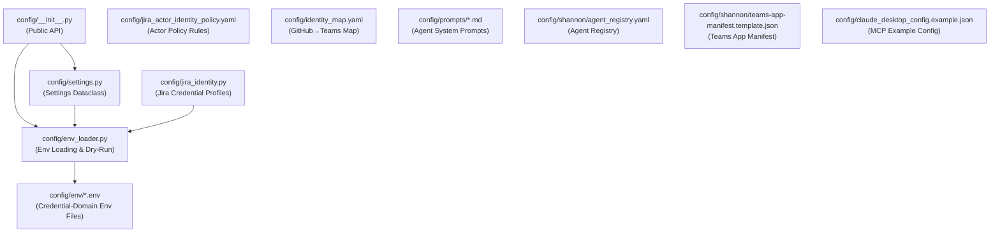
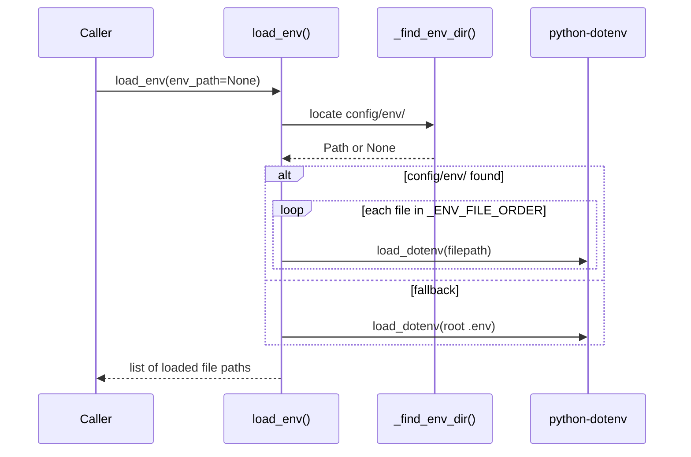
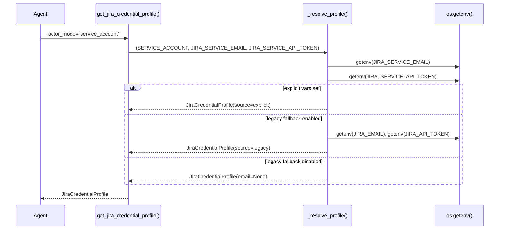
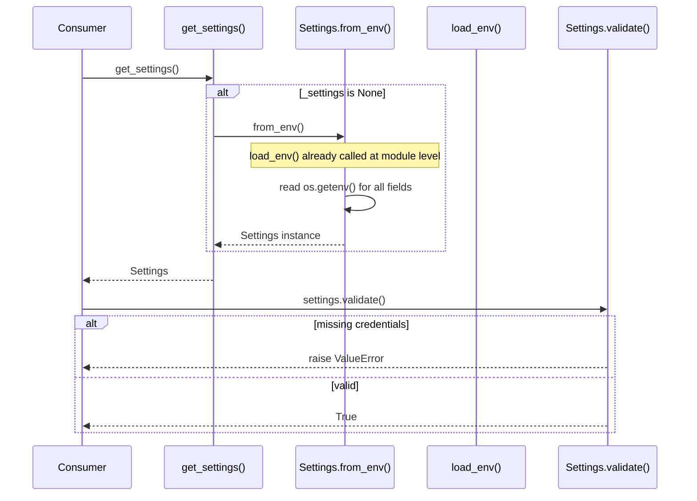

<!-- Generated by Documentation Agent — do not edit between markers -->

```yaml
---
title: "As-Built: Config"
date: "2026-04-03"
status: "draft"
---
```

# Config — Design Reference

## 1. Module Overview

The `config` module is the centralized configuration backbone for the Cornelis Agent Pipeline. It provides three core capabilities: (1) a multi-strategy environment variable loader (`env_loader.py`) that supports credential-domain segregated `.env` files for Docker Compose parity and falls back to a single root `.env` for local development; (2) a typed application settings dataclass (`settings.py`) that hydrates from environment variables and covers Jira, LLM providers, MCP, web search, agent tuning, and state persistence; and (3) a Jira actor identity system (`jira_identity.py`) that resolves credential profiles for three actor modes — `requester`, `service_account`, and `draft_only` — with legacy fallback control. The module also houses YAML policy files governing Jira actor identity selection, a GitHub-to-Teams identity map, an agent registry for the Shannon communications bot, a Teams app manifest template, and a library of Markdown prompt templates that define the system prompts for the agent workforce's specialized sub-agents (research, hardware analysis, scoping, planning, review, and vision).

## 2. What Changed

- **Before:** PR reminder DMs from Drucker had no way to resolve a GitHub login to a Microsoft Teams user for direct messaging.
- **After:** A new file `config/identity_map.yaml` provides a declarative GitHub-login-to-Teams-email mapping. Each entry contains a `name` and `teams_email` keyed by GitHub login.
- **Impact:** The Drucker agent's PR reminder subsystem (commands `/pr-reminder-scan`, `/pr-reminder-process`) can now look up the Teams identity for a GitHub PR author and send targeted DMs via the Graph API. Any agent or service that needs cross-platform identity resolution can consume this file. New team members must be added manually.

## 3. Component Diagram



## 4. Key Flows

### Flow 1: Environment Variable Loading

The `load_env()` function implements a three-tier resolution strategy. An explicit path wins outright; otherwise it searches for the `config/env/` directory by walking up from CWD (anchored by `pyproject.toml`), loading domain files in a fixed order; finally it falls back to a root `.env`.



The load order is defined by the constant `_ENV_FILE_ORDER` in `config/env_loader.py`:

```python
_ENV_FILE_ORDER = [
    'shared.env',
    'jira.env',
    'llm.env',
    'github.env',
    'teams.env',
]
```

This mirrors the Docker Compose `env_file` stacking: shared defaults load first, then credential-domain files override if there is overlap.

### Flow 2: Jira Credential Profile Resolution

`get_jira_credential_profile()` in `config/jira_identity.py` resolves credentials for one of three actor modes. The `draft_only` mode reuses requester credentials but annotates the profile for read-only/preview use.



The legacy fallback is controlled by the `JIRA_ENABLE_LEGACY_FALLBACK` environment variable, parsed by `is_legacy_fallback_enabled()`:

```python
def is_legacy_fallback_enabled() -> bool:
    return _env_flag_enabled('JIRA_ENABLE_LEGACY_FALLBACK', default=True)
```

### Flow 3: Settings Initialization and Validation

`get_settings()` is a lazy singleton that creates a `Settings` instance from environment variables on first access. The `Settings.from_env()` classmethod calls `load_env()` at module import time, then reads every setting from `os.getenv()`.



The module-level call in `config/settings.py` ensures env vars are loaded before any `os.getenv()` calls:

```python
from config.env_loader import load_env
load_env()
```

## 5. Data Model

### `Settings` (dataclass in `config/settings.py`)

The central configuration object. All fields have defaults; secrets default to `None`.

| Field | Type | Default | Source Env Var |
|---|---|---|---|
| `jira_url` | `str` | `'https://cornelisnetworks.atlassian.net'` | `JIRA_URL` |
| `jira_email` | `Optional[str]` | `None` | `JIRA_EMAIL` |
| `jira_api_token` | `Optional[str]` | `None` | `JIRA_API_TOKEN` |
| `cornelis_llm_base_url` | `Optional[str]` | `None` | `CORNELIS_LLM_BASE_URL` |
| `cornelis_llm_api_key` | `Optional[str]` | `None` | `CORNELIS_LLM_API_KEY` |
| `cornelis_llm_model` | `str` | `'cornelis-default'` | `CORNELIS_LLM_MODEL` |
| `openai_api_key` | `Optional[str]` | `None` | `OPENAI_API_KEY` |
| `anthropic_api_key` | `Optional[str]` | `None` | `ANTHROPIC_API_KEY` |
| `default_llm_provider` | `str` | `'cornelis'` | `DEFAULT_LLM_PROVIDER` |
| `mcp_url` | `str` | `'http://cn-ai-01.cornelisnetworks.com:50700/mcp'` | `CORNELIS_MCP_URL` |
| `mcp_enabled` | `bool` | `True` | `CORNELIS_MCP_ENABLED` |
| `agent_max_iterations` | `int` | `50` | `AGENT_MAX_ITERATIONS` |
| `agent_timeout_seconds` | `int` | `300` | `AGENT_TIMEOUT_SECONDS` |
| `state_persistence_enabled` | `bool` | `True` | `STATE_PERSISTENCE_ENABLED` |
| `state_persistence_path` | `str` | `'./data/sessions'` | `STATE_PERSISTENCE_PATH` |
| `state_persistence_format` | `str` | `'json'` | `STATE_PERSISTENCE_FORMAT` |

The `to_dict()` method masks sensitive fields (`jira_api_token`, `cornelis_llm_api_key`, `openai_api_key`, `anthropic_api_key`) with `'***'`.

### `JiraCredentialProfile` (dataclass in `config/jira_identity.py`)

```python
@dataclass
class JiraCredentialProfile:
    actor_mode: str          # 'requester' | 'service_account' | 'draft_only'
    email: Optional[str]
    api_token: Optional[str]
    email_env: Optional[str]  # env var name used for email
    token_env: Optional[str]  # env var name used for token
    source: str               # human-readable provenance string
```

### `jira_actor_identity_policy.yaml`

A declarative policy engine with `version: 1`. Key structures:

- **`actors`**: Three modes — `draft_only`, `service_account`, `requester` — each with a description.
- **`rules`**: Six ordered rules matching on `trigger`, `action_class`, `risk`, and `approval_required` to select an actor mode. Rule IDs: `poller_hygiene_scan`, `deterministic_low_risk_write`, `approved_system_batch_apply`, `human_judgment_change`, `sensitive_workflow_transition`, `unapproved_nontrivial_write`.
- **`agent_defaults`**: Per-agent overrides for `drucker`, `gantt`, `hedy`, `hemingway`.
- **`audit_fields.required`**: `actor_mode`, `requested_by`, `approved_by`, `executed_by`, `policy_rule`, `correlation_id`, `timestamp`.
- **`comment_voice`**: Style guidance for machine vs. human comments.

### `identity_map.yaml`

Maps GitHub logins to Teams identities:

```yaml
users:
  jmac-cornelis:
    name: John MacDonald
    teams_email: john.macdonald@cornelisnetworks.com
```

### `shannon/agent_registry.yaml`

Defines the full agent fleet with per-agent metadata: `agent_id`, `display_name`, `role`, `zone`, `channel_name`, `channel_id`, `team_id`, `api_base_url`, `timeout_seconds`, and `custom_commands`. Each command specifies `api_method`, `api_path`, `mutation` flag, and typed `params`. Currently registers `shannon`, `drucker`, and `gantt`.

## 6. Dependencies

| Dependency | Purpose | Version |
|---|---|---|
| `python-dotenv` | Loads `.env` files into `os.environ` via `load_dotenv()` | Not pinned in module |
| `logging` (stdlib) | Structured logging throughout all config modules | Python stdlib |
| `dataclasses` (stdlib) | `Settings` and `JiraCredentialProfile` dataclasses | Python 3.7+ |
| `pathlib` (stdlib) | File system traversal in `_find_env_dir()` | Python stdlib |
| `os` (stdlib) | Environment variable access | Python stdlib |
| `config/env_loader.py` | Used by `settings.py` and `jira_identity.py` for env loading | Internal |
| `config/settings.py` | Exported via `config/__init__.py` | Internal |

## 7. Configuration

### Environment Variables (Credential-Domain Files)

The `config/env/` directory contains five template files, loaded in this order:

| File | Domain | Key Variables |
|---|---|---|
| `shared.env` | Non-sensitive shared config | `DRY_RUN`, `LOG_LEVEL`, `JIRA_URL` |
| `jira.env` | Jira credentials | `JIRA_SERVICE_EMAIL`, `JIRA_SERVICE_API_TOKEN`, `JIRA_REQUESTER_EMAIL`, `JIRA_REQUESTER_API_TOKEN`, `JIRA_EMAIL`, `JIRA_API_TOKEN` |
| `llm.env` | LLM provider keys | `CORNELIS_LLM_BASE_URL`, `CORNELIS_LLM_API_KEY`, `OPENAI_API_KEY`, `ANTHROPIC_API_KEY` |
| `github.env` | GitHub credentials | GitHub PAT and related vars |
| `teams.env` | Teams / Azure credentials | Azure Bot credentials, webhook URLs |

### Feature Flags

| Flag | Env Var | Default | Effect |
|---|---|---|---|
| Legacy Jira fallback | `JIRA_ENABLE_LEGACY_FALLBACK` | `true` | When `false`, prevents silent fallback to `JIRA_EMAIL`/`JIRA_API_TOKEN` |
| Dry-run mode | `DRY_RUN` | `true` (safe default) | Prevents mutations; resolved by `resolve_dry_run()` |
| MCP enabled | `CORNELIS_MCP_ENABLED` | `true` | Enables/disables MCP server integration |
| LLM fallback | `FALLBACK_ENABLED` | `true` | Enables LLM provider fallback chain |

### Prompt Templates

Twelve Markdown files in `config/prompts/` define system prompts for the agent sub-agents:

| File | Agent / Purpose |
|---|---|
| `orchestrator.md` | Release Planning Orchestrator |
| `feature_planning_orchestrator.md` | Feature Planning Orchestrator (6-phase workflow) |
| `research_agent.md` | Research Agent — web/MCP/knowledge-base gathering |
| `hardware_analyst.md` | Hardware Analyst — product architecture mapping |
| `scoping_agent.md` | Scoping Agent — SW/FW work item definition |
| `feature_plan_builder.md` | Feature Plan Builder — scope-to-Jira conversion |
| `plan_building_instructions.md` | Injected instructions for plan building phase |
| `scope_document_parser.md` | Structured JSON parser for scope documents |
| `planning_agent.md` | Release Planning Agent — roadmap-to-tickets |
| `review_agent.md` | Review Agent — human-in-the-loop approval |
| `vision_analyzer.md` | Vision Analyzer — roadmap image/slide extraction |
| `vision_roadmap_analysis.md` | Short vision analysis prompt |
| `jira_analyst.md` | Jira Analyst — project state analysis |
| `cn5000_bugs_clean.md` | CN5000 bug ticket CSV formatter |

### Shannon Configuration

- `config/shannon/agent_registry.yaml` — Full agent fleet registry with commands, API routes, and parameters.
- `config/shannon/teams-app-manifest.template.json` — Teams app manifest with `${SHANNON_TEAMS_APP_ID}` and `${SHANNON_PUBLIC_DOMAIN}` placeholders.
- `config/claude_desktop_config.example.json` — Example MCP server configuration for Claude Desktop.

## 8. Error Handling

### `Settings.validate()`

Accumulates all missing-credential errors into a list and raises a single `ValueError` with all errors joined. Each error is also logged individually via `log.error()`:

```python
if errors:
    for error in errors:
        log.error(f'Configuration error: {error}')
    raise ValueError(f'Configuration errors: {", ".join(errors)}')
```

Validation is provider-aware: it only checks `CORNELIS_LLM_BASE_URL`/`CORNELIS_LLM_API_KEY` when `default_llm_provider == 'cornelis'`, etc.

### `get_jira_credentials_for_actor()`

Raises `ValueError` with a descriptive message naming the specific env var and actor mode when either email or API token is missing:

```python
if not profile.email:
    raise ValueError(
        f'{profile.email_env} environment variable not set for actor '
        f'"{profile.actor_mode}"'
    )
```

### `load_env()`

Does **not** raise on missing files. Logs a warning for an explicit path that doesn't exist, and logs a debug message when no `.env` files are found at all. Returns an empty list in the worst case, allowing the process environment to serve as the sole source.

### `resolve_dry_run()`

Defaults to `True` (safe, no mutations) when the env var is absent or unrecognized. This is a deliberate safety-first design:

```python
def resolve_dry_run(explicit: Optional[bool] = None) -> bool:
    if explicit is not None:
        return explicit
    env_val = os.environ.get('DRY_RUN', '').strip().lower()
    if env_val in ('0', 'false', 'no', 'off'):
        return False
    if env_val in ('1', 'true', 'yes', 'on'):
        return True
    return True  # safe default
```

## 9. Known Limitations / Technical Debt

1. **Hardcoded MCP URL** — The default `mcp_url` in `Settings` is hardcoded to `'http://cn-ai-01.cornelisnetworks.com:50700/mcp'`. This is an internal hostname that will break outside the Cornelis network. It is overridable via `CORNELIS_MCP_URL` but the default should arguably be `None` or empty.

2. **Hardcoded Jira URL** — The default `jira_url` is `'https://cornelisnetworks.atlassian.net'` in both `Settings` and `claude_desktop_config.example.json`.

3. **Hardcoded webhook URL** — The Drucker agent entry in `agent_registry.yaml` contains a full Power Automate webhook URL in `notifications_webhook_url`. While this is a configuration file (not source code), the URL includes a signature parameter (`sig=DX5rVpdRL5wpv_H9huN668nWIvrhGTWwe97q6NGpxh4`) that functions as a credential.

4. **`Settings.validate()` is not called automatically** — `get_settings()` creates the singleton via `from_env()` but never calls `validate()`. Consumers must explicitly call `settings.validate()` to check for missing credentials. A misconfigured deployment will not fail fast.

5. **Module-level side effects in `jira_identity.py`** — The module calls `load_env()` (or `load_dotenv()`) at import time, outside any function. This means importing the module has the side effect of loading environment variables, which can cause surprising behavior in tests or when import order matters:

   ```python
   if load_env is not None:
       load_env()
   else:
       load_dotenv(override=False)
   ```

6. **Module-level side effects in `settings.py`** — Similarly, `load_env()` is called at module import time in `settings.py`.

7. **`identity_map.yaml` is manually maintained** — There is no automated sync between GitHub org membership and this file. As the team grows, this will drift.

8. **No schema validation for YAML policy files** — `jira_actor_identity_policy.yaml` and `agent_registry.yaml` are consumed as raw YAML with no schema validation in this module. Malformed entries will surface as runtime errors downstream.

9. **`_find_env_dir()` anchors on `pyproject.toml`** — If the repository root lacks `pyproject.toml` (e.g., in a Docker image that strips it), the credential-domain loading path silently falls through to the root `.env` fallback.

10. **`Settings.to_dict()` omits several fields** — Fields like `mcp_url`, `mcp_enabled`, `agent_timeout_seconds`, `brave_search_api_key`, `tavily_api_key`, `feature_planning_*`, `log_file`, and `log_level` are not included in `to_dict()`, making debug introspection incomplete.

11. **`configure_logging()` opens file handler in write mode** — The `FileHandler` uses `mode='w'`, which truncates the log file on every call. If `configure_logging()` is called more than once (e.g., in tests), previous log content is lost.

12. **Prompt files have no versioning or checksumming** — The twelve prompt Markdown files are critical to agent behavior but have no version metadata or integrity checks. A silent edit to a prompt file changes agent behavior with no audit trail beyond git history.

<!-- End Documentation Agent generated content -->