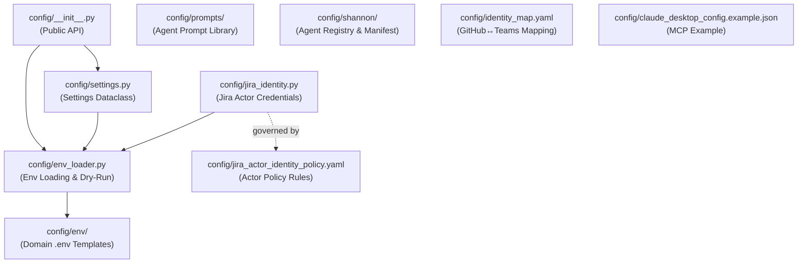
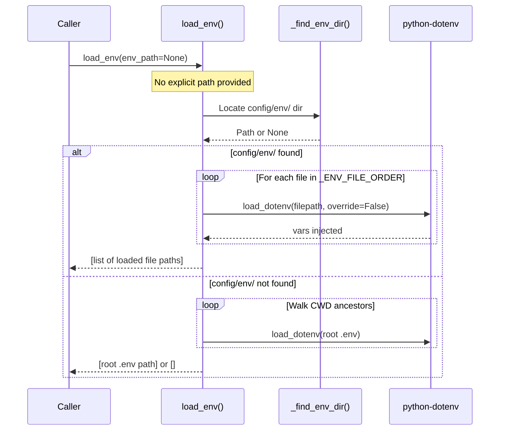
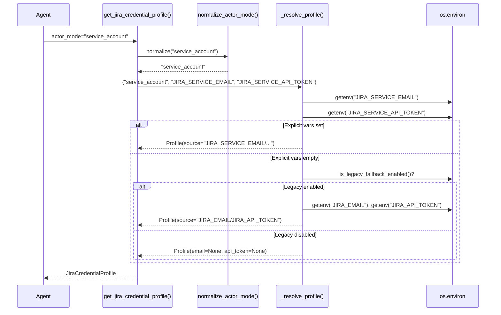
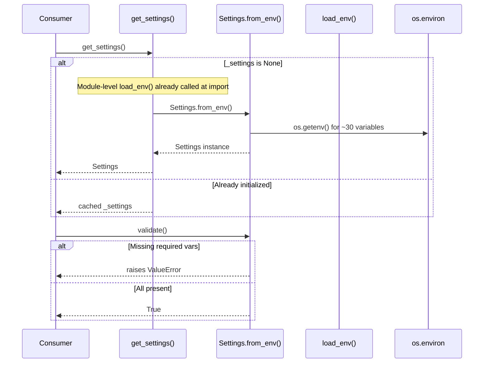

<!-- Generated by Documentation Agent — do not edit between markers -->

```yaml
---
title: "As-Built: Config"
date: "2026-04-03"
status: "draft"
---
```

# Config — Design Reference

## 1. Module Overview

The `config` module is the centralized configuration backbone for the Cornelis Agent Pipeline. It provides three core capabilities: (1) a multi-strategy environment variable loader (`env_loader.py`) that supports credential-domain segregated `.env` files for Docker Compose parity and falls back to a single root `.env` for local development; (2) a typed application settings dataclass (`settings.py`) that hydrates from environment variables and covers Jira, LLM providers, MCP, web search, agent tuning, state persistence, and logging; and (3) a Jira actor identity system (`jira_identity.py`) that resolves credential profiles for three actor modes — `requester`, `service_account`, and `draft_only` — governed by a declarative YAML policy. The module also houses the full prompt library for the agent workforce (`config/prompts/`), a Shannon agent registry and Teams app manifest (`config/shannon/`), and an identity mapping file for GitHub-to-Teams user resolution (`identity_map.yaml`).

## 2. What Changed

**Before:** PR reminder DMs from Drucker had no way to resolve a GitHub login to a Microsoft Teams user identity. No identity mapping file existed.

**After:** A new `config/identity_map.yaml` file provides a declarative GitHub-login-to-Teams-email mapping. Each entry contains a GitHub login key, a display `name`, and a `teams_email` used to resolve the Teams user ID via the Microsoft Graph API.

```yaml
users:
  jmac-cornelis:
    name: John MacDonald
    teams_email: john.macdonald@cornelisnetworks.com
```

**Impact:** The Drucker agent's PR reminder subsystem (commands `/pr-reminder-scan`, `/pr-reminder-process`) can now look up the Teams identity for a GitHub PR author and send direct-message reminders. Any agent or service that needs cross-platform identity resolution can consume this file. New team members must be added manually.

## 3. Component Diagram



## 4. Key Flows

### Flow 1: Environment Variable Loading

The `load_env()` function implements a three-tier resolution strategy: explicit path → credential-domain files → root `.env` fallback.



The `_find_env_dir()` helper walks from `Path.cwd()` upward, requiring both a `config/env/` directory and a `pyproject.toml` at the same ancestor to confirm the repository root. The canonical load order is defined in `_ENV_FILE_ORDER`:

```python
_ENV_FILE_ORDER = [
    'shared.env',
    'jira.env',
    'llm.env',
    'github.env',
    'teams.env',
]
```

### Flow 2: Jira Credential Profile Resolution

`get_jira_credential_profile()` resolves credentials for one of three actor modes, with legacy fallback controlled by the `JIRA_ENABLE_LEGACY_FALLBACK` environment flag.



The `draft_only` mode reuses requester credentials but relabels the profile:

```python
if normalized == DRAFT_ONLY:
    profile = _resolve_profile(
        REQUESTER,
        'JIRA_REQUESTER_EMAIL',
        'JIRA_REQUESTER_API_TOKEN',
    )
    profile.actor_mode = DRAFT_ONLY
    profile.source = f'{profile.source} (draft preview)'
    return profile
```

### Flow 3: Settings Initialization and Validation

The `Settings` dataclass is lazily instantiated via the `get_settings()` singleton and hydrated from environment variables through `Settings.from_env()`.



Note that `config/settings.py` calls `load_env()` at module import time (line-level), ensuring environment variables are populated before `Settings.from_env()` reads them.

## 5. Data Model

### `JiraCredentialProfile` (config/jira_identity.py)

```python
@dataclass
class JiraCredentialProfile:
    actor_mode: str          # 'requester' | 'service_account' | 'draft_only'
    email: Optional[str]     # Resolved Jira email
    api_token: Optional[str] # Resolved Jira API token
    email_env: Optional[str] # Name of the env var that sourced the email
    token_env: Optional[str] # Name of the env var that sourced the token
    source: str              # Human-readable provenance string
```

### `Settings` (config/settings.py)

A `@dataclass` with ~30 fields organized into logical groups:

| Group | Key Fields | Defaults |
|-------|-----------|----------|
| Jira | `jira_url`, `jira_email`, `jira_api_token` | URL defaults to `https://cornelisnetworks.atlassian.net` |
| Cornelis LLM | `cornelis_llm_base_url`, `cornelis_llm_api_key`, `cornelis_llm_model` | Model defaults to `'cornelis-default'` |
| External LLM | `openai_api_key`, `anthropic_api_key` | `None` |
| Agent | `agent_max_iterations`, `agent_timeout_seconds` | `50`, `300` |
| MCP | `mcp_url`, `mcp_timeout`, `mcp_enabled` | URL defaults to `http://cn-ai-01.cornelisnetworks.com:50700/mcp` |
| State | `state_persistence_enabled`, `state_persistence_path`, `state_persistence_format` | `True`, `'./data/sessions'`, `'json'` |

The `to_dict()` method masks sensitive fields (`jira_api_token`, `cornelis_llm_api_key`, `openai_api_key`, `anthropic_api_key`) with `'***'`.

### `jira_actor_identity_policy.yaml`

A declarative policy document (version 1) defining:
- **Three actor modes**: `draft_only`, `service_account`, `requester`
- **Six matching rules** (`poller_hygiene_scan`, `deterministic_low_risk_write`, `approved_system_batch_apply`, `human_judgment_change`, `sensitive_workflow_transition`, `unapproved_nontrivial_write`) that map `(trigger, risk, action_class, approval)` tuples to actor modes
- **Per-agent defaults** for `drucker`, `gantt`, `hedy`, `hemingway`
- **Required audit fields**: `actor_mode`, `requested_by`, `approved_by`, `executed_by`, `policy_rule`, `correlation_id`, `timestamp`
- **Comment voice guidelines** per actor mode

### `identity_map.yaml`

Maps GitHub logins to Microsoft Teams identities:

```yaml
users:
  jmac-cornelis:
    name: John MacDonald
    teams_email: john.macdonald@cornelisnetworks.com
```

### `agent_registry.yaml` (config/shannon/)

Defines the full agent fleet with per-agent metadata: `agent_id`, `display_name`, `role`, `zone`, Teams channel IDs, API base URLs, custom commands with parameters, and timeout values. Currently registers `shannon`, `drucker`, and `gantt` with detailed command schemas.

## 6. Dependencies

| Dependency | Purpose | Version |
|---|---|---|
| `python-dotenv` | Loads `.env` files into `os.environ` via `load_dotenv()` | Not pinned in module |
| `logging` (stdlib) | Structured logging throughout all config modules | Python stdlib |
| `os` / `sys` / `pathlib` (stdlib) | Environment access, path resolution, argv-based logger naming | Python stdlib |
| `dataclasses` (stdlib) | `@dataclass` for `Settings` and `JiraCredentialProfile` | Python stdlib |
| `typing` (stdlib) | Type annotations (`Optional`, `List`, `Dict`, `Any`) | Python stdlib |

## 7. Configuration

### Environment Variables (by domain file)

| Domain File | Variables | Consumers |
|---|---|---|
| `shared.env` | Non-sensitive shared config | All agents |
| `jira.env` | `JIRA_SERVICE_EMAIL`, `JIRA_SERVICE_API_TOKEN`, `JIRA_REQUESTER_EMAIL`, `JIRA_REQUESTER_API_TOKEN`, `JIRA_EMAIL` (legacy), `JIRA_API_TOKEN` (legacy), `JIRA_URL` | Drucker, Gantt, Hedy, Babbage, Linnaeus, Nightingale, Brooks |
| `llm.env` | `CORNELIS_LLM_BASE_URL`, `CORNELIS_LLM_API_KEY`, `CORNELIS_LLM_MODEL`, `OPENAI_API_KEY`, `ANTHROPIC_API_KEY`, `DEFAULT_LLM_PROVIDER`, `VISION_LLM_PROVIDER` | Shannon, Drucker, Gantt, Hemingway, Ada, Curie, Hedy, Linus, Herodotus, Nightingale, Brooks |
| `github.env` | GitHub credentials | Drucker, Josephine, Hedy, Linus, Nightingale, Brandeis |
| `teams.env` | Teams / Azure credentials | Shannon, Herodotus |

### Feature Flags

| Flag | Default | Purpose |
|---|---|---|
| `JIRA_ENABLE_LEGACY_FALLBACK` | `true` | When `false`, prevents fallback to `JIRA_EMAIL`/`JIRA_API_TOKEN` legacy credentials |
| `DRY_RUN` | `true` (safe default) | Controls mutation behavior; parsed by `resolve_dry_run()` |
| `FALLBACK_ENABLED` | `true` | Enables LLM provider fallback in `Settings` |
| `CORNELIS_MCP_ENABLED` | `true` | Enables MCP server integration |
| `STATE_PERSISTENCE_ENABLED` | `true` | Enables session state persistence |

### Configuration Files

| File | Format | Purpose |
|---|---|---|
| `config/jira_actor_identity_policy.yaml` | YAML | Declarative actor-mode selection rules and audit requirements |
| `config/identity_map.yaml` | YAML | GitHub login → Teams email mapping for PR reminder DMs |
| `config/shannon/agent_registry.yaml` | YAML | Agent fleet registry with commands, channels, and API routes |
| `config/shannon/teams-app-manifest.template.json` | JSON (template) | Teams app manifest with `${SHANNON_TEAMS_APP_ID}` and `${SHANNON_PUBLIC_DOMAIN}` placeholders |
| `config/claude_desktop_config.example.json` | JSON | Example MCP server config for Claude Desktop |
| `config/prompts/*.md` | Markdown | System prompts for 12 agent roles |

### Prompt Library (`config/prompts/`)

| Prompt File | Agent / Purpose |
|---|---|
| `orchestrator.md` | Release Planning Orchestrator — coordinates multi-agent workflow |
| `feature_planning_orchestrator.md` | Feature Planning Orchestrator — 6-phase feature-to-Jira pipeline |
| `research_agent.md` | Research Agent — web/MCP/knowledge-base information gathering |
| `hardware_analyst.md` | Hardware Analyst — hardware architecture and SW/FW stack mapping |
| `scoping_agent.md` | Scoping Agent — SW/FW work item identification and gap analysis |
| `feature_plan_builder.md` | Feature Plan Builder — scope-to-Jira Epic/Story conversion |
| `plan_building_instructions.md` | Injected instructions for plan builder execution |
| `scope_document_parser.md` | Parses scoping documents into structured JSON |
| `planning_agent.md` | Planning Agent — roadmap-to-ticket structure conversion |
| `review_agent.md` | Review Agent — human-in-the-loop approval workflow |
| `vision_analyzer.md` | Vision Analyzer — roadmap image/slide extraction |
| `vision_roadmap_analysis.md` | Short vision analysis prompt |
| `jira_analyst.md` | Jira Analyst — project state analysis |
| `cn5000_bugs_clean.md` | CN5000 bug ticket CSV formatting prompt |

## 8. Error Handling

### Environment Loading (`env_loader.py`)

- **Missing explicit path**: Logs a warning (`log.warning`) and returns an empty list — does not raise.
- **No `.env` files found anywhere**: Logs a debug message and returns an empty list, relying on process environment. This is a silent-fallback pattern.
- **`resolve_dry_run()`**: Defaults to `True` (safe, no mutations) when the `DRY_RUN` env var is absent or unparseable.

### Jira Identity (`jira_identity.py`)

- **`normalize_actor_mode()`**: Invalid or `None` input defaults to `'requester'` — never raises.
- **`_env_flag_enabled()`**: Unrecognized values fall back to the provided `default` parameter.
- **`get_jira_credentials_for_actor()`**: Raises `ValueError` with a descriptive message when either `email` or `api_token` is missing, naming the specific env var that was not set:

```python
if not profile.email:
    raise ValueError(
        f'{profile.email_env} environment variable not set for actor '
        f'"{profile.actor_mode}"'
    )
```

- **Legacy fallback disabled**: Returns a `JiraCredentialProfile` with `email=None` and `api_token=None` rather than raising, allowing callers to check via `has_jira_credentials()`.

### Settings Validation (`settings.py`)

- **`validate()`**: Accumulates all errors into a list and raises a single `ValueError` with all messages joined. Errors are also logged individually via `log.error()`.
- **Provider-aware validation**: Only checks credentials for the configured `default_llm_provider` (cornelis, openai, or anthropic).
- **`int()` casts in `from_env()`**: Will raise `ValueError` if non-numeric values are provided for integer settings like `AGENT_MAX_ITERATIONS` — no try/except wrapping.

## 9. Known Limitations / Technical Debt

1. **Hardcoded MCP URL**: The default `mcp_url` in `Settings` is hardcoded to `'http://cn-ai-01.cornelisnetworks.com:50700/mcp'`. This is an internal hostname that will break outside the Cornelis network. It is overridable via `CORNELIS_MCP_URL` but the default should arguably be `None` or empty.

2. **Hardcoded Jira URL**: The default `jira_url` is `'https://cornelisnetworks.atlassian.net'` in both `Settings` and `Settings.from_env()`.

3. **Hardcoded webhook URL**: The Drucker agent entry in `agent_registry.yaml` contains a full Power Automate webhook URL in `notifications_webhook_url` with an embedded signature (`sig=DX5rVpdRL5wpv_H9huN668nWIvrhGTWwe97q6NGpxh4`). This is effectively a hardcoded credential.

4. **No integer parse error handling in `Settings.from_env()`**: Calls like `int(os.getenv('AGENT_MAX_ITERATIONS', '50'))` will raise an unhandled `ValueError` if the env var contains a non-numeric string.

5. **Module-level side effects**: Both `config/settings.py` and `config/jira_identity.py` call `load_env()` at import time. This means importing the module triggers file I/O and environment mutation, which can cause unexpected behavior in testing or when modules are imported in unusual orders.

6. **`jira_identity.py` imports `load_dotenv` as fallback**: The try/except around `from config.env_loader import load_env` with a `load_dotenv` fallback means the module can silently use a different loading strategy depending on import context, making behavior harder to predict.

7. **Policy YAML is not programmatically consumed**: `jira_actor_identity_policy.yaml` defines detailed actor selection rules, but `jira_identity.py` does not parse or enforce this file — the credential resolution logic is hardcoded in Python. The YAML serves as documentation/specification only.

8. **`identity_map.yaml` has a single entry**: Only one GitHub-to-Teams mapping exists (`jmac-cornelis`). The file requires manual maintenance as team members are added.

9. **`Settings` class size**: The `Settings` dataclass has ~30 fields and 4 public methods (`from_env`, `validate`, `to_dict`, plus the implicit `__init__`). While not yet a god class, it is trending toward one as new configuration domains are added. Consider splitting into sub-settings (e.g., `JiraSettings`, `LlmSettings`, `McpSettings`).

10. **`configure_logging()` opens file in write mode**: The `FileHandler` uses `mode='w'`, which truncates the log file on every call. If `configure_logging()` is called more than once (e.g., in tests or multi-agent processes), previous log content is lost.

11. **Agent registry is incomplete**: `agent_registry.yaml` defines only `shannon`, `drucker`, and `gantt`, while the policy YAML and env README reference additional agents (`hedy`, `hemingway`, `babbage`, `linnaeus`, `nightingale`, `brooks`, `josephine`, `brandeis`, `linus`, `herodotus`, `ada`, `curie`).

<!-- End Documentation Agent generated content -->