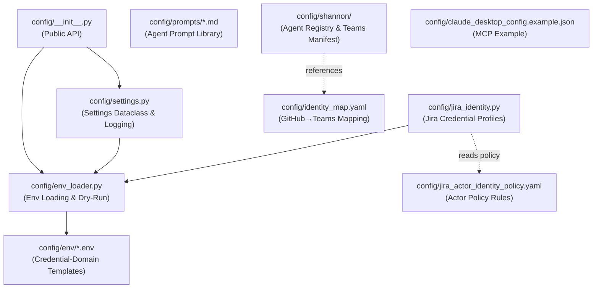
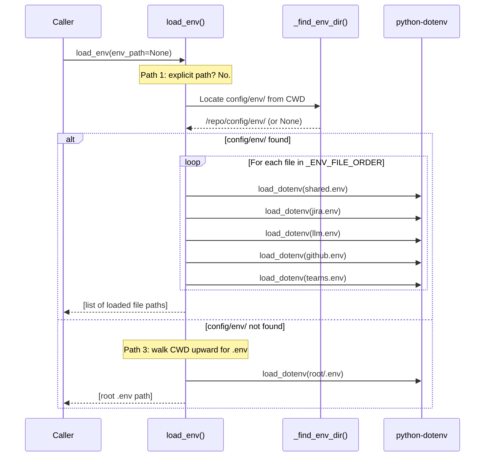
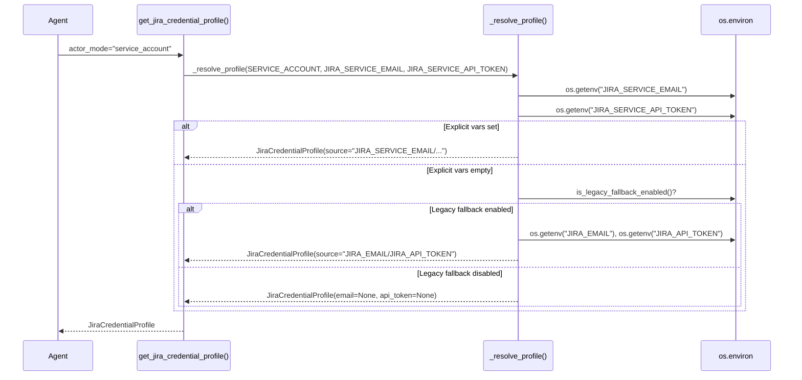
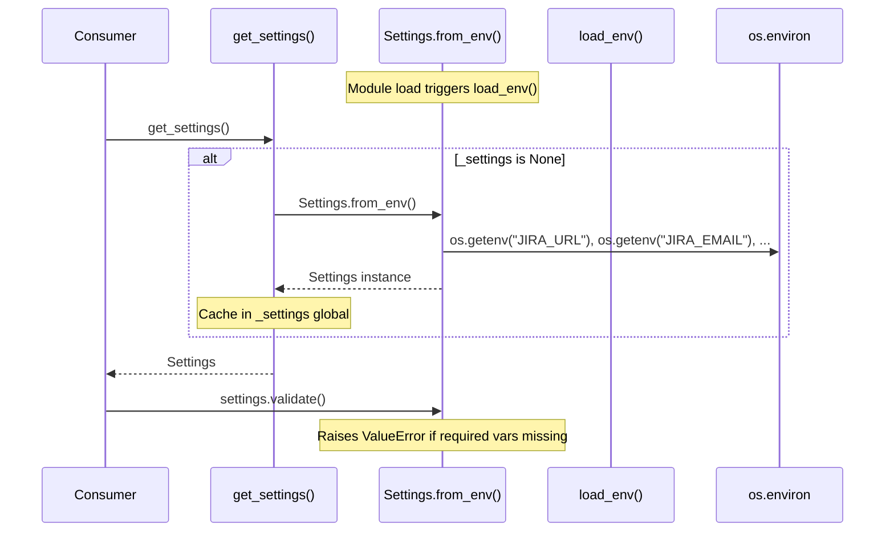

<!-- Generated by Documentation Agent — do not edit between markers -->

```yaml
---
title: "As-Built: Config"
date: "2026-04-03"
status: "draft"
---
```

# Config — Design Reference

## 1. Module Overview

The `config` module is the centralized configuration backbone for the Cornelis Agent Pipeline. It provides three core capabilities: (1) a multi-strategy environment variable loader (`env_loader.py`) that supports credential-domain segregated `.env` files for Docker Compose parity and falls back to a single root `.env` for local development; (2) a typed application settings dataclass (`settings.py`) that reads all environment variables into a validated, singleton `Settings` object covering Jira, LLM providers, MCP, web search, agent tuning, and state persistence; and (3) a Jira actor identity system (`jira_identity.py`) that resolves credential profiles for three actor modes — `requester`, `service_account`, and `draft_only` — with legacy fallback control. The module also houses the agent registry for the Shannon communications bot, a YAML-based Jira actor identity policy, a GitHub-to-Teams identity map, and a library of LLM prompt templates that define the behavior of every specialized agent in the workforce (research, hardware analysis, scoping, planning, review, and feature plan building).

## 2. What Changed

- **Before:** PR reminder DMs from Drucker had no way to resolve a GitHub login to a Microsoft Teams user for direct messaging.
- **After:** A new `config/identity_map.yaml` file provides a declarative GitHub-login → Teams-email mapping. Each entry contains `name` and `teams_email`, keyed by GitHub login.
- **Impact:** The Drucker agent's PR reminder subsystem (commands `/pr-reminder-scan`, `/pr-reminder-process`) can now look up the Teams identity for any mapped GitHub user and send targeted DMs via the Graph API. New GitHub contributors must be added to this file to receive reminders.

## 3. Component Diagram



## 4. Key Flows

### Flow 1: Environment Variable Loading

The `load_env()` function implements a three-tier loading strategy that mirrors Docker Compose `env_file` stacking for local development parity.



The load order is defined by the `_ENV_FILE_ORDER` constant in `env_loader.py`:

```python
_ENV_FILE_ORDER = [
    'shared.env',
    'jira.env',
    'llm.env',
    'github.env',
    'teams.env',
]
```

The `_find_env_dir()` helper validates the repo root by checking for `pyproject.toml` alongside the `config/env/` directory, preventing accidental loading from unrelated directories.

### Flow 2: Jira Credential Profile Resolution

The `get_jira_credential_profile()` function in `jira_identity.py` resolves credentials for one of three actor modes, with a legacy fallback mechanism controlled by the `JIRA_ENABLE_LEGACY_FALLBACK` environment variable.



The `draft_only` mode reuses requester credentials but relabels the profile:

```python
if normalized == DRAFT_ONLY:
    profile = _resolve_profile(
        REQUESTER,
        'JIRA_REQUESTER_EMAIL',
        'JIRA_REQUESTER_API_TOKEN',
    )
    profile.actor_mode = DRAFT_ONLY
    profile.source = f'{profile.source} (draft preview)'
    return profile
```

### Flow 3: Settings Singleton Initialization

The `get_settings()` function in `settings.py` lazily creates a singleton `Settings` instance from environment variables. The module-level `load_env()` call ensures environment variables are populated before any `Settings` construction.



The `Settings.validate()` method checks for required credentials based on the selected LLM provider:

```python
if self.default_llm_provider == 'cornelis':
    if not self.cornelis_llm_base_url:
        errors.append('CORNELIS_LLM_BASE_URL is required for cornelis provider')
```

## 5. Data Model

### `Settings` Dataclass (`config/settings.py`)

The central configuration object with ~30 fields organized into logical groups:

| Group | Fields | Defaults |
|-------|--------|----------|
| Jira | `jira_url`, `jira_email`, `jira_api_token` | URL defaults to `https://cornelisnetworks.atlassian.net` |
| Cornelis LLM | `cornelis_llm_base_url`, `cornelis_llm_api_key`, `cornelis_llm_model` | Model defaults to `'cornelis-default'` |
| External LLM | `openai_api_key`, `anthropic_api_key` | `None` |
| LLM Config | `default_llm_provider`, `vision_llm_provider`, `fallback_enabled` | `'cornelis'`, `'cornelis'`, `True` |
| Agent | `agent_log_level`, `agent_max_iterations`, `agent_timeout_seconds` | `'INFO'`, `50`, `300` |
| MCP | `mcp_url`, `mcp_api_key_env`, `mcp_timeout`, `mcp_enabled` | URL to `cn-ai-01`, timeout `60`, enabled `True` |
| State | `state_persistence_enabled`, `state_persistence_path`, `state_persistence_format` | `True`, `'./data/sessions'`, `'json'` |

The `to_dict()` method masks sensitive fields (`jira_api_token`, `cornelis_llm_api_key`, `openai_api_key`, `anthropic_api_key`) with `'***'`.

### `JiraCredentialProfile` Dataclass (`config/jira_identity.py`)

```python
@dataclass
class JiraCredentialProfile:
    actor_mode: str          # 'requester' | 'service_account' | 'draft_only'
    email: Optional[str]
    api_token: Optional[str]
    email_env: Optional[str]   # Name of the env var that was read
    token_env: Optional[str]   # Name of the env var that was read
    source: str                # Human-readable provenance string
```

### Jira Actor Identity Policy (`config/jira_actor_identity_policy.yaml`)

A versioned policy document (version 1) that defines:
- **Three actor modes**: `draft_only`, `service_account`, `requester`
- **Six matching rules** (`poller_hygiene_scan`, `deterministic_low_risk_write`, `approved_system_batch_apply`, `human_judgment_change`, `sensitive_workflow_transition`, `unapproved_nontrivial_write`) that map action classes and risk levels to actor modes
- **Per-agent defaults** for `drucker`, `gantt`, `hedy`, and `hemingway`
- **Required audit fields**: `actor_mode`, `requested_by`, `approved_by`, `executed_by`, `policy_rule`, `correlation_id`, `timestamp`

### Agent Registry (`config/shannon/agent_registry.yaml`)

Defines the full agent fleet with structured metadata per agent: `agent_id`, `display_name`, `role`, `zone`, Teams channel IDs, API base URLs, and detailed `custom_commands` with parameter schemas. Currently registers `shannon`, `drucker`, and `gantt` with full command definitions.

### Identity Map (`config/identity_map.yaml`)

Maps GitHub logins to Teams identities for PR reminder DMs:

```yaml
users:
  jmac-cornelis:
    name: John MacDonald
    teams_email: john.macdonald@cornelisnetworks.com
```

## 6. Dependencies

| Dependency | Purpose | Version |
|---|---|---|
| `python-dotenv` | Loads `.env` files into `os.environ` via `load_dotenv()` | Not pinned in module |
| `logging` (stdlib) | Structured logging throughout all config modules | Python stdlib |
| `dataclasses` (stdlib) | `Settings` and `JiraCredentialProfile` dataclass definitions | Python stdlib |
| `pathlib` (stdlib) | File system traversal in `_find_env_dir()` and `load_env()` | Python stdlib |
| `os` / `sys` (stdlib) | Environment variable access and logger naming | Python stdlib |

## 7. Configuration

### Environment Variables (loaded by `env_loader.py`)

**Credential-domain files** (in `config/env/`):

| File | Variables |
|---|---|
| `shared.env` | Non-sensitive shared config (all agents) |
| `jira.env` | `JIRA_SERVICE_EMAIL`, `JIRA_SERVICE_API_TOKEN`, `JIRA_REQUESTER_EMAIL`, `JIRA_REQUESTER_API_TOKEN`, `JIRA_EMAIL` (legacy), `JIRA_API_TOKEN` (legacy) |
| `llm.env` | `CORNELIS_LLM_BASE_URL`, `CORNELIS_LLM_API_KEY`, `CORNELIS_LLM_MODEL`, `OPENAI_API_KEY`, `ANTHROPIC_API_KEY` |
| `github.env` | GitHub credentials |
| `teams.env` | Teams / Azure credentials |

**Feature flags:**

| Variable | Purpose | Default |
|---|---|---|
| `JIRA_ENABLE_LEGACY_FALLBACK` | Allow fallback to `JIRA_EMAIL`/`JIRA_API_TOKEN` | `true` |
| `DRY_RUN` | Global dry-run toggle (accepts `true/1/yes/on` or `false/0/no/off`) | `true` (safe default) |
| `CORNELIS_MCP_ENABLED` | Enable/disable MCP integration | `true` |
| `FALLBACK_ENABLED` | Enable LLM provider fallback | `true` |
| `STATE_PERSISTENCE_ENABLED` | Enable session state persistence | `true` |

**Settings read by `Settings.from_env()`:** See the full list in the [Data Model](#5-data-model) section. All settings have sensible defaults; only `JIRA_EMAIL`, `JIRA_API_TOKEN`, and the LLM provider credentials are required (enforced by `validate()`).

### Prompt Templates (`config/prompts/`)

Twelve Markdown prompt files define agent behavior:

| File | Agent/Purpose |
|---|---|
| `orchestrator.md` | Release Planning Orchestrator |
| `feature_planning_orchestrator.md` | Feature Planning Orchestrator (6-phase workflow) |
| `research_agent.md` | Research Agent |
| `hardware_analyst.md` | Hardware Analyst Agent |
| `scoping_agent.md` | Scoping Agent |
| `feature_plan_builder.md` | Feature Plan Builder Agent |
| `plan_building_instructions.md` | Instructions injected into plan builder calls |
| `scope_document_parser.md` | Scope document → JSON parser |
| `planning_agent.md` | Release Planning Agent |
| `review_agent.md` | Review Agent (human-in-the-loop) |
| `vision_analyzer.md` | Vision Analyzer Agent |
| `vision_roadmap_analysis.md` | Short vision analysis prompt |
| `jira_analyst.md` | Jira Analyst Agent |
| `cn5000_bugs_clean.md` | CN5000 bug ticket CSV formatter |

### Shannon Configuration (`config/shannon/`)

| File | Purpose |
|---|---|
| `agent_registry.yaml` | Full agent fleet registry with commands, parameters, and Teams channel mappings |
| `teams-app-manifest.template.json` | Teams app manifest template with `${SHANNON_TEAMS_APP_ID}` and `${SHANNON_PUBLIC_DOMAIN}` placeholders |

### Example Configuration

| File | Purpose |
|---|---|
| `claude_desktop_config.example.json` | Example MCP server config for Claude Desktop with Jira integration |

## 8. Error Handling

### `Settings.validate()`

Accumulates all validation errors into a list and raises a single `ValueError` with all errors joined:

```python
if errors:
    for error in errors:
        log.error(f'Configuration error: {error}')
    raise ValueError(f'Configuration errors: {", ".join(errors)}')
```

Validation is provider-aware — it only checks for Cornelis LLM credentials when `default_llm_provider == 'cornelis'`, OpenAI credentials when `'openai'`, etc.

### `get_jira_credentials_for_actor()`

Raises `ValueError` with a descriptive message identifying the specific environment variable and actor mode when credentials are missing:

```python
if not profile.email:
    raise ValueError(
        f'{profile.email_env} environment variable not set for actor '
        f'"{profile.actor_mode}"'
    )
```

### `load_env()` Graceful Degradation

The environment loader never raises exceptions. If no `.env` files are found at any tier, it logs a debug message and returns an empty list, relying on the process environment:

```python
if not loaded:
    log.debug('No .env files found; relying on process environment')
```

If an explicit `env_path` does not exist, it logs a warning but still returns without raising.

### `resolve_dry_run()` Safe Default

The dry-run resolver defaults to `True` (safe, no mutations) when the environment variable is absent or contains an unrecognized value:

```python
if explicit is not None:
    return explicit
# ... parse env var ...
return True  # safe default
```

## 9. Known Limitations / Technical Debt

1. **Hardcoded MCP URL**: The default `mcp_url` in `Settings` is hardcoded to `'http://cn-ai-01.cornelisnetworks.com:50700/mcp'`. This is an internal hostname that will not resolve outside the Cornelis network. It is overridable via `CORNELIS_MCP_URL` but the default should arguably be `None` or empty.

2. **Hardcoded Jira URL**: The default `jira_url` is hardcoded to `'https://cornelisnetworks.atlassian.net'` in both `Settings.__init__` and `Settings.from_env()`.

3. **Hardcoded webhook URL**: The Drucker agent entry in `agent_registry.yaml` contains a full Power Automate webhook URL in `notifications_webhook_url` with an embedded signature (`sig=DX5rVpdRL5wpv_...`). This is a credential-adjacent value committed to source control.

4. **Module-level side effects in `jira_identity.py`**: The module calls `load_env()` or `load_dotenv()` at import time (module scope), which means importing the module has the side effect of loading environment variables. This can cause surprising behavior in test environments.

5. **Module-level side effect in `settings.py`**: Similarly, `settings.py` calls `load_env()` at module scope, triggering environment loading on import.

6. **No thread safety on `_settings` singleton**: The `get_settings()` function uses a module-level `_settings` global with no locking. In a multi-threaded context, the singleton could be initialized multiple times (benign but wasteful) or read in a partially-constructed state.

7. **`Settings.validate()` only checks a subset**: Validation covers Jira and LLM credentials but does not validate MCP settings, state persistence paths, or agent configuration values (e.g., `agent_max_iterations` could be negative).

8. **`to_dict()` incomplete**: The `to_dict()` method on `Settings` only includes a subset of fields (~14 of ~30). Fields like `mcp_url`, `mcp_timeout`, `log_file`, `log_level`, `brave_search_api_key`, and `tavily_api_key` are omitted.

9. **`configure_logging()` opens file handler in write mode**: The `FileHandler` uses `mode='w'`, which truncates the log file on every call. If `configure_logging()` is called more than once (e.g., in tests or multi-agent setups), previous log content is lost.

10. **Identity map is minimal**: `config/identity_map.yaml` currently contains only one user mapping (`jmac-cornelis`). The PR reminder system will silently skip any GitHub user not present in this file.

11. **Agent registry incomplete**: The `agent_registry.yaml` defines entries for `shannon`, `drucker`, and `gantt` but references agents like `hedy`, `hemingway`, `babbage`, `linnaeus`, `nightingale`, `brooks`, `josephine`, `linus`, `herodotus`, `brandeis`, and `ada` in the `config/env/README.md` and policy YAML without corresponding registry entries.

12. **Policy YAML is declarative only**: The `jira_actor_identity_policy.yaml` defines rules and audit fields, but there is no corresponding Python code in this module that parses or enforces the policy. Enforcement presumably lives elsewhere in the codebase.

<!-- End Documentation Agent generated content -->