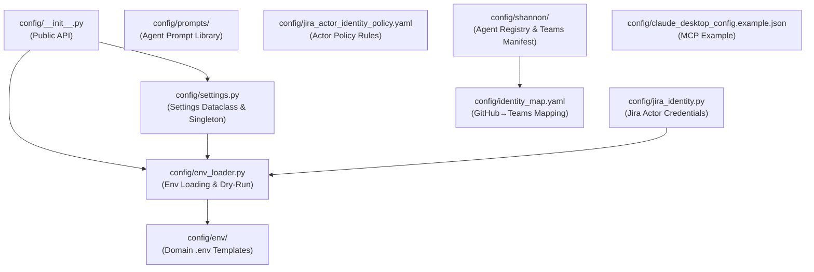
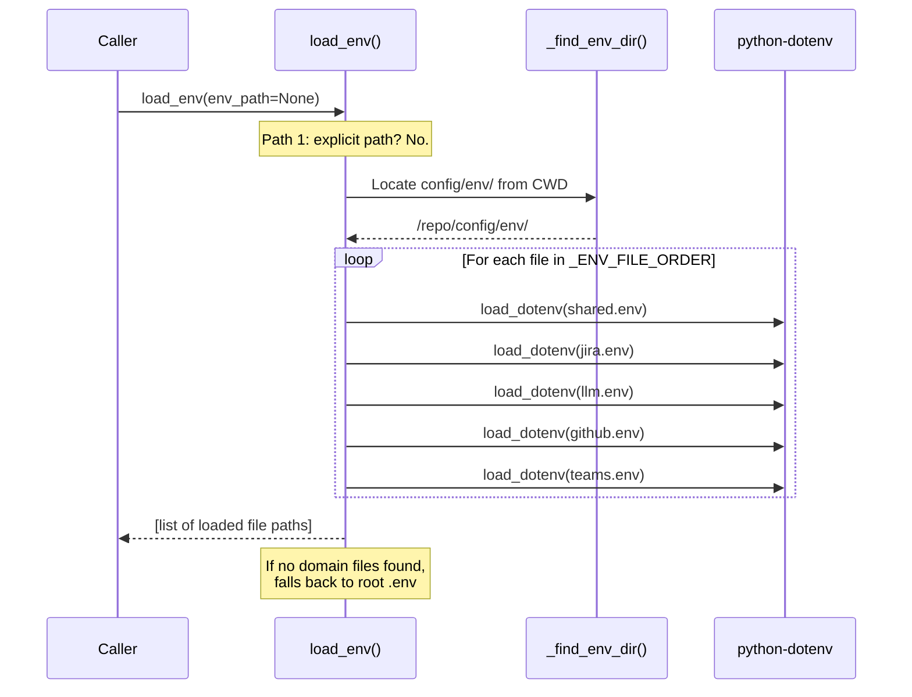
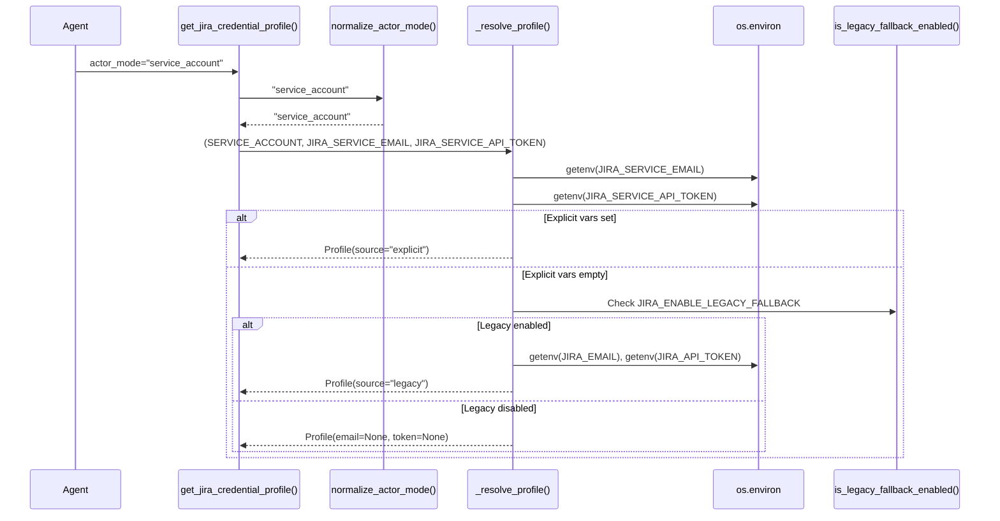
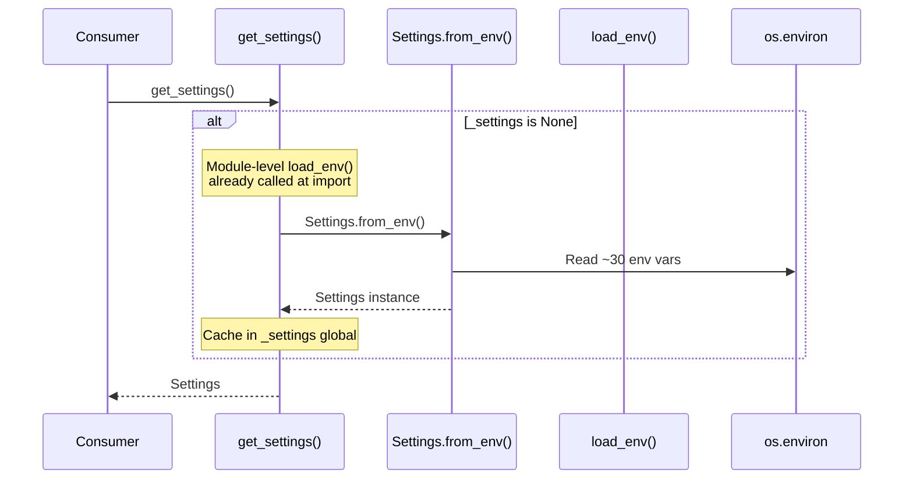

<!-- Generated by Documentation Agent — do not edit between markers -->

```yaml
---
title: "As-Built: Config"
date: "2026-04-03"
status: "draft"
---
```

# Config — Design Reference

## 1. Module Overview

The `config` module is the centralized configuration backbone for the Cornelis Agent Pipeline. It provides three core capabilities: (1) a multi-strategy environment variable loader (`env_loader.py`) that supports credential-domain segregated `.env` files for Docker Compose deployments and falls back to a single root `.env` for local development; (2) a typed application settings dataclass (`settings.py`) that reads all environment variables into a validated, singleton `Settings` object covering Jira, LLM providers, MCP, web search, agent tuning, and state persistence; and (3) a Jira actor identity system (`jira_identity.py`) that resolves credential profiles for three actor modes — `requester`, `service_account`, and `draft_only` — with legacy fallback control. The module also houses the agent workforce's prompt library (`config/prompts/`), identity mapping files, actor identity policy, Shannon agent registry, and a Teams app manifest template. Together, these files define the operational configuration surface for every agent in the workforce.

## 2. What Changed

- **Before:** PR reminder DMs from Drucker had no way to resolve a GitHub login to a Microsoft Teams user identity. No identity mapping file existed.
- **After:** A new `config/identity_map.yaml` file provides a GitHub-login-to-Teams-email mapping. Each entry contains a `name` and `teams_email` field, enabling the PR reminder subsystem to resolve Teams user IDs via the Microsoft Graph API.
- **Impact:** The Drucker agent's PR reminder commands (`/pr-reminder-process`, `/pr-reminder-scan`) can now send direct messages to the correct Teams user. Any new GitHub contributor who should receive PR reminders must be added to this file.

## 3. Component Diagram



## 4. Key Flows

### Flow 1: Environment Variable Loading

The `load_env()` function implements a three-tier resolution strategy that mirrors Docker Compose `env_file` stacking for local development parity.



The function walks up from `Path.cwd()` looking for a `config/env/` directory co-located with `pyproject.toml` (to confirm the repo root). Files are loaded in a canonical order defined by `_ENV_FILE_ORDER`:

```python
_ENV_FILE_ORDER = [
    'shared.env',
    'jira.env',
    'llm.env',
    'github.env',
    'teams.env',
]
```

If an explicit `env_path` argument is provided, only that file is loaded. If no domain files are found, the loader walks upward to find a root `.env` as a legacy fallback.

### Flow 2: Jira Credential Profile Resolution

The `get_jira_credential_profile()` function resolves credentials for one of three actor modes, with optional legacy fallback.



The three actor modes map to different environment variable pairs:

| Actor Mode | Email Env Var | Token Env Var |
|---|---|---|
| `service_account` | `JIRA_SERVICE_EMAIL` | `JIRA_SERVICE_API_TOKEN` |
| `requester` | `JIRA_REQUESTER_EMAIL` | `JIRA_REQUESTER_API_TOKEN` |
| `draft_only` | `JIRA_REQUESTER_EMAIL` (reused) | `JIRA_REQUESTER_API_TOKEN` (reused) |

The `draft_only` mode resolves requester credentials but overrides `actor_mode` to `DRAFT_ONLY` and annotates the source with `(draft preview)`.

### Flow 3: Settings Singleton Initialization

The `get_settings()` function provides a lazily-initialized global `Settings` instance.



At module import time, `config/settings.py` calls `load_env()` at the top level, ensuring environment variables are populated before `Settings.from_env()` reads them. The `Settings.validate()` method checks for required credentials based on the selected LLM provider.

## 5. Data Model

### `Settings` Dataclass (`config/settings.py`)

The central configuration object with ~30 fields organized into logical groups:

```python
@dataclass
class Settings:
    # Jira settings
    jira_url: str = 'https://cornelisnetworks.atlassian.net'
    jira_email: Optional[str] = None
    jira_api_token: Optional[str] = None

    # Cornelis LLM settings
    cornelis_llm_base_url: Optional[str] = None
    cornelis_llm_api_key: Optional[str] = None
    cornelis_llm_model: str = 'cornelis-default'

    # External LLM settings
    openai_api_key: Optional[str] = None
    anthropic_api_key: Optional[str] = None

    # Agent configuration
    agent_max_iterations: int = 50
    agent_timeout_seconds: int = 300

    # MCP settings
    mcp_url: str = 'http://cn-ai-01.cornelisnetworks.com:50700/mcp'
    mcp_enabled: bool = True

    # State persistence
    state_persistence_enabled: bool = True
    state_persistence_path: str = './data/sessions'
    state_persistence_format: str = 'json'
    # ... (additional fields)
```

The `to_dict()` method masks sensitive values (`'***'`) for safe logging.

### `JiraCredentialProfile` Dataclass (`config/jira_identity.py`)

```python
@dataclass
class JiraCredentialProfile:
    actor_mode: str          # 'requester' | 'service_account' | 'draft_only'
    email: Optional[str]
    api_token: Optional[str]
    email_env: Optional[str]   # Name of the env var that was read
    token_env: Optional[str]   # Name of the env var that was read
    source: str                # Human-readable provenance string
```

### Jira Actor Identity Policy (`config/jira_actor_identity_policy.yaml`)

A declarative policy document (version 1) that defines which actor mode applies to each action class. Key structures:

- **`actors`**: Three modes — `draft_only`, `service_account`, `requester`
- **`rules`**: Six match rules keyed by `trigger`, `action_class`, `risk`, and `approval_required`
- **`agent_defaults`**: Per-agent overrides for `drucker`, `gantt`, `hedy`, `hemingway`
- **`audit_fields.required`**: Seven mandatory audit fields including `actor_mode`, `correlation_id`, `timestamp`
- **`comment_voice`**: Style guidelines per actor mode (factual/machine-attributed vs. human-decision/intent-bearing)

### Identity Map (`config/identity_map.yaml`)

```yaml
users:
  jmac-cornelis:
    name: John MacDonald
    teams_email: john.macdonald@cornelisnetworks.com
```

Maps GitHub logins to Microsoft Teams identities for PR reminder DMs.

### Agent Registry (`config/shannon/agent_registry.yaml`)

Defines the full agent workforce roster with per-agent metadata: `agent_id`, `display_name`, `role`, `zone`, `channel_id`, `api_base_url`, `custom_commands` (with HTTP method, path, params, and mutation flags), and `timeout_seconds`. Currently registers `shannon`, `drucker`, and `gantt` with detailed command definitions.

### Prompt Library (`config/prompts/`)

Twelve Markdown files containing system prompts for specialized agents:

| File | Agent/Purpose |
|---|---|
| `orchestrator.md` | Release Planning Orchestrator |
| `feature_planning_orchestrator.md` | Feature Planning Orchestrator (6-phase workflow) |
| `research_agent.md` | Research Agent — web/MCP/knowledge-base gathering |
| `hardware_analyst.md` | Hardware Analyst — product architecture mapping |
| `scoping_agent.md` | Scoping Agent — SW/FW work item definition |
| `feature_plan_builder.md` | Feature Plan Builder — scope-to-Jira conversion |
| `plan_building_instructions.md` | Injected instructions for plan building phase |
| `scope_document_parser.md` | Structured JSON extraction from scope docs |
| `planning_agent.md` | Release Planning Agent — roadmap-to-tickets |
| `review_agent.md` | Review Agent — human-in-the-loop approval |
| `vision_analyzer.md` | Vision Analyzer — roadmap image extraction |
| `vision_roadmap_analysis.md` | Short vision analysis prompt |
| `jira_analyst.md` | Jira Analyst — project state analysis |
| `cn5000_bugs_clean.md` | CN5000 bug CSV formatting prompt |

## 6. Dependencies

| Dependency | Purpose | Version |
|---|---|---|
| `python-dotenv` | `.env` file parsing via `load_dotenv()` | Not pinned in module |
| `pathlib` (stdlib) | File path resolution in `_find_env_dir()` | Python 3.x |
| `dataclasses` (stdlib) | `Settings` and `JiraCredentialProfile` dataclasses | Python 3.7+ |
| `logging` (stdlib) | Structured logging throughout | Python 3.x |
| `os` (stdlib) | Environment variable access | Python 3.x |
| `PyYAML` (implied) | Consumers of `.yaml` config files | Not imported directly |

## 7. Configuration

### Environment Variables (by domain file)

**`config/env/shared.env`** — Non-sensitive shared config:
- `DRY_RUN` — Global dry-run toggle (default: `true`; accepts `true/1/yes/on` or `false/0/no/off`)
- `LOG_FILE`, `LOG_LEVEL`, `AGENT_LOG_LEVEL`
- `STATE_PERSISTENCE_ENABLED`, `STATE_PERSISTENCE_PATH`, `STATE_PERSISTENCE_FORMAT`

**`config/env/jira.env`** — Jira credentials:
- `JIRA_URL` (default: `https://cornelisnetworks.atlassian.net`)
- `JIRA_SERVICE_EMAIL`, `JIRA_SERVICE_API_TOKEN` — Service account identity
- `JIRA_REQUESTER_EMAIL`, `JIRA_REQUESTER_API_TOKEN` — Human requester identity
- `JIRA_EMAIL`, `JIRA_API_TOKEN` — Legacy single-profile (local dev only)
- `JIRA_ENABLE_LEGACY_FALLBACK` — Feature flag (default: `true`)

**`config/env/llm.env`** — LLM provider keys:
- `CORNELIS_LLM_BASE_URL`, `CORNELIS_LLM_API_KEY`, `CORNELIS_LLM_MODEL`
- `OPENAI_API_KEY`, `ANTHROPIC_API_KEY`
- `DEFAULT_LLM_PROVIDER`, `VISION_LLM_PROVIDER`, `FALLBACK_ENABLED`
- `AGENT_MAX_ITERATIONS`, `AGENT_TIMEOUT_SECONDS`
- `CORNELIS_MCP_URL`, `CORNELIS_MCP_API_KEY_ENV`, `CORNELIS_MCP_TIMEOUT`, `CORNELIS_MCP_ENABLED`
- `BRAVE_SEARCH_API_KEY`, `TAVILY_API_KEY`
- `FEATURE_PLANNING_MAX_RESEARCH_QUERIES`, `FEATURE_PLANNING_CONFIDENCE_THRESHOLD`

**`config/env/github.env`** — GitHub credentials (consumed by agents, not loaded by this module directly)

**`config/env/teams.env`** — Teams/Azure credentials (consumed by Shannon and Herodotus)

### Feature Flags

| Flag | Default | Location | Purpose |
|---|---|---|---|
| `JIRA_ENABLE_LEGACY_FALLBACK` | `true` | `jira_identity.py` | Allow fallback to `JIRA_EMAIL`/`JIRA_API_TOKEN` |
| `DRY_RUN` | `true` | `env_loader.py` | Safe default — no mutations |
| `CORNELIS_MCP_ENABLED` | `true` | `settings.py` | Enable/disable MCP integration |
| `FALLBACK_ENABLED` | `true` | `settings.py` | Enable LLM provider fallback |
| `STATE_PERSISTENCE_ENABLED` | `true` | `settings.py` | Enable session state persistence |

### Configuration Files

| File | Format | Purpose |
|---|---|---|
| `config/identity_map.yaml` | YAML | GitHub→Teams identity mapping |
| `config/jira_actor_identity_policy.yaml` | YAML | Actor mode selection rules |
| `config/shannon/agent_registry.yaml` | YAML | Agent roster and command definitions |
| `config/shannon/teams-app-manifest.template.json` | JSON (templated) | Teams app manifest with `${VAR}` placeholders |
| `config/claude_desktop_config.example.json` | JSON | Example MCP server config for Claude Desktop |

## 8. Error Handling

### Environment Loading (`env_loader.py`)

The `load_env()` function uses a **silent degradation** pattern. Missing files are logged at `debug` level and skipped; an explicit path that does not exist triggers a `warning`. If no `.env` files are found at all, the function logs a debug message and returns an empty list — it never raises an exception.

```python
if not loaded:
    log.debug('No .env files found; relying on process environment')
```

### Dry-Run Resolution (`env_loader.py`)

The `resolve_dry_run()` function defaults to `True` (safe, no mutations) when the environment variable is absent or contains an unrecognized value:

```python
def resolve_dry_run(explicit: Optional[bool] = None) -> bool:
    if explicit is not None:
        return explicit
    env_val = os.environ.get('DRY_RUN', '').strip().lower()
    if env_val in ('0', 'false', 'no', 'off'):
        return False
    if env_val in ('1', 'true', 'yes', 'on'):
        return True
    return True  # Safe default
```

### Credential Resolution (`jira_identity.py`)

`get_jira_credentials_for_actor()` raises `ValueError` with a descriptive message when either the email or API token is missing:

```python
if not profile.email:
    raise ValueError(
        f'{profile.email_env} environment variable not set for actor '
        f'"{profile.actor_mode}"'
    )
```

The companion `has_jira_credentials()` function provides a non-throwing boolean check.

### Settings Validation (`settings.py`)

`Settings.validate()` accumulates all errors before raising a single `ValueError`:

```python
if errors:
    for error in errors:
        log.error(f'Configuration error: {error}')
    raise ValueError(f'Configuration errors: {", ".join(errors)}')
```

Validation is provider-aware — it only checks Cornelis LLM credentials when `default_llm_provider == 'cornelis'`, OpenAI credentials when `'openai'`, etc.

### Actor Mode Normalization (`jira_identity.py`)

Invalid or missing actor modes silently default to `REQUESTER` rather than raising:

```python
def normalize_actor_mode(actor_mode: Optional[str]) -> str:
    if not actor_mode:
        return REQUESTER
    normalized = str(actor_mode).strip().lower()
    if normalized not in _VALID_ACTOR_MODES:
        return REQUESTER
    return normalized
```

## 9. Known Limitations / Technical Debt

1. **Hardcoded MCP URL** — The default MCP URL `http://cn-ai-01.cornelisnetworks.com:50700/mcp` is hardcoded in `settings.py` as a dataclass default and repeated in `Settings.from_env()`. This internal hostname will fail in environments without access to the Cornelis network.

2. **Hardcoded Jira URL** — The default `jira_url` is hardcoded to `https://cornelisnetworks.atlassian.net` in both the `Settings` dataclass default and `from_env()`.

3. **Module-level side effects** — Both `config/settings.py` and `config/jira_identity.py` call `load_env()` at module import time. This means importing the module triggers file I/O and environment mutation, which can cause unexpected behavior in tests or when modules are imported in non-standard order.

    ```python
    # config/settings.py, top level
    load_env()
    ```

    ```python
    # config/jira_identity.py, top level
    if load_env is not None:
        load_env()
    else:
        load_dotenv(override=False)
    ```

4. **`Settings.validate()` is never called automatically** — The `get_settings()` singleton factory creates a `Settings` instance via `from_env()` but does not call `validate()`. Consumers must explicitly call `get_settings().validate()` or they may operate with missing credentials.

5. **No validation of YAML config files** — The policy file (`jira_actor_identity_policy.yaml`), identity map (`identity_map.yaml`), and agent registry (`agent_registry.yaml`) are loaded by consumers but have no schema validation in this module. Malformed YAML will surface as runtime errors in downstream code.

6. **`_settings` global is not thread-safe** — The `get_settings()` function uses a module-level `_settings` global with no locking. In a multi-threaded environment, concurrent first calls could create duplicate instances (though the dataclass is effectively immutable after creation, so the practical impact is minimal).

7. **`to_dict()` masks only a subset of sensitive fields** — The `Settings.to_dict()` method masks `jira_api_token`, `cornelis_llm_api_key`, `openai_api_key`, and `anthropic_api_key`, but does not mask `brave_search_api_key` or `tavily_api_key`.

8. **Hardcoded webhook URL in agent registry** — The Drucker agent's `notifications_webhook_url` in `config/shannon/agent_registry.yaml` contains a full Power Automate webhook URL with an embedded signature (`sig=DX5rVp...`). This is a **hardcoded credential** that should be externalized to an environment variable or secret store.

9. **Prompt files have no versioning** — The twelve prompt files in `config/prompts/` have no version markers or checksums. Changes to prompts can silently alter agent behavior with no audit trail beyond git history.

10. **`configure_logging()` opens file handler in write mode** — The `configure_logging()` function uses `mode='w'`, which truncates the log file on every call. If called multiple times (e.g., in tests or multi-agent processes), previous log content is lost.

    ```python
    fh = logging.FileHandler(settings.log_file, mode='w')
    ```

<!-- End Documentation Agent generated content -->