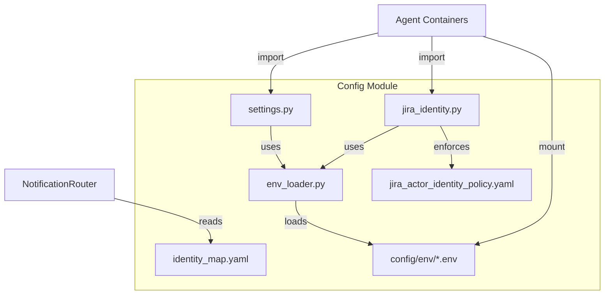
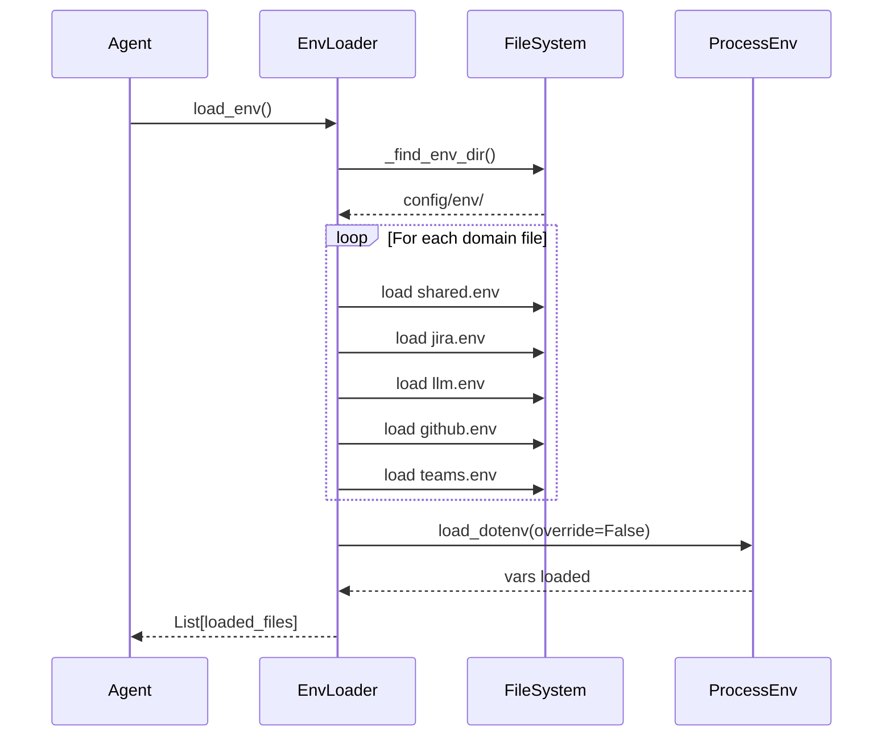
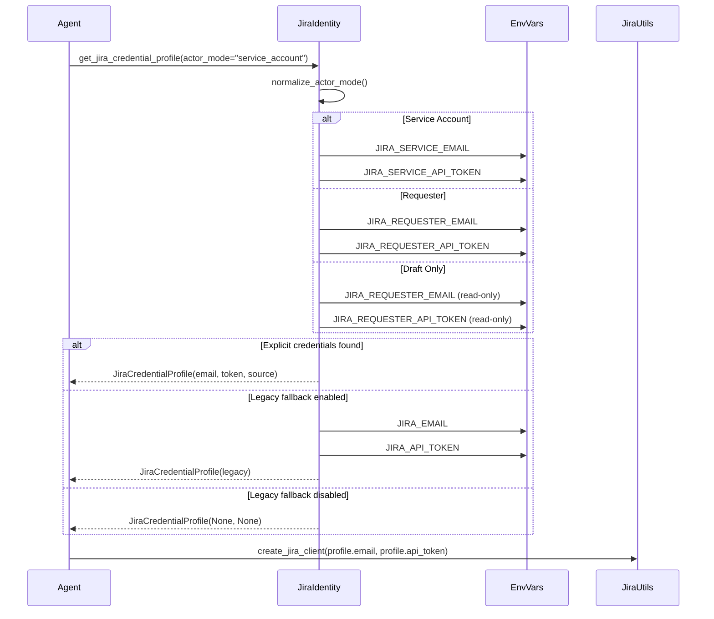
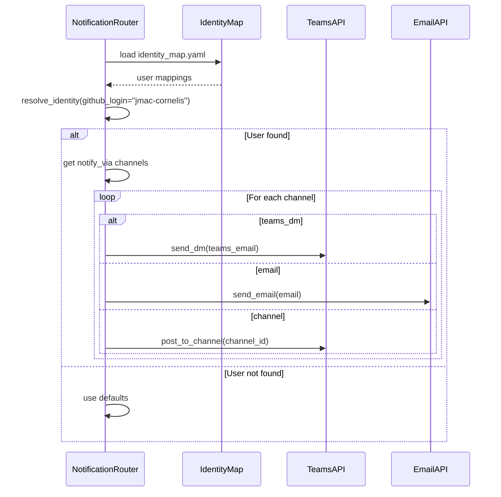

<!-- Generated by Documentation Agent — do not edit between markers -->

```yaml
---
title: "As-Built: Config Module"
date: "2026-04-06"
status: "draft"
---
```

## Module Overview

The `config` module provides centralized configuration management for the Cornelis Agent Pipeline. It handles environment variable loading from credential-domain segregated files, application settings management, Jira actor identity resolution, and cross-platform identity mapping for notification routing. The module implements a least-privilege credential model where each agent container mounts only the environment files it needs, and supports both Docker Compose deployments and local development workflows.

## What Changed

**Before:** The module used a single monolithic `.env` file for all credentials, with basic environment loading via `python-dotenv`.

**After:** The module now implements credential-domain segregation with separate `.env` files (`shared.env`, `jira.env`, `llm.env`, `github.env`, `teams.env`) that are selectively mounted per agent. It includes sophisticated Jira actor identity resolution supporting three modes (`requester`, `service_account`, `draft_only`) with legacy fallback controls, and a cross-platform identity map that unifies GitHub, Jira, Teams, and email identities for notification routing.

**Impact:** All agents now consume credentials via domain-specific env files. The `jira_utils` module and all Jira-interacting agents must use `get_jira_credential_profile()` to resolve actor-specific credentials. The notification system (Shannon, Drucker PR reminders) uses `identity_map.yaml` to route messages across platforms.

## Component Diagram



## Key Flows

### Flow 1: Environment Loading (Credential-Domain Segregation)



The `load_env()` function walks up from the current working directory to find `config/env/`, then loads domain-specific `.env` files in canonical order (`shared.env` first, then credential domains). If no domain files are found, it falls back to a single `.env` at the repository root. Process environment variables always win unless `override=True` is passed.

### Flow 2: Jira Actor Identity Resolution



The `get_jira_credential_profile()` function resolves Jira credentials based on the actor mode. It first attempts to load explicit credentials (`JIRA_SERVICE_EMAIL`/`JIRA_SERVICE_API_TOKEN` for service account, `JIRA_REQUESTER_EMAIL`/`JIRA_REQUESTER_API_TOKEN` for requester). If those are not set and `JIRA_ENABLE_LEGACY_FALLBACK=true`, it falls back to `JIRA_EMAIL`/`JIRA_API_TOKEN`. The `draft_only` mode uses requester credentials but marks the profile as read-only.

### Flow 3: Cross-Platform Identity Resolution



The `identity_map.yaml` file maps GitHub logins to Jira, Teams, and email identities. The `NotificationRouter` (used by Shannon and Drucker PR reminders) loads this file and resolves the target user's notification channels (`teams_dm`, `email`, `channel`). Each user entry specifies which channels are enabled via the `notify_via` list.

## Data Model

### JiraCredentialProfile

```python
@dataclass
class JiraCredentialProfile:
    actor_mode: str              # "requester" | "service_account" | "draft_only"
    email: Optional[str]         # Jira email address
    api_token: Optional[str]     # Jira API token
    email_env: Optional[str]     # Env var name for email
    token_env: Optional[str]     # Env var name for token
    source: str                  # Description of credential source
```

### Settings

```python
@dataclass
class Settings:
    # Jira
    jira_url: str
    jira_email: Optional[str]
    jira_api_token: Optional[str]
    
    # Cornelis LLM
    cornelis_llm_base_url: Optional[str]
    cornelis_llm_api_key: Optional[str]
    cornelis_llm_model: str
    
    # External LLM
    openai_api_key: Optional[str]
    anthropic_api_key: Optional[str]
    
    # LLM configuration
    default_llm_provider: str
    vision_llm_provider: str
    fallback_enabled: bool
    
    # Agent configuration
    agent_log_level: str
    agent_max_iterations: int
    agent_timeout_seconds: int
    
    # Cornelis MCP
    mcp_url: str
    mcp_api_key_env: str
    mcp_timeout: int
    mcp_enabled: bool
    
    # Web search (fallback)
    brave_search_api_key: Optional[str]
    tavily_api_key: Optional[str]
    
    # Feature planning
    feature_planning_max_research_queries: int
    feature_planning_confidence_threshold: str
    
    # State persistence
    state_persistence_enabled: bool
    state_persistence_path: str
    state_persistence_format: str
    
    # Logging
    log_file: str
    log_level: str
```

### Identity Map Schema (YAML)

```yaml
defaults:
  notify_via: [teams_dm, email]
  email_from: john.macdonald@cornelisnetworks.com

users:
  github-login:
    name: Display Name
    email: first.last@cornelisnetworks.com
    teams_email: first.last@cornelisnetworks.com
    jira_display_name: "Last, First"
    jira_account_id: "712020:..."
    github_login: github-login
    notify_via: [teams_dm, email]
```

## Dependencies

| Dependency | Purpose | Version |
|------------|---------|---------|
| `python-dotenv` | Load environment variables from `.env` files | (from requirements.txt) |
| `logging` | Standard library logging | stdlib |
| `os` | Environment variable access | stdlib |
| `sys` | Command-line argument access | stdlib |
| `pathlib` | File path manipulation | stdlib |
| `dataclasses` | Data class definitions | stdlib |
| `typing` | Type hints | stdlib |

## Configuration

### Environment Variables (Credential Domains)

**Shared (`shared.env`)**
- `DRY_RUN` — Default dry-run mode (`true`/`false`, default `true`)
- `JIRA_URL` — Jira instance URL (default `https://cornelisnetworks.atlassian.net`)
- `JIRA_ENABLE_LEGACY_FALLBACK` — Allow fallback to `JIRA_EMAIL`/`JIRA_API_TOKEN` (`true`/`false`, default `true`)

**Jira (`jira.env`)**
- `JIRA_SERVICE_EMAIL` — Service account email for deterministic system writes
- `JIRA_SERVICE_API_TOKEN` — Service account API token
- `JIRA_REQUESTER_EMAIL` — Human requester email for judgment-bearing actions
- `JIRA_REQUESTER_API_TOKEN` — Human requester API token
- `JIRA_EMAIL` — Legacy single-profile email (fallback only)
- `JIRA_API_TOKEN` — Legacy single-profile token (fallback only)

**LLM (`llm.env`)**
- `CORNELIS_LLM_BASE_URL` — Cornelis LLM API base URL
- `CORNELIS_LLM_API_KEY` — Cornelis LLM API key
- `CORNELIS_LLM_MODEL` — Default model name (default `cornelis-default`)
- `OPENAI_API_KEY` — OpenAI API key (fallback)
- `ANTHROPIC_API_KEY` — Anthropic API key (fallback)
- `DEFAULT_LLM_PROVIDER` — Default provider (`cornelis`/`openai`/`anthropic`, default `cornelis`)
- `VISION_LLM_PROVIDER` — Vision provider (default `cornelis`)
- `FALLBACK_ENABLED` — Enable LLM fallback (`true`/`false`, default `true`)

**GitHub (`github.env`)**
- `GITHUB_TOKEN` — GitHub personal access token
- `GITHUB_API_URL` — GitHub API base URL (default `https://api.github.com`)

**Teams (`teams.env`)**
- `TEAMS_TENANT_ID` — Azure AD tenant ID
- `TEAMS_CLIENT_ID` — Azure AD app client ID
- `TEAMS_CLIENT_SECRET` — Azure AD app client secret
- `TEAMS_BOT_ID` — Teams bot app ID
- `TEAMS_BOT_PASSWORD` — Teams bot password

### Agent Configuration

- `AGENT_LOG_LEVEL` — Agent console log level (`DEBUG`/`INFO`/`WARNING`/`ERROR`, default `INFO`)
- `AGENT_MAX_ITERATIONS` — Max agent loop iterations (default `50`)
- `AGENT_TIMEOUT_SECONDS` — Agent execution timeout (default `300`)

### MCP Configuration

- `CORNELIS_MCP_URL` — MCP server URL (default `http://cn-ai-01.cornelisnetworks.com:50700/mcp`)
- `CORNELIS_MCP_API_KEY_ENV` — Env var name for MCP API key (default `CORNELIS_AI_API_KEY`)
- `CORNELIS_MCP_TIMEOUT` — MCP request timeout in seconds (default `60`)
- `CORNELIS_MCP_ENABLED` — Enable MCP integration (`true`/`false`, default `true`)

### Feature Planning

- `FEATURE_PLANNING_MAX_RESEARCH_QUERIES` — Max web search queries (default `20`)
- `FEATURE_PLANNING_CONFIDENCE_THRESHOLD` — Minimum confidence level (`high`/`medium`/`low`, default `medium`)

### State Persistence

- `STATE_PERSISTENCE_ENABLED` — Enable session state persistence (`true`/`false`, default `true`)
- `STATE_PERSISTENCE_PATH` — State storage directory (default `./data/sessions`)
- `STATE_PERSISTENCE_FORMAT` — Storage format (`json`/`sqlite`/`both`, default `json`)

### Logging

- `LOG_FILE` — Log file path (default `cornelis_agent.log`)
- `LOG_LEVEL` — File log level (`DEBUG`/`INFO`/`WARNING`/`ERROR`, default `DEBUG`)

## Error Handling

### Environment Loading Errors

- **Missing env files** — `load_env()` logs a debug message and continues (process env is still available)
- **Invalid env file syntax** — `python-dotenv` silently skips malformed lines
- **Missing required credentials** — `Settings.validate()` raises `ValueError` with a list of missing variables

### Jira Identity Resolution Errors

- **Missing actor credentials** — `get_jira_credentials_for_actor()` raises `ValueError` with the missing env var name
- **Invalid actor mode** — `normalize_actor_mode()` defaults to `"requester"` and logs a warning
- **Legacy fallback disabled** — Returns a profile with `None` credentials when explicit vars are missing

### Settings Validation Errors

```python
try:
    settings = get_settings()
    settings.validate()
except ValueError as e:
    log.error(f'Configuration error: {e}')
    sys.exit(1)
```

The `Settings.validate()` method checks for required credentials based on the configured LLM provider and raises `ValueError` if any are missing.

## Known Limitations / Technical Debt

### Hardcoded Values

- **Jira URL default** — `https://cornelisnetworks.atlassian.net` is hardcoded in `Settings` (should be required env var)
- **MCP URL default** — `http://cn-ai-01.cornelisnetworks.com:50700/mcp` is hardcoded (should be required env var)
- **Env file load order** — `_ENV_FILE_ORDER` in `env_loader.py` is hardcoded (should be configurable)

### Missing Implementations

- **Env file validation** — No schema validation for `.env` files (malformed values are silently ignored)
- **Identity map validation** — `identity_map.yaml` is not validated against a schema (missing fields cause runtime errors)
- **Credential rotation** — No support for credential rotation or expiration (tokens are assumed to be long-lived)
- **Secrets management** — No integration with Docker secrets or vault systems (credentials are plain text in env files)

### Anti-Patterns Detected

- **Global mutable state** — `_settings` in `settings.py` is a module-level singleton (not thread-safe)
- **Implicit env var precedence** — `load_dotenv(override=False)` means process env always wins, but this is not documented in the env file templates
- **Legacy fallback complexity** — The `JIRA_ENABLE_LEGACY_FALLBACK` flag adds significant branching logic to `get_jira_credential_profile()` (consider deprecating legacy mode)

### Technical Debt

- **Env file discovery** — `_find_env_dir()` walks up to the repo root by checking for `pyproject.toml`, but this assumes the repo structure never changes (fragile)
- **Identity map format** — `identity_map.yaml` is manually maintained (should be auto-generated from HR/IT systems or synced from Azure AD)
- **Jira actor policy** — `jira_actor_identity_policy.yaml` is not enforced by code (it is documentation only)
- **Settings.to_dict()** — Masks sensitive values with `'***'`, but this is not a secure redaction (values are still in memory)

<!-- End Documentation Agent generated content -->