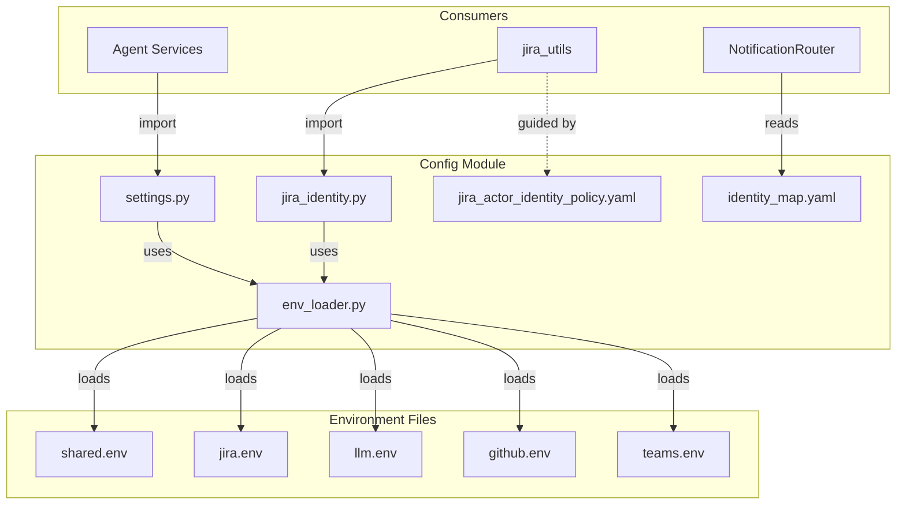
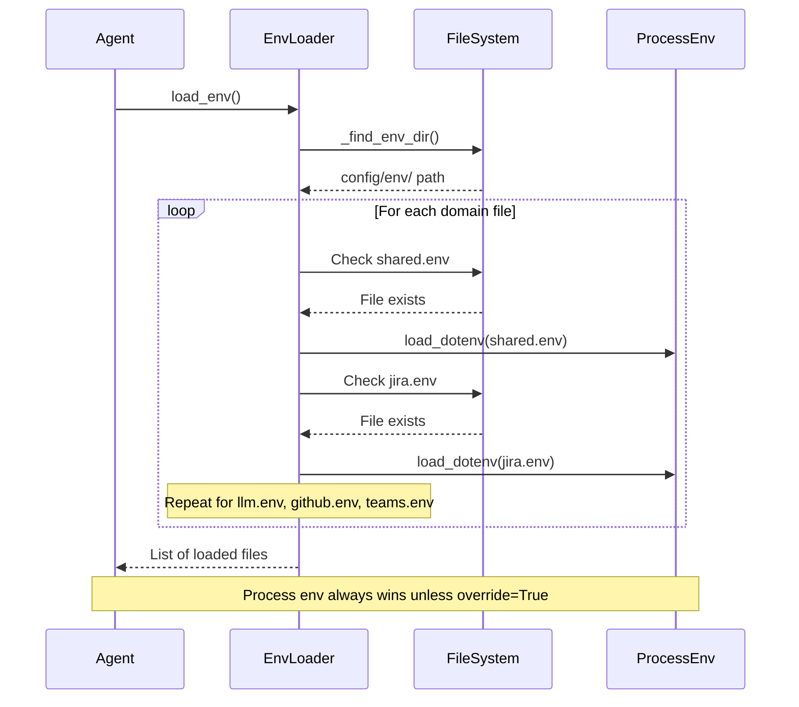
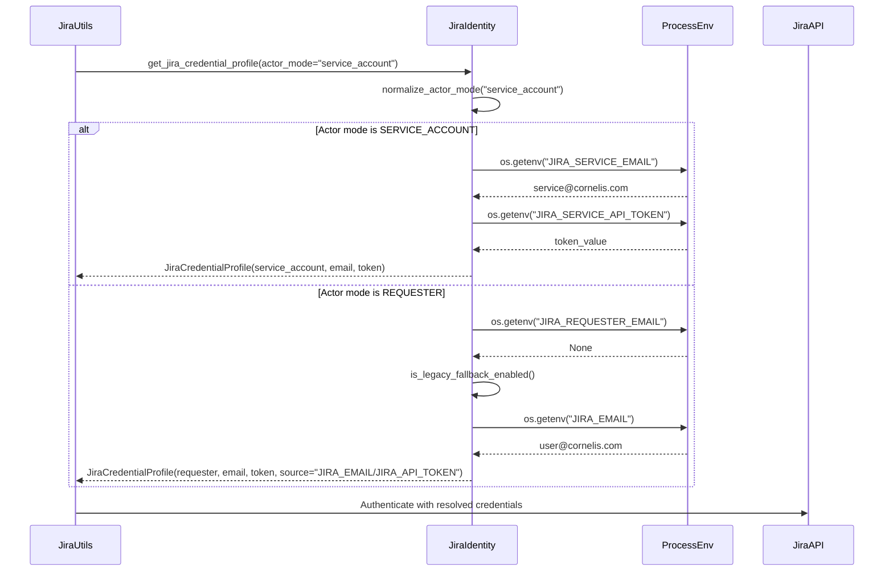
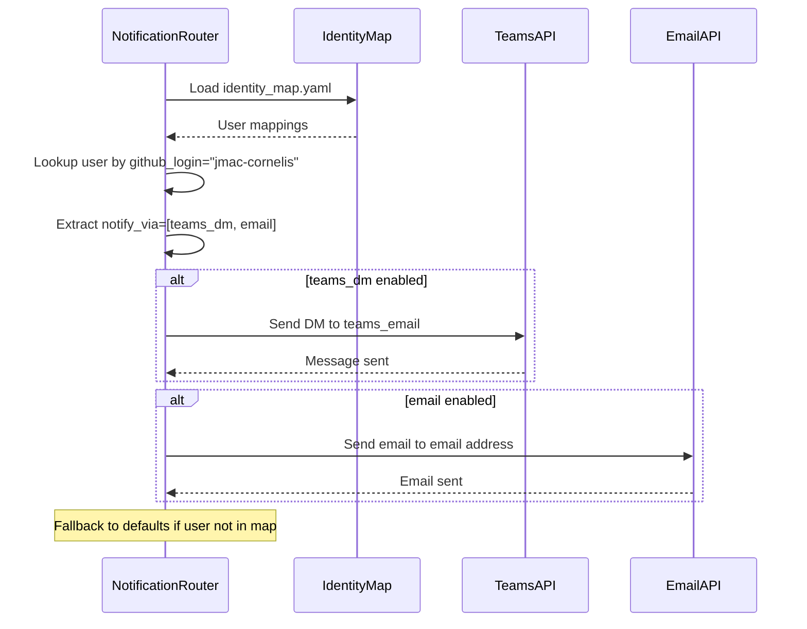

<!-- Generated by Documentation Agent — do not edit between markers -->

```yaml
---
title: "As-Built: Config Module"
date: "2026-04-06"
status: "draft"
---
```

## Module Overview

The `config` module provides centralized configuration management for the Cornelis Agent Pipeline. It handles environment variable loading from credential-domain segregated files, application settings management, Jira actor identity resolution, and cross-platform identity mapping for notification routing. The module implements a least-privilege credential model where each agent container mounts only the environment files it requires, and supports both Docker Compose deployment and local development workflows.

## What Changed

**Before:** The module used a single monolithic `.env` file for all credentials, with basic environment loading via `python-dotenv`. Jira identity was managed through simple `JIRA_EMAIL` and `JIRA_API_TOKEN` variables without actor-mode separation.

**After:** The module now implements credential-domain segregation (`shared.env`, `jira.env`, `llm.env`, `github.env`, `teams.env`) with a canonical load order that mirrors Docker Compose `env_file` stacking. Jira identity resolution supports three actor modes (`requester`, `service_account`, `draft_only`) with separate credential profiles and legacy fallback control. A cross-platform identity map (`identity_map.yaml`) unifies GitHub, Jira, Teams, and email identities for notification routing.

**Impact:** All agents must now mount only the credential-domain files they require in `docker-compose.yml`. Jira-mutating operations must explicitly specify an actor mode to determine which credential profile to use. Notification systems (PR reminders, NotificationRouter) can now route messages across multiple channels (Teams DM, email, channel) using a single identity source.

## Component Diagram



## Key Flows

### Flow 1: Environment Loading (Credential-Domain Segregation)



**Description:** The environment loader walks up from the current working directory to find `config/env/`, then loads credential-domain files in canonical order (`shared.env` → `jira.env` → `llm.env` → `github.env` → `teams.env`). This mirrors Docker Compose `env_file` stacking where later files override earlier ones. If no domain files are found, it falls back to a single `.env` at the repository root for local development compatibility.

### Flow 2: Jira Actor Identity Resolution



**Description:** Jira identity resolution supports three actor modes: `requester` (human who initiated the action), `service_account` (shared automation identity), and `draft_only` (preview-only, uses requester credentials for read operations). Each mode resolves to a separate credential profile from environment variables (`JIRA_REQUESTER_EMAIL`/`JIRA_REQUESTER_API_TOKEN` for requester, `JIRA_SERVICE_EMAIL`/`JIRA_SERVICE_API_TOKEN` for service account). If explicit credentials are missing and `JIRA_ENABLE_LEGACY_FALLBACK=true`, the system falls back to `JIRA_EMAIL`/`JIRA_API_TOKEN` for backward compatibility.

### Flow 3: Cross-Platform Identity Lookup for Notification Routing



**Description:** The identity map (`identity_map.yaml`) provides a single source of truth for cross-platform identities. Each user entry maps a GitHub login to Jira display name, Jira account ID, Teams email, and email address. The `notify_via` field controls which notification channels are enabled for that user (`teams_dm`, `email`, `channel`). Notification systems (PR reminders, NotificationRouter) look up the user by GitHub login and route messages to all enabled channels. If a user is not in the map, the system falls back to the `defaults` section.

## Data Model

### JiraCredentialProfile (dataclass)
```python
@dataclass
class JiraCredentialProfile:
    actor_mode: str              # "requester" | "service_account" | "draft_only"
    email: Optional[str]         # Jira email for this actor
    api_token: Optional[str]     # Jira API token for this actor
    email_env: Optional[str]     # Environment variable name for email
    token_env: Optional[str]     # Environment variable name for token
    source: str                  # Description of credential source
```

### Settings (dataclass)
```python
@dataclass
class Settings:
    # Jira settings
    jira_url: str
    jira_email: Optional[str]
    jira_api_token: Optional[str]
    
    # Cornelis LLM settings
    cornelis_llm_base_url: Optional[str]
    cornelis_llm_api_key: Optional[str]
    cornelis_llm_model: str
    
    # External LLM settings
    openai_api_key: Optional[str]
    anthropic_api_key: Optional[str]
    
    # LLM configuration
    default_llm_provider: str
    vision_llm_provider: str
    fallback_enabled: bool
    
    # Agent configuration
    agent_log_level: str
    agent_max_iterations: int
    agent_timeout_seconds: int
    
    # Cornelis MCP settings
    mcp_url: str
    mcp_api_key_env: str
    mcp_timeout: int
    mcp_enabled: bool
    
    # Web search settings
    brave_search_api_key: Optional[str]
    tavily_api_key: Optional[str]
    
    # Feature planning settings
    feature_planning_max_research_queries: int
    feature_planning_confidence_threshold: str
    
    # State persistence
    state_persistence_enabled: bool
    state_persistence_path: str
    state_persistence_format: str
    
    # Logging
    log_file: str
    log_level: str
```

### Identity Map Schema (YAML)
```yaml
defaults:
  notify_via: [teams_dm, email]
  email_from: john.macdonald@cornelisnetworks.com

users:
  github-login:
    name: Display Name
    email: first.last@cornelisnetworks.com
    teams_email: first.last@cornelisnetworks.com
    jira_display_name: "Last, First"
    jira_account_id: "712020:..."
    github_login: github-login
    notify_via: [teams_dm, email]
```

## Dependencies

| Dependency | Purpose | Version |
|------------|---------|---------|
| `python-dotenv` | Load environment variables from `.env` files | Not specified |
| `logging` (stdlib) | Logging infrastructure | Python 3.x |
| `os` (stdlib) | Environment variable access | Python 3.x |
| `sys` (stdlib) | System-specific parameters | Python 3.x |
| `pathlib` (stdlib) | Filesystem path operations | Python 3.x |
| `dataclasses` (stdlib) | Data class definitions | Python 3.8+ |
| `typing` (stdlib) | Type hints | Python 3.x |

## Configuration

### Environment Variables (Credential-Domain Files)

**`config/env/shared.env`** — Non-sensitive shared configuration
- `DRY_RUN` — Dry-run mode flag (`true`/`false`/`yes`/`no`/`on`/`off`/`1`/`0`, default `true`)
- `LOG_LEVEL` — Logging level (`DEBUG`/`INFO`/`WARNING`/`ERROR`, default `DEBUG`)
- `LOG_FILE` — Log file path (default `cornelis_agent.log`)

**`config/env/jira.env`** — Jira credentials
- `JIRA_URL` — Jira instance URL (default `https://cornelisnetworks.atlassian.net`)
- `JIRA_SERVICE_EMAIL` — Service account email for automation
- `JIRA_SERVICE_API_TOKEN` — Service account API token
- `JIRA_REQUESTER_EMAIL` — Requester email for human-initiated actions
- `JIRA_REQUESTER_API_TOKEN` — Requester API token
- `JIRA_EMAIL` — Legacy single-profile email (fallback only)
- `JIRA_API_TOKEN` — Legacy single-profile token (fallback only)
- `JIRA_ENABLE_LEGACY_FALLBACK` — Enable legacy fallback (`true`/`false`, default `true`)

**`config/env/llm.env`** — LLM provider credentials
- `CORNELIS_LLM_BASE_URL` — Cornelis LLM API base URL
- `CORNELIS_LLM_API_KEY` — Cornelis LLM API key
- `CORNELIS_LLM_MODEL` — Cornelis LLM model name (default `cornelis-default`)
- `OPENAI_API_KEY` — OpenAI API key
- `ANTHROPIC_API_KEY` — Anthropic API key
- `DEFAULT_LLM_PROVIDER` — Default LLM provider (`cornelis`/`openai`/`anthropic`, default `cornelis`)
- `VISION_LLM_PROVIDER` — Vision LLM provider (default `cornelis`)
- `FALLBACK_ENABLED` — Enable LLM fallback (`true`/`false`, default `true`)

**`config/env/github.env`** — GitHub credentials
- `GITHUB_TOKEN` — GitHub personal access token

**`config/env/teams.env`** — Teams/Azure credentials
- `TEAMS_APP_ID` — Teams app ID
- `TEAMS_APP_PASSWORD` — Teams app password
- `AZURE_TENANT_ID` — Azure tenant ID
- `AZURE_CLIENT_ID` — Azure client ID
- `AZURE_CLIENT_SECRET` — Azure client secret

### Feature Flags
- `JIRA_ENABLE_LEGACY_FALLBACK` — When `false`, disables fallback to `JIRA_EMAIL`/`JIRA_API_TOKEN` in shared deployment (default `true`)
- `STATE_PERSISTENCE_ENABLED` — Enable state persistence (default `true`)
- `CORNELIS_MCP_ENABLED` — Enable Cornelis MCP integration (default `true`)

### Configuration Files
- `config/identity_map.yaml` — Cross-platform identity mapping for notification routing
- `config/jira_actor_identity_policy.yaml` — Policy rules for Jira actor mode selection
- `config/shannon/agent_registry.yaml` — Agent registry for Shannon routing
- `config/shannon/teams-app-manifest.template.json` — Teams app manifest template

## Error Handling

### Environment Loading Errors
- **Missing credential-domain files** — Logged as `DEBUG` and falls back to root `.env` or process environment
- **Missing root `.env`** — Logged as `DEBUG` with message "No .env files found; relying on process environment"
- **Invalid env file path** — Logged as `WARNING` with message "Explicit env path does not exist: {path}"

### Settings Validation Errors
- **Missing required Jira credentials** — Raises `ValueError` with message "JIRA_EMAIL is required" or "JIRA_API_TOKEN is required"
- **Missing required LLM credentials** — Raises `ValueError` with provider-specific message (e.g., "CORNELIS_LLM_BASE_URL is required for cornelis provider")
- **Multiple validation errors** — Accumulated and raised as single `ValueError` with comma-separated error list

### Jira Identity Resolution Errors
- **Missing actor credentials** — Raises `ValueError` with message "{email_env} environment variable not set for actor \"{actor_mode}\""
- **Invalid actor mode** — Normalized to `REQUESTER` (default) with no error raised
- **Legacy fallback disabled** — Returns `JiraCredentialProfile` with `None` credentials and source message "legacy fallback disabled"

### Logging Configuration
- **File handler** — Writes to `settings.log_file` with `DEBUG` level and detailed format
- **Console handler** — Writes to stderr with `settings.agent_log_level` and simple format
- **Logger naming** — Uses `os.path.basename(sys.argv[0])` for script-specific loggers

## Known Limitations / Technical Debt

### Hardcoded Values
- **Canonical env file order** — `_ENV_FILE_ORDER` in `env_loader.py` is hardcoded to `['shared.env', 'jira.env', 'llm.env', 'github.env', 'teams.env']`. Adding a new credential domain requires code change.
- **Default Jira URL** — Hardcoded to `https://cornelisnetworks.atlassian.net` in `Settings` dataclass
- **Default MCP URL** — Hardcoded to `http://cn-ai-01.cornelisnetworks.com:50700/mcp` in `Settings` dataclass
- **Actor mode constants** — `REQUESTER`, `SERVICE_ACCOUNT`, `DRAFT_ONLY` are module-level constants in `jira_identity.py` instead of an enum

### Missing Implementations
- **Settings validation** — `Settings.validate()` only checks for missing credentials; does not validate URL formats, file paths, or numeric ranges
- **Identity map validation** — No schema validation for `identity_map.yaml`; malformed YAML will cause runtime errors
- **Credential rotation** — No support for credential expiration or rotation; tokens are assumed to be long-lived
- **Audit logging** — Jira actor identity resolution logs credential source at `DEBUG` level but does not emit structured audit events

### Areas for Improvement
- **Environment file discovery** — `_find_env_dir()` walks up to the repository root by checking for `pyproject.toml`, which couples the config module to the repository structure. Consider making this configurable.
- **Legacy fallback deprecation** — The `JIRA_ENABLE_LEGACY_FALLBACK` flag is `true` by default for backward compatibility, but should be phased out in favor of explicit actor-mode credentials.
- **Global settings singleton** — `get_settings()` uses a module-level `_settings` variable, which makes testing difficult. Consider dependency injection or context managers.
- **Identity map format** — `identity_map.yaml` is manually maintained. Consider generating it from an authoritative source (e.g., HR system, Active Directory).

### Anti-patterns Detected
- **God class risk** — `Settings` dataclass has 20+ fields covering Jira, LLM, MCP, web search, feature planning, state persistence, and logging. Consider splitting into domain-specific settings classes.
- **Circular dependency potential** — `env_loader.py` imports `load_dotenv` from `dotenv`, and `settings.py` imports `load_env` from `env_loader.py`, which calls `load_dotenv` again. This works because `load_dotenv` is idempotent, but the pattern is fragile.
- **Missing error handling on I/O boundaries** — `load_env()` calls `Path.is_file()` and `load_dotenv()` without catching `OSError` or `PermissionError`. File system errors will propagate as unhandled exceptions.

<!-- End Documentation Agent generated content -->