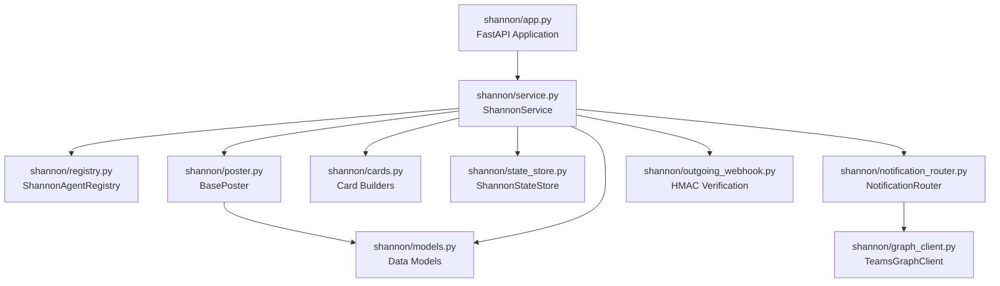
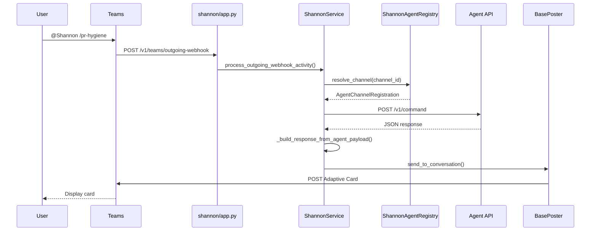
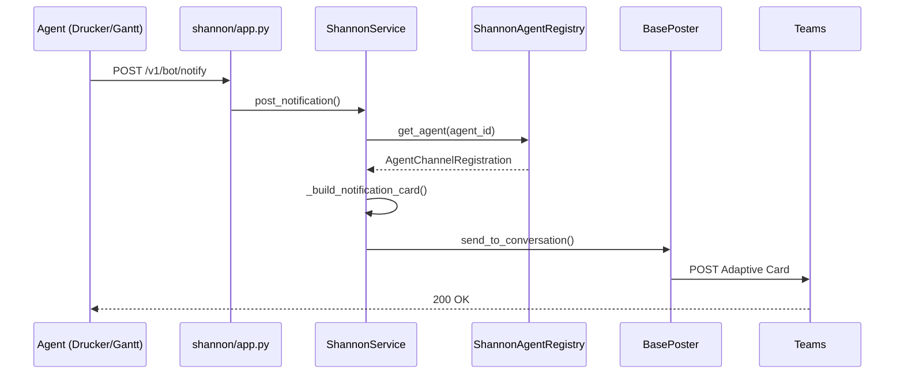
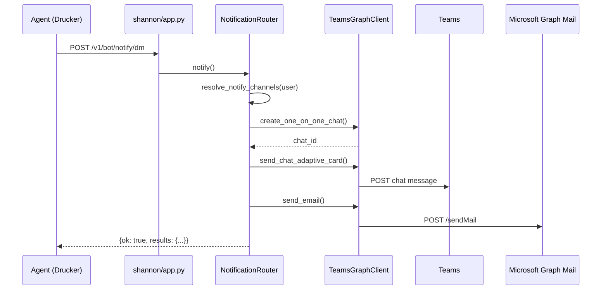

<!-- Generated by Documentation Agent — do not edit between markers -->

```yaml
---
title: "As-Built: Shannon Communications Agent"
date: "2026-04-08"
status: "draft"
---
```

## Module Overview

Shannon is a Microsoft Teams bot service that acts as the unified communications surface for the Cornelis agent workforce. It routes user commands from Teams to registered agent APIs, renders responses as Adaptive Cards, and posts notifications to Teams channels. Shannon supports both Bot Framework activities and Outgoing Webhook integrations, providing flexible deployment options with minimal Azure permissions required.

## What Changed

**Before:** Shannon used a simple `build_fact_card()` helper to render all notifications with basic text formatting.

**After:** Shannon now includes a specialized `_build_notification_card()` method that detects URLs in notification body lines and renders them as clickable Adaptive Card links with intelligent label extraction.

**Impact:** Notifications containing GitHub PR URLs, Jira ticket links, or other web resources now display as interactive links rather than plain text. This improves usability for agents like Drucker (PR hygiene alerts) and Gantt (release monitoring) that frequently post URLs in their notifications.

## Component Diagram



## Key Flows

### Flow 1: Teams Command Routing

When a user sends a command to Shannon in Teams, the service resolves the target agent, forwards the request, and posts the response as an Adaptive Card.



**Description:** Shannon extracts the command text, resolves the target agent via the registry, forwards the command as a JSON POST to the agent's API, builds an Adaptive Card from the response, and posts it back to Teams using the configured poster (Workflows webhook or Bot Framework).

### Flow 2: Agent Notification Posting

Agents post notifications to Shannon via the `/v1/bot/notify` endpoint. Shannon resolves the target channel and posts the notification as an Adaptive Card.



**Description:** Agents call Shannon's `/v1/bot/notify` endpoint with a title, text, and optional body lines. Shannon builds an Adaptive Card with URL detection and link rendering, then posts it to the agent's registered Teams channel.

### Flow 3: Direct DM + Email Notification

Agents can send direct messages and emails to users via the `/v1/bot/notify/dm` endpoint, which uses the `NotificationRouter` to dispatch to Teams DM and email channels.



**Description:** The `NotificationRouter` looks up user preferences in `config/identity_map.yaml`, creates or retrieves a 1:1 Teams chat via Microsoft Graph, sends an Adaptive Card DM, and sends an HTML email. This flow supports targeted notifications to specific users or all users in the identity map.

## Data Model

### Core Data Structures

**`AgentChannelRegistration`** (`shannon/models.py`)
- Describes how Shannon maps a Teams channel to an agent API.
- Fields: `agent_id`, `display_name`, `role`, `channel_id`, `channel_name`, `team_id`, `api_base_url`, `notifications_webhook_url`, `custom_commands`, `timeout_seconds`.
- Loaded from `config/shannon/agent_registry.yaml`.
- Supports environment variable overrides for `api_base_url` (e.g., `DRUCKER_API_URL`).

**`ConversationReference`** (`shannon/models.py`)
- Captures Teams conversation context for replies and notifications.
- Fields: `reference_id`, `agent_id`, `service_url`, `channel_id`, `conversation_id`, `team_id`, `user_id`, `user_name`, `bot_id`, `bot_name`.
- Built from Bot Framework activity payloads via `ConversationReference.from_activity()`.

**`AuditRecord`** (`shannon/models.py`)
- Audit trail for Shannon events and routing decisions.
- Fields: `record_id`, `timestamp`, `event_type`, `status`, `agent_id`, `command`, `decision`, `details`.
- Stored in-memory by `ShannonStateStore`.

**`ShannonResponse`** (`shannon/models.py`)
- Response payload generated by Shannon before posting to Teams.
- Fields: `text`, `card` (Adaptive Card JSON), `command`, `decision`, `metadata`.
- Converted to Bot Framework activity via `to_message_activity()` or Outgoing Webhook response via `to_outgoing_webhook_response()`.

**`ConversationState`** (`shannon/models.py`)
- Tracks in-progress Q&A conversations for commands with missing parameters.
- Fields: `state_id`, `user_id`, `agent_id`, `command`, `collected_params`, `remaining_params`, `created_at`, `channel_id`.
- Ephemeral — stored in-memory only.

### State Storage

Shannon uses `ShannonStateStore` (in-memory) to track:
- Conversation references (keyed by `channel_id` or `conversation_id`)
- Audit records (routing decisions, errors, notifications)
- Conversation states (multi-turn Q&A sessions)
- Throughput statistics (messages/commands/notifications per day)

## Dependencies

| Dependency | Purpose | Version |
|------------|---------|---------|
| `fastapi` | Web framework for REST API | `^0.100.0` |
| `uvicorn` | ASGI server | `^0.23.0` |
| `pydantic` | Request/response validation | `^2.0.0` |
| `requests` | HTTP client for agent API calls | `^2.31.0` |
| `pyyaml` | Agent registry YAML parsing | `^6.0.0` |
| `python-dotenv` | Environment variable loading | `^1.0.0` |
| `agents.rename_registry` | Agent name canonicalization | Internal |
| `config.env_loader` | Dry-run flag resolution | Internal |
| `agents.shannon.graph_client` | Microsoft Graph API client | Internal |
| `agents.shannon.state_store` | In-memory state storage | Internal |

## Configuration

### Environment Variables

**Shannon Service**
- `SHANNON_HOST` — Host to bind (default: `0.0.0.0`)
- `SHANNON_PORT` — Port to bind (default: `8200`)
- `SHANNON_AGENT_REGISTRY_PATH` — Path to agent registry YAML (default: `config/shannon/agent_registry.yaml`)
- `SHANNON_TEAMS_BOT_NAME` — Bot display name (default: `Shannon`)
- `SHANNON_SEND_WELCOME_ON_INSTALL` — Send welcome message on bot install (default: `true`)

**Teams Integration**
- `SHANNON_TEAMS_POST_MODE` — Posting mode: `memory`, `workflows`, or `botframework` (default: `memory`)
- `SHANNON_TEAMS_WORKFLOWS_WEBHOOK_URL` — Workflows incoming webhook URL (required if mode=`workflows`)
- `SHANNON_TEAMS_APP_ID` — Azure Bot app ID (required if mode=`botframework`)
- `SHANNON_TEAMS_APP_PASSWORD` — Azure Bot app password (required if mode=`botframework`)
- `SHANNON_TEAMS_OUTGOING_WEBHOOK_SECRET` — HMAC secret for Outgoing Webhook verification (base64-encoded)

**Agent API Overrides**
- `{AGENT_ID}_API_URL` — Override `api_base_url` for a specific agent (e.g., `DRUCKER_API_URL=http://cn-ai-03:8201`)

**Notification Router**
- `CONFIG_DIR` — Base directory for config files (default: `config`)
- `NOTIFICATION_EMAIL_FROM` — Default from-address for email notifications (default: `shannon@cornelisnetworks.com`)

### Configuration Files

**`config/shannon/agent_registry.yaml`**
- Defines agent-to-channel mappings and API endpoints.
- Schema: `agents: [{agent_id, display_name, role, channel_id, api_base_url, custom_commands, ...}]`

**`config/identity_map.yaml`**
- Maps GitHub logins to Teams emails, Jira account IDs, and notification preferences.
- Schema: `users: {github_login: {email, teams_email, jira_account_id, notify_via: [teams_dm, email]}}`

## Error Handling

Shannon uses a layered error handling strategy:

1. **HTTP Exception Handling** (`shannon/app.py`)
   - FastAPI endpoints raise `HTTPException` with appropriate status codes (400, 401, 404, 500).
   - Example: `raise HTTPException(status_code=400, detail='Invalid JSON payload')`

2. **Audit Record Logging** (`shannon/service.py`)
   - All routing decisions and errors are recorded as `AuditRecord` instances.
   - Status field: `ok`, `error`, `timeout`, `not_found`.
   - Example: `self._record('decision', status='error', command='/pr-hygiene', decision='agent_api_timeout')`

3. **Graceful Degradation**
   - If an agent API call fails, Shannon posts an error card to Teams instead of crashing.
   - Example: `build_fact_card(title='Agent Error', subtitle=str(exc))`

4. **HMAC Signature Verification** (`shannon/outgoing_webhook.py`)
   - Outgoing Webhook requests are rejected with 401 if the HMAC signature is invalid.
   - Uses constant-time comparison via `hmac.compare_digest()`.

5. **Poster Fallback**
   - If `WorkflowsPoster` or `BotFrameworkPoster` fail, Shannon logs the error and returns a failure response.
   - `MemoryPoster` (used in tests) never fails — it stores messages in-memory.

## Known Limitations / Technical Debt

### Hardcoded Values
- **Jira Base URL**: `_JIRA_BASE = 'https://cornelisnetworks.atlassian.net/browse'` in `shannon/cards.py` (line 13).
  - **Impact**: Cannot support multiple Jira instances without code changes.
  - **Recommendation**: Move to environment variable or agent registry.

- **Token URL**: `TOKEN_URL = 'https://login.microsoftonline.com/botframework.com/oauth2/v2.0/token'` in `shannon/poster.py` (line 118).
  - **Impact**: Assumes public Azure cloud. Breaks in sovereign clouds (GCC, DoD).
  - **Recommendation**: Make configurable via environment variable.

### Missing Implementations
- **Token Refresh**: `BotFrameworkPoster._get_access_token()` does not refresh expired tokens.
  - **Impact**: Bot Framework posting will fail after ~1 hour.
  - **Recommendation**: Implement token expiry tracking and automatic refresh.

- **Conversation State Persistence**: `ConversationState` is stored in-memory only.
  - **Impact**: Multi-turn Q&A sessions are lost on service restart.
  - **Recommendation**: Persist to Redis or database.

- **Rate Limiting**: No rate limiting on agent API calls or Teams posting.
  - **Impact**: Vulnerable to abuse or accidental DoS.
  - **Recommendation**: Implement per-agent and per-user rate limits.

### God Classes
- **`ShannonService`** (`shannon/service.py`): 1,400+ lines with 30+ public methods.
  - **Impact**: Difficult to test and refactor.
  - **Recommendation**: Extract command handling, notification posting, and card building into separate classes.

### Circular Dependencies
- None detected. Shannon has a clean dependency graph with no circular imports.

### Missing Error Handling
- **Agent API Timeout**: `ShannonService._call_agent_api()` does not handle `requests.exceptions.Timeout` explicitly.
  - **Impact**: Timeout errors are logged as generic exceptions.
  - **Recommendation**: Add explicit timeout handling and post a user-friendly error card.

- **Graph API Failures**: `NotificationRouter._send_teams_dm()` does not retry on transient Graph API errors.
  - **Impact**: DM notifications may fail silently.
  - **Recommendation**: Implement exponential backoff retry logic.

### Technical Debt
- **URL Regex in `_build_notification_card()`**: Uses a simple regex (`r'(https?://\S+)'`) that may match invalid URLs.
  - **Impact**: May create broken links in Adaptive Cards.
  - **Recommendation**: Use a more robust URL parser (e.g., `urllib.parse`).

- **Adaptive Card Version**: All cards use `version: 1.4`, which may not be supported by older Teams clients.
  - **Impact**: Cards may not render on legacy clients.
  - **Recommendation**: Add version negotiation or fallback to `1.2`.

<!-- End Documentation Agent generated content -->