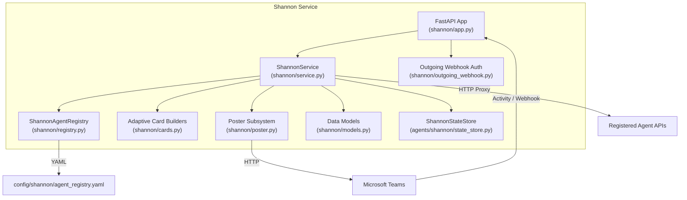
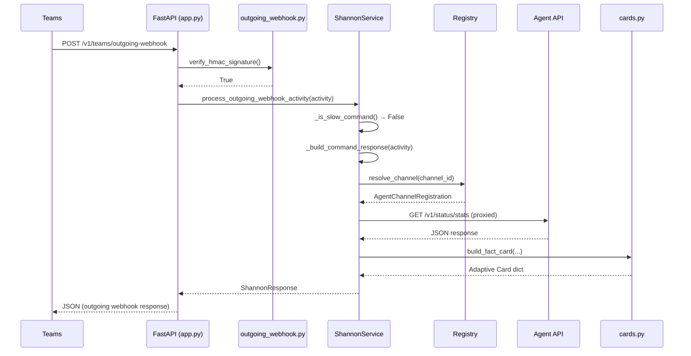
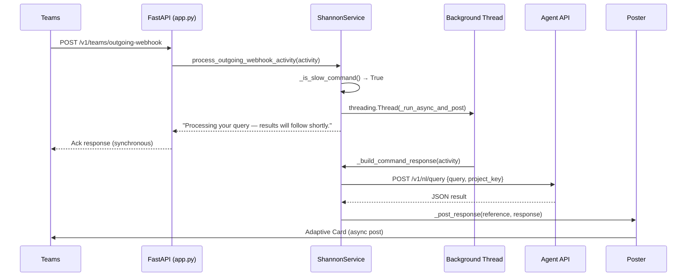
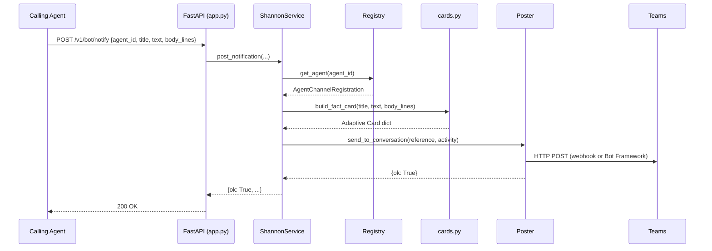

<!-- Generated by Documentation Agent — do not edit between markers -->

```yaml
---
title: "As-Built: Shannon — Communications Agent"
date: "2026-04-03"
status: "draft"
---
```

## Module Overview

Shannon is the single Microsoft Teams bot and routing surface for the Cornelis agent workforce. It receives commands from Teams users — via Bot Framework activities, outgoing webhooks, or direct API calls — normalizes them, resolves the target agent from a YAML-based channel-to-agent registry, proxies the request to that agent's REST API, and renders the response as an Adaptive Card posted back to the originating Teams channel. Shannon also exposes its own introspection commands (`/stats`, `/busy`, `/work-today`, `/decision-tree`, `/why`) and a notification endpoint that any agent can call to push alerts into Teams. The module is implemented as a FastAPI service (`shannon/app.py`) backed by a service layer (`shannon/service.py`), a pluggable posting subsystem (`shannon/poster.py`), an Adaptive Card rendering library (`shannon/cards.py`), and a YAML-driven agent registry (`shannon/registry.py`).

## What Changed

**Before:** Jira ticket references in Adaptive Card text were rendered as plain text. The Drucker `/stats` card displayed a simple four-field fact card (`total_reports`, `projects_analyzed`, `total_findings`, `proposed_actions`). Natural-language queries (`/ask` and free-text input) were not supported. Outgoing webhook requests were always handled synchronously. Commands sent to the wrong channel received a generic "unknown command" error. The `build_gantt_nl_query_card`, `build_jira_query_card`, `build_jira_release_status_card`, `build_jira_ticket_counts_card`, `build_jira_status_report_card`, and `build_nl_query_card` card builders did not exist.

**After:** All card text and fact values are now auto-linkified — any Jira ticket key (e.g. `STL-1234`) is converted to a clickable Markdown link via `_linkify_tickets()`. The Drucker `/stats` card now renders a richer payload with `total_requests`, `total_errors`, `hygiene_reports`, per-category breakdowns, and PR reminder state. Shannon supports natural-language query routing: `/ask` commands and free-text (non-slash) input in registered agent channels are forwarded to the agent's `/v1/nl/query` endpoint. Slow commands (`/ask`, `/planning-snapshot`, `/release-monitor`, `/release-survey`, and all free-text queries) arriving via outgoing webhook are now handled asynchronously — Shannon returns an immediate acknowledgment and posts the real result in a background thread. A `_find_command_owner()` method redirects users who type a command in the wrong channel. Six new card builders cover Jira queries, release status, ticket counts, status reports, and NL query results for both Drucker and Gantt agents. POST command parameter parsing now supports a single-required-string-param shortcut that joins all trailing arguments into one value (enabling `/ask how many open bugs in STL?`).

**Impact:** All downstream agents that post notifications through Shannon benefit from automatic Jira ticket linkification. Teams users in any registered channel can now issue free-text questions. The async outgoing-webhook path introduces a `threading.Thread` per slow request, which changes the concurrency model for webhook-originated traffic. The Drucker `/stats` response contract changed — callers expecting the old `total_reports` / `projects_analyzed` shape will see different fields.

## Component Diagram



## Key Flows

### Flow 1: Outgoing Webhook Command (Synchronous Fast Path)

A Teams user @-mentions Shannon in a registered agent channel. Teams sends an outgoing webhook POST. Shannon verifies the HMAC signature, resolves the agent, proxies the command, builds an Adaptive Card, and returns the response synchronously.



The entry point is `teams_outgoing_webhook()` in `app.py`, which reads the `Authorization` header and calls `verify_hmac_signature()` from `outgoing_webhook.py`. On success, `ShannonService.process_outgoing_webhook_activity()` normalizes the command text, checks `_is_slow_command()`, and for fast commands calls `_build_command_response()` synchronously. That method calls `_handle_registered_agent_command()`, which matches the slash command against `STANDARD_COMMAND_ROUTES` or `custom_commands` from the registry, calls `_call_agent_api()`, and passes the result through `_agent_response_to_shannon()` to select the correct card builder.

### Flow 2: Outgoing Webhook — Async Slow Command (`/ask` / NL Query)

When a slow command is detected, Shannon returns an immediate acknowledgment and processes the real request in a background thread.



The set of slow commands is defined in `ShannonService._SLOW_COMMANDS`:

```python
_SLOW_COMMANDS = frozenset({'/ask', '/planning-snapshot', '/release-monitor', '/release-survey'})
```

Free-text (non-slash) input is also classified as slow by `_is_slow_command()`:

```python
if not command.startswith('/'):
    return True
```

The background thread calls `_run_async_and_post()`, which re-invokes `_build_command_response()`, records audit entries, and posts the result via the configured poster.

### Flow 3: Agent Notification Push

Any agent in the workforce can POST to `/v1/bot/notify` to push a message into a Teams channel.



The `NotificationRequest` Pydantic model validates the inbound payload. `ShannonService.post_notification()` resolves the target channel from the registry (by `agent_id` or explicit `channel_id`), builds a fact card, and delegates to the poster.

## Data Model

### `AgentChannelRegistration` (`shannon/models.py`)

Maps a Teams channel to an agent. Loaded from `config/shannon/agent_registry.yaml` by `ShannonAgentRegistry`. Key fields:

```python
@dataclass
class AgentChannelRegistration:
    agent_id: str           # e.g. 'drucker', 'gantt'
    display_name: str       # Human-readable name
    channel_id: str         # Teams channel ID
    channel_name: str       # e.g. '#agent-drucker'
    api_base_url: str       # e.g. 'http://cn-ai-03:8201'
    custom_commands: List[Dict[str, Any]]  # Per-agent slash commands
    timeout_seconds: int    # API call timeout (default 30)
```

### `ConversationReference` (`shannon/models.py`)

Captures the full Teams conversation context from an inbound activity. Used by posters to address replies. Constructed via `ConversationReference.from_activity()`, which extracts `serviceUrl`, `channelData.team.id`, `channelData.channel.id`, `conversation.id`, sender/recipient info, and `tenantId`.

### `AuditRecord` (`shannon/models.py`)

Every routing decision and notification post is recorded as an `AuditRecord` with a short UUID `record_id`, timestamp, event type, status, agent/channel/user context, the command text, and a decision label. Stored in `ShannonStateStore` and queryable via `/v1/status/decisions`.

### `ShannonResponse` (`shannon/models.py`)

Internal response envelope carrying `text`, an optional Adaptive Card `card`, the `command` and `decision` labels, and arbitrary `metadata`. Provides `to_message_activity()` for Bot Framework and `to_outgoing_webhook_response()` for outgoing webhook replies (which adds `contentUrl`, `name`, `thumbnailUrl` stubs to attachments).

### Command Text Normalization

```python
MENTION_RE = re.compile(r'<at>.*?</at>', re.IGNORECASE | re.DOTALL)
TAG_RE = re.compile(r'<[^>]+>')

def normalize_command_text(text: str) -> str:
    clean = MENTION_RE.sub(' ', str(text or ''))
    clean = TAG_RE.sub(' ', clean)
    clean = clean.replace('&nbsp;', ' ')
    clean = re.sub(r'\s+', ' ', clean).strip()
    return clean
```

Strips `<at>Shannon</at>` mention markup, HTML tags, and `&nbsp;` entities.

## Dependencies

| Dependency | Purpose | Version |
|---|---|---|
| `fastapi` | HTTP framework for all Shannon endpoints | Not pinned in source |
| `pydantic` | Request validation (`NotificationRequest`, `BaseModel`) | Not pinned in source |
| `uvicorn` | ASGI server (used in `run()`) | Not pinned in source |
| `requests` | HTTP client for agent API proxying and Bot Framework token exchange | Not pinned in source |
| `pyyaml` | YAML parsing for agent registry | Not pinned in source |
| `python-dotenv` | `.env` file loading at import time | Not pinned in source |
| `agents.rename_registry` | `canonical_agent_name()` and `agent_display_name()` for agent ID normalization | Internal |
| `agents.shannon.state_store` | `ShannonStateStore` for audit records and statistics | Internal |
| `config.env_loader` | `resolve_dry_run()` for dry-run mode resolution | Internal |

## Configuration

| Variable | Purpose | Default |
|---|---|---|
| `SHANNON_HOST` | Bind address for uvicorn | `0.0.0.0` |
| `SHANNON_PORT` | Bind port for uvicorn | `8200` |
| `SHANNON_TEAMS_BOT_NAME` | Display name used in responses | `Shannon` |
| `SHANNON_TEAMS_POST_MODE` | Poster backend: `memory`, `workflows`, or `botframework` | `memory` |
| `SHANNON_TEAMS_WORKFLOWS_WEBHOOK_URL` | Workflows incoming webhook URL (when mode=`workflows`) | — |
| `SHANNON_TEAMS_APP_ID` | Azure Bot registration app ID (when mode=`botframework`) | — |
| `SHANNON_TEAMS_APP_PASSWORD` | Azure Bot registration app secret (when mode=`botframework`) | — |
| `SHANNON_TEAMS_OUTGOING_WEBHOOK_SECRET` | Base64-encoded HMAC secret for outgoing webhook verification | — |
| `SHANNON_AGENT_REGISTRY_PATH` | Path to agent registry YAML | `config/shannon/agent_registry.yaml` |
| `SHANNON_SEND_WELCOME_ON_INSTALL` | Send welcome card on `installationUpdate` activity | `true` |
| `{AGENT_ID}_API_URL` | Per-agent override for `api_base_url` (e.g. `DRUCKER_API_URL`) | — |
| `DRY_RUN` | Global dry-run flag (resolved by `config.env_loader`) | — |

## Error Handling

**HMAC verification failure:** The outgoing webhook endpoint returns HTTP 401 immediately if `verify_hmac_signature()` returns `False`. The function uses `hmac.compare_digest()` for timing-safe comparison.

```python
if not verify_hmac_signature(authorization, secret, body_bytes):
    raise HTTPException(status_code=401, detail='Invalid outgoing webhook signature')
```

**Agent API call failures:** `_call_agent_api()` in `service.py` wraps `requests` calls in a try/except, catching `requests.RequestException` and returning an error dict with `ok: False`. The caller (`_handle_registered_agent_command`) propagates this as a `ShannonResponse` with the error text.

**Activity processing:** Both `/api/messages` and `/v1/teams/outgoing-webhook` catch broad `Exception` at the endpoint level, log the traceback via `log.exception()`, and raise `HTTPException(status_code=500)`.

**Notification validation:** `post_notification()` raises `ValueError` for missing agent/channel resolution, which `bot_notify()` converts to HTTP 400.

**Decision not found:** `GET /v1/status/decisions/{record_id}` returns HTTP 404 when the record ID is not in the state store.

**Poster construction:** Both `WorkflowsPoster` and `BotFrameworkPoster` raise `ValueError` in `__init__` if required credentials are missing, failing fast at startup.

**Bot Framework token exchange:** `_get_access_token()` raises `RuntimeError` if the token response lacks an `access_token` field. HTTP errors from the token endpoint propagate via `response.raise_for_status()`.

**Async thread failures:** `_run_async_and_post()` wraps its entire body in a try/except and logs failures, but does not notify the user if the background post fails.

## Known Limitations / Technical Debt

1. **God class — `ShannonService`:** `shannon/service.py` contains the `ShannonService` class which, based on the visible source, has well over 500 lines and more than 10 public methods (`get_health`, `get_stats`, `get_load`, `get_work_summary`, `get_token_status`, `get_decisions`, `get_decision`, `post_notification`, `process_teams_activity`, `process_outgoing_webhook_activity`, plus numerous `_build_*_response` and `_handle_*` methods). This class handles command parsing, agent API proxying, card builder dispatch, audit recording, and posting — multiple responsibilities that could be decomposed.

2. **Hardcoded Jira base URL:** `_JIRA_BASE` in `cards.py` is hardcoded to `https://cornelisnetworks.atlassian.net/browse`. This should be configurable for portability.

3. **Hardcoded project key in NL fallback:** When free-text input falls through to the NL query endpoint, the project key is hardcoded to `'STL'`:
   ```python
   json_body={'query': command_text, 'project_key': 'STL'},
   ```

4. **No token expiry handling:** `BotFrameworkPoster._get_access_token()` caches the token indefinitely in `self._access_token` with no TTL or refresh logic. Long-running instances will eventually use an expired token.

5. **Thread-per-request for slow commands:** `_run_async_and_post()` spawns an unbounded `threading.Thread` for each slow outgoing webhook request. Under load, this could exhaust system resources. No thread pool or concurrency limit is applied.

6. **Silent failure on async post:** If `_run_async_and_post()` fails, the error is logged but the user who issued the command receives only the initial "Processing your query" acknowledgment with no follow-up error notification.

7. **Incomplete source files provided:** The source for `shannon/cards.py` and `shannon/service.py` is truncated. Several card builders imported in `service.py` (e.g. `build_ci_failures_card`, `build_stale_branches_card`, `build_hemingway_doc_card`, `build_merge_conflicts_card`, `build_naming_compliance_card`, `build_pr_list_card`, `build_pr_reviews_card`) are not visible in the provided `cards.py` source. The `_handle_registered_agent_command`, `_build_command_response`, `_post_response`, `post_notification`, and `process_teams_activity` method bodies are only partially visible. Documentation of those methods is based on the diff context and visible fragments.

8. **Duplicate card builder logic:** `build_gantt_nl_query_card` and `build_nl_query_card` in `cards.py` are structurally identical except for the card title (`'Gantt Query Result'` vs `'Drucker Query Result'`). These should be consolidated with a parameterized title.

9. **Missing error handling on `requests.Session.post` in `WorkflowsPoster`:** `response.raise_for_status()` is called but the resulting `HTTPError` is not caught — it propagates as an unhandled exception to the caller.

10. **`__init__.py` is empty:** `shannon/__init__.py` exports nothing (`__all__ = []`). All imports go through submodules directly.

<!-- End Documentation Agent generated content -->