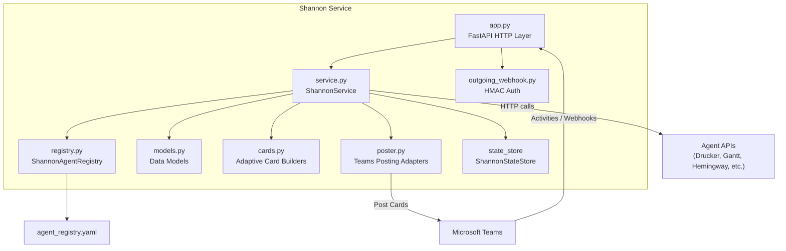
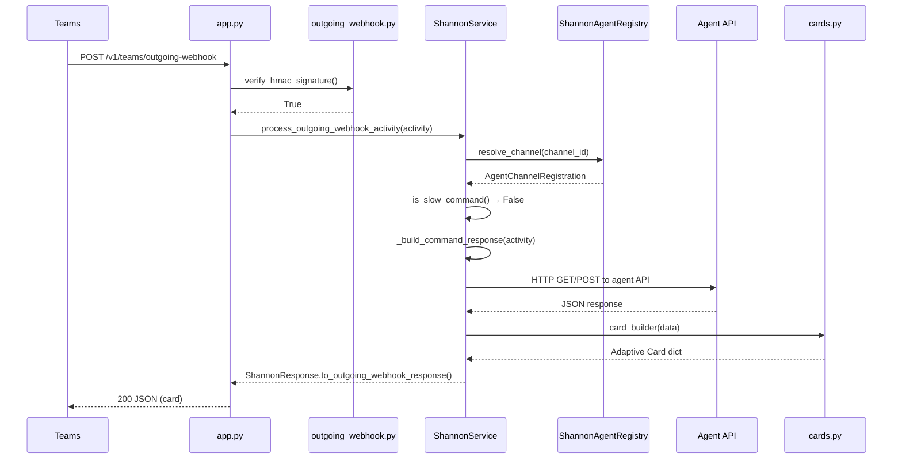
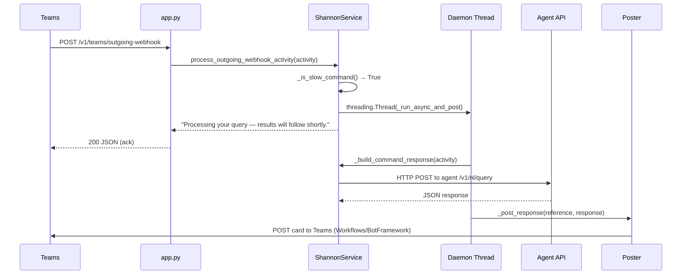
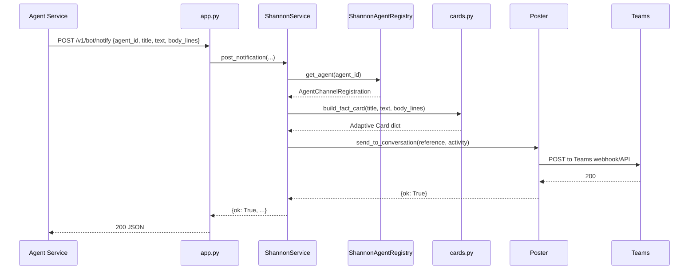

<!-- Generated by Documentation Agent — do not edit between markers -->

```yaml
---
title: "As-Built: Shannon"
date: "2026-04-03"
status: "draft"
---
```

# Shannon — Design Reference

## 1. Module Overview

Shannon is the communications gateway for the Cornelis agent workforce. It is a FastAPI service that acts as the single Microsoft Teams bot surface: it receives messages from Teams (via Bot Framework activities and Outgoing Webhooks), routes slash commands to the appropriate backend agent APIs (Drucker, Gantt, Hemingway, etc.), renders agent responses as Adaptive Cards, and posts notifications back to Teams channels. Shannon itself is stateless in the persistent sense — it keeps an in-memory audit log and conversation reference store — and is deterministic in v1 (no LLM token usage). The service is defined across seven source files under the `shannon/` package: `app.py` (HTTP layer), `service.py` (core routing logic), `registry.py` (agent/channel configuration), `models.py` (data structures), `cards.py` (Adaptive Card builders), `poster.py` (Teams posting adapters), and `outgoing_webhook.py` (HMAC authentication).

## 2. What Changed

### Before
- Jira ticket references in Adaptive Card text were rendered as plain text with no hyperlinks.
- The `build_drucker_summary_card` function accepted a simple summary dict with fields like `total_reports` and `total_findings`.
- Natural-language (`/ask`) commands and Gantt NL query cards did not exist.
- Outgoing Webhook processing was fully synchronous — slow commands blocked the HTTP response.
- Unknown commands in the Shannon channel returned a generic "unknown command" message with no cross-channel redirect hint.
- POST command parameter parsing always used positional key-value pair splitting, even for single-parameter commands.

### After
- All Adaptive Card text (fact values and body lines) is now auto-linkified: Jira ticket keys like `STL-1234` become clickable Markdown links via `_linkify_tickets()` in `cards.py`.
- `build_drucker_summary_card` now renders a richer card with `total_requests`, `total_errors`, per-category breakdowns, and PR reminder state.
- New card builders added: `build_gantt_nl_query_card`, `build_jira_query_card`, `build_jira_release_status_card`, `build_jira_ticket_counts_card`, `build_jira_status_report_card`, and `build_nl_query_card`.
- Slow commands (`/ask`, `/planning-snapshot`, `/release-monitor`, `/release-survey`, and free-text NL queries) are now deferred in the Outgoing Webhook path: Shannon returns an immediate acknowledgment and processes the command asynchronously on a daemon thread, posting results back via the configured poster.
- A `_find_command_owner` method redirects users who type a command in the wrong channel (e.g., typing `/hygiene` in `#agent-shannon` when it belongs to `#agent-drucker`).
- POST commands with a single required string parameter now join all trailing arguments into one value instead of treating them as key-value pairs.

### Impact
- **Teams users** see clickable Jira links in all card responses.
- **Outgoing Webhook consumers** receive faster acknowledgments for slow queries; results arrive as follow-up posts.
- **Agent integrations** for Drucker and Gantt gain `/ask` NL query routing and richer Jira-oriented card rendering.
- **Operators** must ensure the poster is configured for async follow-up posting (Workflows or BotFramework mode) if using the Outgoing Webhook path for slow commands.

## 3. Component Diagram



## 4. Key Flows

### Flow 1: Outgoing Webhook Command (Synchronous Fast Path)

A user @-mentions Shannon in a Teams channel. Teams sends an Outgoing Webhook POST. Shannon verifies the HMAC signature, resolves the channel to an agent, dispatches the command to the agent API, builds an Adaptive Card, and returns it synchronously.



The fast-path check happens in `_is_slow_command()` (`service.py`). Commands not in `_SLOW_COMMANDS` and starting with `/` take this path.

### Flow 2: Outgoing Webhook Command (Async Slow Path)

For commands in `_SLOW_COMMANDS` (`/ask`, `/planning-snapshot`, `/release-monitor`, `/release-survey`) or free-text NL queries, Shannon returns an immediate acknowledgment and spawns a daemon thread.



The thread is started in `process_outgoing_webhook_activity()`:

```python
thread = threading.Thread(
    target=self._run_async_and_post,
    args=(activity, agent_id, reference),
    daemon=True,
)
thread.start()
```

### Flow 3: Notification Posting via `/v1/bot/notify`

An agent service (e.g., Drucker) calls Shannon's notify endpoint to push an alert card into a Teams channel.



The `post_notification` method on `ShannonService` resolves the target channel from the agent registry, builds a fact card, and delegates to the configured poster.

## 5. Data Model

### `AgentChannelRegistration` (`models.py`)

Maps a Teams channel to a backend agent. Loaded from `agent_registry.yaml` by `ShannonAgentRegistry`.

```python
@dataclass
class AgentChannelRegistration:
    agent_id: str
    display_name: str
    role: str
    description: str
    zone: str = 'service_infrastructure'
    channel_id: str = ''
    channel_name: str = ''
    team_id: str = ''
    api_base_url: str = ''
    custom_commands: List[Dict[str, Any]] = field(default_factory=list)
    timeout_seconds: int = 30
    # ... additional fields
```

### `ConversationReference` (`models.py`)

Captures the Teams conversation context from an inbound activity. Used by posters to address replies.

Key fields: `service_url`, `channel_id`, `conversation_id`, `tenant_id`, `reply_to_id`, `user_id`, `bot_id`.

Factory method `from_activity()` extracts these from a raw Teams activity dict, navigating `channelData.team`, `channelData.channel`, `channelData.tenant`, `conversation`, `from`, and `recipient`.

### `AuditRecord` (`models.py`)

Immutable record of a Shannon event or routing decision. Stored in `ShannonStateStore` (in-memory). Fields include `record_id` (8-char UUID prefix), `event_type`, `status`, `command`, `decision`, and a freeform `details` dict.

### `ShannonResponse` (`models.py`)

Internal response object carrying `text`, an optional Adaptive Card `card`, the resolved `command` and `decision` labels, and arbitrary `metadata`. Provides two serialization methods:

- `to_message_activity()` — Bot Framework activity shape
- `to_outgoing_webhook_response()` — adds `contentUrl`, `name`, `thumbnailUrl` nulls required by the Outgoing Webhook contract

### Command Text Normalization (`models.py`)

```python
MENTION_RE = re.compile(r'<at>.*?</at>', re.IGNORECASE | re.DOTALL)
TAG_RE = re.compile(r'<[^>]+>')

def normalize_command_text(text: str) -> str:
    clean = MENTION_RE.sub(' ', str(text or ''))
    clean = TAG_RE.sub(' ', clean)
    clean = clean.replace('&nbsp;', ' ')
    clean = re.sub(r'\s+', ' ', clean).strip()
    return clean
```

Strips `<at>Shannon</at>` mention markup and HTML tags, collapses whitespace.

## 6. Dependencies

| Dependency | Purpose | Version |
|---|---|---|
| `fastapi` | HTTP framework for all Shannon endpoints | Not pinned in source |
| `pydantic` | Request body validation (`NotificationRequest`) | Not pinned in source |
| `uvicorn` | ASGI server (used in `run()`) | Not pinned in source |
| `requests` | HTTP client for agent API calls and Bot Framework token exchange | Not pinned in source |
| `pyyaml` | Loading `agent_registry.yaml` | Not pinned in source |
| `python-dotenv` | `.env` file loading at import time in `app.py` | Not pinned in source |
| `agents.rename_registry` | `canonical_agent_name()` and `agent_display_name()` for agent ID normalization | Internal |
| `agents.shannon.state_store` | `ShannonStateStore` — in-memory audit and stats store | Internal |
| `config.env_loader` | `resolve_dry_run()` — dry-run flag resolution | Internal |

## 7. Configuration

| Variable | Purpose | Default |
|---|---|---|
| `SHANNON_HOST` | Bind address for uvicorn | `0.0.0.0` |
| `SHANNON_PORT` | Bind port for uvicorn | `8200` |
| `SHANNON_TEAMS_BOT_NAME` | Display name used in health responses | `Shannon` |
| `SHANNON_AGENT_REGISTRY_PATH` | Path to `agent_registry.yaml` | `config/shannon/agent_registry.yaml` |
| `SHANNON_TEAMS_POST_MODE` | Poster backend: `memory`, `workflows`, or `botframework` | `memory` |
| `SHANNON_TEAMS_WORKFLOWS_WEBHOOK_URL` | Workflows incoming webhook URL (when mode=`workflows`) | — |
| `SHANNON_TEAMS_APP_ID` | Azure Bot app ID (when mode=`botframework`) | — |
| `SHANNON_TEAMS_APP_PASSWORD` | Azure Bot app password (when mode=`botframework`) | — |
| `SHANNON_TEAMS_OUTGOING_WEBHOOK_SECRET` | Base64-encoded HMAC secret for Outgoing Webhook verification | — |
| `SHANNON_SEND_WELCOME_ON_INSTALL` | Send welcome card on `installationUpdate` activity | `true` |
| `{AGENT_ID}_API_URL` | Per-agent API base URL override (e.g., `DRUCKER_API_URL`) | — |
| `DRY_RUN` | Global dry-run flag (resolved by `config.env_loader`) | — |

The YAML registry file (`agent_registry.yaml`) defines the `agents` list, each entry mapping to an `AgentChannelRegistration`. Environment variable overrides for `api_base_url` are applied at registry load time in `ShannonAgentRegistry.reload()`.

## 8. Error Handling

**HMAC Verification** — `outgoing_webhook.py` provides `verify_hmac_signature()` which uses `hmac.compare_digest` for timing-safe comparison. On failure, `app.py` returns HTTP 401:

```python
if not verify_hmac_signature(authorization, secret, body_bytes):
    raise HTTPException(status_code=401, detail='Invalid outgoing webhook signature')
```

**Agent API Calls** — `_call_agent_api()` in `service.py` wraps `requests` calls. Failures are caught and returned as error dicts:

```python
except requests.RequestException as exc:
    log.warning(...)
    return {'ok': False, 'error': str(exc), ...}
```

The `_agent_response_to_shannon()` method checks for `ok: False` in agent responses and builds error cards accordingly.

**Activity Processing** — Both `/api/messages` and `/v1/teams/outgoing-webhook` catch broad `Exception` at the endpoint level, log the traceback, and return HTTP 500.

**Notification Posting** — `bot_notify` catches `ValueError` (e.g., missing agent) and returns HTTP 400.

**Async Thread Errors** — `_run_async_and_post()` wraps its entire body in a try/except, logging failures but not propagating them (fire-and-forget):

```python
except Exception:
    log.exception('Async outgoing webhook handler failed for %s', agent_id)
```

**Registry Loading** — `ShannonAgentRegistry.reload()` raises `FileNotFoundError` if the YAML file is missing, which will crash the service at startup — this is intentional (fail-fast).

## 9. Known Limitations / Technical Debt

1. **`service.py` is a God class candidate.** `ShannonService` contains command routing, agent API dispatch, card builder selection, notification posting, status reporting, and async thread management. The file imports 30+ card builders and contains large routing tables (`STANDARD_COMMAND_ROUTES`, `CARD_BUILDERS`). While the public method count is moderate, the file likely exceeds 500 lines with high internal complexity.

2. **Hardcoded Jira base URL.** `cards.py` contains `_JIRA_BASE = 'https://cornelisnetworks.atlassian.net/browse'`. This should be configurable for portability.

3. **Hardcoded project key in NL fallback.** In `_handle_registered_agent_command()`, the NL query fallback passes `'project_key': 'STL'` as a hardcoded default:
   ```python
   json_body={'query': command_text, 'project_key': 'STL'},
   ```

4. **No token refresh for `BotFrameworkPoster`.** The `_get_access_token()` method caches the token indefinitely (`self._access_token`). Bot Framework tokens expire (typically after 1 hour), but there is no expiry check or refresh logic.

5. **Daemon threads for async commands have no backpressure.** Each slow command spawns a new `threading.Thread` with no pool, queue, or concurrency limit. Under load, this could create unbounded threads.

6. **`cards.py` source is truncated in the provided files.** Several card builder functions referenced in `service.py` imports (e.g., `build_ci_failures_card`, `build_hemingway_doc_card`, `build_pr_list_card`, `build_stale_branches_card`, etc.) are not visible in the provided source. The `build_pr_stale_card` function is cut off mid-body. Documentation of these builders is based on their usage patterns in `service.py`.

7. **Missing error handling on poster HTTP calls.** `WorkflowsPoster._post()` calls `response.raise_for_status()` which raises `requests.HTTPError`, but this is not caught within the poster — it propagates up to the caller. In the async thread path, this is caught by the broad except in `_run_async_and_post()`, but error details are only logged, not recorded as audit records.

8. **In-memory state store.** `ShannonStateStore` (imported from `agents.shannon.state_store`) is in-memory. All audit records, conversation references, and stats are lost on service restart.

9. **Duplicate NL query card builders.** `build_gantt_nl_query_card` and `build_nl_query_card` in `cards.py` have nearly identical implementations — the only difference is the card title (`'Gantt Query Result'` vs. `'Drucker Query Result'`). This is a candidate for consolidation.

<!-- End Documentation Agent generated content -->