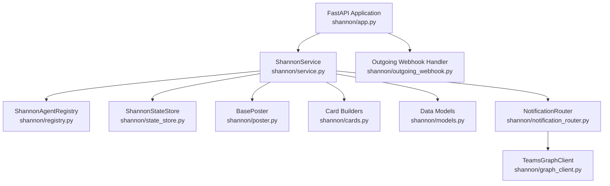
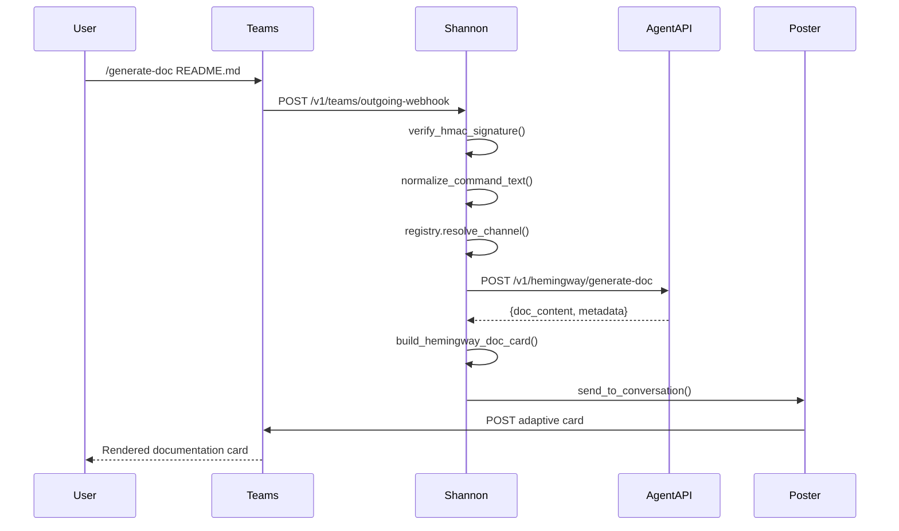
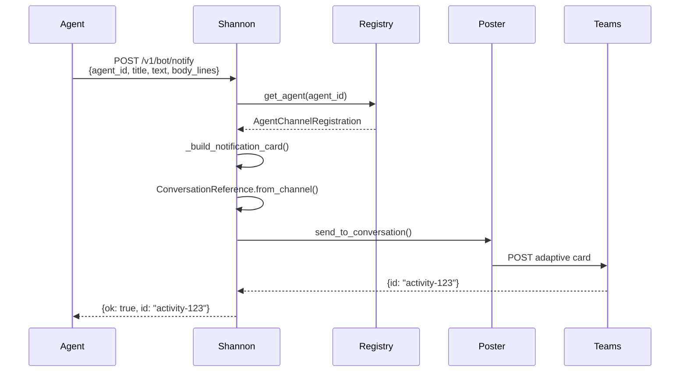
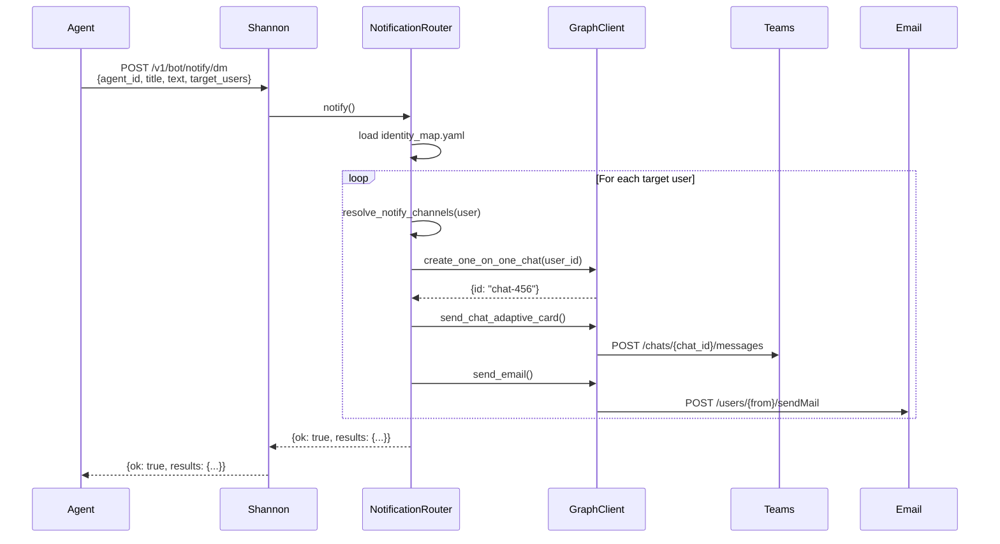

<!-- Generated by Documentation Agent — do not edit between markers -->

```yaml
---
title: "As-Built: Shannon Communications Agent"
date: "2026-04-08"
status: "draft"
---
```

## Module Overview

Shannon is a Microsoft Teams bot service that acts as a unified communications gateway for the Cornelis agent workforce. It routes slash commands from Teams channels to registered agent APIs, renders agent responses as Adaptive Cards, and posts notifications to Teams channels via multiple delivery mechanisms (Bot Framework, Workflows webhooks, or in-memory for testing). Shannon maintains a registry mapping Teams channels to agents, tracks conversation state for multi-turn interactions, and provides observability endpoints for service health, throughput statistics, and routing decisions.

## What Changed

**Before:** Shannon posted notifications using a simple fact-based Adaptive Card builder (`build_fact_card`) that rendered body lines as plain text blocks.

**After:** Shannon now uses a specialized `_build_notification_card` method that detects URLs in notification body lines and renders them as clickable `RichTextBlock` elements with accent-colored text. This improves the user experience for notifications containing GitHub PR links, Jira tickets, or other web resources.

**Impact:** All agents posting notifications via Shannon's `/v1/bot/notify` endpoint now benefit from automatic URL linkification. Users can click directly on PR or issue links without copying and pasting. The change is backward-compatible — notifications without URLs render as before.

## Component Diagram



## Key Flows

### Flow 1: Teams Command Routing

A user sends a slash command in a Teams channel. Shannon resolves the channel to an agent, forwards the command to the agent's API, and posts the response as an Adaptive Card.



**Description:** Shannon extracts the command text, strips Teams mention markup, resolves the channel to an agent registration, and forwards the command with typed parameters to the agent's API. The agent's JSON response is converted to an Adaptive Card and posted back to the conversation.

### Flow 2: Agent Notification Posting

An agent posts a notification to a Teams channel via Shannon's `/v1/bot/notify` endpoint.



**Description:** Shannon looks up the agent's channel registration, builds an Adaptive Card with URL linkification, retrieves the stored conversation reference for the channel, and posts the card via the configured poster (Workflows webhook or Bot Framework).

### Flow 3: Multi-Channel DM + Email Notification

An agent sends a notification to multiple users via Teams DM and email using the `NotificationRouter`.



**Description:** The `NotificationRouter` reads `identity_map.yaml` to determine each user's preferred notification channels (`teams_dm`, `email`). For Teams DMs, it uses the Graph API to create or retrieve a 1:1 chat and posts an Adaptive Card. For email, it sends an HTML-formatted message via the Graph API's `sendMail` endpoint.

## Data Model

### Core Data Structures

**`AgentChannelRegistration`** (shannon/models.py)
- Maps a Teams channel to an agent's API endpoint and metadata.
- Fields: `agent_id`, `display_name`, `role`, `description`, `zone`, `channel_id`, `channel_name`, `team_id`, `api_base_url`, `icon_url`, `notifications_webhook_url`, `approval_types`, `custom_commands`, `timeout_seconds`.

**`ConversationReference`** (shannon/models.py)
- Persists Teams conversation context for replies and notifications.
- Fields: `reference_id`, `captured_at`, `agent_id`, `service_url`, `channel_id`, `channel_name`, `team_id`, `tenant_id`, `conversation_id`, `conversation_type`, `reply_to_id`, `user_id`, `user_name`, `bot_id`, `bot_name`, `raw_activity_type`.

**`AuditRecord`** (shannon/models.py)
- Tracks Shannon events and routing decisions for observability.
- Fields: `record_id`, `timestamp`, `event_type`, `status`, `agent_id`, `channel_id`, `conversation_id`, `team_id`, `user_id`, `user_name`, `command`, `decision`, `details`.

**`ShannonResponse`** (shannon/models.py)
- Encapsulates a Shannon reply before posting to Teams.
- Fields: `text`, `card`, `command`, `decision`, `metadata`.
- Methods: `to_message_activity()`, `to_outgoing_webhook_response()`.

**`ConversationState`** (shannon/models.py)
- Tracks in-progress Q&A conversations for commands with missing parameters.
- Fields: `state_id`, `user_id`, `agent_id`, `command`, `collected_params`, `remaining_params`, `created_at`, `channel_id`.

### State Storage

Shannon uses `ShannonStateStore` (shannon/state_store.py) to maintain in-memory state:
- `_conversation_references`: Maps channel/conversation IDs to `ConversationReference` objects.
- `_audit_records`: List of `AuditRecord` objects for observability.
- `_conversation_states`: Maps state IDs to `ConversationState` objects for multi-turn interactions.

## Dependencies

| Dependency | Purpose | Version |
|------------|---------|---------|
| `fastapi` | Web framework for REST API | (runtime) |
| `pydantic` | Request/response validation | (runtime) |
| `requests` | HTTP client for agent API calls | (runtime) |
| `pyyaml` | Agent registry and identity map parsing | (runtime) |
| `uvicorn` | ASGI server | (runtime) |
| `python-dotenv` | Environment variable loading | (runtime) |
| `agents.rename_registry` | Agent name canonicalization | Internal |
| `agents.shannon.graph_client` | Microsoft Graph API client | Internal |
| `config.env_loader` | Dry-run flag resolution | Internal |

## Configuration

### Environment Variables

| Variable | Purpose | Default |
|----------|---------|---------|
| `SHANNON_HOST` | FastAPI bind address | `0.0.0.0` |
| `SHANNON_PORT` | FastAPI bind port | `8200` |
| `SHANNON_TEAMS_POST_MODE` | Poster implementation (`memory`, `workflows`, `botframework`) | `memory` |
| `SHANNON_TEAMS_WORKFLOWS_WEBHOOK_URL` | Workflows incoming webhook URL | (required if mode=workflows) |
| `SHANNON_TEAMS_APP_ID` | Azure Bot Framework app ID | (required if mode=botframework) |
| `SHANNON_TEAMS_APP_PASSWORD` | Azure Bot Framework app password | (required if mode=botframework) |
| `SHANNON_TEAMS_OUTGOING_WEBHOOK_SECRET` | HMAC secret for outgoing webhook verification | (required) |
| `SHANNON_TEAMS_BOT_NAME` | Bot display name | `Shannon` |
| `SHANNON_SEND_WELCOME_ON_INSTALL` | Send welcome card on bot install | `true` |
| `SHANNON_AGENT_REGISTRY_PATH` | Path to agent registry YAML | `config/shannon/agent_registry.yaml` |
| `CONFIG_DIR` | Base directory for config files | `config` |
| `NOTIFICATION_EMAIL_FROM` | Default from-address for email notifications | `shannon@cornelisnetworks.com` |
| `{AGENT_ID}_API_URL` | Override API base URL for an agent (e.g., `DRUCKER_API_URL`) | (optional) |

### Configuration Files

**`config/shannon/agent_registry.yaml`**
- Defines agent-to-channel mappings and API endpoints.
- Schema: `agents: [{agent_id, display_name, role, description, zone, channel_id, channel_name, team_id, api_base_url, icon_url, notifications_webhook_url, approval_types, custom_commands, timeout_seconds}]`.

**`config/identity_map.yaml`**
- Maps GitHub logins to Teams/Jira/email identities and notification preferences.
- Schema: `users: {<github_login>: {email, teams_email, jira_account_id, notify_via: [teams_dm, email]}}`.

## Error Handling

Shannon uses a layered error handling strategy:

1. **HMAC Verification Failures** (shannon/outgoing_webhook.py)
   - `verify_hmac_signature()` returns `False` if the signature is invalid.
   - FastAPI endpoint raises `HTTPException(401)` and logs the failure.

2. **Agent API Failures** (shannon/service.py)
   - `_forward_to_agent()` catches `requests.RequestException` and returns a fallback `ShannonResponse` with error details.
   - Audit record is created with `status='error'`.

3. **Posting Failures** (shannon/poster.py)
   - `BotFrameworkPoster` and `WorkflowsPoster` raise `requests.HTTPError` on non-2xx responses.
   - Caller logs the exception and returns an error response to the user.

4. **Registry Lookup Failures** (shannon/service.py)
   - `registry.resolve_channel()` returns `None` if no matching registration is found.
   - Shannon posts a fallback card: "No agent is registered for this channel."

5. **Notification Router Failures** (shannon/notification_router.py)
   - Per-user, per-channel errors are caught and logged.
   - Results dict includes `{<github_login>: {<channel>: {error: <message>}}}`.

## Known Limitations / Technical Debt

### Hardcoded Values
- **Jira Base URL**: `_JIRA_BASE = 'https://cornelisnetworks.atlassian.net/browse'` in `shannon/cards.py` (line 18).
- **Bot Framework Token URL**: `TOKEN_URL = 'https://login.microsoftonline.com/botframework.com/oauth2/v2.0/token'` in `shannon/poster.py` (line 145).

### Missing Implementations
- **Token Refresh**: `BotFrameworkPoster._get_access_token()` does not cache or refresh tokens. Every request fetches a new token, which is inefficient and may hit rate limits.
- **Conversation State Expiry**: `ConversationState` objects are stored in-memory indefinitely. No TTL or cleanup mechanism exists.
- **Audit Record Retention**: `ShannonStateStore._audit_records` grows unbounded. No rotation or archival strategy is implemented.

### Circular Dependencies
- `shannon.notification_router` imports `agents.shannon.graph_client`, which is not shown in the provided source files. This creates a potential circular dependency if `graph_client` imports from `shannon`.

### God Classes
- **`ShannonService`** (shannon/service.py): 1300+ lines with 30+ public methods. Responsibilities include command routing, card building, notification posting, state management, and observability. Consider splitting into:
  - `CommandRouter` (routing and agent API calls)
  - `CardRenderer` (Adaptive Card generation)
  - `NotificationService` (posting and delivery)
  - `ObservabilityService` (stats, audit, decisions)

### Error Handling Gaps
- **Missing Timeout Handling**: `requests.post()` calls in `_forward_to_agent()` use `timeout=registration.timeout_seconds`, but no retry logic exists for transient failures.
- **No Validation on Agent Responses**: `_forward_to_agent()` assumes agent APIs return well-formed JSON. Malformed responses will raise `JSONDecodeError` and crash the request.

### Technical Debt
- **URL Regex in `_build_notification_card`**: The regex `r'(https?://\S+)'` is overly broad and may match URLs embedded in code snippets or JSON. Consider using a more restrictive pattern or a URL parsing library.
- **Duplicate Card Builders**: `shannon/cards.py` contains 20+ card builder functions with similar structure. Refactor to a template-based system or a single `build_card()` function with a schema parameter.
- **In-Memory State**: `ShannonStateStore` is not persistent. Service restarts lose all conversation references and audit records. Consider migrating to Redis or a database.

<!-- End Documentation Agent generated content -->