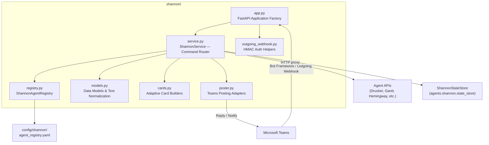
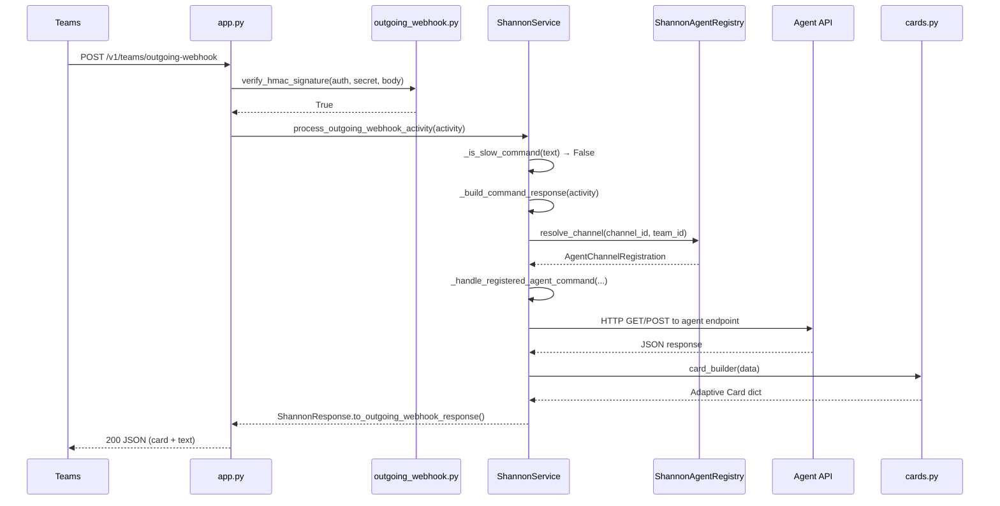
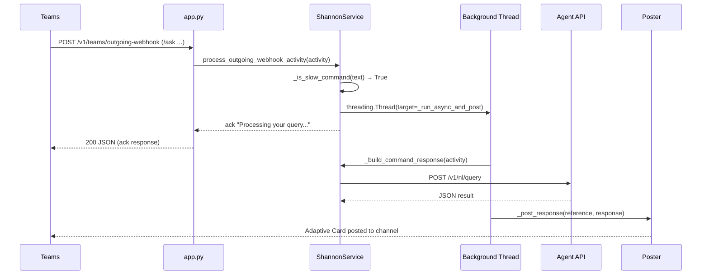
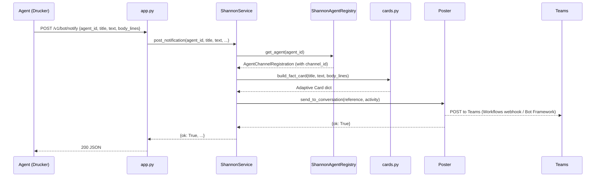

<!-- Generated by Documentation Agent — do not edit between markers -->

```yaml
---
title: "As-Built: Shannon — Communications Agent"
date: "2026-04-03"
status: "draft"
---
```

## Module Overview

Shannon is the single Microsoft Teams bot and routing surface for the Cornelis agent workforce. It receives commands from Teams users — via Bot Framework activities, outgoing webhooks, or direct API calls — normalizes them, resolves the target agent from a YAML-based channel-to-agent registry, proxies the request to that agent's REST API, and renders the response as an Adaptive Card posted back to the originating Teams channel. Shannon also provides its own introspection commands (`/stats`, `/busy`, `/work-today`, `/decision-tree`, `/why`), a notification endpoint for agents to push alerts into Teams, and an audit trail of every routing decision it makes. The module lives under `shannon/` and is composed of seven source files: `app.py` (FastAPI application factory), `service.py` (core routing and orchestration logic), `registry.py` (YAML agent registry loader), `models.py` (data models and text normalization), `cards.py` (Adaptive Card builders), `poster.py` (Teams posting adapters), and `outgoing_webhook.py` (HMAC authentication helpers).

## What Changed

**Before:** Fact-set values and body-line text in Adaptive Cards were rendered as plain strings. The Drucker `/stats` card showed a minimal four-field summary (`total_reports`, `projects_analyzed`, `total_findings`, `proposed_actions`). There was no natural-language query (`/ask`) support for Drucker or Gantt agents. Unknown commands in the Shannon channel returned a generic "unknown command" message with no cross-channel redirect. Slow commands were handled synchronously through the outgoing webhook path, risking Teams' response timeout. POST commands with a single required string parameter were split into key-value pairs, breaking free-text queries.

**After:** All text rendered through `build_fact_card` — both fact values and body lines — is now auto-linkified: Jira ticket keys (e.g. `STL-1234`) are converted to clickable Markdown links via `_linkify_tickets()`. The Drucker `/stats` card now renders the richer `ShannonStateStore` statistics shape (`total_requests`, `total_errors`, `by_category` breakdown, PR reminder counts). New card builders exist for Jira queries (`build_jira_query_card`, `build_jira_release_status_card`, `build_jira_ticket_counts_card`, `build_jira_status_report_card`), natural-language queries (`build_nl_query_card`, `build_gantt_nl_query_card`), and the service routes them via new `/ask` command mappings. A `_find_command_owner()` method now redirects users who type a command in the wrong channel. Slow commands (`/ask`, `/planning-snapshot`, `/release-monitor`, `/release-survey`, and any non-slash free-text) are deferred to a background `threading.Thread` in the outgoing webhook path, returning an immediate acknowledgment. Single-required-string-parameter POST commands now join all trailing arguments into one string instead of pairing them.

**Impact:** Any agent that posts notifications through Shannon benefits from automatic Jira ticket linkification. Drucker and Gantt users can now issue free-text queries from Teams. The async outgoing webhook path prevents Teams from timing out on long-running agent calls. The wrong-channel redirect improves discoverability across agent channels.

## Component Diagram



## Key Flows

### Flow 1: Outgoing Webhook Command (Synchronous Fast Path)

A Teams user @-mentions Shannon in a channel. Teams sends an outgoing webhook POST to `/v1/teams/outgoing-webhook`. Shannon verifies the HMAC signature, resolves the agent from the channel, dispatches the command to the agent API, builds an Adaptive Card, and returns the response synchronously.



The fast-path decision is made in `_is_slow_command()` (`service.py`). Commands not in `_SLOW_COMMANDS` and starting with `/` take this path:

```python
_SLOW_COMMANDS = frozenset({'/ask', '/planning-snapshot', '/release-monitor', '/release-survey'})

def _is_slow_command(self, command_text: str) -> bool:
    parts = normalize_command_text(command_text).split()
    command = parts[0].lower() if parts else ''
    if command in self._SLOW_COMMANDS:
        return True
    if not command.startswith('/'):
        return True
    return False
```

### Flow 2: Outgoing Webhook Command (Async Slow Path)

When a user issues a slow command (e.g., `/ask how many open bugs in STL?`), Shannon returns an immediate acknowledgment to Teams and processes the command in a background thread, posting the result back via the configured poster.



The thread is spawned in `process_outgoing_webhook_activity()`:

```python
thread = threading.Thread(
    target=self._run_async_and_post,
    args=(activity, agent_id, reference),
    daemon=True,
)
thread.start()
ack = ShannonResponse(
    text='Processing your query — results will follow shortly.',
    decision='deferred_slow_command',
)
return ack.to_outgoing_webhook_response()
```

### Flow 3: Agent Notification Push

An agent (e.g., Drucker) calls Shannon's `/v1/bot/notify` endpoint to push an alert into a Teams channel. Shannon resolves the target channel from the agent registry, builds a fact card, and posts it via the configured poster.



## Data Model

### `AgentChannelRegistration` (`models.py`)

Maps a Teams channel to an agent. Loaded from `agent_registry.yaml` by `ShannonAgentRegistry`.

```python
@dataclass
class AgentChannelRegistration:
    agent_id: str
    display_name: str
    role: str
    description: str
    zone: str = 'service_infrastructure'
    channel_id: str = ''
    channel_name: str = ''
    team_id: str = ''
    api_base_url: str = ''
    icon_url: str = ''
    notifications_webhook_url: str = ''
    approval_types: List[str] = field(default_factory=list)
    custom_commands: List[Dict[str, Any]] = field(default_factory=list)
    timeout_seconds: int = 30
```

### `ConversationReference` (`models.py`)

Captures the full Teams conversation context from an inbound activity, enabling Shannon to reply or post back later. Extracted via `ConversationReference.from_activity()`.

Key fields: `service_url`, `channel_id`, `team_id`, `tenant_id`, `conversation_id`, `reply_to_id`, `user_id`, `bot_id`.

### `AuditRecord` (`models.py`)

Every routing decision, notification post, and error is recorded as an `AuditRecord` with a short UUID `record_id`, timestamp, event type, status, and free-form `details` dict. Stored in `ShannonStateStore` and queryable via `/v1/status/decisions`.

### `ShannonResponse` (`models.py`)

Internal response object carrying `text`, an optional Adaptive Card `card`, the resolved `command` and `decision` labels, and arbitrary `metadata`. Provides `to_message_activity()` for Bot Framework and `to_outgoing_webhook_response()` for outgoing webhooks (which adds `contentUrl`, `name`, `thumbnailUrl` fields to attachments).

### Text Normalization

`normalize_command_text()` strips Teams `<at>...</at>` mention markup, HTML tags, `&nbsp;`, and collapses whitespace:

```python
MENTION_RE = re.compile(r'<at>.*?</at>', re.IGNORECASE | re.DOTALL)
TAG_RE = re.compile(r'<[^>]+>')

def normalize_command_text(text: str) -> str:
    clean = MENTION_RE.sub(' ', str(text or ''))
    clean = TAG_RE.sub(' ', clean)
    clean = clean.replace('&nbsp;', ' ')
    clean = re.sub(r'\s+', ' ', clean).strip()
    return clean
```

## Dependencies

| Dependency | Purpose | Version |
|---|---|---|
| `fastapi` | HTTP framework for all Shannon endpoints | (project-managed) |
| `pydantic` | Request body validation (`NotificationRequest`) | (bundled with FastAPI) |
| `uvicorn` | ASGI server for `run()` entrypoint | (project-managed) |
| `requests` | HTTP client for agent API calls and Bot Framework token exchange | (project-managed) |
| `pyyaml` | YAML parsing for `agent_registry.yaml` | (project-managed) |
| `python-dotenv` | `.env` file loading in `app.py` | (project-managed) |
| `agents.rename_registry` | `canonical_agent_name()` and `agent_display_name()` for agent ID normalization | Internal |
| `agents.shannon.state_store` | `ShannonStateStore` for audit records and statistics | Internal |
| `config.env_loader` | `resolve_dry_run()` for dry-run mode resolution | Internal |

## Configuration

| Variable | Default | Description |
|---|---|---|
| `SHANNON_HOST` | `0.0.0.0` | Bind address for uvicorn |
| `SHANNON_PORT` | `8200` | Listen port |
| `SHANNON_TEAMS_BOT_NAME` | `Shannon` | Display name used in responses |
| `SHANNON_SEND_WELCOME_ON_INSTALL` | `true` | Whether to post a welcome card on `installationUpdate` |
| `SHANNON_TEAMS_POST_MODE` | `memory` | Poster backend: `memory`, `workflows`, or `botframework` |
| `SHANNON_TEAMS_WORKFLOWS_WEBHOOK_URL` | *(none)* | Workflows incoming webhook URL (when mode=`workflows`) |
| `SHANNON_TEAMS_APP_ID` | *(none)* | Azure Bot registration app ID (when mode=`botframework`) |
| `SHANNON_TEAMS_APP_PASSWORD` | *(none)* | Azure Bot registration app secret (when mode=`botframework`) |
| `SHANNON_TEAMS_OUTGOING_WEBHOOK_SECRET` | *(none)* | Base64-encoded HMAC secret for outgoing webhook verification |
| `SHANNON_AGENT_REGISTRY_PATH` | `config/shannon/agent_registry.yaml` | Path to the agent registry YAML |
| `{AGENT_ID}_API_URL` | *(none)* | Per-agent override for `api_base_url` (e.g. `DRUCKER_API_URL`) |
| `DRY_RUN` | *(from env_loader)* | Global dry-run flag respected by all posters |

## Error Handling

**HMAC verification** (`outgoing_webhook.py`): `verify_hmac_signature()` returns `False` on empty headers, missing secrets, or mismatched digests. The endpoint raises `HTTPException(401)`.

**Agent API calls** (`service.py`, `_call_agent_api()`): Wraps `requests.get()`/`requests.post()` in a try/except. On `requests.RequestException`, returns `{'ok': False, 'error': str(exc)}` which `_agent_response_to_shannon()` converts to a user-facing error card. Timeouts are set per-agent via `registration.timeout_seconds` (default 30s).

**Bot Framework token exchange** (`poster.py`, `BotFrameworkPoster._get_access_token()`): Calls `response.raise_for_status()` and raises `RuntimeError` if the token response lacks `access_token`.

**Activity processing** (`app.py`): Both `/api/messages` and `/v1/teams/outgoing-webhook` catch broad `Exception` at the endpoint level, log the traceback, and return `HTTPException(500)`.

**Async thread failures** (`service.py`, `_run_async_and_post()`): Catches all exceptions and logs them; the user has already received the acknowledgment, so failures are silent from the Teams perspective.

**Notification endpoint** (`app.py`, `/v1/bot/notify`): Catches `ValueError` from `post_notification()` and returns `HTTPException(400)`.

## Known Limitations / Technical Debt

1. **Hardcoded Jira base URL** — `_JIRA_BASE` in `cards.py` is hardcoded to `https://cornelisnetworks.atlassian.net/browse`. Multi-tenant or alternate Jira instances would require configuration.

2. **No token expiry handling in `BotFrameworkPoster`** — `_access_token` is cached indefinitely after the first fetch. If the token expires (typically 1 hour), all subsequent Bot Framework calls will fail until the service restarts. The field `_access_token` is never invalidated.

3. **Daemon threads for slow commands** — `_run_async_and_post()` runs in a `threading.Thread(daemon=True)`. If the process shuts down while a slow command is in flight, the thread is killed silently with no retry or persistence. There is no thread pool or concurrency limit.

4. **`service.py` is a potential god class** — `ShannonService` contains all command routing, agent API proxying, card selection, notification posting, and audit recording. The file imports over 20 card builders and contains large dispatch tables (`CARD_BUILDERS`, `STANDARD_COMMAND_ROUTES`). While the public method count is within bounds, the file is likely to exceed 500 lines as more agents are added.

5. **Duplicate `/ask` handling** — `_agent_response_to_shannon()` has nearly identical blocks for Drucker `/ask` and Gantt `/ask` (lines differ only in the agent ID check). This should be consolidated.

6. **Missing error handling on `request.json()` in outgoing webhook** — While there is a try/except for JSON parsing, the `body_bytes` used for HMAC verification and the subsequent `request.json()` call read the body twice (once as bytes, once as JSON). FastAPI handles this correctly, but the pattern is fragile.

7. **Hardcoded `project_key: 'STL'`** — The natural-language fallback in `_handle_registered_agent_command()` hardcodes `'STL'` as the project key for NL queries: `json_body={'query': command_text, 'project_key': 'STL'}`.

8. **`WorkflowsPoster` does not support threading** — `reply_to_activity()` logs a debug message noting threading is unsupported and posts as a new message. This means async slow-command replies via Workflows appear as top-level messages, not threaded replies.

9. **`__init__.py` exports nothing** — `__all__ = []` means `from shannon import *` imports nothing. All consumers must use explicit imports.

<!-- End Documentation Agent generated content -->