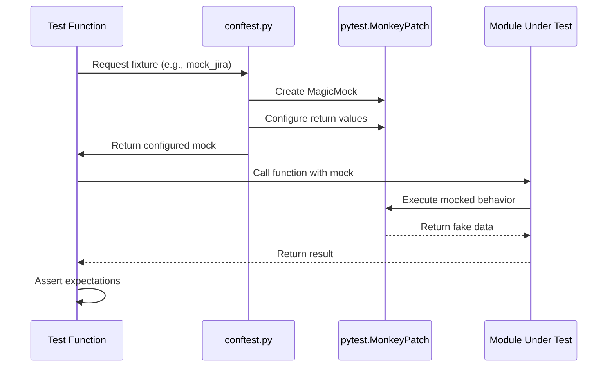
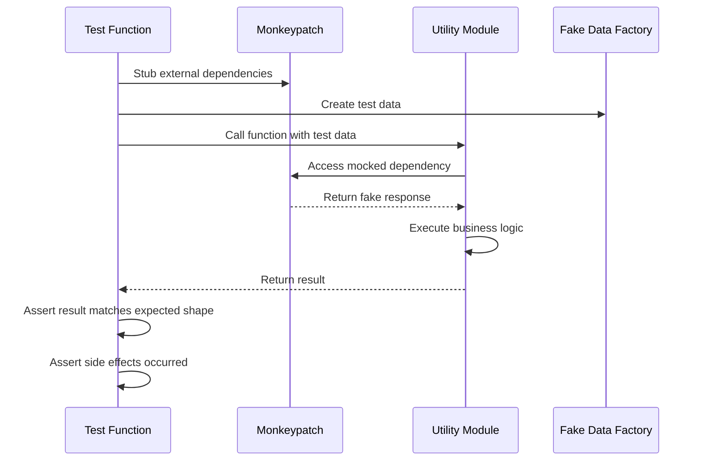
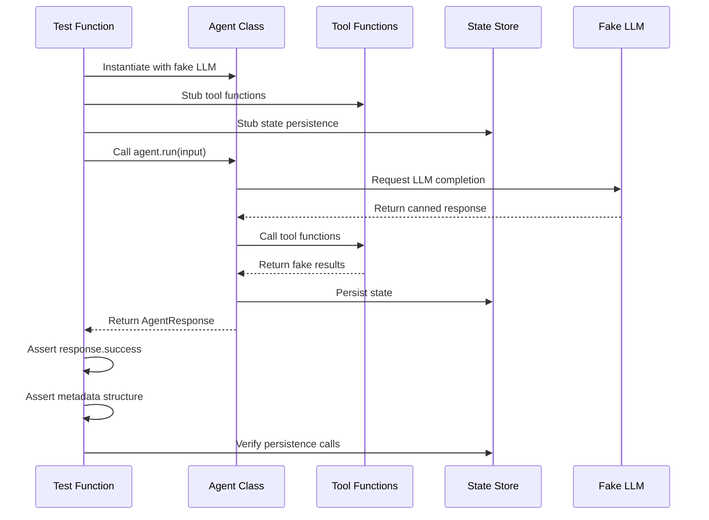

<!-- Generated by Documentation Agent — do not edit between markers -->

```yaml
---
title: "As-Built: Tests — Design Reference"
date: "2026-04-06"
status: "draft"
---
```

# Module Overview

The `tests/` directory contains the comprehensive characterization test suite for the Cornelis Networks agent workforce system. This suite validates all core modules, agents, tools, integrations, and infrastructure components through 10,000+ test cases organized into 50+ test modules. The tests follow a strict "no live API calls" policy, using monkeypatching and fake fixtures to ensure fast, deterministic execution. The suite covers Jira/Confluence utilities, GitHub integrations, agent orchestration (Drucker, Gantt, Hemingway), Shannon bot service, MCP server tools, and all supporting infrastructure.

# What Changed

**Before:** The test suite had a gap in `test_jira_utils_coverage.py` where the `mock_jira.issue.side_effect` lambda did not accept the `fields` parameter, causing potential test failures when the underlying code passed that parameter.

**After:** The lambda now accepts `fields=None` as a parameter, matching the actual signature of the `jira.issue()` method and preventing parameter mismatch errors.

**Impact:** This change affects only the test suite's internal mocking infrastructure. No production code or external components are impacted. The fix ensures test stability when `jira_utils.get_children_hierarchy()` calls `jira.issue()` with the `fields` parameter.

# Component Diagram

```mermaid
graph TB
    subgraph "Test Infrastructure"
        conftest[conftest.py<br/>Shared Fixtures]
        smoke[test_smoke.py<br/>Import Validation]
    end
    
    subgraph "Core Module Tests"
        jira_utils[test_jira_utils_char.py<br/>Jira Utilities]
        confluence[test_confluence_utils_char.py<br/>Confluence Utilities]
        excel[test_excel_utils_char.py<br/>Excel Operations]
        core_queries[test_core_queries_coverage.py<br/>JQL Query Builder]
        core_tickets[test_core_tickets.py<br/>Ticket Normalization]
    end
    
    subgraph "Agent Tests"
        drucker[test_drucker_agent_char.py<br/>Drucker Hygiene Agent]
        gantt[test_gantt_agent_char.py<br/>Gantt Planning Agent]
        hemingway[test_hemingway_agent_char.py<br/>Hemingway Documentation Agent]
        review[test_agents_char.py<br/>Review Agent]
    end
    
    subgraph "Integration Tests"
        github[test_github_utils_char.py<br/>GitHub Integration]
        mcp[test_mcp_server_char.py<br/>MCP Server Tools]
        shannon[test_shannon_service_char.py<br/>Shannon Bot Service]
    end
    
    conftest --> jira_utils
    conftest --> confluence
    conftest --> drucker
    conftest --> gantt
    conftest --> hemingway
    conftest --> github
    conftest --> mcp
    conftest --> shannon
```



# Key Flows

## Flow 1: Test Fixture Initialization



**Description:** Every test begins by requesting fixtures from `conftest.py`, which uses `pytest.MonkeyPatch` to inject fake implementations. This ensures no live API calls occur and all tests run deterministically. The test then calls the module under test, which interacts with the mocked dependencies, and finally asserts the expected behavior.

## Flow 2: Characterization Test Execution



**Description:** Characterization tests validate the current behavior of existing code. The test stubs all external dependencies (Jira API, GitHub API, file system), creates fake input data, calls the function under test, and asserts that the output matches the expected structure and that any side effects (like cache updates or state changes) occurred as expected.

## Flow 3: Agent Integration Test



**Description:** Agent integration tests validate the orchestration layer. The test instantiates an agent with a fake LLM that returns canned responses, stubs all tool functions to return fake data, and stubs the state store to avoid file I/O. The test then calls the agent's `run()` method, verifies the response structure, and checks that the agent correctly called tools and persisted state.

# Data Model

## Core Test Fixtures (conftest.py)

```python
# Fake response envelope
@dataclass
class FakeResponse:
    status_code: int = 200
    payload: Optional[Dict[str, Any]] = None
    text: str = ""
    headers: Optional[Dict[str, str]] = None

# Fake Jira issue resource
class FakeIssueResource:
    def __init__(self, raw: Dict[str, Any]):
        self.raw = raw
        self.key = raw.get("key", "")
        self.updated_fields: List[Dict[str, Any]] = []
```

## Test Data Factories

The test suite uses factory functions to create consistent test data:

- `issue_factory()` — Creates Jira issue dicts with configurable fields
- `fake_issue_resource_factory()` — Creates `FakeIssueResource` objects
- `temp_csv_file()` — Creates temporary CSV files for file I/O tests
- `temp_excel_file()` — Creates temporary Excel files for Excel utility tests
- `mock_jira` — Provides a fully-configured fake Jira client

## Test Organization

Tests are organized by module and follow a strict naming convention:

- `test_<module>_char.py` — Characterization tests for existing behavior
- `test_<module>_coverage.py` — Coverage tests for edge cases and error paths
- `test_<module>_integration_char.py` — Integration tests for multi-component flows

# Dependencies

| Dependency | Purpose | Version |
|------------|---------|---------|
| pytest | Test framework and fixture management | ^8.0.0 |
| pytest-asyncio | Async test support for MCP server tests | ^0.23.0 |
| openpyxl | Excel file creation for test fixtures | ^3.1.0 |
| PyYAML | YAML parsing for configuration tests | ^6.0.0 |
| requests | HTTP mocking for API integration tests | ^2.31.0 |

# Configuration

## Environment Variables

The test suite respects the following environment variables:

- `DRY_RUN` — Set to `'1'` or `'true'` to enable dry-run mode (default in tests)
- `JIRA_EMAIL` — Fake Jira credentials for credential resolution tests
- `JIRA_API_TOKEN` — Fake Jira API token for credential resolution tests
- `GITHUB_TOKEN` — Fake GitHub token for GitHub integration tests
- `CONFLUENCE_EMAIL` — Fake Confluence credentials for Confluence tests
- `CONFLUENCE_API_TOKEN` — Fake Confluence API token for Confluence tests

## Test Configuration Files

- `pytest.ini` — Pytest configuration (markers, test discovery patterns)
- `conftest.py` — Shared fixtures and test infrastructure
- `.coveragerc` — Code coverage configuration (if present)

## Feature Flags

The test suite uses the following feature flags:

- `_quiet_mode` — Suppresses output during tests (set by `_patch_common()`)
- `_show_jql` — Disables JQL logging during tests (set by `_patch_common()`)
- `send_welcome_on_install` — Controls Shannon bot welcome messages (disabled in tests)

# Error Handling

## Test Isolation

All tests use `pytest.MonkeyPatch` to ensure complete isolation:

```python
@pytest.fixture(autouse=True)
def reset_jira_utils_state():
    """Reset jira_utils module state before and after each test."""
    jira_utils.reset_connection()
    jira_utils.reset_user_resolver()
    jira_utils._quiet_mode = False
    yield
    jira_utils.reset_connection()
    jira_utils.reset_user_resolver()
    jira_utils._quiet_mode = False
```

## Exception Testing

Tests validate exception handling using `pytest.raises`:

```python
def test_get_jira_credentials_missing_token(monkeypatch: pytest.MonkeyPatch):
    monkeypatch.delenv('JIRA_API_TOKEN', raising=False)
    with pytest.raises(jira_utils.JiraCredentialsError):
        jira_utils.get_jira_credentials()
```

## Async Test Support

Async tests use the `@pytest.mark.asyncio` decorator:

```python
@pytest.mark.asyncio
async def test_search_tickets_tool_returns_json_text(import_mcp_server, monkeypatch):
    # Test async MCP server tool
    result = await import_mcp_server.search_tickets('project = STL', limit=1)
    assert isinstance(result, list)
```

# Known Limitations / Technical Debt

## Missing Test Coverage

1. **`get_pr_review_requests()`** — Not tested at either `github_utils` or `tools/github_tools` layers (flagged in `GITHUB_TEST_COVERAGE_ANALYSIS.md`)
2. **`config/env_loader.py`** — Zero test coverage despite being wired into 3 production files
3. **CLI `main()` functions** — Minimal coverage for command-line entry points (matches existing pattern but leaves gap)
4. **Integration tests** — No end-to-end tests that exercise full agent→tools→state pipeline without mocks

## Test Infrastructure Debt

1. **Fixture duplication** — Multiple test files define similar fake data factories (e.g., `_make_pr()`, `_fake_repo()`) that could be consolidated in `conftest.py`
2. **Hardcoded test data** — Many tests use hardcoded dates like `'2026-03-01'` that will become stale
3. **Monkeypatch complexity** — Some tests require 10+ monkeypatch calls to set up the test environment, indicating tight coupling
4. **No performance tests** — Test suite validates correctness but not performance characteristics

## Anti-patterns Detected

1. **God test modules** — `test_jira_utils_coverage.py` is 1,200+ lines with 40+ test functions
2. **Missing error path coverage** — Several modules test only happy paths (e.g., `test_confluence_search_char.py` has no error tests)
3. **Implicit dependencies** — Some tests rely on module-level state that isn't explicitly reset between tests
4. **Incomplete mocking** — Some tests mock only part of a dependency chain, leaving potential for flaky behavior

## Recommended Improvements

1. **P1**: Add `test_get_pr_review_requests` to both `test_github_utils_char.py` and `test_github_tools_char.py`
2. **P2**: Create `test_env_loader_char.py` with 4 tests covering the three-tier resolution
3. **P3**: Add one end-to-end smoke test that exercises `analyze_repo_pr_hygiene()` → card builder pipeline
4. **P4**: Consolidate duplicate fake data factories into `conftest.py`
5. **P5**: Add performance benchmarks for critical paths (JQL query building, Excel export, agent orchestration)

<!-- End Documentation Agent generated content -->