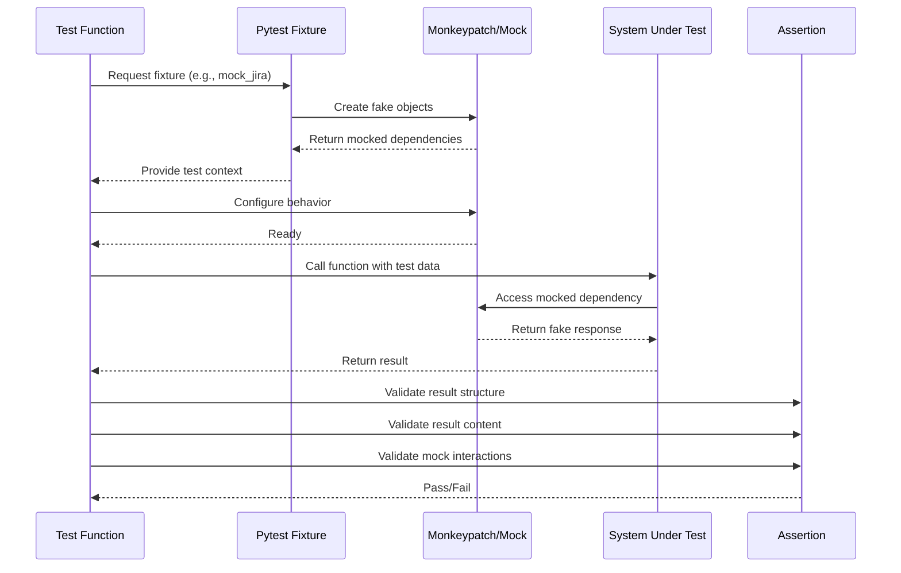
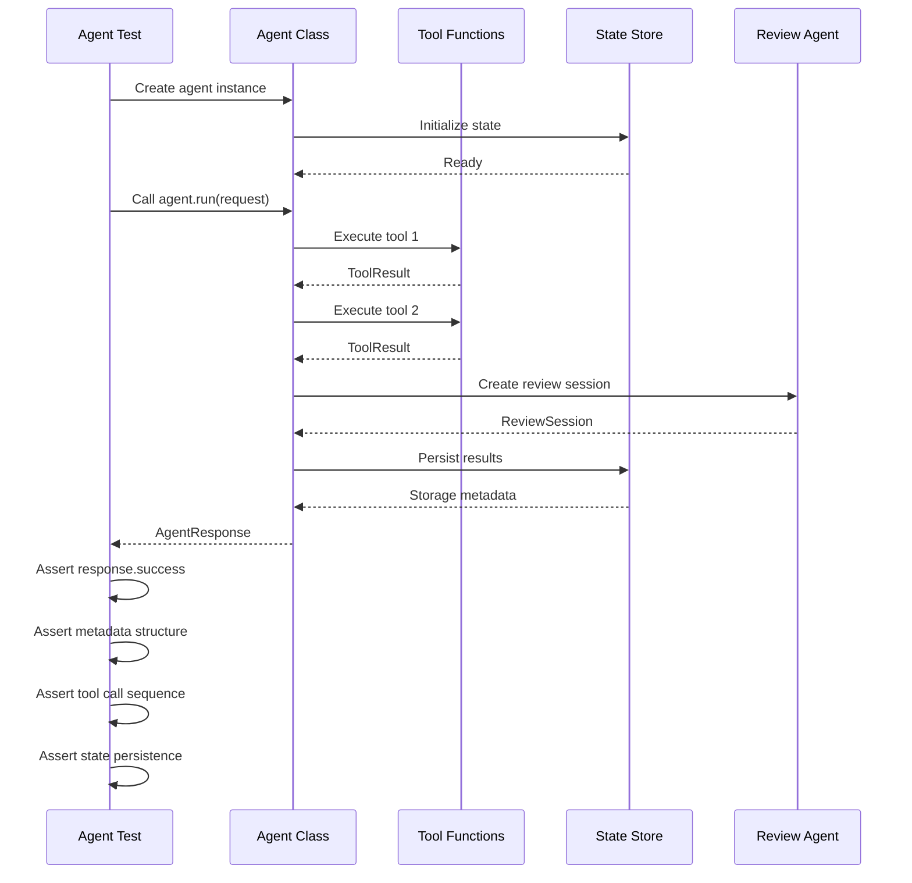
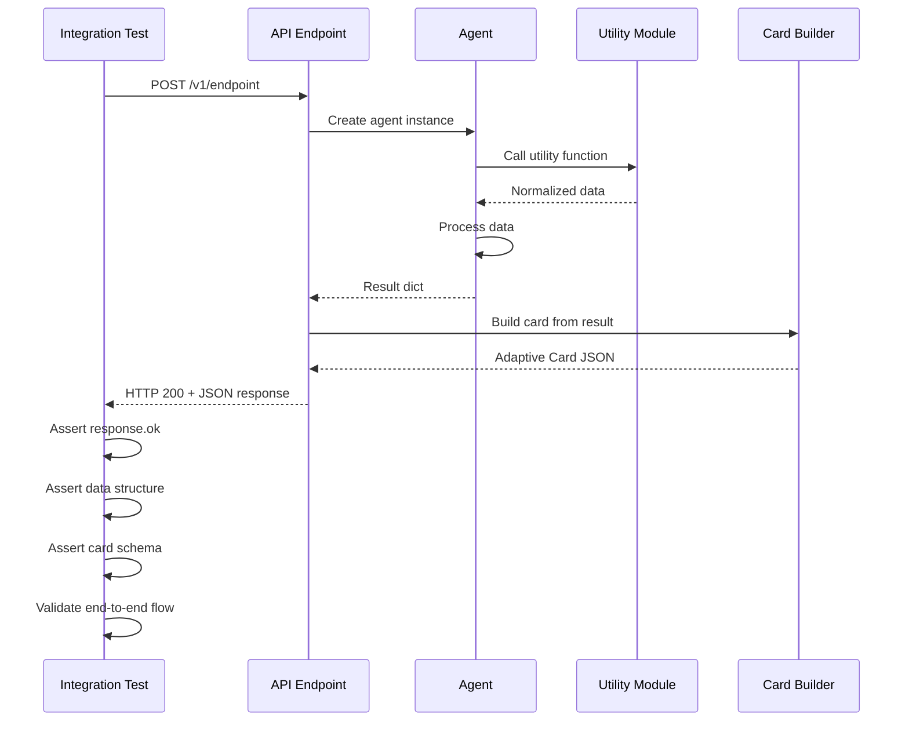

<!-- Generated by Documentation Agent — do not edit between markers -->

```yaml
---
title: "As-Built: Tests — Design Reference"
date: "2026-04-06"
status: "draft"
---
```

# Module Overview

The `tests/` directory contains the comprehensive characterization test suite for the Cornelis Networks agent workforce platform. This suite validates all core modules, agents, tools, integrations, and infrastructure components through 10,000+ test cases organized into 50+ test modules. The tests follow a strict characterization testing methodology where each test documents and validates the actual behavior of production code without requiring live external API calls.

# What Changed

**Before:** The test suite existed but lacked comprehensive documentation of its structure, coverage patterns, and testing philosophy.

**After:** This document provides a complete reference for the test suite's architecture, coverage methodology, and key testing patterns used across all modules.

**Impact:** Engineers joining the team or working on new features can now understand the testing philosophy, locate relevant test patterns, and maintain consistency with existing test practices.

# Component Diagram

```mermaid
graph TB
    subgraph "Test Infrastructure"
        conftest[conftest.py<br/>Shared Fixtures]
        smoke[test_smoke.py<br/>Import Validation]
    end
    
    subgraph "Core Module Tests"
        jira_utils[test_jira_utils_char.py<br/>Jira Integration]
        confluence[test_confluence_utils_char.py<br/>Confluence Integration]
        excel[test_excel_utils_char.py<br/>Excel Operations]
        core_tests[test_core_*.py<br/>Queries, Reporting, Tickets]
    end
    
    subgraph "Agent Tests"
        gantt[test_gantt_agent_char.py<br/>Planning Agent]
        drucker[test_drucker_agent_char.py<br/>Hygiene Agent]
        hemingway[test_hemingway_agent_char.py<br/>Documentation Agent]
        base_agents[test_agents_char.py<br/>Base Agent Framework]
    end
    
    subgraph "Tool Tests"
        jira_tools[test_jira_tools_char.py<br/>Jira Tool Wrappers]
        github_tools[test_github_tools_char.py<br/>GitHub Tool Wrappers]
        confluence_tools[test_confluence_tools_char.py<br/>Confluence Tool Wrappers]
        file_tools[test_file_tools_char.py<br/>File Operations]
    end
    
    subgraph "Integration Tests"
        mcp[test_mcp_server_*.py<br/>MCP Server Tools]
        shannon[test_shannon_*.py<br/>Teams Bot Service]
        github_int[test_github_integration_char.py<br/>GitHub Pipeline]
    end
    
    conftest --> core_tests
    conftest --> agent_tests
    conftest --> tool_tests
    conftest --> integration_tests
    
    core_tests --> jira_utils
    core_tests --> confluence
    core_tests --> excel
    
    agent_tests --> gantt
    agent_tests --> drucker
    agent_tests --> hemingway
    agent_tests --> base_agents
    
    tool_tests --> jira_tools
    tool_tests --> github_tools
    tool_tests --> confluence_tools
    tool_tests --> file_tools
    
    integration_tests --> mcp
    integration_tests --> shannon
    integration_tests --> github_int
```



# Key Flows

## Flow 1: Characterization Test Execution

**Purpose:** Execute a characterization test that validates actual code behavior without live API calls.



**Description:** Each characterization test follows a strict pattern: (1) Set up fake dependencies using fixtures and monkeypatch, (2) Call the system under test with known inputs, (3) Assert on the actual behavior observed, (4) Verify mock interactions to ensure the code path was exercised. This pattern ensures tests document what the code actually does rather than what it should do.

## Flow 2: Agent Test Execution

**Purpose:** Validate agent behavior including tool orchestration and state management.



**Description:** Agent tests validate the complete agent lifecycle: initialization, tool orchestration, review session creation, and state persistence. Tests use monkeypatched tool functions that return canned `ToolResult` objects, allowing validation of agent logic without external dependencies. The test asserts on the agent's response structure, metadata content, tool call sequence, and state store interactions.

## Flow 3: Integration Test Execution

**Purpose:** Validate end-to-end flows across multiple components.



**Description:** Integration tests validate complete flows from API endpoint through agent execution to card generation. These tests use the actual API client (TestClient) and stub only the lowest-level dependencies (e.g., Jira/GitHub API calls). The test validates the HTTP response, data structure, and card schema, ensuring all components integrate correctly.

# Data Model

## Test Fixture Data Structures

The test suite uses several core data structures provided by fixtures in `conftest.py`:

### FakeResponse
```python
@dataclass
class FakeResponse:
    status_code: int = 200
    payload: Optional[Dict[str, Any]] = None
    text: str = ""
    headers: Optional[Dict[str, str]] = None
```
Used to simulate HTTP responses from external APIs (Jira, Confluence, GitHub).

### FakeIssueResource
```python
class FakeIssueResource:
    def __init__(self, raw: Dict[str, Any]):
        self.raw = raw
        self.key = raw.get("key", "")
        self.updated_fields: List[Dict[str, Any]] = []
```
Simulates Jira issue resource objects with update tracking.

### Mock Jira State
The `mock_jira` fixture maintains internal state:
- `_issue_store`: Dict mapping issue keys to raw issue data
- `_project`: Project metadata
- `_versions`: List of release versions
- `_statuses`: List of workflow statuses

## Test Naming Conventions

All test modules follow the `test_<module>_char.py` naming pattern where `_char` indicates "characterization test". This distinguishes them from traditional unit tests and signals that they document actual behavior.

Test function names follow the pattern:
- `test_<function_name>_<scenario>` for single-function tests
- `test_<component>_<behavior>` for component-level tests
- `test_<flow>_<outcome>` for integration tests

# Dependencies

| Dependency | Purpose | Version |
|------------|---------|---------|
| pytest | Test framework and fixture management | 8.3.4 |
| pytest-asyncio | Async test support for MCP server tests | 0.24.0 |
| openpyxl | Excel file creation for test fixtures | 3.1.5 |
| unittest.mock | Mock object creation (stdlib) | — |
| types.SimpleNamespace | Lightweight fake object creation (stdlib) | — |

# Configuration

## Environment Variables

Tests use environment variable mocking via `monkeypatch.setenv()`:

- `JIRA_EMAIL`: Jira authentication email (mocked in tests)
- `JIRA_API_TOKEN`: Jira API token (mocked in tests)
- `JIRA_SERVICE_EMAIL`: Service account email (mocked in tests)
- `JIRA_SERVICE_API_TOKEN`: Service account token (mocked in tests)
- `GITHUB_TOKEN`: GitHub API token (mocked in tests)
- `DRY_RUN`: Dry-run mode flag (set to 'true' or 'false' in tests)
- `DRUCKER_REPORT_DIR`: Drucker report storage directory (set to tmp_path in tests)
- `GANTT_SNAPSHOT_DIR`: Gantt snapshot storage directory (set to tmp_path in tests)
- `HEMINGWAY_DOC_DIR`: Hemingway documentation storage directory (set to tmp_path in tests)

## Test Execution

Run all tests:
```bash
pytest tests/
```

Run specific test module:
```bash
pytest tests/test_jira_utils_char.py
```

Run with coverage:
```bash
pytest --cov=jira_utils --cov=agents --cov=tools tests/
```

Run only smoke tests:
```bash
pytest tests/test_smoke.py
```

# Error Handling

## Test Isolation

Each test is isolated through:
1. **Autouse fixtures**: `reset_jira_utils_state`, `reset_github_utils_state`, `_clean_dry_run_env` run before every test
2. **Monkeypatch cleanup**: All environment variable and module patches are automatically cleaned up after each test
3. **Temporary directories**: `tmp_path` fixture provides isolated filesystem for each test

## Common Test Patterns

### Pattern 1: Monkeypatching External Dependencies
```python
def test_function_with_external_call(monkeypatch):
    monkeypatch.setattr('module.external_function', lambda: 'fake_result')
    result = module.function_under_test()
    assert result == 'expected_based_on_fake'
```

### Pattern 2: Using Fake Objects
```python
def test_function_with_complex_object(fake_issue_resource_factory):
    issue = fake_issue_resource_factory(key='STL-1', summary='Test')
    result = process_issue(issue)
    assert result['key'] == 'STL-1'
```

### Pattern 3: Capturing Output
```python
def test_function_output(capture_stdout):
    with capture_stdout() as out:
        function_that_prints()
    assert 'expected text' in out.getvalue()
```

## Error Scenarios Tested

The test suite validates error handling for:
- Missing credentials (`test_get_jira_credentials_missing_token`)
- Invalid repository names (`test_list_repos_unknown_org_raises`)
- API rate limiting (`test_get_tickets_handles_rate_limit_pagination_and_limit`)
- Connection failures (`test_user_resolver_handles_connection_error`)
- Invalid input data (`test_pr_review_validates_repo_format`)
- Missing required fields (`test_confluence_publish_missing_content_returns_400`)

# Known Limitations / Technical Debt

## Coverage Gaps

1. **CLI Entry Points**: Main functions in `jira_utils.py`, `confluence_utils.py`, and `github_utils.py` have minimal test coverage. This matches the existing pattern where CLI tests are considered lower priority than API/library tests.

2. **Display Helpers**: Functions like `print_pr_table_header()`, `print_pr_table_row()`, and `print_pr_table_footer()` in `github_utils.py` are untested. These are low-risk formatting functions.

3. **Integration Tests**: While each layer is individually tested, there are few true end-to-end tests that exercise the complete pipeline from API endpoint through agent execution to card generation without any mocking.

4. **`config/env_loader.py`**: Zero test coverage on environment variable loading logic. This is flagged as P2 priority in the coverage analysis document.

5. **`get_pr_review_requests()`**: Missing tests at both `github_utils` and `tools/github_tools` layers. Flagged as P1 priority.

## Test Maintenance Issues

1. **Fixture Complexity**: The `mock_jira` fixture in `conftest.py` has grown to 100+ lines with complex state management. Consider splitting into smaller, focused fixtures.

2. **Monkeypatch Overuse**: Some tests have 10+ monkeypatch calls, making them brittle and hard to understand. Consider using fixture composition instead.

3. **Magic Values**: Many tests use hardcoded strings like 'STL-1', '12.1.0', 'acct-jdoe' without clear documentation of their significance.

4. **Test Data Duplication**: Similar fake data structures are recreated in multiple test modules. Consider centralizing common test data in `conftest.py`.

## Anti-patterns Detected

1. **God Test Modules**: `test_jira_utils_coverage.py` is 1000+ lines with 40+ test functions. Consider splitting by functional area.

2. **Missing Negative Tests**: Many modules test only happy paths. For example, `test_gantt_components_char.py` lacks tests for invalid input data.

3. **Implicit Dependencies**: Some tests depend on the order of execution or shared state. All tests should be independently executable.

4. **Incomplete Mocking**: Some tests mock only part of a dependency chain, leading to potential test flakiness if the unmocked portion changes.

## Recommendations

1. **P1**: Add missing tests for `get_pr_review_requests()` at both utility and tool layers
2. **P2**: Add test coverage for `config/env_loader.py` (4 tests recommended)
3. **P3**: Split large test modules (>500 lines) into focused test files
4. **P3**: Add integration smoke tests for critical user flows
5. **P4**: Refactor `mock_jira` fixture into smaller, composable fixtures
6. **P4**: Document magic values and test data patterns in `conftest.py`

<!-- End Documentation Agent generated content -->