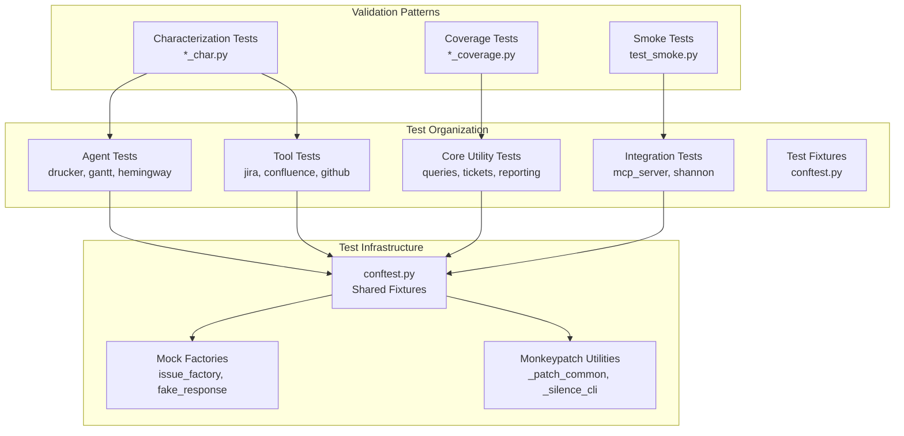
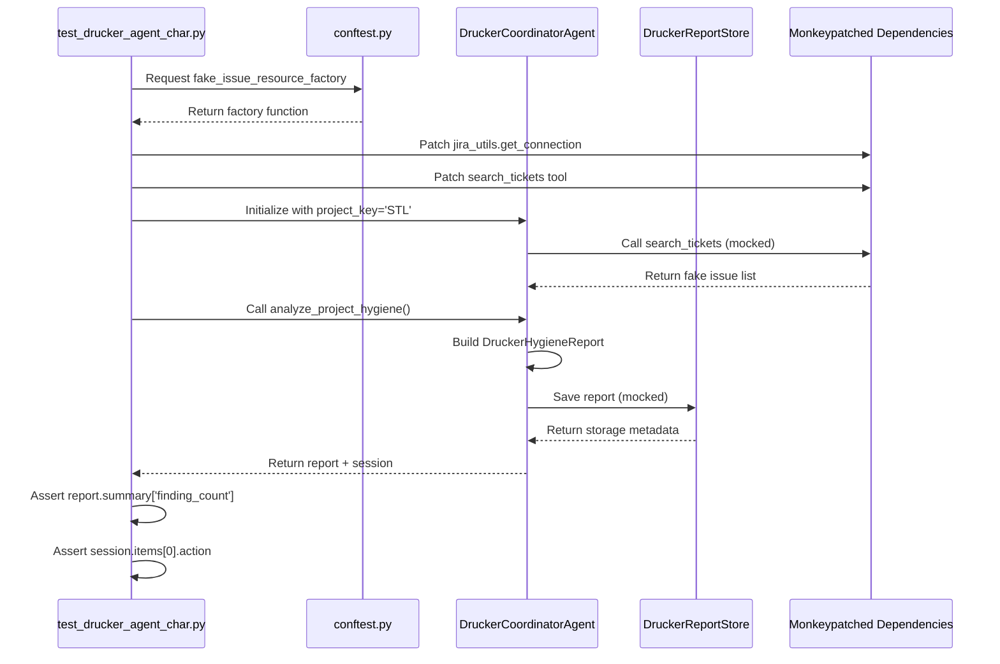
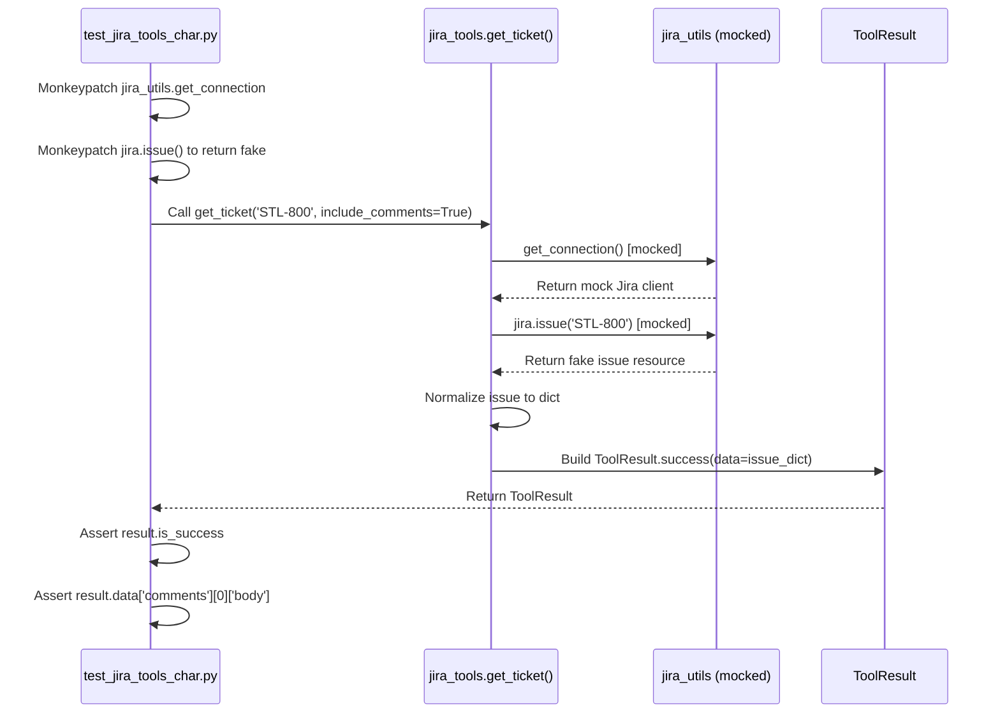
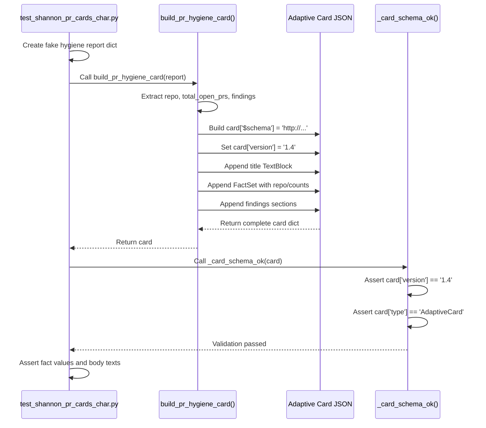

<!-- Generated by Documentation Agent — do not edit between markers -->

```yaml
---
title: "As-Built: Tests — Design Reference"
date: "2026-04-08"
status: "draft"
---
```

# Module Overview

The `tests/` directory contains the comprehensive characterization test suite for the agent-workforce repository. This suite validates the behavior of all core modules, agents, tools, and integrations through 59+ test modules covering approximately 1,200+ individual test cases. The tests follow a strict "no live API calls" policy, using monkeypatching and mock objects to ensure fast, deterministic execution. The suite is organized by functional domain (agents, tools, core utilities, integrations) and employs consistent naming conventions (`*_char.py` for characterization tests, `*_coverage.py` for gap-filling tests).

# What Changed

**Before:** The test suite used Adaptive Card schema version `1.5` in card validation assertions across multiple test modules.

**After:** All card schema version assertions now validate against version `1.4` to align with the Microsoft Teams Adaptive Card renderer compatibility requirements.

**Impact:** This change affects 5 test modules that validate Shannon card builders and GitHub integration card outputs. The change is backward-compatible and ensures cards render correctly in all Teams clients.

# Component Diagram



# Key Flows

## Flow 1: Agent Characterization Test Execution



**Description:** This flow demonstrates the standard pattern for agent characterization tests. The test uses fixtures from `conftest.py` to create fake Jira issues, monkeypatches all external dependencies (Jira API, LLM calls, file I/O), invokes the agent's core analysis method, and validates the structured output. The pattern ensures zero network calls while exercising the full agent logic path.

## Flow 2: Tool Wrapper Validation



**Description:** Tool wrapper tests validate the thin adapter layer between agent code and utility modules. The test monkeypatches the underlying utility function (`jira_utils.get_connection`, `jira.issue`), calls the tool wrapper (`get_ticket`), and verifies that the wrapper correctly transforms the utility output into a `ToolResult` with proper success/failure status and metadata. This pattern is repeated across all 11 tool collections.

## Flow 3: Shannon Card Builder Validation



**Description:** Shannon card builder tests validate the Adaptive Card JSON generation for Microsoft Teams notifications. The test creates a fake data payload (e.g., GitHub PR hygiene report), calls the card builder function, and validates the resulting JSON structure against the Adaptive Card schema. The `_card_schema_ok()` helper ensures all cards have the correct envelope (`$schema`, `type`, `version`), while subsequent assertions verify fact sets, text blocks, and data-driven content rendering.

# Data Model

## Core Test Fixtures (conftest.py)

```python
# Fake Jira issue resource factory
@pytest.fixture
def fake_issue_resource_factory():
    """
    Returns a factory function that creates SimpleNamespace objects
    mimicking jira.Issue resources with configurable fields.
    """
    def _make(key='STL-1', summary='Test', status='Open', ...):
        return SimpleNamespace(
            key=key,
            raw={'fields': {...}},
            fields=SimpleNamespace(
                summary=summary,
                status=SimpleNamespace(name=status),
                ...
            )
        )
    return _make

# Fake HTTP response factory
@pytest.fixture
def fake_response_factory():
    """
    Returns a factory function that creates FakeResponse objects
    with configurable status codes and JSON payloads.
    """
    def _make(status_code=200, payload=None, text=''):
        return FakeResponse(status_code, payload, text)
    return _make
```

## Test Naming Conventions

| Pattern | Purpose | Example |
|---------|---------|---------|
| `test_<module>_char.py` | Characterization tests for a module | `test_jira_utils_char.py` |
| `test_<module>_coverage.py` | Gap-filling tests for edge cases | `test_jira_utils_coverage.py` |
| `test_<agent>_agent_char.py` | Agent behavior validation | `test_drucker_agent_char.py` |
| `test_<agent>_tools_char.py` | Agent tool wrapper validation | `test_drucker_tools_char.py` |
| `test_<agent>_api_char.py` | Agent REST API endpoint validation | `test_drucker_api_char.py` |
| `test_<integration>_char.py` | Integration layer validation | `test_mcp_server_char.py` |

## Monkeypatch Patterns

```python
# Standard pattern for silencing CLI output
def _patch_common(monkeypatch: pytest.MonkeyPatch) -> None:
    monkeypatch.setattr(jira_utils, 'output', lambda *a, **kw: None)
    monkeypatch.setattr(jira_utils, 'show_jql', lambda _jql: None)

# Standard pattern for mocking authentication
def _mock_auth(monkeypatch: pytest.MonkeyPatch) -> None:
    monkeypatch.setattr(
        jira_utils,
        'get_jira_credentials',
        lambda: ('engineer@cornelisnetworks.com', 'token-123'),
    )

# Standard pattern for injecting fake modules
def _inject_github_utils(monkeypatch, **attrs):
    fake_module = types.ModuleType('github_utils')
    for name, fn in attrs.items():
        setattr(fake_module, name, fn)
    monkeypatch.setitem(sys.modules, 'github_utils', fake_module)
```

# Dependencies

| Dependency | Purpose | Version |
|------------|---------|---------|
| `pytest` | Test framework and fixture management | 8.3.4 |
| `pytest-asyncio` | Async test support for MCP server tests | 0.24.0 |
| `openpyxl` | Excel file validation in `test_excel_utils_char.py` | 3.1.5 |
| `conftest.py` | Shared fixtures and mock factories | N/A (local) |
| `agents/*` | Agent modules under test | N/A (local) |
| `tools/*` | Tool wrapper modules under test | N/A (local) |
| `core/*` | Core utility modules under test | N/A (local) |
| `shannon/*` | Shannon service modules under test | N/A (local) |

# Configuration

## Environment Variables

| Variable | Purpose | Default | Required |
|----------|---------|---------|----------|
| `DRY_RUN` | Controls mutation behavior in tests | `'1'` (set by `conftest.py`) | No |
| `JIRA_EMAIL` | Fake Jira credentials for tests | `'engineer@cornelisnetworks.com'` | No |
| `JIRA_API_TOKEN` | Fake Jira token for tests | `'token-123'` | No |
| `GITHUB_TOKEN` | Fake GitHub token for tests | `'ghp_test_token_123'` | No |

## Test Execution

```bash
# Run all tests
pytest

# Run specific test module
pytest tests/test_drucker_agent_char.py

# Run tests matching a pattern
pytest -k "test_drucker"

# Run with coverage report
pytest --cov=agents --cov=tools --cov=core

# Run with verbose output
pytest -v

# Run only characterization tests
pytest tests/*_char.py
```

## Pytest Configuration (pyproject.toml)

```toml
[tool.pytest.ini_options]
testpaths = ["tests"]
python_files = ["test_*.py"]
python_classes = ["Test*"]
python_functions = ["test_*"]
addopts = [
    "--strict-markers",
    "--tb=short",
    "--disable-warnings",
]
markers = [
    "slow: marks tests as slow (deselect with '-m \"not slow\"')",
    "integration: marks tests as integration tests",
]
```

# Error Handling

## Test Isolation

All tests use `pytest` fixtures with automatic cleanup to ensure test isolation:

```python
@pytest.fixture(autouse=True)
def reset_jira_utils_state():
    """Reset jira_utils module state before and after each test."""
    import jira_utils
    jira_utils.reset_connection()
    jira_utils._quiet_mode = False
    yield
    jira_utils.reset_connection()
    jira_utils._quiet_mode = False
```

## Monkeypatch Cleanup

The `monkeypatch` fixture automatically restores all patched attributes and environment variables after each test, preventing state leakage between tests.

## Exception Validation

Tests validate exception handling using `pytest.raises`:

```python
def test_get_jira_credentials_missing_token(monkeypatch: pytest.MonkeyPatch):
    monkeypatch.setenv('JIRA_EMAIL', 'engineer@cornelisnetworks.com')
    monkeypatch.delenv('JIRA_API_TOKEN', raising=False)

    with pytest.raises(jira_utils.JiraCredentialsError):
        jira_utils.get_jira_credentials()
```

## Async Test Error Handling

Async tests use `pytest.mark.asyncio` and validate error responses:

```python
@pytest.mark.asyncio
async def test_get_ticket_not_found(import_mcp_server, monkeypatch):
    jira = MagicMock()
    jira.issue.side_effect = Exception('Issue does not exist')
    monkeypatch.setattr(import_mcp_server.jira_utils, 'get_connection', lambda: jira)

    result = await import_mcp_server.get_ticket('STL-999999')
    data = json.loads(result[0].text)

    assert 'not found' in data['error'].lower()
```

# Known Limitations / Technical Debt

## Test Coverage Gaps

1. **`config/env_loader.py`**: Zero test coverage on a module wired into 3 files (Drucker API, Gantt API, settings). Needs 4 tests covering three-tier resolution (explicit path, config/env/ directory, .env fallback).

2. **`github_utils.get_pr_review_requests()`**: Missing tests at both `github_utils` and `tools/github_tools` layers. This function returns `(users, teams)` and should be tested with monkeypatched repo/PR returning users+teams.

3. **CLI `main()` functions**: Not tested in `jira_utils`, `confluence_utils`, `github_utils`. This matches existing pattern where CLI tests are minimal, but integration smoke tests would improve confidence.

4. **No integration tests**: All tests are unit-level with mocked dependencies. No test validates the full Drucker→github_utils→Shannon card pipeline end-to-end.

## Hardcoded Test Data

- **Fake timestamps**: Tests use hardcoded dates like `'2026-03-01T00:00:00.000+0000'` which may cause confusion when tests are run in different years.
- **Fake credentials**: Tests use `'engineer@cornelisnetworks.com'` and `'token-123'` which are not configurable.
- **Fake URLs**: Tests use `'https://example.test'` and `'https://cornelisnetworks.atlassian.net'` which are not parameterized.

## Adaptive Card Version Inconsistency (RESOLVED)

**Status**: Fixed in recent PR diff.

**Before**: Tests validated against Adaptive Card schema version `1.5` in 5 test modules:
- `test_github_integration_char.py`
- `test_github_phase5_integration_char.py`
- `test_hemingway_confluence_publish_char.py`
- `test_hemingway_shannon_cards_char.py`
- `test_shannon_pr_cards_char.py`

**After**: All tests now validate against version `1.4` to align with Microsoft Teams renderer compatibility.

**Impact**: This was a low-risk change affecting only test assertions, not production card generation code.

## Missing Test Utilities

- **No shared card validation helpers**: Each test module defines its own `_card_schema_ok()`, `_find_fact_set()`, `_fact_value()`, and `_body_texts()` helpers. These should be extracted to a shared `tests/card_helpers.py` module.

- **No shared fake data builders**: Each test module defines its own `_make_issue()`, `_make_pr()`, `_make_review()` helpers. These should be extracted to `conftest.py` or a shared `tests/factories.py` module.

## Test Execution Performance

- **No test parallelization**: Tests run sequentially. Adding `pytest-xdist` would enable parallel execution with `pytest -n auto`.
- **No test categorization**: Tests are not marked as `unit`, `integration`, or `slow`, making it difficult to run subsets during development.

## Documentation Gaps

- **No test writing guide**: New contributors must infer patterns from existing tests.
- **No test coverage report**: The repository does not generate or publish test coverage metrics.
- **No test failure triage guide**: When tests fail, there is no documented process for determining whether the failure indicates a regression or a test maintenance issue.

<!-- End Documentation Agent generated content -->