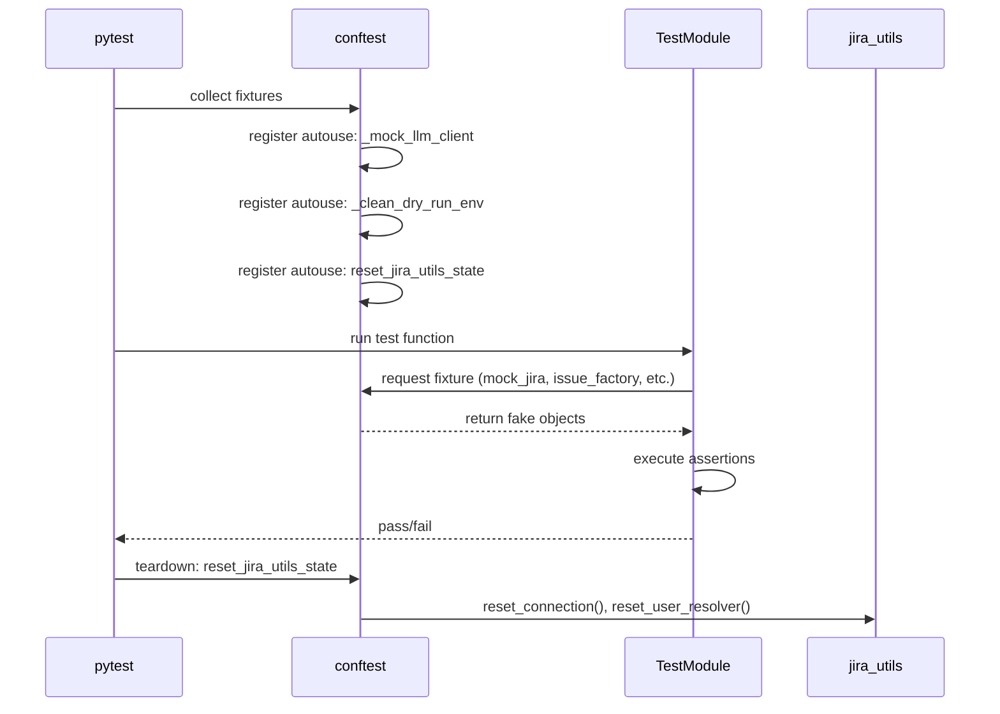
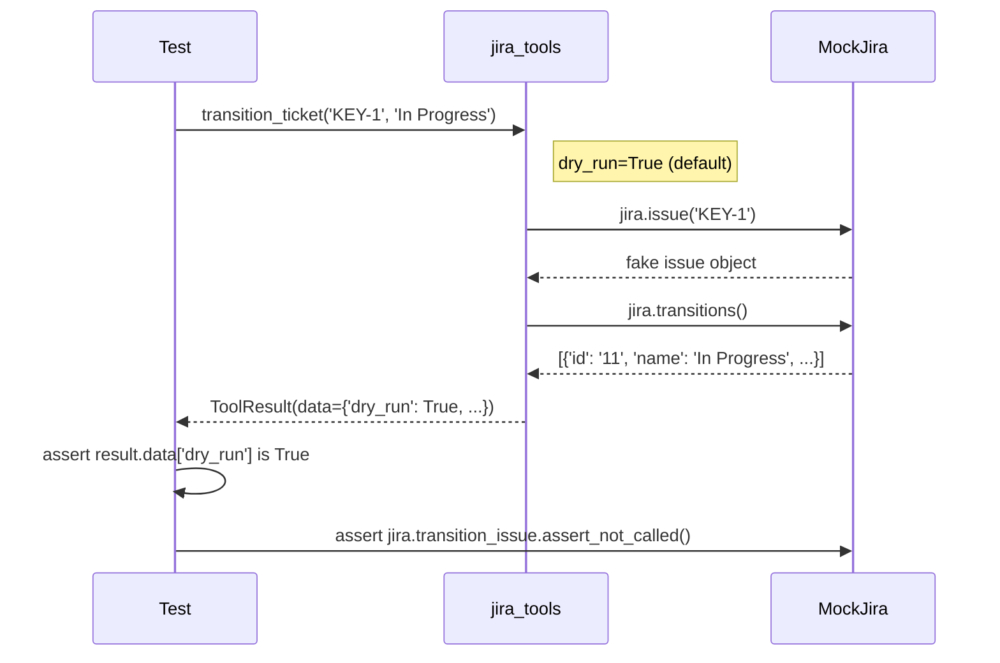
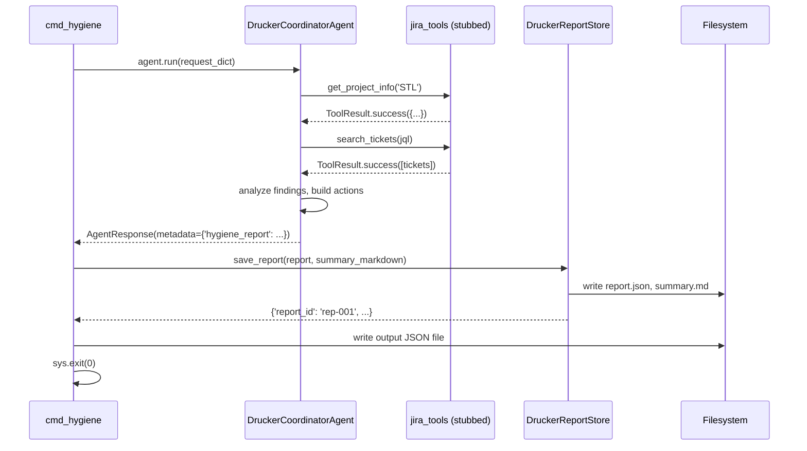

<!-- Generated by Documentation Agent — do not edit between markers -->

```yaml
---
title: "As-Built: Tests — Design Reference"
date: "2026-04-03"
status: "draft"
---
```

## Module Overview

The `tests/` directory contains the complete characterization and unit test suite for the **agent-workforce** repository — a multi-agent platform built on Jira, GitHub, Confluence, and Microsoft Teams integrations. The suite comprises approximately 60 test modules totaling over 550 passing tests. Every test runs without live API calls; external services are replaced by `monkeypatch` stubs, `SimpleNamespace` fakes, and `MagicMock` objects wired through a shared `conftest.py` fixture layer. The tests validate seven agent subsystems (Drucker, Gantt, Hemingway, Shannon, Research, Review, Feature Planning), six utility libraries (`jira_utils`, `github_utils`, `confluence_utils`, `excel_utils`, `core/*`, `config/*`), three tool collection layers (`tools/jira_tools`, `tools/github_tools`, `tools/confluence_tools`), an MCP server, and a Shannon Teams bot service — covering CLI handlers, REST API endpoints, data models, dry-run safety gates, actor identity policies, and Adaptive Card rendering.

## What Changed (If applicable)

- **Before:** Shannon card builders for Hemingway rendered Doc IDs, Impact IDs, and blocking issue keys as plain text. Shannon service tests passed full `key value` argument strings for commands like `/planning-snapshot`, `/release-survey`, and `/intake-report`.
- **After:** Card builder assertions now expect Jira-linked Markdown references (e.g., `[DOC-001](https://cornelisnetworks.atlassian.net/browse/DOC-001)`). Shannon service tests pass positional project keys directly (e.g., `/planning-snapshot STL` instead of `/planning-snapshot project_key STL`), and the `/release-survey` command no longer passes `releases` or `scope_label` inline.
- **Impact:** These changes reflect updates in `shannon/cards.py` (Hemingway card builders now emit hyperlinked IDs) and `shannon/service.py` (simplified command argument parsing). Any consumer of these cards or commands must expect the new formats.

## Component Diagram

```mermaid
graph TD
    subgraph "Test Infrastructure"
        CONFTEST["conftest.py<br/>Shared fixtures & fakes"]
        SMOKE["test_smoke.py<br/>Import smoke tests"]
    end

    subgraph "Utility Tests"
        JIRA_UTILS["test_jira_utils_*.py<br/>Jira connection, queries, dump"]
        GITHUB_UTILS["test_github_utils_char.py<br/>GitHub connection, PRs, hygiene"]
        CONFLUENCE_UTILS["test_confluence_utils_char.py<br/>Confluence CRUD, search"]
        EXCEL_UTILS["test_excel_utils_*.py<br/>CSV repair, diff, dashboard"]
        CORE["test_core_*.py<br/>queries, tickets, reporting, utils"]
    end

    subgraph "Agent Tests"
        DRUCKER["test_drucker_*_char.py<br/>Hygiene, polling, learning, CLI"]
        GANTT["test_gantt_*_char.py<br/>Snapshot, release monitor, CLI"]
        HEMINGWAY["test_hemingway_*_char.py<br/>Docs, publish, PR review, CLI"]
        SHANNON["test_shannon_*_char.py<br/>Service, cards, dry-run flow"]
        AGENTS["test_agents_char.py<br/>Base agent, tool loop, review"]
    end

    subgraph "Tool & Integration Tests"
        TOOLS["test_*_tools_char.py<br/>Jira, GitHub, Confluence, file tools"]
        MCP["test_mcp_server_*.py<br/>MCP server tool wrappers"]
        DRY_RUN["test_dry_run_*.py<br/>Mutation safety gates"]
    end

    CONFTEST --> JIRA_UTILS
    CONFTEST --> GITHUB_UTILS
    CONFTEST --> AGENTS
    CONFTEST --> MCP
    CONFTEST --> DRUCKER
    CONFTEST --> GANTT
    CONFTEST --> HEMINGWAY
```



## Key Flows

### Flow 1: Fixture Injection and State Isolation

Every test session begins with `conftest.py` providing shared fixtures and autouse hooks that guarantee isolation between tests.



The `_mock_llm_client` autouse fixture replaces the LLM client globally with a `FakeLLM` that returns deterministic responses, preventing any live model calls:

```python
class FakeLLM(BaseLLM):
    def chat(self, messages, temperature=0.7, max_tokens=None, **kwargs):
        from llm.base import LLMResponse
        return LLMResponse(content='fake-response', model='fake-model')
```

The `reset_jira_utils_state` autouse fixture resets module-level singletons before and after each test:

```python
@pytest.fixture(autouse=True)
def reset_jira_utils_state():
    # ... reset connection, user resolver, quiet mode, etc.
    yield
    # ... reset again on teardown
```

### Flow 2: Dry-Run Safety Gate Verification

The dry-run test modules (`test_dry_run_jira_tools_char.py`, `test_dry_run_jira_utils_char.py`, `test_dry_run_mcp_messaging_char.py`) verify that all 13+ mutation functions default to preview mode without performing actual writes.



Each of the 13 mutation functions follows this pattern. For example, `test_transition_ticket_dry_run_returns_preview`:

```python
def test_transition_ticket_dry_run_returns_preview(monkeypatch):
    # ... setup mock jira ...
    result = jira_tools.transition_ticket('KEY-1', 'In Progress')
    assert result.is_success
    assert result.data['dry_run'] is True
    jira.transition_issue.assert_not_called()
```

### Flow 3: Agent → Tool → Store → CLI End-to-End

The Drucker agent tests demonstrate the full pipeline from agent analysis through review session creation to CLI output.



This is verified in `test_cmd_hygiene_success`:

```python
def test_cmd_hygiene_success(monkeypatch, tmp_path):
    # ... stub agent and store ...
    with pytest.raises(SystemExit) as exc_info:
        cmd_hygiene(args)
    assert exc_info.value.code == 0
    assert os.path.exists(json_path)
    data = json.load(f)
    assert data['project_key'] == 'STL'
```

## Data Model

### Core Test Fixtures (conftest.py)

| Structure | Purpose | Key Fields |
|-----------|---------|------------|
| `FakeResponse` | HTTP response stub | `status_code`, `payload`, `text`, `headers` |
| `FakeIssueResource` | Jira issue resource with mutation tracking | `raw`, `key`, `updated_fields` |
| `FakeLLM` | Deterministic LLM replacement | Returns `'fake-response'` for all `chat()` calls |
| `mock_jira` | Complete Jira client mock | `project`, `versions`, `statuses`, `issue_store`, `search_issues` |
| `issue_factory` | Parameterized Jira issue dict builder | 20+ configurable fields including custom fields |

The `issue_factory` fixture produces raw Jira REST API dicts:

```python
def _make(key='STL-1', summary='Sample summary', issue_type='Bug',
          status='Open', priority='P1-Critical', assignee='Jane Dev', ...):
    fields = {
        'summary': summary,
        'issuetype': {'name': issue_type},
        'status': {'name': status},
        'customfield_17504': customer_ids,
        'customfield_28434': [{'value': name} for name in product_family],
        # ...
    }
    return {'key': key, 'id': key.replace('-', ''), 'fields': fields}
```

### Test Coverage Tracking (GITHUB_TEST_COVERAGE_ANALYSIS.md)

The coverage analysis document tracks symbol-level coverage across 5 modules:

| Module | Coverage | Gap |
|--------|----------|-----|
| `github_utils.py` | 96% (22/26 public + 3 internal) | `get_pr_review_requests`, `main()`, display helpers |
| `tools/github_tools.py` | 91% (10/11 tools + 1 class) | `get_pr_review_requests` tool |
| `shannon/cards.py` (PR builders) | 100% (4/4) | — |
| `agents/drucker_api.py` (GitHub endpoints) | 100% (4/4) | — |
| `config/env_loader.py` | 100% (post-P2 fix) | — |

## Dependencies

| Dependency | Purpose | Version |
|------------|---------|---------|
| `pytest` | Test framework and fixture system | ≥7.0 |
| `pytest-asyncio` | Async test support for MCP server tools | ≥0.21 |
| `openpyxl` | Excel file creation/validation in fixtures and excel_utils tests | ≥3.1 |
| `unittest.mock` (stdlib) | `MagicMock`, `patch` for stubbing | stdlib |
| `types.SimpleNamespace` (stdlib) | Lightweight fake objects replacing PyGithub/Jira resources | stdlib |
| `fastapi` / `starlette` | `TestClient` for API endpoint tests | ≥0.100 |
| `agents.base` | `BaseAgent`, `AgentConfig`, `AgentResponse` | internal |
| `tools.base` | `ToolResult`, `ToolStatus`, `@tool` decorator | internal |
| `llm.base` | `BaseLLM`, `LLMResponse` for `FakeLLM` | internal |
| `shannon.poster` | `MemoryPoster` for Teams bot tests | internal |

## Configuration

| Variable | Purpose | Default |
|----------|---------|---------|
| `DRY_RUN` | Controls mutation safety; autouse fixture deletes it before each test | Unset (cleaned by `_clean_dry_run_env`) |
| `DRUCKER_REPORT_DIR` | Storage directory for Drucker report persistence tests | Set to `tmp_path` per test |
| `GANTT_SNAPSHOT_DIR` | Storage directory for Gantt snapshot persistence tests | Set to `tmp_path` per test |
| `GANTT_RELEASE_MONITOR_DIR` | Storage directory for release monitor tests | Set to `tmp_path` per test |
| `GANTT_RELEASE_SURVEY_DIR` | Storage directory for release survey tests | Set to `tmp_path` per test |
| `GANTT_DEPENDENCY_REVIEW_DIR` | Storage directory for dependency review tests | Set to `tmp_path` per test |
| `HEMINGWAY_DOC_DIR` | Storage directory for Hemingway record persistence tests | Set to `tmp_path` per test |
| `DRUCKER_LEARNING_DB` | SQLite path for learning store tests | Set to `tmp_path` or `:memory:` |
| `JIRA_EMAIL` / `JIRA_API_TOKEN` | Jira credentials for actor policy tests | Set per test via `monkeypatch.setenv` |
| `JIRA_SERVICE_EMAIL` / `JIRA_SERVICE_API_TOKEN` | Service account credentials for polling tests | Set per test |
| `GITHUB_TOKEN` | GitHub credentials for connection tests | Set per test |

## Error Handling

The test suite validates error handling at multiple layers:

**Tool-level error propagation:** Tests verify that when underlying utilities raise exceptions, tool wrappers return `ToolResult.failure()` with descriptive error messages rather than propagating raw exceptions:

```python
def test_tool_returns_failure_on_exception(monkeypatch):
    monkeypatch.setattr(github_tools, 'get_github',
        lambda: (_ for _ in ()).throw(RuntimeError('Connection refused')))
    result = github_tools.list_repos('cornelisnetworks')
    assert not result.is_success
    assert 'Connection refused' in (result.error or '')
```

**API endpoint error wrapping:** All Drucker, Gantt, and Hemingway API endpoint tests verify that exceptions are caught and returned as `{'ok': False, 'error': '...'}` rather than HTTP 500s:

```python
def test_pr_hygiene_error(self, client, mock_github_utils):
    mock_github_utils.analyze_repo_pr_hygiene.side_effect = RuntimeError('rate limit')
    resp = client.post('/v1/github/pr-hygiene', json={...})
    assert resp.status_code == 200
    assert body['ok'] is False
    assert 'rate limit' in body['error']
```

**CLI exit codes:** All CLI handler tests verify `sys.exit(0)` for success and `sys.exit(1)` for failures, using `pytest.raises(SystemExit)`.

**Exception hierarchy:** `test_github_utils_char.py` validates the custom exception hierarchy (`GitHubCredentialsError`, `GitHubRepoError`, etc.) and `test_jira_utils_char.py` validates `JiraCredentialsError`.

## Known Limitations / Technical Debt

1. **`get_pr_review_requests()` untested at utils layer (P1):** The `github_utils.get_pr_review_requests()` function lacks a direct characterization test, though the tool wrapper now has coverage via `test_get_pr_review_requests_returns_success`. The coverage analysis document flags this as medium risk.

2. **No integration tests:** All tests are unit-level with mocked dependencies. No test validates the full agent → utility → card builder pipeline with real data flowing through. The `test_github_integration_char.py` file comes closest but still uses `SimpleNamespace` fakes for PyGithub objects.

3. **CLI `main()` entry points untested:** The `main()` functions in `jira_utils.py` and `github_utils.py` are not tested, matching an acknowledged pattern where CLI routing tests are minimal.

4. **Truncated test files in source:** Several test files (`test_confluence_utils_char.py`, `test_drucker_cli_char.py`, `test_gantt_cli_char.py`, `test_github_phase5_char.py`, `test_github_phase5_integration_char.py`, `test_jira_utils_coverage.py`, `test_excel_utils_coverage.py`, `test_hemingway_api_char.py`, `test_hemingway_cli_char.py`, `test_hemingway_confluence_publish_char.py`, `test_hemingway_search_char.py`, `test_markdown_to_confluence.py`, `test_mcp_server_coverage.py`, `test_shannon_service_char.py`, `test_github_write_ops_char.py`, `test_core_reporting.py`, `test_drucker_agent_char.py`, `test_gantt_agent_char.py`) appear truncated in the provided source, meaning the full test count and coverage may be higher than documented here.

5. **Hardcoded Jira URL in card assertions:** Multiple card builder tests assert against `https://cornelisnetworks.atlassian.net/browse/` as a hardcoded base URL. If the Jira instance URL changes, these tests will break.

6. **`import_mcp_server` fixture complexity:** The MCP server fixture in `conftest.py` constructs an elaborate fake module hierarchy (`mcp`, `mcp.server`, `mcp.server.stdio`, `mcp.types`) with `FakeServer`, `FakeTextContent`, etc. This is fragile — any change to the MCP SDK's import structure requires updating this fixture.

7. **Missing `display_jql` and `print_pr_table_*` tests:** Display/formatting functions in both `jira_utils` and `github_utils` are explicitly marked as low-priority untested symbols.

<!-- End Documentation Agent generated content -->