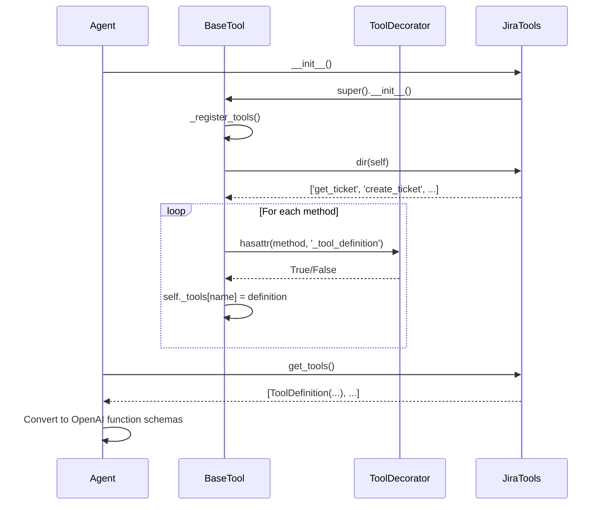
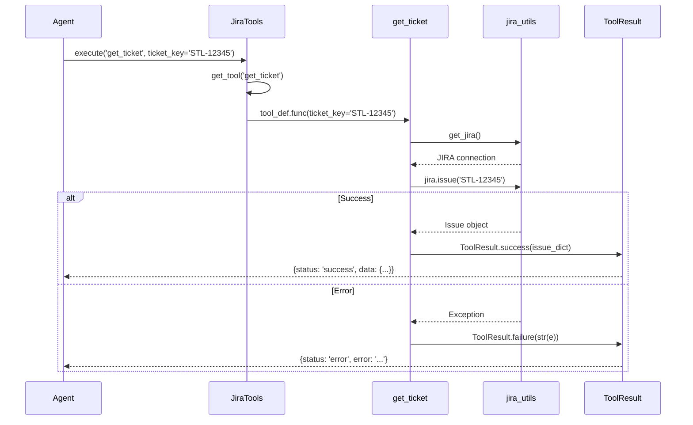
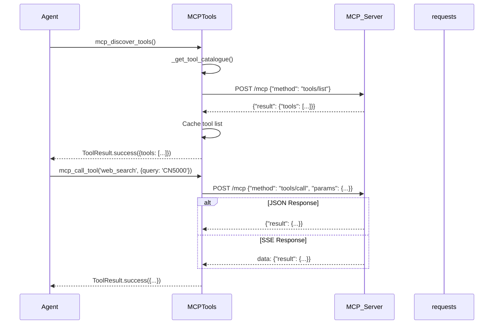

<!-- Generated by Documentation Agent — do not edit between markers -->

```yaml
---
title: "As-Built: Tools — Design Reference"
date: "2026-04-06"
status: "draft"
---
```

# Module Overview

The `tools/` module provides a comprehensive toolkit for the Cornelis Agent Pipeline, exposing Jira, Confluence, GitHub, file operations, knowledge base search, web search, MCP client integration, Excel utilities, vision/OCR, draw.io parsing, and specialized agent tools (Gantt, Drucker, Hemingway) as agent-callable functions. Each tool is decorated with `@tool()` to generate OpenAI/ADK-compatible function schemas, wrapped in `ToolResult` for consistent error handling, and organized into `BaseTool` collections for framework registration. The module acts as the primary interface between the agent orchestration layer and external systems, enforcing a uniform contract for tool discovery, parameter validation, and result serialization.

# What Changed

**Before:** Tools were scattered across utility modules (`jira_utils.py`, `confluence_utils.py`, etc.) with inconsistent interfaces and no agent-friendly metadata.

**After:** All tools are centralized in `tools/`, decorated with `@tool()` for automatic schema generation, and return `ToolResult` objects. New capabilities include:
- **Confluence Jira macros** (`build_jira_jql_table`, `build_jira_filter_table`) for embedding live Jira tables in Confluence pages
- **Jira filter creation** (`create_filter`) to persist JQL queries as saved filters
- **Plan export tools** (`plan_to_csv`, `plan_json_to_dict_rows`) for bidirectional conversion between feature-plan JSON and CSV/Excel formats
- **MCP client tools** (`mcp_discover_tools`, `mcp_call_tool`) for runtime discovery and invocation of Model Context Protocol tools
- **Knowledge base search** (`search_knowledge`, `read_document`) for local Markdown search and PDF/DOCX extraction
- **Web search** (`web_search`, `web_search_multi`) with MCP/Brave/Tavily fallback strategies

**Impact:** Agents can now dynamically discover and invoke tools via OpenAI function calling or ADK tool schemas. The `ToolResult` contract ensures all tools return structured success/failure payloads, simplifying error handling in agent loops. Downstream consumers (e.g., `FeaturePlanBuilderAgent`, `HemingwayAgent`) can register tool collections via `BaseTool.get_tools()`.

# Component Diagram

```mermaid
graph TB
    subgraph "Tool Collections"
        JiraTools[JiraTools]
        ConfluenceTools[ConfluenceTools]
        FileTools[FileTools]
        KnowledgeTools[KnowledgeTools]
        WebSearchTools[WebSearchTools]
        MCPTools[MCPTools]
        ExcelTools[ExcelTools]
        VisionTools[VisionTools]
        DrawioTools[DrawioTools]
        GanttTools[GanttTools]
        DruckerTools[DruckerTools]
        HemingwayTools[HemingwayTools]
    end
    
    subgraph "Core Infrastructure"
        BaseTool[BaseTool]
        ToolResult[ToolResult]
        ToolDecorator[@tool decorator]
    end
    
    subgraph "External Systems"
        Jira[Jira API]
        Confluence[Confluence API]
        GitHub[GitHub API]
        MCP[MCP Server]
        FileSystem[File System]
    end
    
    JiraTools --> BaseTool
    ConfluenceTools --> BaseTool
    FileTools --> BaseTool
    KnowledgeTools --> BaseTool
    WebSearchTools --> BaseTool
    MCPTools --> BaseTool
    
    JiraTools --> Jira
    ConfluenceTools --> Confluence
    MCPTools --> MCP
    FileTools --> FileSystem
    
    ToolDecorator --> ToolResult
    BaseTool --> ToolDecorator
```

# Key Flows

## Flow 1: Tool Registration and Discovery



**Description:** When a `BaseTool` subclass (e.g., `JiraTools`) is instantiated, `_register_tools()` introspects all methods decorated with `@tool()`, extracts their `_tool_definition` metadata, and stores them in `self._tools`. Agents call `get_tools()` to retrieve `ToolDefinition` objects, which are then converted to OpenAI function calling schemas via `to_function_schema()`.

## Flow 2: Tool Execution with Error Handling



**Description:** The `@tool()` decorator wraps each function in a try/except block that catches exceptions and returns `ToolResult.failure()`. Successful executions return `ToolResult.success()`. This ensures agents always receive a structured response with `status`, `data`, and `error` fields, enabling robust error recovery in agent loops.

## Flow 3: MCP Tool Discovery and Invocation



**Description:** `mcp_discover_tools()` queries the MCP server's `tools/list` endpoint and caches the result. `mcp_call_tool()` invokes a specific tool via `tools/call`. The MCP client handles both JSON and Server-Sent Events (SSE) responses by parsing `data:` lines in SSE streams. This enables runtime discovery of tools exposed by the Cornelis MCP server without hardcoding tool names.

# Data Model

## Core Data Structures

### `ToolResult`
```python
@dataclass
class ToolResult:
    status: ToolStatus  # SUCCESS | ERROR | PENDING
    data: Any = None
    error: Optional[str] = None
    metadata: Dict[str, Any] = field(default_factory=dict)
```
- **Purpose:** Uniform return type for all tool executions
- **Key Methods:** `success()`, `failure()`, `is_success`, `to_dict()`

### `ToolDefinition`
```python
@dataclass
class ToolDefinition:
    name: str
    description: str
    parameters: List[ToolParameter]
    returns: str
    func: Callable
```
- **Purpose:** Metadata for agent-callable tools
- **Key Methods:** `to_function_schema()` (OpenAI format), `to_adk_tool()` (Google ADK format)

### `ToolParameter`
```python
@dataclass
class ToolParameter:
    name: str
    type: str  # 'string' | 'integer' | 'boolean' | 'array' | 'object'
    description: str
    required: bool = True
    default: Any = None
    enum: Optional[List[Any]] = None
```
- **Purpose:** JSON Schema-compatible parameter definition
- **Key Methods:** `to_schema()` (converts to JSON Schema dict)

## State Management

- **Connection Caching:** `jira_utils.get_connection()`, `confluence_utils.get_connection()`, `github_utils.get_connection()` maintain singleton connections with lazy initialization
- **MCP Tool Catalogue:** `_tool_cache` in `mcp_tools.py` caches discovered tools to avoid repeated `tools/list` calls
- **User Resolver:** `jira_utils.get_user_resolver()` caches Jira user lookups for assignee resolution

# Dependencies

| Dependency | Purpose | Version |
|------------|---------|---------|
| `jira` | Jira REST API client | 3.x |
| `atlassian-python-api` | Confluence REST API client | 3.x |
| `PyGithub` | GitHub API client | 2.x |
| `requests` | HTTP client for MCP/web search | 2.x |
| `openpyxl` | Excel file I/O | 3.x |
| `python-pptx` | PowerPoint parsing | 0.6.x |
| `python-docx` | Word document parsing | 1.x |
| `PyMuPDF` / `pdfplumber` / `PyPDF2` | PDF text extraction | Various |
| `Pillow` | Image processing | 10.x |
| `dotenv` | Environment variable loading | 1.x |

# Configuration

## Environment Variables

| Variable | Purpose | Default |
|----------|---------|---------|
| `JIRA_URL` | Jira instance URL | `https://cornelisnetworks.atlassian.net` |
| `JIRA_EMAIL` | Jira user email | Required |
| `JIRA_API_TOKEN` | Jira API token | Required |
| `CONFLUENCE_URL` | Confluence instance URL | Same as `JIRA_URL` |
| `CONFLUENCE_EMAIL` | Confluence user email | Same as `JIRA_EMAIL` |
| `CONFLUENCE_API_TOKEN` | Confluence API token | Same as `JIRA_API_TOKEN` |
| `GITHUB_TOKEN` | GitHub personal access token | Required for GitHub tools |
| `CORNELIS_MCP_URL` | MCP server endpoint | `http://cn-ai-01.cornelisnetworks.com:50700/mcp` |
| `CORNELIS_AI_API_KEY` | MCP bearer token | Optional |
| `BRAVE_SEARCH_API_KEY` | Brave Search API key | Optional (web search fallback) |
| `TAVILY_API_KEY` | Tavily Search API key | Optional (web search fallback) |
| `DRY_RUN` | Global dry-run mode | `false` |

## Feature Flags

- **`include_comments`** (Jira tools): Fetch ticket comments when retrieving tickets
- **`include_changelog`** (Jira tools): Fetch ticket history when retrieving tickets
- **`include_transitions`** (Jira tools): Fetch available workflow transitions when retrieving tickets
- **`render_diagrams`** (Confluence tools): Render Mermaid diagrams to PNG when converting Markdown to Confluence
- **`table_format`** (Excel/CSV tools): `'flat'` (default) or `'indented'` (depth-based columns)

# Error Handling

## Exception Hierarchy

All tools follow a consistent error handling pattern:

1. **Validation Errors:** Raised immediately for invalid inputs (e.g., missing required parameters, file not found)
2. **API Errors:** Caught and wrapped in `ToolResult.failure()` with the original exception message
3. **Graceful Degradation:** Tools attempt fallback strategies (e.g., web search tries MCP → Brave → Tavily)

## Error Patterns

### Pattern 1: Missing Dependencies
```python
# tools/vision_tools.py
if not PIL_AVAILABLE:
    return ToolResult.failure('PIL not available - image processing limited')
```

### Pattern 2: API Failures
```python
# tools/jira_tools.py
try:
    jira = get_jira()
    issue = jira.issue(ticket_key)
    return ToolResult.success(issue_to_dict(issue))
except Exception as e:
    log.error(f'Failed to get ticket: {e}')
    return ToolResult.failure(f'Failed to get ticket {ticket_key}: {e}')
```

### Pattern 3: Fallback Chains
```python
# tools/web_search_tools.py
result = _search_via_mcp(query, max_results)
if result is not None:
    return ToolResult.success(result)
result = _search_via_brave(query, max_results)
if result is not None:
    return ToolResult.success(result)
return ToolResult.failure('Web search unavailable')
```

# Known Limitations / Technical Debt

## Hardcoded Values
- **Jira URL:** Default `https://cornelisnetworks.atlassian.net` in multiple files (`jira_tools.py`, `confluence_tools.py`, `drawio_tools.py`)
- **MCP URL:** Default `http://cn-ai-01.cornelisnetworks.com:50700/mcp` in `mcp_tools.py`
- **Knowledge Directory:** Hardcoded `data/knowledge` in `knowledge_tools.py`
- **Base CSV Fields:** `BASE_FIELDS` list in `plan_export_tools.py` duplicates `jira_utils.py` schema

## Missing Implementations
- **`drawio_tools.py`:** `create_diagram_from_tickets()` function is truncated (line 450+)
- **`file_tools.py`:** `write_json()` function is truncated (line 350+)
- **`vision_tools.py`:** `_parse_roadmap_excel()` function is truncated (line 450+)
- **`jira_tools.py`:** `get_release_tickets()` function is truncated (line 450+)

## Circular Dependencies
- **`web_search_tools.py` → `mcp_tools.py`:** Lazy import via `_get_mcp_tools()` to avoid circular import
- **`tools/__init__.py`:** Imports all tool modules, creating potential for circular dependencies if tools import from `tools/`

## Error Handling Gaps
- **MCP SSE Parsing:** `_mcp_request()` in `mcp_tools.py` only parses the first valid JSON line in SSE responses; does not handle multi-event streams
- **File Size Limits:** `read_file()` enforces a 10MB default limit but does not handle partial reads for larger files
- **Excel Format Detection:** `_detect_table_format()` in `plan_export_tools.py` uses regex matching on column headers, which may fail for non-standard formats

## Technical Debt
- **God Class:** `JiraTools` has 50+ methods (lines 100-2700 in `jira_tools.py`)
- **Duplicate Code:** `_normalize_comment()`, `_normalize_changelog()`, `_normalize_transition()` in `jira_tools.py` could be refactored into a shared `normalizers.py` module
- **Missing Tests:** No unit tests for tool parameter validation or `ToolResult` serialization
- **Inconsistent Logging:** Some tools use `log.debug()`, others use `log.info()` for the same operation types

<!-- End Documentation Agent generated content -->