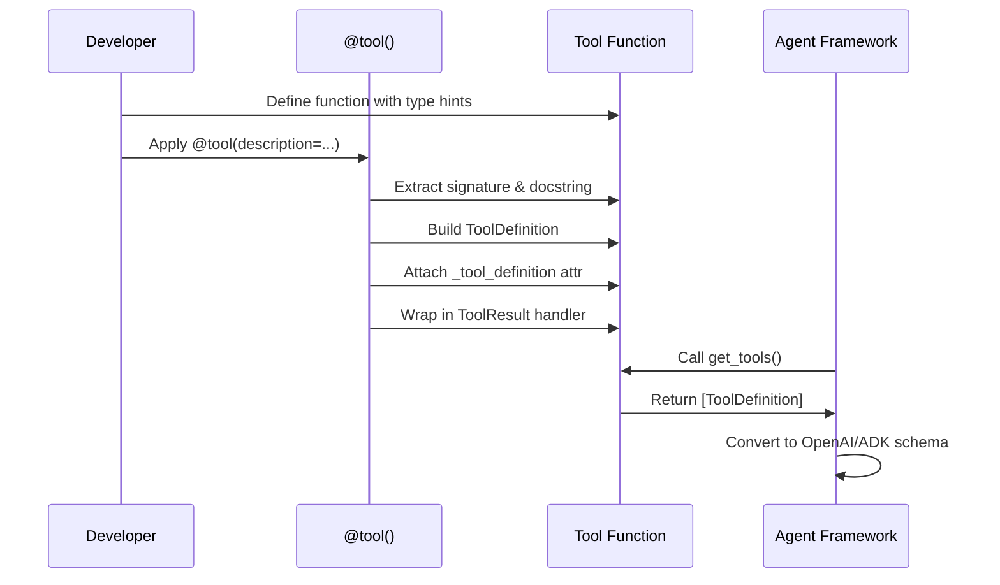
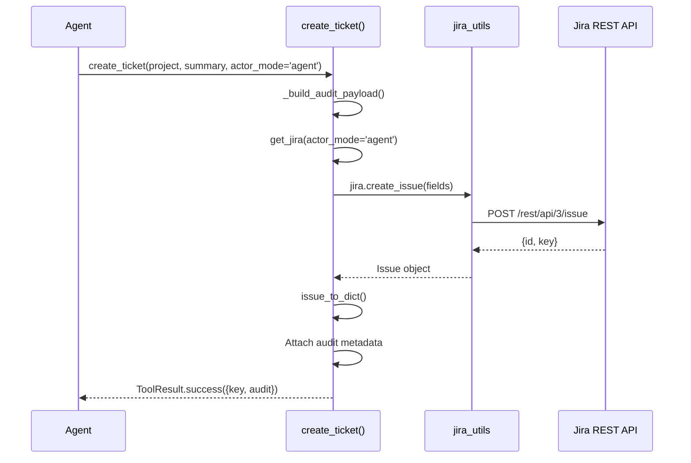
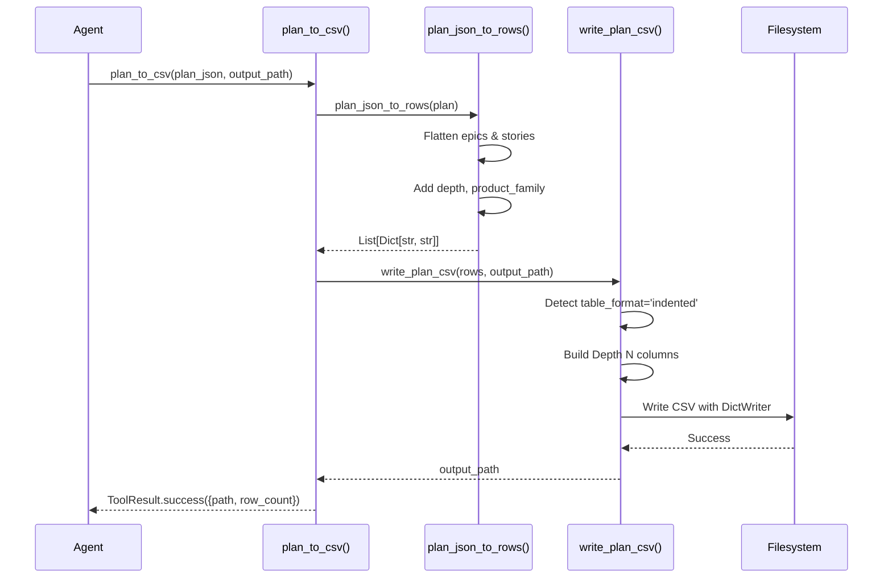

<!-- Generated by Documentation Agent — do not edit between markers -->

```yaml
---
title: "As-Built: Tools — Design Reference"
date: "2026-04-06"
status: "draft"
---
```

# Module Overview

The `tools/` module provides a comprehensive toolkit for the Cornelis Agent Pipeline, exposing Jira, Confluence, GitHub, Excel, file I/O, knowledge base search, web search, MCP client, and specialized agent tools (Gantt, Drucker, Hemingway) as agent-callable functions. Each tool is decorated with `@tool()` to generate OpenAI/ADK-compatible function schemas, wrapped in `ToolResult` for consistent error handling, and organized into `BaseTool` collections for framework registration. The module acts as the primary interface between agents and external systems, providing both low-level primitives (read/write files, execute JQL) and high-level workflows (build Excel maps, generate documentation, analyze PR hygiene).

# What Changed

**Before:** Tools were scattered across utility modules (`jira_utils.py`, `confluence_utils.py`, etc.) without a unified agent interface. Agents had to call raw utility functions directly, handle errors inconsistently, and manually construct function schemas.

**After:** All tools are centralized in `tools/`, decorated with `@tool()` for automatic schema generation, wrapped in `ToolResult` for uniform error handling, and grouped into `BaseTool` collections. The `@tool` decorator extracts parameter metadata from type hints and docstrings, eliminating manual schema maintenance. Recent additions include Jira filter creation (`create_filter`), Confluence Jira macro builders (`build_jira_jql_table`, `build_jira_filter_table`), and plan export tools (`plan_to_csv`, `plan_json_to_dict_rows`).

**Impact:** Agents can now discover and invoke tools via standardized schemas. The pipeline is more maintainable (single source of truth for tool definitions) and extensible (new tools auto-register). Downstream consumers (Excel export, Confluence publishing) benefit from consistent error reporting and metadata.

# Component Diagram

```mermaid
graph TB
    subgraph "Tool Framework"
        base[base.py<br/>@tool decorator<br/>ToolResult<br/>BaseTool]
    end
    
    subgraph "External System Tools"
        jira[jira_tools.py<br/>JiraTools]
        confluence[confluence_tools.py<br/>ConfluenceTools]
        github[github_tools.py<br/>GitHubTools]
    end
    
    subgraph "Data Tools"
        excel[excel_tools.py<br/>ExcelTools]
        file[file_tools.py<br/>FileTools]
        plan[plan_export_tools.py<br/>PlanExportTools]
    end
    
    subgraph "Search & Knowledge"
        knowledge[knowledge_tools.py<br/>KnowledgeTools]
        web[web_search_tools.py<br/>WebSearchTools]
        mcp[mcp_tools.py<br/>MCPTools]
    end
    
    subgraph "Specialized Agents"
        gantt[agents/gantt/tools.py<br/>GanttTools]
        drucker[agents/drucker/tools.py<br/>DruckerTools]
        hemingway[agents/hemingway/tools.py<br/>HemingwayTools]
    end
    
    subgraph "Utilities"
        drawio[drawio_tools.py<br/>DrawioTools]
        vision[vision_tools.py<br/>VisionTools]
    end
    
    base --> jira
    base --> confluence
    base --> github
    base --> excel
    base --> file
    base --> plan
    base --> knowledge
    base --> web
    base --> mcp
    base --> gantt
    base --> drucker
    base --> hemingway
    base --> drawio
    base --> vision
    
    jira -.->|wraps| jira_utils[jira_utils.py]
    confluence -.->|wraps| confluence_utils[confluence_utils.py]
    github -.->|wraps| github_utils[github_utils.py]
    excel -.->|wraps| excel_utils[excel_utils.py]
```

# Key Flows

## Flow 1: Tool Registration and Schema Generation



**Description:** When a developer decorates a function with `@tool()`, the decorator inspects the function signature, extracts parameter types from type hints, parses descriptions from the docstring, and constructs a `ToolDefinition` object. This definition is attached to the wrapped function as `_tool_definition` and can be retrieved by the agent framework to generate OpenAI function calling schemas or ADK tool schemas. The wrapper also ensures all tool executions return `ToolResult` for consistent error handling.

## Flow 2: Jira Ticket Creation with Audit Trail



**Description:** When an agent calls `create_ticket()`, the tool first builds an audit payload capturing `actor_mode`, `requested_by`, `executed_by`, and timestamp. It then retrieves a Jira connection scoped to the specified actor (requester, agent, or admin) via `get_jira(actor_mode)`. The tool delegates to `jira_utils.create_issue()`, which calls the Jira REST API. On success, the tool converts the raw Jira issue to a normalized dict via `issue_to_dict()`, attaches audit metadata, and returns a `ToolResult.success()` with the ticket key and audit trail.

## Flow 3: Plan Export to CSV/Excel



**Description:** When an agent calls `plan_to_csv()`, the tool first converts the feature plan JSON to a flat list of row dicts via `plan_json_to_rows()`. This function iterates over epics and stories, extracting fields like `summary`, `components`, `complexity`, and `depth`, and appends plan-specific metadata (`product_family`, `acceptance_criteria`). The rows are then passed to `write_plan_csv()`, which detects the table format (indented vs. flat) and writes the CSV using Python's `csv.DictWriter`. The tool returns a `ToolResult` with the output path and row count.

# Data Model

## Core Data Structures

### ToolResult
```python
@dataclass
class ToolResult:
    status: ToolStatus          # SUCCESS | ERROR | PENDING
    data: Any = None            # Result payload (if successful)
    error: Optional[str] = None # Error message (if failed)
    metadata: Dict[str, Any]    # Execution metadata (tokens, timing, etc.)
```

**Purpose:** Uniform return type for all tool executions. Agents check `is_success` before accessing `data`. The `metadata` dict stores execution context (e.g., `tokens_used`, `model_used`, `audit_trail`).

### ToolDefinition
```python
@dataclass
class ToolDefinition:
    name: str                   # Function name
    description: str            # Tool purpose (from docstring)
    parameters: List[ToolParameter]
    returns: str                # Return value description
    func: Callable              # Actual function to execute
```

**Purpose:** Metadata container for tool registration. The `to_function_schema()` method converts this to OpenAI function calling format, and `to_adk_tool()` converts to Google ADK format.

### ToolParameter
```python
@dataclass
class ToolParameter:
    name: str
    type: str                   # JSON schema type (string, integer, array, etc.)
    description: str
    required: bool = True
    default: Any = None
    enum: Optional[List[Any]] = None
```

**Purpose:** Describes a single tool parameter. The `to_schema()` method generates JSON schema fragments for OpenAI/ADK.

## State Management

- **Jira Connection Cache:** `jira_utils.get_connection()` maintains a singleton JIRA client per actor mode (requester, agent, admin). Tools call `get_jira(actor_mode)` to retrieve the cached connection.
- **MCP Tool Catalogue:** `mcp_tools._tool_cache` caches the list of tools from the MCP server to avoid repeated discovery calls.
- **Knowledge File Index:** `knowledge_tools._find_knowledge_files()` scans `data/knowledge/` on each search; no persistent index.

# Dependencies

| Dependency | Purpose | Version |
|------------|---------|---------|
| `jira` | Jira REST API client | 3.x |
| `atlassian-python-api` | Confluence REST API client | 3.x |
| `PyGithub` | GitHub REST API client | 2.x |
| `openpyxl` | Excel file I/O | 3.x |
| `python-pptx` | PowerPoint parsing | 0.6.x |
| `PyMuPDF` / `pdfplumber` / `PyPDF2` | PDF text extraction | Latest |
| `python-docx` | DOCX text extraction | 0.8.x |
| `requests` | HTTP client for MCP/web search | 2.x |
| `Pillow` | Image metadata extraction | 10.x |
| `dotenv` | Environment variable loading | 1.x |
| `core.tickets` | Jira issue normalization (`issue_to_dict`) | Internal |
| `core.utils` | ADF text extraction (`extract_text_from_adf`) | Internal |
| `config.env_loader` | Dry-run resolution (`resolve_dry_run`) | Internal |
| `config.jira_identity` | Actor mode normalization (`get_jira_actor_email`) | Internal |

# Configuration

## Environment Variables

| Variable | Purpose | Default |
|----------|---------|---------|
| `JIRA_URL` | Jira instance URL | `https://cornelisnetworks.atlassian.net` |
| `JIRA_EMAIL` | Jira user email (requester mode) | Required |
| `JIRA_API_TOKEN` | Jira API token (requester mode) | Required |
| `JIRA_AGENT_EMAIL` | Jira agent service account email | Optional |
| `JIRA_AGENT_API_TOKEN` | Jira agent service account token | Optional |
| `JIRA_ADMIN_EMAIL` | Jira admin service account email | Optional |
| `JIRA_ADMIN_API_TOKEN` | Jira admin service account token | Optional |
| `CONFLUENCE_URL` | Confluence instance URL | Same as `JIRA_URL` |
| `CONFLUENCE_EMAIL` | Confluence user email | Same as `JIRA_EMAIL` |
| `CONFLUENCE_API_TOKEN` | Confluence API token | Same as `JIRA_API_TOKEN` |
| `GITHUB_TOKEN` | GitHub personal access token | Required for GitHub tools |
| `CORNELIS_MCP_URL` | MCP server endpoint | `http://cn-ai-01.cornelisnetworks.com:50700/mcp` |
| `CORNELIS_AI_API_KEY` | MCP bearer token | Optional |
| `BRAVE_SEARCH_API_KEY` | Brave Search API key | Optional (web search fallback) |
| `TAVILY_API_KEY` | Tavily Search API key | Optional (web search fallback) |
| `DRY_RUN` | Global dry-run flag | `false` |

## Feature Flags

- **`include_description`** (plan export): If `True`, adds a `description` column to CSV/Excel exports. Defaults to `False` to avoid unwieldy files.
- **`table_format`** (plan export): `'indented'` (default) or `'flat'`. Indented format replaces `key` + `depth` with `Depth 0`, `Depth 1`, … columns.
- **`render_diagrams`** (Confluence): If `True`, renders Mermaid diagrams to PNG before publishing. Requires `mmdc` CLI tool.

# Error Handling

## Exception Hierarchy

All tools return `ToolResult` instead of raising exceptions. Errors are captured in `ToolResult.failure(error_message)`. Common error patterns:

- **`FileNotFoundError`** → `ToolResult.failure('File not found: {path}')`
- **`JIRAError`** → `ToolResult.failure('Jira API error: {message}')`
- **`requests.HTTPError`** → `ToolResult.failure('HTTP error: {status_code}')`
- **`ImportError`** → `ToolResult.failure('{library} not installed. Run: pip install {library}')`

## Error Recovery

- **Jira Connection Failures:** Tools call `reset_connection()` to clear the cached client and retry.
- **MCP Unavailable:** `web_search()` falls back to Brave Search, then Tavily.
- **Missing Libraries:** Tools check for optional dependencies (e.g., `openpyxl`, `PyMuPDF`) and return graceful errors with installation instructions.

## Logging

All tools log at `DEBUG` level on entry (e.g., `log.debug(f'create_ticket(project={project}, summary={summary})')`) and `ERROR` level on failure. Successful operations log at `INFO` level with result summaries (e.g., `log.info(f'Created ticket: {key}')`).

# Known Limitations / Technical Debt

## Hardcoded Values

- **`JIRA_URL`**: Defaults to `https://cornelisnetworks.atlassian.net` if not set in environment. Should be required.
- **`KNOWLEDGE_DIR`**: Hardcoded to `data/knowledge`. Should be configurable.
- **`BASE_FIELDS`** (plan export): Hardcoded list of Jira fields. Should be derived from `jira_utils.TICKET_FIELDS`.

## Missing Implementations

- **`drawio_tools._add_ticket_cell()`**: Incomplete fallback implementation for creating draw.io diagrams without `drawio_utilities.py`. Only handles basic box placement; no edge rendering.
- **`vision_tools._parse_roadmap_text()`**: Naive regex-based roadmap extraction. Should use LLM for structured parsing.
- **`knowledge_tools._score_match()`**: Simple keyword frequency scoring. Should use TF-IDF or semantic search.

## Technical Debt

- **Circular Import Risk:** `web_search_tools` lazy-imports `mcp_tools` to avoid circular dependency. Should refactor to use dependency injection.
- **Inconsistent Error Handling:** Some tools (e.g., `read_file`) validate inputs before execution; others (e.g., `create_ticket`) rely on downstream exceptions. Should standardize input validation.
- **Missing Unit Tests:** No test coverage for `@tool` decorator parameter extraction or schema generation.
- **Duplicate Code:** `jira_tools._normalize_comment()` and `jira_tools._normalize_changelog()` have similar ADF extraction logic. Should extract to `core.utils`.

## Anti-Patterns Detected

- **God Class:** `JiraTools` has 40+ public methods (>500 lines). Should split into `JiraReadTools`, `JiraWriteTools`, `JiraSearchTools`.
- **Missing Error Handling:** `mcp_tools._mcp_request()` does not handle SSE parsing errors gracefully (raises `RuntimeError` instead of returning `ToolResult.failure`).
- **Hardcoded Credentials:** `github_tools._get_mcp_api_key()` reads from environment but does not validate format or expiration.

<!-- End Documentation Agent generated content -->