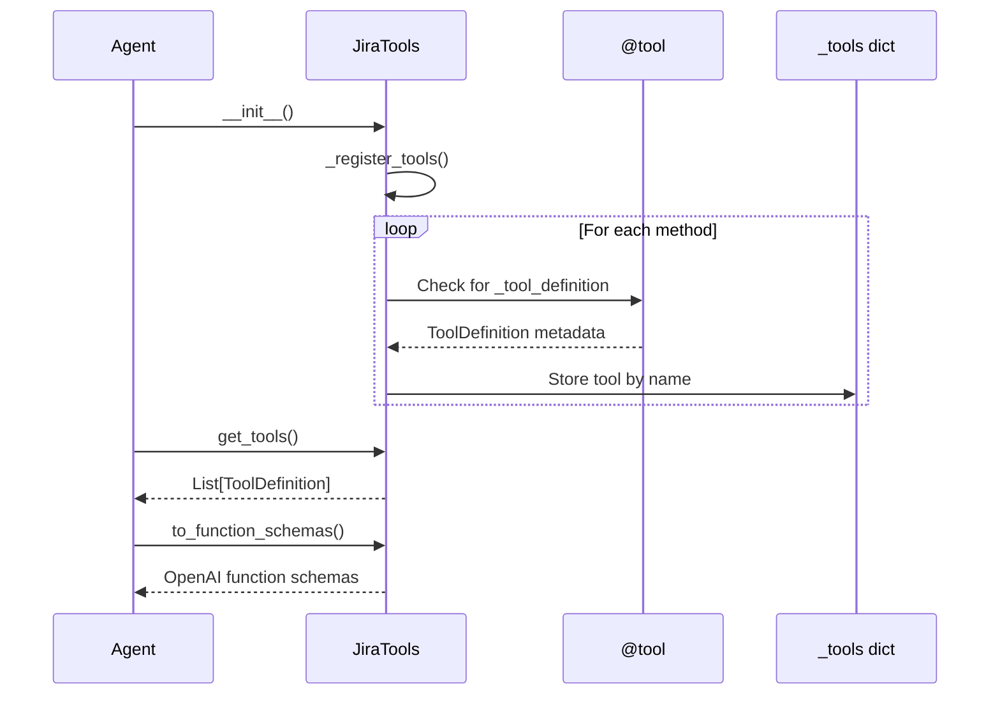
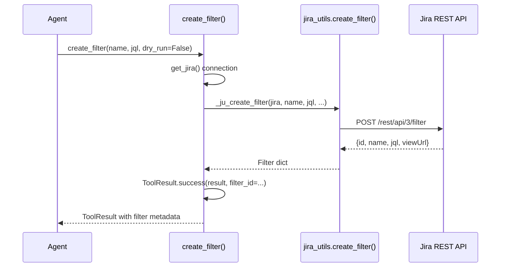
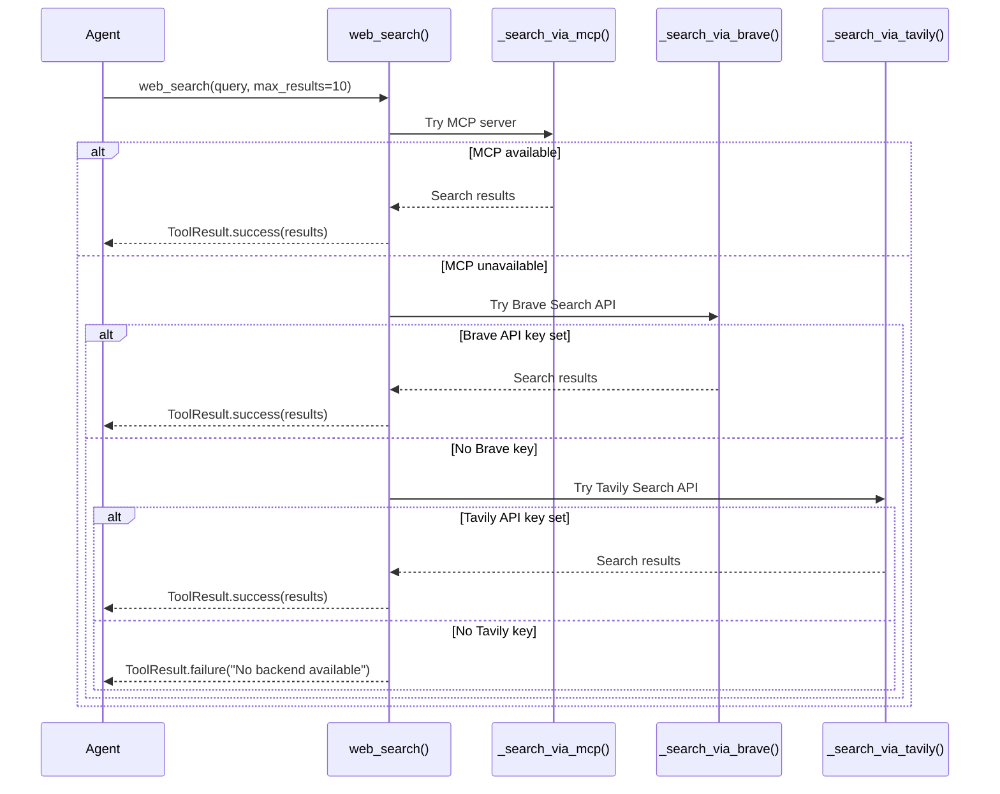

<!-- Generated by Documentation Agent — do not edit between markers -->

```yaml
---
title: "As-Built: Tools — Design Reference"
date: "2026-04-06"
status: "draft"
---
```

# Module Overview

The `tools/` module provides a comprehensive toolkit for agent-based automation of Jira, Confluence, GitHub, Excel, file operations, knowledge base search, web search, vision/OCR, and Model Context Protocol (MCP) integrations. Each tool is exposed through a consistent `@tool` decorator interface that wraps underlying utility modules (`jira_utils.py`, `confluence_utils.py`, etc.) and returns `ToolResult` objects for uniform error handling and data serialization. The module supports both programmatic invocation by agents and direct CLI usage for many operations.

# What Changed

**Before:** The tools module provided basic Jira and Confluence operations with limited support for advanced workflows like filter creation, Jira macro embedding, or multi-backend web search.

**After:** 
- Added `create_filter()` tool in `jira_tools.py` to create saved Jira filters programmatically
- Added `build_jira_jql_table()` and `build_jira_filter_table()` tools in `confluence_tools.py` to generate live Jira Issues macros for embedding in Confluence pages
- Enhanced web search tools to support multiple backends (MCP, Brave, Tavily) with automatic fallback

**Impact:** Agents can now create reusable Jira filters, embed dynamic Jira tables in Confluence documentation, and perform web searches even when the MCP server is unavailable. This enables more sophisticated documentation workflows and reduces manual filter management overhead.

# Component Diagram

```mermaid
graph TB
    subgraph "Tool Collections"
        JiraTools[JiraTools]
        ConfluenceTools[ConfluenceTools]
        FileTools[FileTools]
        KnowledgeTools[KnowledgeTools]
        WebSearchTools[WebSearchTools]
        MCPTools[MCPTools]
        ExcelTools[ExcelTools]
        VisionTools[VisionTools]
        GanttTools[GanttTools]
        DruckerTools[DruckerTools]
        HemingwayTools[HemingwayTools]
    end
    
    subgraph "Core Infrastructure"
        BaseTool[BaseTool]
        ToolResult[ToolResult]
        ToolDecorator[@tool decorator]
    end
    
    subgraph "Backend Utilities"
        JiraUtils[jira_utils.py]
        ConfluenceUtils[confluence_utils.py]
        ExcelUtils[excel_utils.py]
        GitHubUtils[github_utils.py]
    end
    
    JiraTools --> BaseTool
    ConfluenceTools --> BaseTool
    FileTools --> BaseTool
    
    JiraTools --> JiraUtils
    ConfluenceTools --> ConfluenceUtils
    ExcelTools --> ExcelUtils
    
    ToolDecorator --> ToolResult
    BaseTool --> ToolDecorator
```

# Key Flows

## Flow 1: Tool Registration and Discovery



**Description:** When a tool collection class (e.g., `JiraTools`) is instantiated, it scans all methods decorated with `@tool` and registers them in an internal `_tools` dictionary. The `get_tools()` method returns metadata for all registered tools, and `to_function_schemas()` converts them to OpenAI function calling format for LLM consumption.

## Flow 2: Jira Filter Creation



**Description:** The `create_filter()` tool wraps `jira_utils.create_filter()` to create a saved Jira filter. It validates the JQL query, posts to the Jira REST API, and returns the filter ID and view URL. The `dry_run` parameter allows preview without persistence.

## Flow 3: Multi-Backend Web Search



**Description:** The `web_search()` tool implements a three-tier fallback strategy: (1) Query the Cornelis MCP server for a web search tool, (2) Use Brave Search API if `BRAVE_SEARCH_API_KEY` is set, (3) Use Tavily Search API if `TAVILY_API_KEY` is set. This ensures web search capability even when the MCP server is down.

# Data Model

## ToolResult
```python
@dataclass
class ToolResult:
    status: ToolStatus          # SUCCESS, ERROR, or PENDING
    data: Any = None            # Result payload (dict, list, etc.)
    error: Optional[str] = None # Error message if status=ERROR
    metadata: Dict[str, Any]    # Additional context (e.g., token counts)
```

## ToolDefinition
```python
@dataclass
class ToolDefinition:
    name: str                   # Function name (e.g., 'create_filter')
    description: str            # Human-readable description
    parameters: List[ToolParameter]  # Input parameter specs
    returns: str                # Return value description
    func: Callable              # Actual function to execute
```

## ToolParameter
```python
@dataclass
class ToolParameter:
    name: str                   # Parameter name
    type: str                   # JSON schema type (string, integer, etc.)
    description: str            # Parameter description
    required: bool = True       # Whether parameter is required
    default: Any = None         # Default value if not provided
    enum: Optional[List[Any]]   # Allowed values for enum types
```

# Dependencies

| Dependency | Purpose | Version |
|------------|---------|---------|
| `jira_utils` | Jira API operations | Internal |
| `confluence_utils` | Confluence API operations | Internal |
| `excel_utils` | Excel file manipulation | Internal |
| `github_utils` | GitHub API operations | Internal |
| `jira` (atlassian-python-api) | Jira REST client | 3.x |
| `requests` | HTTP client for MCP/web search | 2.x |
| `openpyxl` | Excel file I/O | 3.x |
| `python-pptx` | PowerPoint parsing | 0.6.x |
| `PyMuPDF` / `pdfplumber` / `PyPDF2` | PDF text extraction | Various |
| `python-docx` | DOCX text extraction | 0.8.x |
| `PIL` (Pillow) | Image processing | 9.x |

# Configuration

## Environment Variables

| Variable | Purpose | Default |
|----------|---------|---------|
| `JIRA_URL` | Jira instance URL | `https://cornelisnetworks.atlassian.net` |
| `JIRA_EMAIL` | Jira user email | Required |
| `JIRA_API_TOKEN` | Jira API token | Required |
| `CONFLUENCE_URL` | Confluence instance URL | Same as `JIRA_URL` |
| `CONFLUENCE_EMAIL` | Confluence user email | Same as `JIRA_EMAIL` |
| `CONFLUENCE_API_TOKEN` | Confluence API token | Same as `JIRA_API_TOKEN` |
| `CORNELIS_MCP_URL` | MCP server endpoint | `http://cn-ai-01.cornelisnetworks.com:50700/mcp` |
| `CORNELIS_AI_API_KEY` | MCP bearer token | Optional |
| `BRAVE_SEARCH_API_KEY` | Brave Search API key | Optional |
| `TAVILY_API_KEY` | Tavily Search API key | Optional |
| `GITHUB_TOKEN` | GitHub personal access token | Optional |

## Feature Flags

The tools module respects the following feature flags from `config/env_loader.py`:

- `DRY_RUN`: When `True`, write operations (create/update tickets, filters, etc.) are simulated without persisting changes
- `ACTOR_MODE`: Controls which Jira user account is used for write operations (`requester`, `agent`, `admin`)

# Error Handling

All tools follow a consistent error handling pattern:

1. **Input Validation**: Parameter types and required fields are validated before execution
2. **Connection Errors**: Network failures return `ToolResult.failure()` with a descriptive error message
3. **API Errors**: Jira/Confluence API errors are caught and wrapped in `ToolResult.failure()` with the API error code and message
4. **Graceful Degradation**: Tools like `web_search()` fall back to alternative backends when the primary backend is unavailable
5. **Logging**: All errors are logged at `ERROR` level with full exception context

Example error handling in `create_filter()`:

```python
try:
    jira = get_jira()
    result = _ju_create_filter(jira, name=name, jql=jql, ...)
    return ToolResult.success(result, filter_id=str(result.get('id', '')))
except Exception as e:
    log.error(f'Failed to create filter: {e}')
    return ToolResult.failure(f'Failed to create filter: {e}')
```

# Known Limitations / Technical Debt

## Hardcoded Values
- **`JIRA_URL` default**: Hardcoded to `https://cornelisnetworks.atlassian.net` in multiple files (`jira_tools.py`, `confluence_tools.py`). Should be centralized in `config/`.
- **MCP server URL**: Hardcoded default in `mcp_tools.py` and `web_search_tools.py`. Should use a shared config constant.
- **Knowledge base path**: `KNOWLEDGE_DIR = 'data/knowledge'` is hardcoded in `knowledge_tools.py`. Should be configurable via environment variable.

## Missing Error Handling
- **`read_file()` in `file_tools.py`**: Does not validate file permissions before attempting to read. Could fail with cryptic errors on permission-denied scenarios.
- **`_search_via_brave()` and `_search_via_tavily()`**: Do not handle rate limiting (HTTP 429) gracefully. Should implement exponential backoff.
- **`extract_roadmap_from_ppt()` and `extract_roadmap_from_excel()`**: Assume well-formed input files. Malformed PowerPoint/Excel files can cause unhandled exceptions.

## Circular Dependencies
- **`web_search_tools.py` → `mcp_tools.py`**: Lazy import pattern (`_get_mcp_tools()`) is used to avoid circular import, but this is fragile. Should refactor to eliminate the circular dependency.

## God Classes
- **`JiraTools` (300+ lines, 40+ public methods)**: Violates single responsibility principle. Should be split into `JiraTicketTools`, `JiraFilterTools`, `JiraWorkflowTools`, etc.
- **`ConfluenceTools` (200+ lines, 15+ public methods)**: Should be split into `ConfluencePageTools` and `ConfluenceMacroTools`.

## Missing Implementations
- **`plan_export_tools.py`**: The `_read_excel_rows()` function is truncated in the source file (line 582 cuts off mid-import). This will cause runtime errors when attempting to read Excel files.
- **`vision_tools.py`**: The `_parse_roadmap_excel()` function is truncated (line 300+ cuts off). This will cause runtime errors when extracting roadmaps from Excel.
- **`drawio_tools.py`**: The `_add_ticket_cell()` helper function is referenced but not defined in the provided source. This will cause `NameError` at runtime.

## Technical Debt
- **Inconsistent import patterns**: Some modules use `try/except ImportError` with fallback stubs (e.g., `knowledge_tools.py`), while others raise `RuntimeError` on missing dependencies (e.g., `mcp_tools.py`). Should standardize on one approach.
- **Duplicate code**: The `_normalize_comment()` and `_normalize_changelog()` functions in `jira_tools.py` have similar structure and could be refactored to share a common normalization helper.
- **Missing type hints**: Many helper functions (e.g., `_strip_html()`, `_parse_org_node()` in `drawio_tools.py`) lack type hints, making them harder to maintain.
- **No unit tests**: The tools module has no visible test coverage. Critical functions like `create_filter()`, `build_jira_jql_table()`, and `web_search()` should have unit tests with mocked backends.

<!-- End Documentation Agent generated content -->