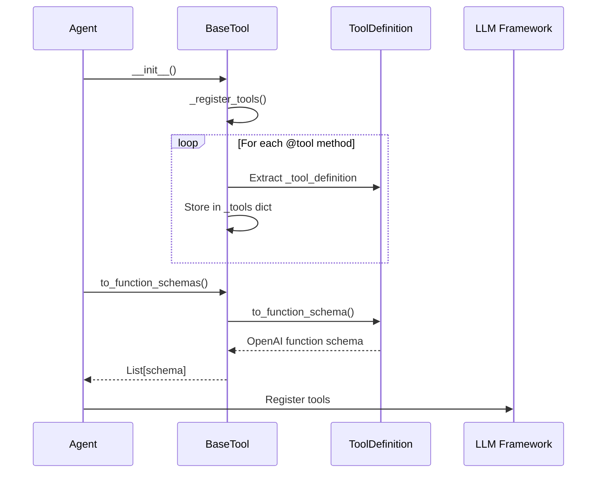
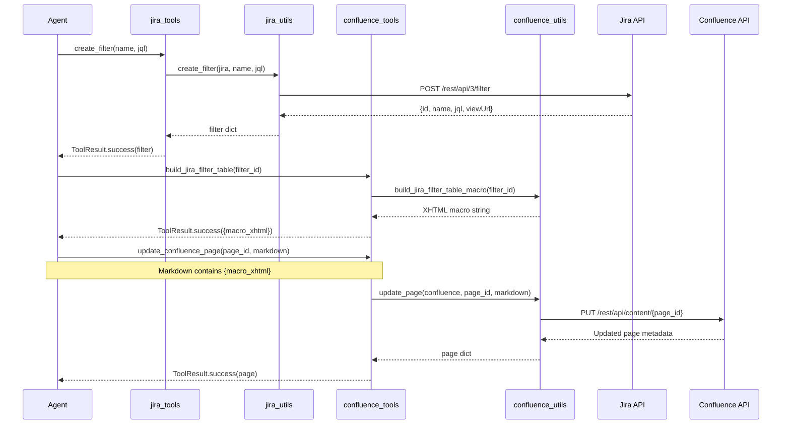
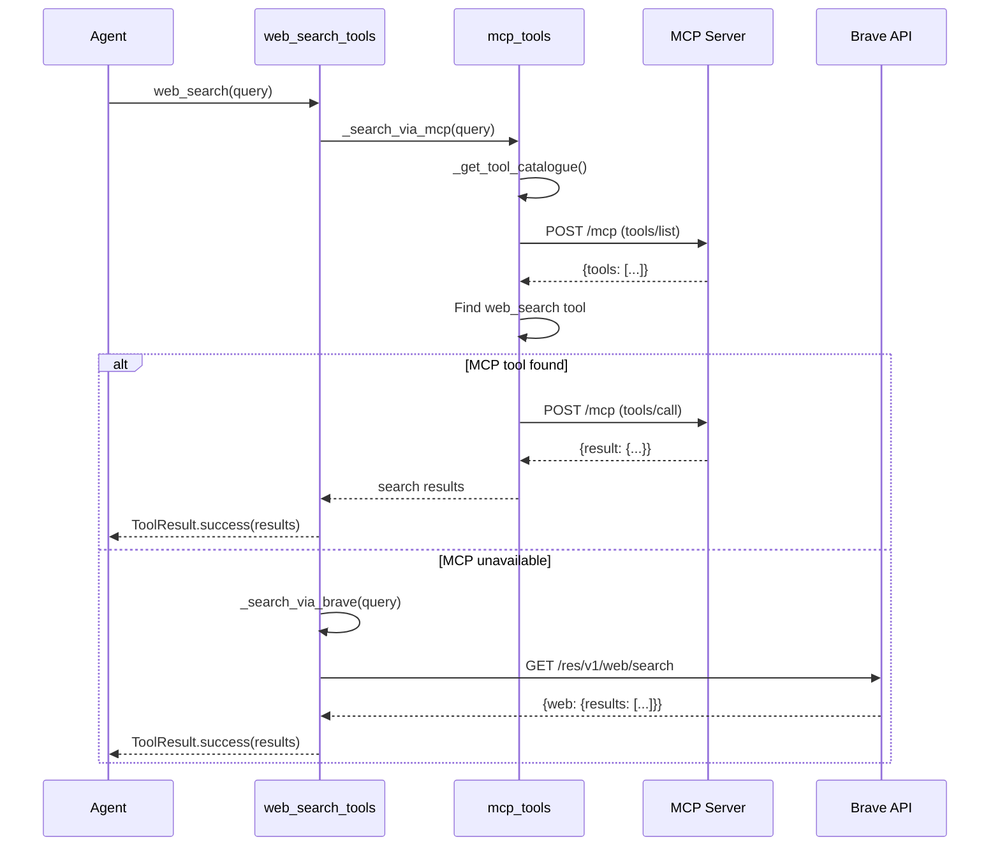

<!-- Generated by Documentation Agent — do not edit between markers -->

```yaml
---
title: "As-Built: Tools — Design Reference"
date: "2026-04-06"
status: "draft"
---
```

# Module Overview

The `tools/` module provides a comprehensive toolkit for agent-based automation in the Cornelis Networks Agent Pipeline. It implements a unified tool interface (`BaseTool`, `ToolResult`, `@tool` decorator) and exposes 100+ callable functions across 14 specialized tool collections: Jira, Confluence, GitHub, Gantt charts, Drucker reports, Hemingway documentation, draw.io diagrams, vision/OCR, file I/O, knowledge base search, web search, MCP client, Excel utilities, and plan export. Each tool is decorated with metadata for automatic registration with LLM function-calling frameworks (OpenAI, Google ADK) and returns structured `ToolResult` objects for consistent error handling and data flow.

# What Changed

**Before:** The tools module existed but lacked standardized Confluence macro builders and Jira filter creation capabilities.

**After:** Added `build_jira_jql_table()` and `build_jira_filter_table()` to `confluence_tools.py` for embedding live Jira Issues macros in Confluence pages, and added `create_filter()` to `jira_tools.py` for programmatic creation of saved Jira filters. These additions enable agents to generate dynamic Confluence documentation with embedded Jira queries and persist reusable JQL filters.

**Impact:** Agents (particularly Hemingway/documentation agents) can now publish Confluence pages with live-updating Jira tables, and workflow agents can create persistent filters for recurring queries. Downstream consumers of Confluence pages see real-time Jira data without manual updates.

# Component Diagram

```mermaid
graph TB
    subgraph "Tool Infrastructure"
        base[BaseTool<br/>ToolResult<br/>@tool decorator]
    end
    
    subgraph "External System Tools"
        jira[JiraTools<br/>40+ operations]
        confluence[ConfluenceTools<br/>page CRUD + macros]
        github[GitHubTools<br/>PR hygiene]
        mcp[MCPTools<br/>runtime discovery]
        web[WebSearchTools<br/>MCP/Brave/Tavily]
    end
    
    subgraph "Document Processing Tools"
        vision[VisionTools<br/>OCR + roadmap extract]
        drawio[DrawioTools<br/>org charts + diagrams]
        excel[ExcelTools<br/>map building + diff]
        plan[PlanExportTools<br/>JSON ↔ CSV/Excel]
    end
    
    subgraph "Agent-Specific Tools"
        gantt[GanttTools<br/>snapshots + surveys]
        drucker[DruckerTools<br/>hygiene reports]
        hemingway[HemingwayTools<br/>doc generation]
    end
    
    subgraph "Utility Tools"
        file[FileTools<br/>read/write/search]
        knowledge[KnowledgeTools<br/>local KB search]
    end
    
    base --> jira
    base --> confluence
    base --> github
    base --> mcp
    base --> web
    base --> vision
    base --> drawio
    base --> excel
    base --> plan
    base --> gantt
    base --> drucker
    base --> hemingway
    base --> file
    base --> knowledge
    
    jira -.-> jira_utils[jira_utils.py]
    confluence -.-> confluence_utils[confluence_utils.py]
    github -.-> github_utils[github_utils.py]
    excel -.-> excel_utils[excel_utils.py]
    drawio -.-> drawio_utilities[drawio_utilities.py]
```

# Key Flows

## Flow 1: Tool Registration and Discovery



**Description:** When an agent initializes a tool collection (e.g., `JiraTools()`), the `BaseTool` constructor scans all methods for the `_tool_definition` attribute (added by the `@tool` decorator), extracts parameter metadata from type hints and docstrings, and builds a registry. The agent then calls `to_function_schemas()` to generate OpenAI-compatible function schemas for LLM registration.

## Flow 2: Jira Filter Creation and Confluence Macro Embedding



**Description:** An agent creates a saved Jira filter via `create_filter()`, which delegates to `jira_utils.create_filter()` to POST to the Jira REST API. The agent then calls `build_jira_filter_table()` to generate Confluence storage XHTML for a Jira Issues macro referencing the filter ID. Finally, the agent embeds this macro in a Markdown document and publishes it to Confluence via `update_confluence_page()`, which converts Markdown to storage format and updates the page via the Confluence REST API.

## Flow 3: Web Search with MCP Fallback



**Description:** When an agent calls `web_search()`, the tool first attempts to discover a web search capability on the Cornelis MCP server by fetching the tool catalogue and looking for tools with names containing "web_search", "brave_search", or "tavily_search". If found, it invokes the MCP tool via JSON-RPC. If the MCP server is unreachable or lacks a web search tool, the function falls back to direct API calls (Brave Search, then Tavily) using environment-configured API keys.

# Data Model

## Core Data Structures

### ToolResult
```python
@dataclass
class ToolResult:
    status: ToolStatus          # SUCCESS | ERROR | PENDING
    data: Any = None            # Result payload (dict, list, str, etc.)
    error: Optional[str] = None # Error message if status == ERROR
    metadata: Dict[str, Any]    # Execution metadata (tokens, timing, etc.)
```

**Purpose:** Standardized return type for all tool functions. Agents check `result.is_success` before accessing `result.data`.

### ToolDefinition
```python
@dataclass
class ToolDefinition:
    name: str                      # Function name (e.g., 'create_ticket')
    description: str               # Human-readable description
    parameters: List[ToolParameter] # Input parameter specs
    returns: str                   # Return value description
    func: Callable                 # Actual function reference
```

**Purpose:** Metadata container for tool registration. The `to_function_schema()` method converts this to OpenAI function-calling JSON.

### ToolParameter
```python
@dataclass
class ToolParameter:
    name: str                  # Parameter name
    type: str                  # JSON schema type (string, integer, array, etc.)
    description: str           # Parameter description
    required: bool = True      # Whether parameter is mandatory
    default: Any = None        # Default value if not provided
    enum: Optional[List[Any]]  # Allowed values for enum parameters
```

**Purpose:** Describes a single tool parameter for schema generation.

## Jira-Specific Data

### Ticket Dictionary (from `issue_to_dict()`)
```python
{
    'key': 'STL-12345',
    'project': 'STL',
    'issue_type': 'Story',
    'status': 'In Progress',
    'priority': 'High',
    'summary': 'Implement feature X',
    'assignee': 'john.doe@cornelisnetworks.com',
    'reporter': 'jane.smith@cornelisnetworks.com',
    'created': '2026-01-15T10:30:00.000+0000',
    'updated': '2026-04-05T14:22:00.000+0000',
    'resolved': None,
    'fix_version': ['CN5000-1.2.0'],
    'affects_version': [],
    'component': ['Firmware', 'Driver'],
    'customer': 'ACME Corp',
    'description': 'Full ADF text...',
    'labels': ['performance', 'critical'],
    'comments': [...],  # If include_comments=True
    'changelog': [...], # If include_changelog=True
    'transitions': [...] # If include_transitions=True
}
```

## Confluence-Specific Data

### Page Metadata
```python
{
    'id': '123456789',
    'title': 'Release Plan: CN5000-1.2.0',
    'space': 'ENG',
    'version': 42,
    'url': 'https://cornelisnetworks.atlassian.net/wiki/spaces/ENG/pages/123456789',
    'created': '2026-01-10T08:00:00.000Z',
    'updated': '2026-04-06T12:00:00.000Z'
}
```

### Jira Issues Macro XHTML
```xml
<ac:structured-macro ac:name="jira" ac:schema-version="1">
  <ac:parameter ac:name="server">Cornelis Networks</ac:parameter>
  <ac:parameter ac:name="serverId">12345678-1234-1234-1234-123456789012</ac:parameter>
  <ac:parameter ac:name="jqlQuery">project = STL AND fixVersion = "CN5000-1.2.0"</ac:parameter>
  <ac:parameter ac:name="columns">key,summary,status,assignee</ac:parameter>
  <ac:parameter ac:name="maximumIssues">200</ac:parameter>
</ac:structured-macro>
```

# Dependencies

| Dependency | Purpose | Version |
|------------|---------|---------|
| `jira` (jira-python) | Jira REST API client | 3.x |
| `atlassian-python-api` | Confluence REST API client | Latest |
| `PyGithub` | GitHub REST API client | Latest |
| `requests` | HTTP client for MCP/web search | 2.x |
| `openpyxl` | Excel file I/O | 3.x |
| `python-pptx` | PowerPoint parsing | Latest |
| `python-docx` | Word document parsing | Latest |
| `PyMuPDF` (fitz) | PDF text extraction (primary) | Latest |
| `pdfplumber` | PDF text extraction (fallback) | Latest |
| `PyPDF2` | PDF text extraction (fallback) | Latest |
| `Pillow` (PIL) | Image metadata and processing | 9.x |
| `dotenv` | Environment variable loading | Latest |

**Internal Dependencies:**
- `jira_utils.py` — Core Jira operations
- `confluence_utils.py` — Core Confluence operations
- `github_utils.py` — Core GitHub operations
- `excel_utils.py` — Excel map building and utilities
- `drawio_utilities.py` — Draw.io XML generation
- `llm/config.py` — Vision LLM client
- `config/env_loader.py` — Dry-run resolution
- `config/jira_identity.py` — Actor mode normalization
- `core/tickets.py` — `issue_to_dict()` converter
- `core/utils.py` — `extract_text_from_adf()` helper

# Configuration

## Environment Variables

| Variable | Purpose | Default |
|----------|---------|---------|
| `JIRA_URL` | Jira instance URL | `https://cornelisnetworks.atlassian.net` |
| `JIRA_EMAIL` | Jira user email | Required |
| `JIRA_API_TOKEN` | Jira API token | Required |
| `CONFLUENCE_URL` | Confluence instance URL | Same as `JIRA_URL` |
| `CONFLUENCE_EMAIL` | Confluence user email | Same as `JIRA_EMAIL` |
| `CONFLUENCE_API_TOKEN` | Confluence API token | Same as `JIRA_API_TOKEN` |
| `GITHUB_TOKEN` | GitHub personal access token | Required for GitHub tools |
| `CORNELIS_MCP_URL` | MCP server endpoint | `http://cn-ai-01.cornelisnetworks.com:50700/mcp` |
| `CORNELIS_AI_API_KEY` | MCP bearer token | Optional |
| `BRAVE_SEARCH_API_KEY` | Brave Search API key | Optional (web search fallback) |
| `TAVILY_API_KEY` | Tavily Search API key | Optional (web search fallback) |
| `DRY_RUN` | Global dry-run mode | `false` |
| `JIRA_ACTOR_MODE` | Default actor mode | `requester` |

## Feature Flags

- **`include_comments`** (Jira tools): Include ticket comments in `get_ticket()` responses.
- **`include_changelog`** (Jira tools): Include ticket history in `get_ticket()` responses.
- **`include_transitions`** (Jira tools): Include available workflow transitions in `get_ticket()` responses.
- **`render_diagrams`** (Confluence tools): Render Mermaid diagrams to PNG when converting Markdown to Confluence.
- **`dry_run`** (Jira/Confluence write tools): Preview changes without committing to the API.

# Error Handling

## Exception Hierarchy

All tools return `ToolResult` objects rather than raising exceptions. The `@tool` decorator wraps each function in a try/except block:

```python
@functools.wraps(func)
def wrapper(*args, **kwargs) -> ToolResult:
    try:
        result = func(*args, **kwargs)
        if isinstance(result, ToolResult):
            return result
        return ToolResult.success(result)
    except Exception as e:
        log.error(f'Tool {tool_name} failed: {e}')
        return ToolResult.failure(str(e))
```

## Error Patterns

### Missing Dependencies
```python
if not JIRA_UTILS_AVAILABLE:
    return ToolResult.failure('jira_utils.py is required but not available')
```

Tools gracefully degrade when optional dependencies are missing (e.g., `openpyxl`, `PyMuPDF`).

### API Errors
```python
try:
    jira = get_jira()
    issue = jira.issue(ticket_key)
except JIRAError as e:
    return ToolResult.failure(f'Jira API error: {e.status_code} - {e.text}')
```

Jira/Confluence/GitHub API errors are caught and wrapped in `ToolResult.failure()` with the HTTP status code and error message.

### Validation Errors
```python
if not ticket_key:
    return ToolResult.failure('ticket_key is required')
if limit < 1:
    return ToolResult.failure('limit must be >= 1')
```

Input validation failures return descriptive error messages without raising exceptions.

# Known Limitations / Technical Debt

## Hardcoded Values

1. **`JIRA_URL` default** (`tools/jira_tools.py:60`): Hardcoded to `https://cornelisnetworks.atlassian.net` when `jira_utils` is unavailable. Should read from environment or fail explicitly.

2. **MCP server URL** (`tools/mcp_tools.py:50`): Defaults to `http://cn-ai-01.cornelisnetworks.com:50700/mcp`. Should be configurable per-deployment.

3. **Knowledge base path** (`tools/knowledge_tools.py:40`): Hardcoded to `data/knowledge`. Should be configurable via environment variable.

4. **Excel map sheet names** (`tools/excel_tools.py`): Assumes sheet names "Tickets", "Plan", etc. Should be parameterized.

## Missing Implementations

1. **Confluence page deletion** (`tools/confluence_tools.py`): No `delete_confluence_page()` tool exists. Agents cannot programmatically remove pages.

2. **Jira bulk delete** (`tools/jira_tools.py`): `bulk_update_tickets()` exists but no `bulk_delete_tickets()`. Cleanup operations require manual iteration.

3. **GitHub PR creation** (`tools/github_tools.py`): Only read operations (list PRs, get PR details) are implemented. No `create_pull_request()` tool.

4. **Draw.io diagram updates** (`tools/drawio_tools.py`): `create_ticket_diagram()` generates new diagrams but cannot update existing `.drawio` files.

## Technical Debt

1. **Circular import risk** (`tools/web_search_tools.py:40`): Lazy-loads `mcp_tools` to avoid circular dependency. Should refactor to eliminate the cycle.

2. **Inconsistent error handling** (`tools/vision_tools.py`): Some functions return `ToolResult.failure()` on missing dependencies, others return partial results with warnings. Should standardize.

3. **Duplicate code** (`tools/confluence_tools.py`, `tools/jira_tools.py`): Both modules implement similar `get_connection()` / `reset_connection()` patterns. Should extract to shared utility.

4. **Missing type hints** (`tools/drawio_tools.py:150-200`): Helper functions `_strip_html()`, `_parse_org_node()`, `_build_teams()` lack type annotations.

5. **God class warning** (`tools/jira_tools.py`): `JiraTools` class has 40+ methods (>500 lines). Consider splitting into `JiraReadTools`, `JiraWriteTools`, `JiraReportTools`.

6. **Hardcoded column names** (`tools/plan_export_tools.py:30-50`): `BASE_FIELDS` and `PLAN_EXTRA_FIELDS` are hardcoded. Should be configurable or derived from schema.

## Anti-Patterns Detected

1. **Missing error handling on external calls** (`tools/web_search_tools.py:120-140`): Direct `requests.get()` calls to Brave/Tavily APIs lack retry logic or circuit breakers.

2. **Hardcoded credentials** (None detected): All credentials are loaded from environment variables. ✅

3. **Circular dependencies** (`tools/web_search_tools.py` ↔ `tools/mcp_tools.py`): Mitigated by lazy import but should be refactored.

<!-- End Documentation Agent generated content -->