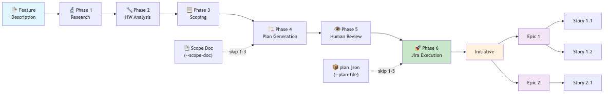

# Agentic Workflows

Agentic workflows are operator-oriented flows orchestrated by [`agent_cli.py`](../agent_cli.py). Each agent also has a standalone CLI. Some workflows are deterministic, while others use an LLM to research, analyze, scope, and plan.

All workflows are invoked via `agent-cli <agent> <command>` or standalone `<agent-name> <command>`. By default, workflows operate in **dry-run mode** — no Jira tickets are created or modified until `--execute` is explicitly passed.

## Table of Contents

- [Gantt Planning Workflows](#gantt-planning-workflows)
  - [Gantt Snapshots](#gantt-snapshots)
  - [Gantt Release Monitor](#gantt-release-monitor)
  - [Gantt Polling Mode](#gantt-polling-mode)
  - [Feature Plan (Scope Document → Jira)](#feature-plan-scope-document--jira)
- [Drucker Hygiene Workflow](#drucker-hygiene-workflow)
  - [Drucker Polling Mode](#drucker-polling-mode)
- [Hypatia Documentation Workflow](#hypatia-documentation-workflow)
- [Bug Report Workflow](#bug-report-workflow)
- [Release Planning Workflow](#release-planning-workflow)
- [Global Workflow Flags](#global-workflow-flags)
- [Workflow Architecture](#workflow-architecture)

---

## Gantt Planning Workflows

Gantt provides three planning-and-delivery capabilities: **snapshots** of a project backlog, **release monitoring** for Jira fix versions, and **feature plans** that produce Jira ticket hierarchies from scope documents.

### Gantt Snapshots

Build, persist, and review Jira-grounded planning snapshots with milestone proposals, dependency views, and risk summaries.

```bash
# Create and persist a new planning snapshot
agent-cli gantt-snapshot --project STL --planning-horizon 120

# Add build/test/release evidence inputs to the snapshot
agent-cli gantt-snapshot --project STL --evidence build.json test.yaml release.md

# List stored snapshots, optionally scoped to one project
agent-cli gantt-snapshot-list --project STL

# Load a stored snapshot by ID and re-export it
agent-cli gantt-snapshot-get --snapshot-id a1b2c3d4 --output stl_snapshot.json
```

Snapshots are stored under `data/gantt_snapshots/<PROJECT>/<SNAPSHOT_ID>/`.

### Gantt Release Monitor

Build, persist, and review release-health reports for one or more Jira fix versions.

```bash
# Create and persist a release monitor report
agent-cli gantt-release-monitor --project STL --releases 12.1.1.x,12.2.0.x

# Scope the report and re-export ad hoc files
agent-cli gantt-release-monitor --project STL --scope-label CN6000 --output stl_release_monitor.json

# List and retrieve stored reports
agent-cli gantt-release-monitor-list --project STL
agent-cli gantt-release-monitor-get --report-id 12345678-1234-1234-1234-123456789abc
```

Release-monitor reports are stored under `data/gantt_release_monitors/<PROJECT>/<REPORT_ID>/`.

### Gantt Polling Mode

Run Gantt as an always-on CLI poller that performs one-shot work on a schedule.

```bash
# Run one Gantt polling cycle (planning snapshot only)
agent-cli gantt-poll --project STL

# Run two cycles with planning + release monitoring and proactive Teams notifications
agent-cli gantt-poll --project STL --run-release-monitor \
  --releases 12.1.1.x --max-cycles 2 --poll-interval 60 --notify-shannon
```

> **Teams integration:** Gantt one-shot tasks can also be triggered from Microsoft Teams via Shannon in `#agent-gantt`, for example `@Shannon /planning-snapshot project_key STL` or `@Shannon /release-monitor project_key STL releases 12.1.1.x`.

### Feature Plan (Scope Document → Jira)

Generate a Jira project plan (Initiative → Epics → Stories) from a scope document, feature description, or previously generated plan. The recommended path is for the engineering team to author a scope document (JSON, Markdown, PDF, or DOCX) and feed it via `--scope-doc`.

```bash
# 1. Generate plan from scope document (dry-run — no tickets created)
agent-cli feature-plan --project STL --feature "SPDM Attestation" \
         --scope-doc scope.json

# 2. Review the generated plan
cat plans/STL-spdm-attestation/plan.md

# 3. Execute: create tickets in Jira under an existing Initiative
agent-cli feature-plan --project STL \
         --plan-file plans/STL-spdm-attestation/plan.json \
         --initiative STL-74071 --execute
```

#### Entry Points

| Entry Point | Phases Executed | Use When |
|-------------|----------------|----------|
| `--scope-doc FILE` | Phases 4–6 (plan → review → execute) | **Recommended** — engineering team provides a scope document |
| `--feature "text"` or `--feature-prompt FILE` | All 6 phases | Starting from scratch — agent does its own research |
| `--plan-file FILE` | Phase 6 only (execute) | You already have a reviewed `plan.json` |

#### Feature Plan Flags

| Flag | Description |
|------|-------------|
| `--feature TEXT` | Feature description string |
| `--feature-prompt FILE` | Rich feature prompt file (Markdown) — takes precedence over `--feature` |
| `--scope-doc FILE` | Pre-existing scope document (JSON/MD/PDF/DOCX) — skips research/HW/scoping phases |
| `--plan-file FILE` | Previously generated `plan.json` — skips all agentic phases |
| `--initiative KEY` | Existing Initiative ticket key (e.g. `STL-74071`). If omitted, auto-created. |
| `--execute` | Actually create Jira tickets (default: dry-run) |
| `--force` | Skip duplicate-ticket and DELETE confirmation prompts |
| `--cleanup CSV` | Delete tickets listed in `created_tickets.csv`. Dry-run by default; add `--execute` to delete. |
| `--docs FILE [FILE ...]` | Spec documents / datasheets for the research phase |
| `--output-dir DIR` | Root directory for output (default: `plans/<PROJECT>-<slug>/`) |

#### Output Files

All output lands in `plans/<PROJECT>-<slug>/`:

| File | Description |
|------|-------------|
| `plan.json` | Machine-readable Jira plan (Epics + Stories) |
| `plan.md` | Human-readable Markdown plan |
| `scope.json` | Scoping agent output |
| `research.json` | Research agent output |
| `hw_profile.json` | Hardware analyst output |
| `created_tickets.csv` | Ticket keys created by `--execute` (feed to `--cleanup` to undo) |

---

## Drucker Hygiene Workflow

Build, persist, and review Jira hygiene reports with ticket-level remediation suggestions.

```bash
# Create and persist a Drucker hygiene report
agent-cli drucker-hygiene --project STL

# Tighten the stale threshold and export ad hoc files
agent-cli drucker-hygiene --project STL --stale-days 21 --output stl_hygiene.json
```

Each `drucker-hygiene` run stores a durable copy under `data/drucker_reports/<PROJECT>/<REPORT_ID>/`
and also writes a review-session JSON file alongside the exported report files so the
proposed Jira actions can be reviewed before execution.

> **Teams integration:** Drucker hygiene can also be triggered from Microsoft Teams via `@Shannon /hygiene-run project_key STL` in the `#agent-drucker` channel. See the [Agents section in README](../README.md#agents) for details.

### Drucker Polling Mode

Run Drucker as an always-on CLI poller that executes scheduled hygiene scans and can proactively notify Teams through Shannon.

```bash
# Run one hygiene polling cycle
agent-cli drucker-poll --project STL

# Run two cycles and post the summaries to Shannon
agent-cli drucker-poll --project STL --max-cycles 2 --poll-interval 300 --notify-shannon
```

---

## Hypatia Documentation Workflow

Build, persist, and review source-grounded internal documentation candidates for
repo Markdown and optional Confluence targets.

```bash
# Generate a repo-owned documentation draft
agent-cli hypatia-generate --doc-title "STL Build Notes" --docs README.md AGENTS.md

# Target a specific repo doc path and documentation class
agent-cli hypatia-generate --doc-title "Fabric Bring-Up Guide" \
  --doc-type how_to --docs docs/source.md --target-file docs/fabric-bring-up.md

# Add evidence files and stricter validation for release-note support
agent-cli hypatia-generate --doc-title "Release Notes Support" \
  --doc-type release_note_support --docs notes.md --evidence release.json --doc-validation strict

# Stage a Confluence publication target alongside the repo draft
agent-cli hypatia-generate --doc-title "STL Weekly Summary" \
  --docs README.md --confluence-title "STL Weekly Summary" --confluence-space ENG
```

Each `hypatia-generate` run stores a durable copy under `data/hypatia_docs/<DOC_ID>/`
and writes a review-session JSON plus per-target Markdown patch drafts alongside the
exported record files so publication stays reviewable before execution.

---

## Bug Report Workflow

Generate a cleaned, enriched bug report from a Jira filter.

```bash
# Basic usage — looks up filter by name, pulls tickets, sends to LLM, converts to Excel
agent-cli bug-report --filter "SW 12.1.1 P0/P1 Bugs" --timeout 800

# With verbose logging
agent-cli bug-report --filter "SW 12.1.1 P0/P1 Bugs" --timeout 800 --verbose

# Override the LLM model for this run
agent-cli bug-report --filter "SW 12.1.1 P0/P1 Bugs" --model developer-opus --timeout 800

# Custom prompt file
agent-cli bug-report --filter "My Filter" --prompt my_prompt.md --timeout 600

# With dashboard pivot columns
agent-cli bug-report --filter "SW 12.1.1 P0/P1 Bugs" --d-columns Phase Customer Product Module Priority
```

**Steps performed:**

| Step | Action | Output |
|------|--------|--------|
| 1 | Connect to Jira | — |
| 2 | Look up filter by name from favourite filters | Filter ID |
| 3 | Run filter to get tickets with latest comments | Issues list |
| 4 | Dump tickets to JSON | `<filter_name>.json` |
| 5 | Send JSON + prompt to LLM for analysis | `llm_output.md` + extracted files |
| 6 | Convert any extracted CSV to styled Excel | `<name>.xlsx` |

### Bug Report Flags

| Flag | Description |
|------|-------------|
| `--filter NAME` | Jira filter name to look up (required) |
| `--prompt FILE` | LLM prompt file (default: `config/prompts/cn5000_bugs_clean.md`) |
| `--d-columns COL [COL ...]` | Column names for the Excel Dashboard pivot sheet |
| `--output FILE` | Override output filename |

---

## Release Planning Workflow (Legacy — Removed)

These legacy commands (`--plan`, `--analyze`, `--vision`, `--sessions`, `--resume`) were removed during the `agent-cli` restructure. Use `agent-cli feature-plan` for feature planning workflows.

---

## Global Workflow Flags

These flags apply to all agentic workflows:

| Flag | Description |
|------|-------------|
| `--workflow NAME` | Workflow to run (`bug-report`, `drucker-hygiene`, `drucker-poll`, `feature-plan`, `gantt-poll`, `gantt-release-monitor`, `gantt-release-monitor-get`, `gantt-release-monitor-list`, `gantt-snapshot`, `gantt-snapshot-get`, `gantt-snapshot-list`, `hypatia-generate`) |
| `--project KEY` | Jira project key |
| `--stale-days DAYS` | Stale threshold for `drucker-hygiene` |
| `--poll-interval SECS` | Poll interval for `gantt-poll` and `drucker-poll` |
| `--max-cycles N` | Number of polling cycles (`0` means continuous mode) |
| `--notify-shannon` | Post proactive poller summaries through Shannon |
| `--evidence FILE ...` | Evidence files for workflows that accept build/test/release/meeting context |
| `--doc-title TEXT` | Document title for `hypatia-generate` |
| `--doc-type TYPE` | Documentation class for `hypatia-generate` |
| `--doc-validation PROFILE` | Validation profile for `hypatia-generate` (`default`, `strict`, `sphinx`) |
| `--target-file FILE` | Repo Markdown target for `hypatia-generate` |
| `--confluence-title TITLE`, `--confluence-page PAGE`, `--confluence-space SPACE` | Optional Confluence publication target for `hypatia-generate` |
| `--model MODEL`, `-m` | LLM model name override (e.g. `developer-opus`, `gpt-4o`) |
| `--timeout SECS` | LLM request timeout in seconds |
| `--env FILE` | Load a specific `.env` file |
| `-v`, `--verbose` | Enable verbose (DEBUG-level) logging |
| `-q`, `--quiet` | Minimal stdout output |

---

## Workflow Architecture

### Feature Plan Workflow



> Source: [`docs/diagrams/feature-plan-workflow.mmd`](diagrams/feature-plan-workflow.mmd)

### Bug Report Workflow


> Source: [`docs/diagrams/bug-report-workflow.mmd`](diagrams/bug-report-workflow.mmd)
