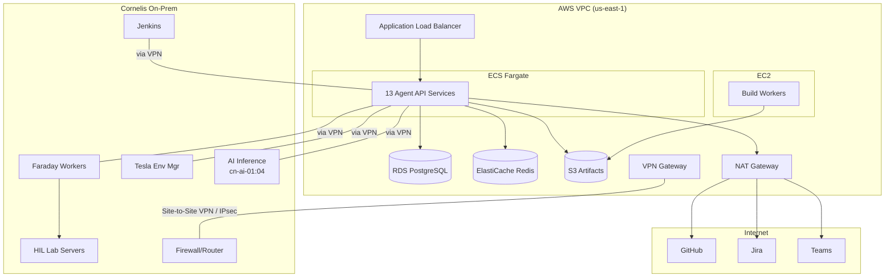

# AWS Hybrid Deployment Proposal

[Back to AI Agent Workforce](../AGENT_WORKFORCE_OVERVIEW.md) | [On-Prem Architecture](INFRASTRUCTURE_ARCHITECTURE.md)

> **Note:** **Proposal:** This is an alternative deployment model. The baseline plan uses on-prem infrastructure (see [Infrastructure Architecture](INFRASTRUCTURE_ARCHITECTURE.md)). This page proposes a hybrid AWS approach where compute runs in the cloud while HIL labs and AI inference stay on-prem.

## Architecture Overview

## Why Consider AWS

| Benefit | Details |
|---------|---------|
| **Elastic compute** | Scale agent services up/down based on demand. Nightly test runs can burst to more workers without permanent hardware. |
| **Managed services** | RDS PostgreSQL, ElastiCache Redis, S3 — no DBA overhead, automatic backups, HA built in. |
| **Availability** | Multi-AZ deployment for agent APIs. No single-host failure takes down the platform. |
| **Separation of concerns** | Cloud handles stateless compute; on-prem handles hardware-specific work (HIL testing, AI inference). Each runs where it's best suited. |
| **No cn-ai host contention** | Agent services don't compete with LLM inference for GPU/CPU on cn-ai hosts. |

## What Runs Where

| Location | Services | Why |
|----------|----------|-----|
| **AWS (cloud)** | All 13 agent API services (Josephine API, Ada, Curie, Hedy, Linus, Babbage, Linnaeus, Herodotus, Hypatia, Nightingale, Drucker, Gantt, Brooks) | Stateless API services. No hardware dependency. Benefit from elastic scaling and managed infrastructure. |
| **AWS (cloud)** | Josephine build workers (EC2) | Builds don't need physical hardware. EC2 provides Docker-in-Docker capability. Spot instances for cost savings. |
| **AWS (cloud)** | PostgreSQL (RDS), Redis (ElastiCache), Artifact Store (S3), ALB, CloudWatch | Managed services eliminate operational overhead. Multi-AZ for HA. |
| **On-prem** | Faraday test workers | Must execute on or near HIL lab hardware. Low-latency access to DUTs, switches, fabric topology. |
| **On-prem** | Tesla environment manager | Manages physical lab reservations. Needs direct access to ATF resource files and lab health probes. |
| **On-prem** | HIL lab servers | Physical hardware — cannot move to cloud. |
| **On-prem** | AI inference hosts (cn-ai-01:04) | GPU-equipped hosts running LLM services. Agents call these via VPN for AI-assisted analysis (code review, doc generation, bug investigation). |
| **On-prem** | Jenkins | Existing CI/CD. Triggers agent workflows. Could migrate to cloud later but not required for v1. |

## Network Architecture

### VPN Connection

AWS and on-prem networks connect via **AWS Site-to-Site VPN** (IPsec tunnels) or **AWS Direct Connect** (dedicated fiber, lower latency).

| Option | Bandwidth | Latency | Cost | Recommendation |
|--------|-----------|---------|------|----------------|
| **Site-to-Site VPN** | Up to 1.25 Gbps per tunnel (2 tunnels) | Variable (internet-dependent) | ~$36/month + data transfer | Start here. Sufficient for agent API traffic and test result transfer. |
| **Direct Connect** | 1-100 Gbps dedicated | Consistent, low | $200-2000+/month + port fees | Upgrade if VPN latency impacts test execution or artifact transfer becomes a bottleneck. |

### Traffic Flows Through VPN

| Flow | Direction | Volume |
|------|-----------|--------|
| Faraday workers ↔ Agent APIs (Ada, Curie, Tesla) | Bidirectional | Low (API calls, test plans, status updates) |
| Faraday workers → S3 (test results, logs) | On-prem → AWS | Medium (test artifacts after each run) |
| Josephine build workers → S3 (build artifacts) | Within AWS | N/A (stays in cloud) |
| Agent APIs → AI inference (cn-ai hosts) | AWS → On-prem | Medium (LLM prompts/responses for Linus, Hypatia, Nightingale, Herodotus) |
| Jenkins → Agent APIs (triggers) | On-prem → AWS | Low (webhook triggers) |
| Tesla ↔ Agent APIs | Bidirectional | Low (reservation requests/grants) |

### DNS & Service Discovery

- **AWS side:** Route 53 private hosted zone for agent service endpoints (e.g., josephine.agents.cornelis.internal)
- **On-prem side:** Internal DNS resolves agent endpoints through VPN
- **Cross-network:** Route 53 Resolver endpoints forward queries between AWS and on-prem DNS

## AWS Services & Estimated Costs

| Service | Configuration | Est. Monthly Cost |
|---------|--------------|-------------------|
| **ECS Fargate** | 13 agent services, 0.5 vCPU / 1GB each, 2 tasks per service | ~$400 |
| **EC2 (build workers)** | 2x c5.2xlarge on-demand + spot burst | ~$500 |
| **RDS PostgreSQL** | db.r6g.large, Multi-AZ, 100GB gp3 | ~$350 |
| **ElastiCache Redis** | cache.r6g.large, single node | ~$150 |
| **S3** | 500GB artifacts, Standard tier | ~$12 |
| **ALB** | 1 load balancer, moderate traffic | ~$25 |
| **Site-to-Site VPN** | 2 tunnels | ~$36 |
| **CloudWatch** | Logs, metrics, alarms | ~$50 |
| **Secrets Manager** | ~20 secrets | ~$8 |
| **NAT Gateway** | Outbound internet for GitHub/Jira/Teams APIs | ~$35 |
| **Data Transfer** | ~100GB/month outbound | ~$9 |
| | **Total Estimated** | **~$1,575/month** |

## Comparison: On-Prem vs AWS Hybrid

| Factor | On-Prem (baseline) | AWS Hybrid (proposal) |
|--------|-------------------|----------------------|
| **Upfront cost** | $0 (existing hardware) | $0 (pay-as-you-go) |
| **Monthly cost** | ~$0 (sunk cost hardware + power) | ~$1,575/month |
| **Ops burden** | High (manage PostgreSQL, Docker, networking, backups) | Low (managed RDS, Fargate, S3, CloudWatch) |
| **Availability** | Single-host risk (cn-ai hosts) | Multi-AZ, auto-recovery |
| **Scaling** | Fixed capacity (4 cn-ai hosts) | Elastic (burst for nightly/release runs) |
| **Network complexity** | Simple (everything on-prem) | Moderate (VPN, cross-network DNS, split traffic) |
| **Latency to HIL labs** | Sub-millisecond (same network) | 5-50ms (VPN dependent) |
| **Latency to AI inference** | Sub-millisecond | 5-50ms (VPN dependent) |
| **Data sovereignty** | All data on-prem | Build artifacts, test results, source refs in AWS. Transcripts stay on-prem (Herodotus can run on-prem if needed). |
| **Time to production** | Faster (no AWS setup) | Slower (VPN setup, IAM, networking) |

## Recommendation

> **Info:** **Start on-prem, plan for cloud.**
>
> Deploy v1 on existing cn-ai hosts (zero cost, faster to production). Design the agent platform with cloud-readiness in mind:
>
> - Containerized services (Docker) — portable to ECS Fargate
> - PostgreSQL — portable to RDS
> - S3-compatible artifact API — use MinIO on-prem, swap to S3 later
> - Environment variables for config — portable to Secrets Manager
>
> Migrate to AWS hybrid when: (a) cn-ai hosts become a bottleneck, (b) availability requirements increase, or (c) operational burden of self-managed PostgreSQL/Docker becomes unsustainable.

## Migration Path

| Step | Action | Prerequisite |
|------|--------|-------------|
| **1** | Establish Site-to-Site VPN between AWS VPC and Cornelis network | Network team approval, firewall rules |
| **2** | Deploy RDS PostgreSQL + ElastiCache Redis in AWS | VPN operational |
| **3** | Migrate agent API services to ECS Fargate (one at a time) | Database accessible from AWS |
| **4** | Move build workers to EC2 | S3 artifact storage configured |
| **5** | Keep Faraday workers + Tesla + HIL labs on-prem permanently | VPN latency acceptable for API calls |
| **6** | Decommission agent services from cn-ai hosts (keep AI inference) | All agents stable in AWS |
