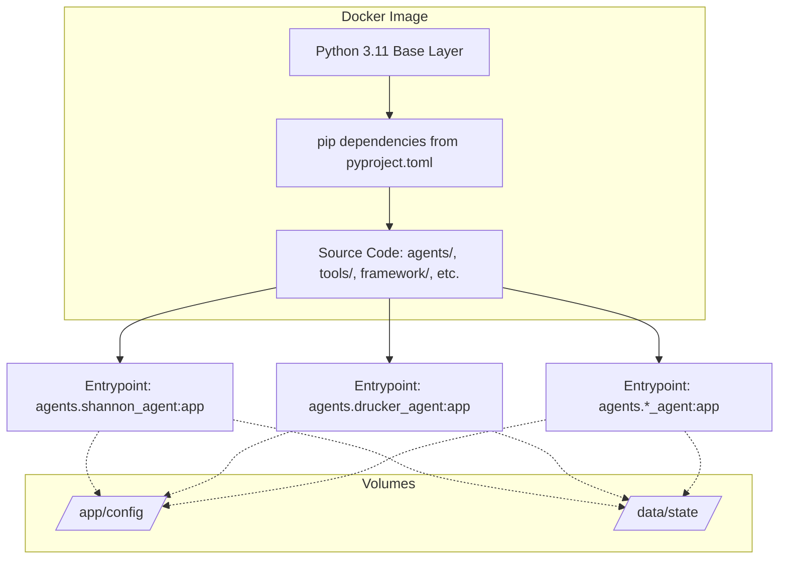
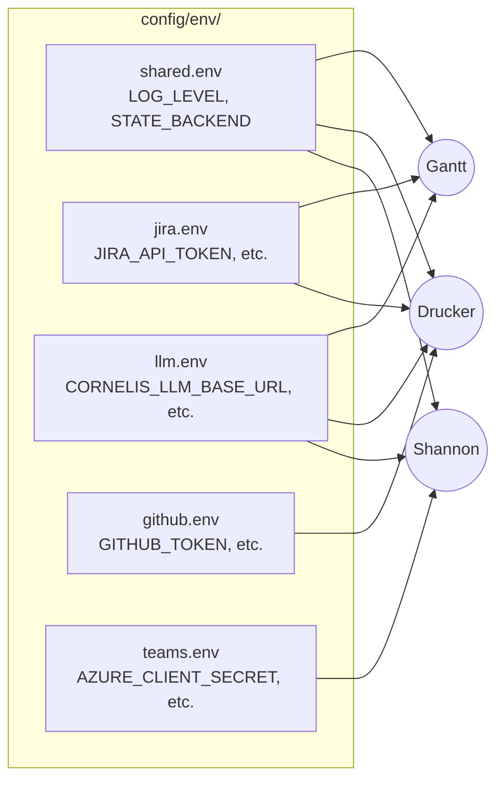
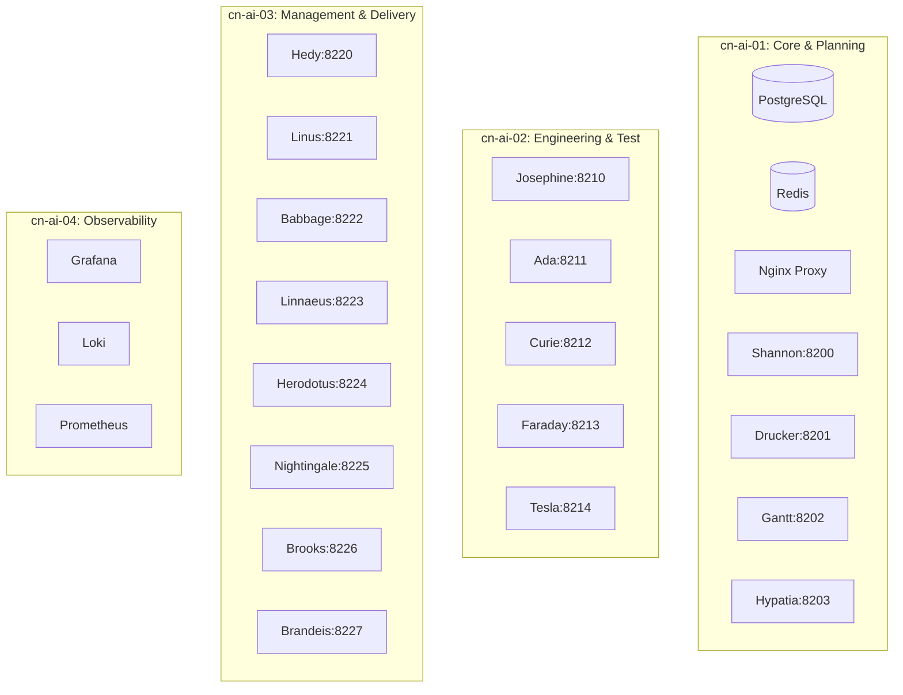
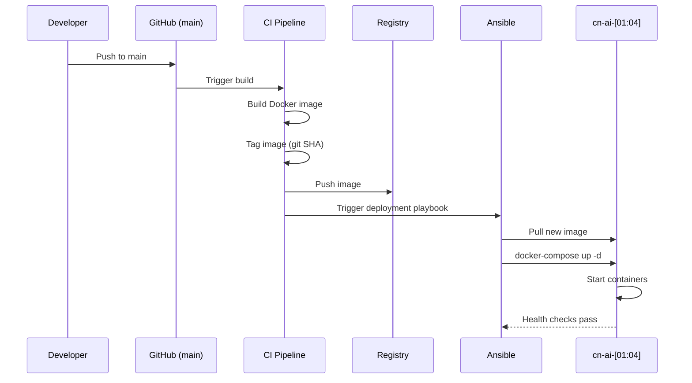

# Deployment Guide

[Back to AI Agent Workforce](README.md) | [Infrastructure Architecture](INFRASTRUCTURE_ARCHITECTURE.md)

## Overview

This guide covers the practical deployment of the Cornelis Networks AI Agent Workforce. It focuses on the on-premise Docker Compose deployment to the `cn-ai-[01:04]` host cluster. The deployment utilizes a single-image, multi-entrypoint pattern where all agents run from the same foundational container image but execute different entrypoint commands.

For information on the underlying platform components, event transport, and security architecture, see the [Infrastructure Architecture](INFRASTRUCTURE_ARCHITECTURE.md) document.

## Container Architecture

The system uses a single Docker image built from the repository root. Each agent starts via a different entrypoint command, leveraging the FastAPI framework app factory (`framework/api/app.py` `create_agent_app()`).



## Docker Image

The single `Dockerfile` at the repository root uses a multi-stage build:

1.  **Builder Stage**: Installs both core dependencies and `[agents]` optional dependencies using `pip`.
2.  **Runtime Stage**: A slim Python 3.11 base image that copies the installed dependencies and all necessary source code.

Copied source directories include: `*.py`, `agents/`, `tools/`, `adapters/`, `config/`, `framework/`, `core/`, `state/`, `llm/`, `data/`.

The entrypoint is configurable via environment variable or command override.

**Example execution:**
```bash
CMD ["uvicorn", "agents.drucker_agent:app", "--host", "0.0.0.0", "--port", "8201"]
```

## Environment File Architecture

The deployment uses a segregated environment file architecture to ensure each container only receives the credentials it needs (least-privilege). Container isolation provides the security boundary.



### Agent Environment Mapping

| Agent | shared.env | jira.env | llm.env | github.env | teams.env |
|-------|------------|----------|---------|------------|-----------|
| Shannon | ✓ | | ✓ | | ✓ |
| Drucker | ✓ | ✓ | ✓ | ✓ | |
| Gantt | ✓ | ✓ | ✓ | | |
| Hypatia | ✓ | | ✓ | | |
| Josephine | ✓ | | | ✓ | |
| Ada | ✓ | | ✓ | | |
| Curie | ✓ | | ✓ | | |
| Faraday | ✓ | | | | |
| Tesla | ✓ | | | | |
| Hedy | ✓ | ✓ | ✓ | ✓ | |
| Linus | ✓ | | ✓ | ✓ | |
| Babbage | ✓ | ✓ | | | |
| Linnaeus | ✓ | ✓ | | | |
| Herodotus | ✓ | | ✓ | | ✓ |
| Nightingale | ✓ | ✓ | ✓ | ✓ | |
| Brooks | ✓ | ✓ | ✓ | | |
| Brandeis | ✓ | | | ✓ | |

## Docker Compose Service Topology

The services are distributed across four hosts (`cn-ai-01` through `cn-ai-04`). Each service definition in the Compose files includes specific configurations for the agent.



### Service Definition Structure
Each service definition includes:
- `image`: The shared workforce image
- `command`: The specific uvicorn entrypoint for the agent
- `ports`: The mapped port (see allocation below)
- `env_file`: The list of environment files based on the mapping table
- `volumes`: Required persistent storage
- `restart`: `unless-stopped`
- `healthcheck`: HTTP GET to `/health`
- `depends_on`: Core services like Redis/Postgres if applicable

## Port Allocation

| Agent | Port | Host |
|-------|------|------|
| Shannon | 8200 | cn-ai-01 |
| Drucker | 8201 | cn-ai-01 |
| Gantt | 8202 | cn-ai-01 |
| Hypatia | 8203 | cn-ai-01 |
| Josephine | 8210 | cn-ai-02 |
| Ada | 8211 | cn-ai-02 |
| Curie | 8212 | cn-ai-02 |
| Faraday | 8213 | cn-ai-02 |
| Tesla | 8214 | cn-ai-02 |
| Hedy | 8220 | cn-ai-03 |
| Linus | 8221 | cn-ai-03 |
| Babbage | 8222 | cn-ai-03 |
| Linnaeus | 8223 | cn-ai-03 |
| Herodotus | 8224 | cn-ai-03 |
| Nightingale | 8225 | cn-ai-03 |
| Brooks | 8226 | cn-ai-03 |
| Brandeis | 8227 | cn-ai-03 |

## Volume Mounts

Containers require persistent storage for specific functions:

- **State files**: `/data/state/` → Used by the `state/` module for local persistence.
- **Config**: `/app/config/` → Agent YAML configurations and markdown prompt files.
- **Logs**: `/data/logs/` → Agent log files (though stdout is preferred for Docker).
- **Artifacts**: `/data/artifacts/` → Build outputs and test results (primarily used by Josephine and Faraday).

## Deployment Workflow



## Health Checks & Monitoring

- **Health Endpoints**: Each agent exposes a `GET /health` endpoint automatically provided by the framework app factory (`create_agent_app()`).
- **Reverse Proxy**: Nginx uses these health checks to manage upstream availability.
- **Metrics**: Prometheus scrapes `/metrics` endpoints provided by the framework.
- **Dashboards**: Grafana provides per-agent dashboards visualizing the scraped metrics.

## Local Development

For local development, the segregated `config/env/` split is not strictly required. Developers typically use `python-dotenv` with a single `.env` file at the repository root. The split environment file architecture is specifically designed for the production Docker Compose deployment to enforce least-privilege.

To run agents locally:
```bash
python -m agents.drucker_agent
# OR
uvicorn agents.drucker_agent:app --reload
```

## Secrets Management Roadmap

- **Phase 1 (Current)**: `.env` files located in `config/env/`, mounted into containers, and ignored by `.gitignore`.
- **Phase 2 (Planned)**: Docker Swarm secrets (if the deployment topology migrates from plain Compose to Swarm).
- **Phase 3 (Future)**: HashiCorp Vault integration with short-lived credentials for ultimate security.
