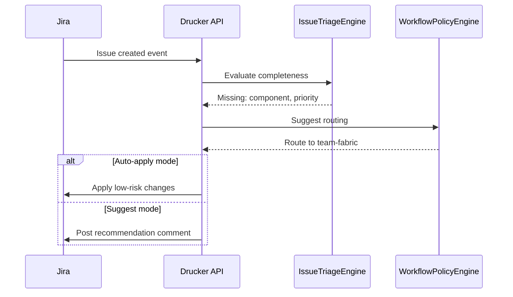
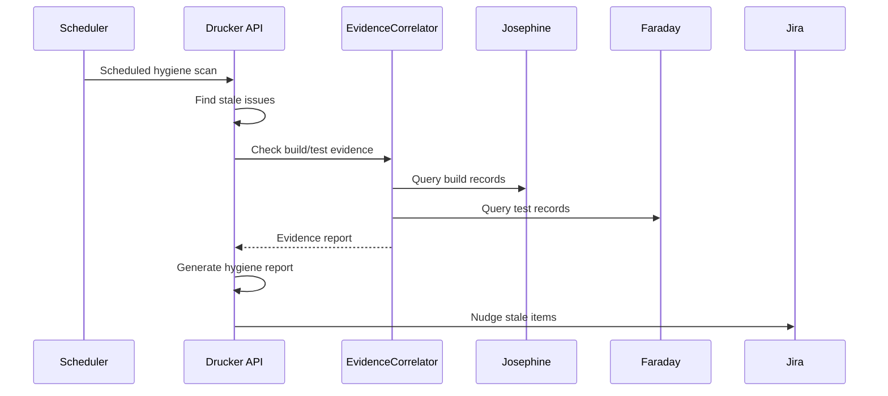

# Drucker Jira Coordinator Plan

## Summary
Drucker should be the Jira workflow-coordination agent for the platform. Its v1 job is to keep Jira operationally coherent: triage incoming issues, enforce workflow hygiene, route work to the right owners or queues, and apply evidence-backed status nudges based on build, test, release, and traceability signals.

Drucker should not replace Jira as the system of record. It should make Jira cleaner, more current, and more trustworthy.

## Product definition
### Goal
- consume Jira issue events and scheduled hygiene checks
- detect missing required metadata, stale workflow state, and routing mistakes
- correlate issue state with technical evidence from Josephine, Faraday, Hedy, Babbage, and Linnaeus
- propose or apply safe Jira workflow updates under policy
- produce durable triage, routing, and workflow-audit records

### Non-goals for v1
- replacing Hedy release decisions
- replacing Linnaeus traceability ownership
- replacing Herodotus meeting follow-up capture
- replacing Gantt planning or Brooks delivery reporting
- autonomous closure or reprioritization of important issues without approval

### Position in the system
- Jira remains the work and defect source of truth
- Linnaeus owns exact linkage between issues, builds, tests, and releases
- Hedy owns release-state decisions and release-facing Jira interactions
- Herodotus may suggest new follow-up items from meetings
- Drucker keeps issue workflow, assignment, and field hygiene aligned with those signals

## Triggering model
- Drucker should run as an always-on Jira coordination service.
- Normal work should start from Jira issue events, direct issue-evaluation requests, and scheduled hygiene scans for stale or incomplete work.
- Humans should be able to approve, apply, or suppress workflow actions and write-backs under policy.

## Architecture
### Core design
Drucker should be split into these concerns:
- `IssueTriageEngine`: classifies new or changed issues and determines required metadata
- `WorkflowPolicyEngine`: evaluates allowed transitions, stale-state rules, and field completeness
- `RoutingCoordinator`: proposes or applies assignment, component, label, or queue changes
- `EvidenceCorrelator`: pulls build, test, release, and traceability facts into issue context
- `JiraWritebackCoordinator`: performs approval-backed comments, links, and safe field updates

Required internal objects:
- `IssueCoordinationRequest`
- `IssueCoordinationRecord`
- `WorkflowRecommendation`
- `RoutingDecision`
- `IssueAuditRecord`

### Jira grounding
Drucker should be grounded in the existing Jira integration model already present in `fuze`:
- `fuze/plugins/jirafuze.py` already creates release tickets, links fixVersion issues, closes versions, and drives stage-based transitions
- `fuze/plugins/drivers/atlassian/_jira.py` already provides a basic Jira adapter for JQL search and transitions
- the new agent should reuse a service-grade Jira adapter layer rather than re-implement ad hoc Jira calls in multiple agents

Grounding references:
- [fuze/plugins/jirafuze.py](/Users/johnmacdonald/code/cornelis/fuze/plugins/jirafuze.py)
- [fuze/plugins/drivers/atlassian/_jira.py](/Users/johnmacdonald/code/cornelis/fuze/plugins/drivers/atlassian/_jira.py)
- [fuze/docs/source/fuze-workspaces.rst](/Users/johnmacdonald/code/cornelis/fuze/docs/source/fuze-workspaces.rst)

## Coordination model
### Inputs
- Jira issue create/update events
- stale-issue scan triggers
- assignee, component, priority, and release-field changes
- traceability context from Linnaeus
- build/package evidence from Josephine
- test execution evidence from Faraday
- release-state evidence from Hedy
- version context from Babbage
- optional action-item candidates from Herodotus

### Outputs
Drucker should produce:
- metadata-completeness flags
- triage comments
- routing recommendations
- safe workflow-transition recommendations
- assignment or queue recommendations
- issue hygiene summaries

### Coordination rules
- every recommendation must cite the rule or evidence that caused it
- write-backs should prefer comments, labels, links, and bounded field updates in v1
- any transition that changes customer-visible or release-critical state should require explicit policy support or approval
- unresolved missing build/test context should be visible quickly on defects
- stale ownership and stale workflow state should be surfaced before they silently age out
- Drucker may coordinate, but it must not overwrite Linnaeus traceability facts or Hedy release state

## Public API and contracts
### API surface
- `POST /v1/jira/issues/evaluate`
  - input: `issue_key`, evaluation scope, policy profile
  - output: `IssueCoordinationRecord`
- `POST /v1/jira/issues/{issue_key}/recommend`
  - generate workflow and routing recommendations without applying them
- `POST /v1/jira/issues/{issue_key}/apply`
  - apply approved comments, labels, links, or safe field changes
- `GET /v1/jira/issues/{issue_key}/coordination`
  - return current coordination record, evidence, and applied actions
- `GET /v1/jira/projects/{project_key}/hygiene`
  - return stale issues, missing metadata, and routing anomalies

### Internal contracts
- `IssueCoordinationRequest`
- `IssueCoordinationRecord`
- `WorkflowRecommendation`
- `RoutingDecision`
- `IssueAuditRecord`

## Workflow scope
### What Drucker should own
- new-bug intake hygiene
- missing metadata detection
- stale issue and stale owner detection
- routing to components, queues, or assignees under policy
- status nudges when technical evidence contradicts issue state
- summarized Jira hygiene reports for humans

### What Drucker should not own
- release ticket creation and release stage transitions already anchored in Hedy and existing `fuze` release automation
- build-to-issue linkage truth already anchored in Linnaeus
- milestone planning already anchored in Gantt
- delivery health interpretation already anchored in Brooks

## Observability and operations
### Structured events
Emit:
- `jira.issue_evaluated`
- `jira.metadata_gap_detected`
- `jira.routing_recommended`
- `jira.workflow_nudge_recommended`
- `jira.writeback_applied`

### Metrics
Collect:
- missing-metadata rate by project
- stale-issue count by workflow state
- routing-correction count
- recommendation acceptance rate
- issue-to-build evidence coverage

### Operator controls
- approve or reject a proposed write-back
- suppress a rule for a defined issue or project scope
- re-run evaluation for an issue or project
- inspect the exact evidence behind a recommendation

## Security and approvals
- read access to Jira issues, fields, and workflow metadata is required
- write access should be scoped to comments, links, labels, and approved field updates in v1
- permission to transition issues across sensitive workflow boundaries should be separated from read and comment permissions
- all write-backs must be audited with before/after state and policy reason
- no hidden bulk transitions

## Fuze and platform changes required
Drucker can build on the existing Jira substrate, but the following changes would improve the overall platform.

### 1. Shared Jira adapter layer
Promote the existing Jira adapter into a reusable service/library abstraction with:
- paginated search helpers
- typed issue reads
- comment, link, label, and field-update helpers
- transition introspection and policy validation

### 2. Structured Jira event model
Create a canonical issue event schema so Linnaeus, Hedy, Brooks, Gantt, and Drucker all react to the same normalized Jira signals.

### 3. Rule-aware write-back mode
Add a dry-run capability that shows:
- which fields would change
- which comments or links would be written
- which policy rule triggered the action

### 4. Separation from `fuze` release plugin side effects
Keep `fuze` release Jira automation available, but expose its release-ticket and version-linking outcomes as structured events so Drucker can observe them instead of scraping or duplicating them.

## Diagrams

### Issue Triage

### Hygiene Workflow

## Decision Logging & Audit Trail

Every action this agent takes is logged with full context. For decisions, the complete decision tree is recorded — what options were considered, what data was evaluated, and why the chosen path was selected.

| Log Type | What Is Captured | Example |
|----------|-----------------|---------|
| **Action log** | Every API call, event consumed, event emitted, external system interaction. Timestamped with correlation_id and agent_id. | `action=emit_event, event_type=build.completed, build_id=BLD-1234, correlation_id=abc-123` |
| **Decision log** | The full decision tree: inputs evaluated, rules applied, alternatives considered, chosen outcome, and rationale. | `decision=select_test_plan, trigger=PR, inputs=[branch=feature/x, module=opx-core], candidates=[quick_smoke, pr_standard], selected=pr_standard, reason="PR trigger + no HIL changes"` |
| **Rejection log** | When an action is rejected or blocked — what was attempted, what rule prevented it, what the agent did instead. | `decision=promote_release, attempted=sit_to_qa, blocked_by=failing_test_TES-456, action=hold_and_notify` |

All logs are stored in PostgreSQL (audit table) and streamed to Grafana/Loki. Decision logs are queryable by correlation_id, agent_id, decision type, and time range.

## Tool Use & Token Efficiency

This agent prioritizes **deterministic tools** over LLM inference wherever possible. LLM calls are reserved for tasks that genuinely require reasoning, generation, or ambiguity resolution.

| Principle | Implementation |
|-----------|---------------|
| **Deterministic first** | Policy lookups, schema validation, event routing, suite selection, version mapping, and traceability queries all use deterministic code paths. No tokens spent on work that has a known algorithm. |
| **Custom tooling** | The agent platform builds and maintains its own tool library. When a pattern repeats, it becomes a tool. Agents can also generate new tools for themselves when they identify repeated LLM-heavy patterns. |
| **Token-aware execution** | Every LLM call logs input tokens, output tokens, model used, and cost. The agent selects the smallest capable model for each task. |
| **Caching** | LLM responses for identical inputs are cached (Redis). Repeated queries hit cache instead of burning tokens. |

### Token Tracking

All token usage is logged to PostgreSQL and accumulates per agent, per day, per operation type.

| Metric | Tracked | Queryable By |
|--------|---------|-------------|
| **Per-call tokens** | input_tokens, output_tokens, model, latency_ms, cost_usd | correlation_id, agent_id, timestamp |
| **Cumulative totals** | total_input_tokens, total_output_tokens, total_cost_usd | agent_id, date range, operation type |
| **Efficiency ratio** | deterministic_actions / total_actions (target: >80%) | agent_id, date range |

## Standard Commands

Every agent responds to these standard commands in its Teams channel and via REST API.

| Command | What It Returns |
|---------|----------------|
| `/token-status` | Token usage summary: today's input/output tokens, cumulative totals, cost, efficiency ratio, comparison to 7-day average. |
| `/decision-tree` | The last N decisions made by this agent, each showing: timestamp, decision type, inputs evaluated, candidates considered, selected outcome, and rationale. |
| `/why {decision-id}` | Deep dive into a specific decision: full decision tree, all inputs, every rule evaluated, alternatives rejected and why, final rationale with links to source data. |
| `/stats` | Operational statistics: uptime, total actions today/this week/this month, success/failure rates, average latency, queue depth, active jobs, error rate trend. |
| `/work-today` | Summary of today's work: number of jobs processed, key outcomes, notable decisions, any failures or blocked items. |
| `/busy` | Current load: active jobs, queue depth, estimated drain time. Status: idle / working / busy / overloaded. |

All commands also work via the agent's REST API (e.g., `GET /v1/status/tokens`, `GET /v1/status/decisions`, `GET /v1/status/stats`).

## Teams Channel Interface

This agent has a dedicated **Microsoft Teams channel** (`#agent-{name}`) in the "Agent Workforce" team. This is the primary human interface. This channel is managed by **[Shannon](SHANNON_COMMUNICATIONS_AGENT_PLAN.md)**, the communications service agent.

| Function | How It Works |
|----------|-------------|
| **Activity feed** | The agent posts a summary of every significant action. Engineers follow along in real time. |
| **Decision notifications** | Non-trivial decisions are posted with rationale. Engineers can review and challenge. |
| **Approval requests** | When human approval is required, the agent posts an Adaptive Card with approve/reject buttons. |
| **Input requests** | When the agent needs information it cannot determine automatically, it posts a structured request. Engineers reply in-thread. |
| **Error alerts** | Failures and anomalies posted with severity and suggested actions. Critical alerts @mention the relevant team. |
| **Status queries** | Engineers can ask for status by posting in the channel. The agent responds in-thread. |

## Phased roadmap
### Phase 1. Issue hygiene
- evaluate single issues for missing metadata, stale state, and routing gaps
- emit durable coordination records

Exit criteria:
- Drucker can evaluate an issue and explain the result
- missing metadata and stale-state findings are queryable

### Phase 2. Evidence-backed workflow coordination
- incorporate build, test, release, and traceability evidence
- propose workflow and routing actions tied to that evidence

Exit criteria:
- technical evidence can influence Jira recommendations
- recommendations cite exact linked records

### Phase 3. Controlled write-back
- apply approved comments, labels, links, and safe field updates
- support bounded project-level hygiene scans

Exit criteria:
- write-backs are auditable and policy-controlled
- project hygiene views are usable by humans

### Phase 4. Operational automation
- add scheduled stale-issue scans
- add queue-level summaries and escalation hooks into Brooks or Teams

Exit criteria:
- Jira hygiene no longer depends on manual sweeps
- escalations remain reviewable and suppressible

## Test and acceptance plan
### Intake behavior
- new bug missing build context is flagged
- missing required routing field is flagged
- issue with complete metadata stays quiet

### Workflow behavior
- stale issue is detected
- mismatch between issue state and technical evidence is surfaced
- disallowed transition is refused with explanation

### Write-back behavior
- dry-run shows exact proposed changes
- approved comment/link/label write-back is applied once
- duplicate evaluation does not create duplicate comments or links

### Operational behavior
- project hygiene scan is stable across repeated runs
- suppressions are honored and auditable
- recommendation history remains queryable

## Assumptions
- Jira remains the source of truth for issue workflow
- Drucker is advisory-first in v1
- Linnaeus, Hedy, and Herodotus continue to own their current domains
- existing `fuze` Jira automation remains available during migration
