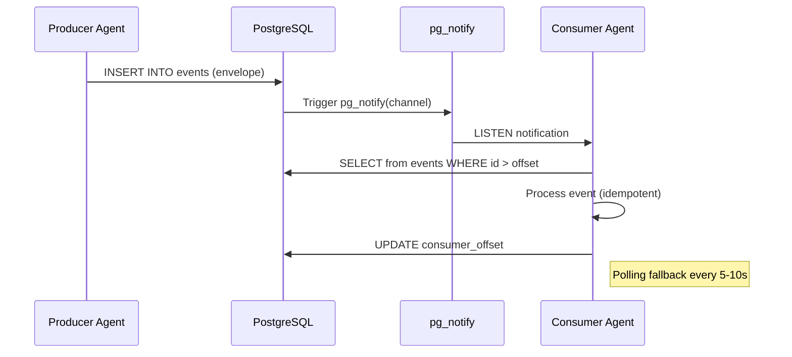
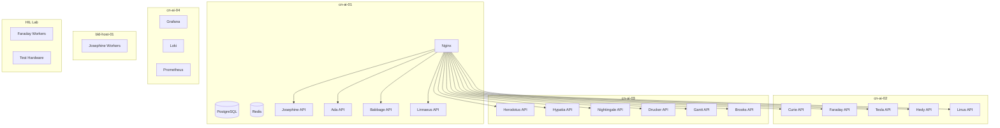

# Infrastructure Architecture

[Back to AI Agent Workforce](README.md)

> **Info:** This page defines the infrastructure platform on which all 15 agents execute. Decisions here are grounded in what Cornelis Networks already operates.

## Design Principles

- **Use what exists** — align with Cornelis's current Docker Compose, PostgreSQL, FastAPI, Nginx, Grafana stack. No new orchestration platforms (no Kubernetes).
- **On-prem first** — all agents run on internal servers. No cloud dependencies.
- **Simple operations** — Docker Compose for deployment, Ansible for provisioning, Grafana for observability. No service mesh.
- **PostgreSQL as backbone** — state, queues, and event transport all through PostgreSQL. No separate message broker unless scale demands it.

## Target Hosts

| Host | Role | Notes |
|------|------|-------|
| **cn-ai-01 through cn-ai-04** | Agent runtime | Dedicated AI hosts with Docker pre-installed. Currently running LLM inference services. Agent services deploy alongside. |
| **bld-host-01** | Build workers | Josephine build workers run here. Ephemeral Docker workspaces, FIFO queue, one build per worker. |
| **HIL lab servers** | Test environments | Managed by Tesla. ATF resource files define topology. Faraday workers execute tests here. |
| **aw-fi-jenkins-01** | CI/CD | Jenkins primary. Triggers agent workflows via webhooks. Agents report status back. |

## Core Infrastructure Components

| Component | Technology | Purpose | Status |
|-----------|-----------|---------|--------|
| **Container Runtime** | Docker + Docker Compose | All agent services run as Docker containers. Multi-instance deployment (3-5 per agent type for availability). | Available (cn-ai hosts) |
| **Agent APIs** | FastAPI + Uvicorn | Each agent exposes REST endpoints. Standard across all agents. OpenAPI spec auto-generated. | Pattern established (cn_frn_05) |
| **Load Balancer** | Nginx (HTTP) + HAProxy (streaming) | Round-robin for API requests. Leastconn for long-running operations (builds, tests). | Available |
| **Database** | PostgreSQL | All agent state: BuildRecords, TestExecutionRecords, ReleaseRecords, TraceabilityRecords, etc. Also serves as job queue (SKIP LOCKED) and event transport (pg_notify/LISTEN). | Available (Netbox instance exists; new DB needed for agents) |
| **Event Transport** | PostgreSQL pg_notify + LISTEN/NOTIFY | Lightweight pub/sub for agent-to-agent events. Canonical event envelope stored in events table. pg_notify for real-time notification, polling fallback for reliability. | To be built |
| **Caching** | Redis | Session cache, rate limiting, ephemeral state. Already deployed for Netbox. | Available |
| **Artifact Storage** | Local filesystem (/scratch, /local-data) | Build artifacts, test results, generated docs. Persistent volumes mounted into containers. NFS for cross-host access if needed. | Available |
| **Logging** | Grafana + Loki + Promtail | Structured logs from all agents. Correlation IDs for cross-agent tracing. Promtail ships container logs to Loki. | Available |
| **Metrics** | Prometheus + Grafana | Per-agent metrics: latency, success/error rates, queue depth, throughput. Dashboard templates per agent. | Available |
| **Provisioning** | Ansible | Host setup, Docker installation, agent deployment, configuration management. Follows lab-ansible patterns. | Available (lab-ansible) |
| **Secret Management** | Environment variables + Docker secrets | Per-agent service credentials. workspace_profile_ref resolves to short-lived creds. No raw secrets in API requests. | To be formalized |

## Event Transport Design

Rather than introducing a separate message broker (RabbitMQ, Kafka, NATS), the agent platform uses **PostgreSQL as the event backbone**. This keeps the stack simple and avoids a new operational dependency.

### How It Works

| Mechanism | Purpose | Details |
|-----------|---------|---------|
| **events table** | Durable event log | All events stored with canonical envelope (event_id, event_type, producer, correlation_id, subject_id, payload, occurred_at). Immutable append-only. |
| **pg_notify / LISTEN** | Real-time notification | After INSERT, trigger sends pg_notify on channel per event_type. Consuming agents LISTEN on relevant channels. |
| **Polling fallback** | Reliability | Agents also poll events table periodically (every 5-10s) to catch any missed notifications. Idempotent processing via event_id. |
| **Consumer offsets** | At-least-once delivery | Each consumer tracks last processed event_id. On restart, resumes from offset. Idempotency keys prevent duplicate processing. |
| **Dead letter** | Failed event handling | Events that fail processing N times move to dead_letter_events table. Dashboard alert on DLQ depth. |

> **Note:** **Scale trigger:** If event volume exceeds what pg_notify can handle (thousands/second sustained), migrate to NATS or Redis Streams. The event envelope schema stays the same — only the transport changes.

## Deployment Architecture

### Docker Compose Layout

Each agent deploys as a Docker Compose stack with 1-5 service instances. Following the established cn_frn_05 pattern:

- **Host networking** for performance (no Docker bridge overhead)
- **Persistent volumes** for state (/scratch, /local-data)
- **Environment-based config** (.env files per deployment)
- **restart: unless-stopped** for all services
- **Health checks** on all containers

### Service Distribution

| Host | Services |
|------|----------|
| **cn-ai-01** | PostgreSQL (primary), Redis, Nginx, Josephine API, Ada API, Babbage API, Linnaeus API |
| **cn-ai-02** | Curie API, Faraday API, Tesla API, Hedy API, Linus API |
| **cn-ai-03** | Herodotus API, Hypatia API, Nightingale API, Drucker API, Gantt API, Brooks API |
| **cn-ai-04** | Grafana, Loki, Prometheus, PostgreSQL (replica), overflow capacity |
| **bld-host-01** | Josephine workers (build execution in Docker) |
| **HIL lab** | Faraday workers (test execution on hardware) |

## Security Architecture

| Control | Implementation |
|---------|---------------|
| **Service identity** | Each agent has a unique service principal (DB user + API key). No shared credentials. |
| **Network isolation** | Build workers have restricted network access. Test workers access only reserved environments. |
| **Secret management** | workspace_profile_ref resolves to short-lived credentials via Docker secrets or env injection. No raw secrets in API payloads. |
| **Approval gates** | Human approval required for: release promotion, review policy override, traceability exception, external doc publish. |
| **Audit log** | All agent actions logged to PostgreSQL audit table with correlation_id, agent_id, action, timestamp. Immutable. |
| **Transcript access** | Only Herodotus can access Teams transcripts. Scoped API credentials. |

## Observability

| Layer | Tool | What It Captures |
|-------|------|-----------------|
| **Logs** | Loki + Promtail | Structured JSON logs from all containers. Fields: agent_id, correlation_id, job_id, level, message. |
| **Metrics** | Prometheus | Per-agent: request latency, success/error rate, queue depth, active jobs, heartbeat age. Per-system: event bus lag, DLQ depth. |
| **Dashboards** | Grafana | Per-agent dashboard template + cross-agent flow dashboard (PR→build→test→trace). Alert rules for SLO violations. |
| **Tracing** | Correlation IDs | Every event and API call carries correlation_id. Queryable across agents in Loki and PostgreSQL. |

## Open Decisions

> **Warning:** The following infrastructure decisions need to be finalized before Phase 0 implementation:
>
> 1. **PostgreSQL vs dedicated message broker** — pg_notify is simple but may not scale. Benchmark with expected event volume before committing.
> 2. **Artifact storage** — local filesystem works for v1 but cross-host access needs NFS or object storage (MinIO). Evaluate based on artifact sizes.
> 3. **Secret management** — Docker secrets vs HashiCorp Vault vs environment variables. Current pattern is env-based; formalize for production.
> 4. **PostgreSQL HA** — single instance for v1, but production needs replication. Evaluate Patroni or simple streaming replica.
> 5. **Test framework** — see [Test Framework Evaluation](TEST_FRAMEWORK_EVALUATION.md) for whether Fuze Test/ATF is the right tool.
