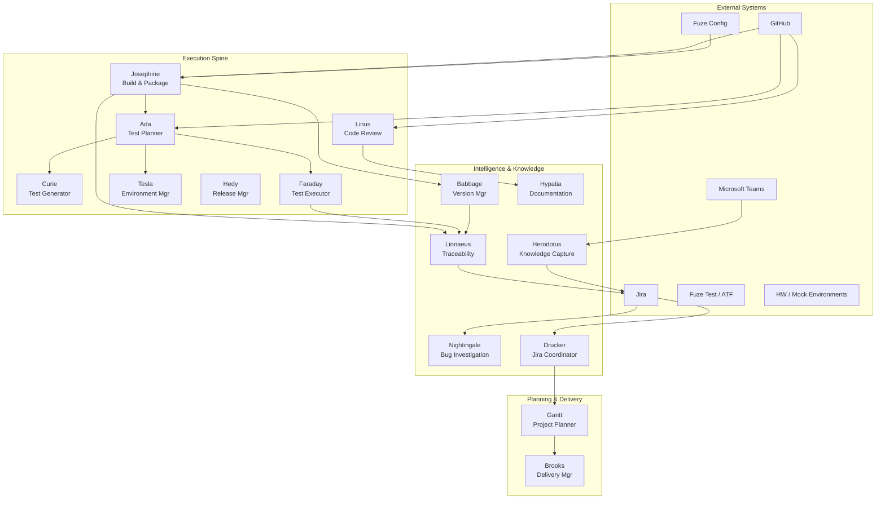
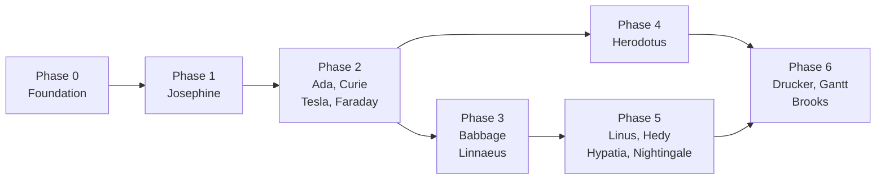

# AI Agent Workforce

## Introduction 

This document provides a working proposal for a new paradigm for the design of an embedded systems software organization. It creates a hybrid Human-Agent organization where the people add the most value that people can, and the agents add value where they can, including in helping the people do their work better.

This document focus's on the what can loosely be described as the "DevOps" parts of the organization -- project planning and status, bug tracking and triaging, build automation and management, release automation and managmement, code quality and scanning, and test generationa, execution, and tracking.

> [!NOTE]
> This document does not address the details of human responsibilities, other than calling out the roles that they will continue to perform.

**Coordinated software engineering, testing, release, bug investigation, knowledge capture, and planning agents for the Cornelis Networks development organization.**

The AI Agent Workforce is a system of 17 specialized agents that automate and coordinate the full software development lifecycle at Cornelis Networks. Each agent owns a distinct responsibility — from build orchestration and test generation to release management and project planning — and communicates through well-defined interfaces to deliver reliable, traceable, and auditable engineering outcomes.

Agents are organized into three operational zones: the **Execution Spine** handles build, test, and release workflows; **Intelligence & Knowledge** manages versioning, traceability, documentation, and bug investigation; and **Planning & Delivery** coordinates project schedules and delivery milestones.

---

## Quick Stats

| Metric | Value |
|--------|-------|
| Agents | 17 |
| Zones | 6 |

---

## Agent Zone Map

## Agents by Zone

### Execution Spine

These agents form the core build-test-release pipeline.

| Agent | Role | Description |
|-------|------|-------------|
| **[Josephine](JOSEPHINE_BUILD_AGENT_PLAN.md)** | Build & Package | Build orchestration, compilation management, and artifact production across all Cornelis repositories. Wraps Fuze build/package into an API-driven service. |
| **[Ada](ADA_TEST_PLANNER_PLAN.md)** | Test Planning | Determines what to test based on trigger class (PR, merge, nightly, release), coverage targets, and environment constraints. |
| **[Curie](CURIE_TEST_GENERATOR_PLAN.md)** | Test Generation | Materializes Ada's test plans into concrete Fuze Test runtime inputs with reproducible version hashes. |
| **[Faraday](FARADAY_TEST_EXECUTOR_PLAN.md)** | Test Execution | Runs ATF/Fuze Test cycles, captures logs/artifacts/results, classifies failures, and produces structured TestExecutionRecords. |
| **[Tesla](TESLA_TEST_ENVIRONMENT_MANAGER_PLAN.md)** | Environment Mgmt | Shared reservation service for HIL and mock environments with capability matching and health monitoring. |
| **[Hedy](HEDY_RELEASE_MANAGER_PLAN.md)** | Release Mgmt | Orchestrates release decisions using the Fuze release model with stage promotion (sit, qa, release) and human approval gates. |
| **[Linus](LINUS_CODE_REVIEW_AGENT_PLAN.md)** | Code Review | Evaluates PRs against policy profiles (kernel, embedded C++, Python) and emits cross-agent impact signals. |
| **[Brandeis](BRANDEIS_COMPLIANCE_AGENT_PLAN.md)** | Legal Compliance & Code Scanning | Scans dependencies for license compliance, flags policy violations on PRs, and manages license exception workflows. Named after Louis Brandeis, champion of transparency and the right to privacy. |

### Intelligence & Knowledge

These agents provide context, traceability, and institutional knowledge.

| Agent | Role | Description |
|-------|------|-------------|
| **[Babbage](BABBAGE_VERSION_MANAGER_PLAN.md)** | Version Mapping | Maps Fuze internal build IDs to external customer-facing release versions with conflict detection and lineage tracking. |
| **[Linnaeus](LINNAEUS_TRACEABILITY_AGENT_PLAN.md)** | Traceability | Maintains queryable relationships between requirements, Jira issues, commits, builds, tests, releases, and versions. |
| **[Herodotus](HERODOTUS_KNOWLEDGE_CAPTURE_AGENT_PLAN.md)** | Knowledge Capture | Ingests Teams meeting transcripts and produces structured summaries, decisions, and action items. |
| **[Hypatia](HYPATIA_DOCUMENTATION_AGENT_PLAN.md)** | Documentation | Produces as-built, user, and engineering docs from authoritative system records via Sphinx/ReadTheDocs. |
| **[Nightingale](NIGHTINGALE_BUG_TRIAGE_REPRODUCTION_PLAN.md)** | Bug Investigation | Reacts to Jira bugs, assembles build/test/release context, drives targeted reproduction, and produces investigation summaries. |
| **[Drucker](DRUCKER_JIRA_COORDINATOR_PLAN.md)** | Jira Coordination | Keeps Jira operationally coherent with triage, hygiene, routing, and evidence-backed workflow nudges. |

### Planning & Delivery

These agents support project management and delivery tracking.

| Agent | Role | Description |
|-------|------|-------------|
| **[Gantt](GANTT_PROJECT_PLANNER_PLAN.md)** | Project Planning | Converts Jira work state, technical evidence, and meeting decisions into milestone proposals, dependency graphs, and risk summaries. |
| **[Brooks](BROOKS_DELIVERY_MANAGER_PLAN.md)** | Delivery Mgmt | Monitors execution against plan, detects schedule risk and coordination failures, produces forecasts and escalation prompts. |

Planning backlog for the current Gantt + Drucker convergence work:
[`GANTT_DRUCKER_PM_IMPLEMENTATION_BACKLOG.md`](GANTT_DRUCKER_PM_IMPLEMENTATION_BACKLOG.md)

### Service Infrastructure

This agent provides the shared communications layer for all other agents.

| Agent | Role | Description |
|-------|------|-------------|
| **[Shannon](SHANNON_COMMUNICATIONS_AGENT_PLAN.md)** | Communications | Single Teams bot serving all agent channels. Routes commands, manages approvals, posts notifications, and logs all human-agent interactions. Named after Claude Shannon, father of information theory. |

---

## Architecture

All agents communicate through a shared **event backbone** with a canonical event envelope (`event_id`, `event_type`, `producer`, `correlation_id`, `subject_id`, `payload`). Six canonical data schemas underpin the system: BuildRecord, TestExecutionRecord, ReleaseRecord, TraceabilityRecord, DocumentationRecord, and MeetingSummaryRecord.

**Key design principles:**

- **Event-driven where possible, with polling support for reliability and scheduled PM workflows**
- **Human-in-the-loop** — irreversible actions (release promotion, policy override, external doc publish) require human approval
- **Progressive testing** — PR (unit+fast), merge (expanded+HIL), nightly (extended), release (certification)
- **Full traceability** — every artifact has an ID; every relationship is queryable

---

## Cross-Cutting Capabilities

Every agent shares these two capabilities regardless of its domain:

### Decision Logging & Audit Trail

Every agent logs all actions and, for decisions, records the complete decision tree — what inputs were evaluated, what alternatives were considered, and why the chosen path was selected. All logs are stored in PostgreSQL and queryable by correlation_id, agent_id, and time range via Grafana/Loki. This provides full transparency and accountability for every automated action.

### Microsoft Teams Channel Interface

Each agent has a dedicated Teams channel (`#agent-{name}`) in the "Agent Workforce" team. This is the primary human interface. All Teams channels are managed by **[Shannon](../agents/SHANNON_COMMUNICATIONS_AGENT_PLAN.md)**, the communications service agent — a single bot deployment that routes commands, renders responses, and manages approval workflows across all 15 domain agent channels. See the [Teams Bot Framework Specification](reference/TEAMS_BOT_FRAMEWORK.md) for full technical details.

- **Activity feed** — real-time summaries of agent actions
- **Decision notifications** — non-trivial decisions posted with rationale
- **Approval requests** — Adaptive Cards for approve/reject workflows
- **Input requests** — structured requests when the agent needs human input
- **Status queries** — engineers can ask the agent for status in the channel
- **Error alerts** — failures and anomalies with severity and suggested actions

### Tool Use & Token Efficiency

Agents use **deterministic tools first** — policy lookups, schema validation, event routing, and queries all use code paths that consume zero tokens. LLM calls are reserved for tasks requiring reasoning or generation. The platform builds custom tools to eliminate repeated LLM patterns. All token usage (input, output, model, cost) is logged and accumulates in the audit database. Target: >80% of actions are deterministic.

### Standard Commands

Every agent responds to these commands in its Teams channel and via REST API:

| Command | Returns |
|---------|---------|
| `/token-status` | Token usage: today, cumulative, cost, efficiency ratio |
| `/decision-tree` | Recent decisions with inputs, candidates, outcomes, rationale |
| `/why {id}` | Deep dive into a specific decision's full reasoning |
| `/stats` | Uptime, success/failure rates, latency, queue depth, error trends |
| `/work-today` | Today's work summary: jobs processed, outcomes, failures |
| `/busy` | Current load: idle / working / busy / overloaded |

## Infrastructure & Platform

The agent platform runs on Cornelis Networks internal infrastructure using Docker Compose, PostgreSQL, FastAPI, and Grafana. No cloud dependencies or Kubernetes.

| Component | Technology | Purpose |
|-----------|-----------|---------|
| **Runtime** | Docker Compose on cn-ai-[01:04] | All agents run as containerized services. Multi-instance for availability. |
| **APIs** | FastAPI + Uvicorn | Each agent exposes REST endpoints. OpenAPI spec auto-generated. |
| **Database & Events** | PostgreSQL | All agent state, job queues (SKIP LOCKED), and event transport (pg_notify). Single operational dependency. |
| **Observability** | Grafana + Loki + Prometheus | Structured logs, per-agent metrics, cross-agent flow dashboards. |
| **Provisioning** | Ansible | Host setup, deployment, configuration management. |

Full details: [Infrastructure Architecture](reference/INFRASTRUCTURE_ARCHITECTURE.md) | [Test Framework Evaluation](reference/TEST_FRAMEWORK_EVALUATION.md)

## External Systems & Integrations

| System | Role |
|--------|------|
| **GitHub** | Source events (PR, merge, tag), status checks, inline review comments |
| **Jira** | Work items, bug tracking, traceability write-backs, hygiene |
| **Microsoft Teams** | Meeting transcripts, summary publication, approval prompts |
| **Fuze** | Build configuration, build execution, release metadata, test config |
| **ATF / Fuze Test** | Test execution framework, suite definitions, result collection |
| **HW / Mock Environments** | HIL and mock test environments managed by Tesla |

---

## Human Roles

| Role | Responsibilities |
|------|-----------------|
| **Developers** | Generate designs, develop production code, responsible for functionality, schedule, documentation, and quality of that code. Review and approval of code merges. |
| **Management** | Manage team responsibilities, priorities, and projects. Overall responsibilities for the delivery of the product and team components. Review and approval of code merges and release decisions. |
| **DevOps** | Build configuration and output, release configuration and output, build and release quality (CI), compliance, test execution and results visibility, infrastructure to support this agent workforce. Review and quality of all related code, infrastructure, and documentation. |
| **Project Management** | Release planning, release decision-making, project status, bug prioritization, continuous improvement. (Note: could also be team management.) |
| **Test Engineering** | Test development, requirements verification, test execution and automation. |

---

*AI Agent Workforce Documentation — Cornelis Networks*

---

## Implementation Phasing

Agents are built in dependency order. Each phase delivers working capabilities that the next phase builds on.

| Phase | Focus | Agents | Why This Order |
|-------|-------|--------|----------------|
| **0** | Platform Foundation | Shannon | Event bus, canonical schemas, adapters (GitHub, Jira, Teams, Fuze, Env Mgr), security, observability, Teams bot (Shannon). Everything depends on this. |
| **1** | Build Spine | Josephine | Builds are the foundation — every downstream agent needs build IDs and artifacts to operate. |
| **2** | Test Spine | Ada, Curie, Tesla, Faraday | Test planning, generation, environment reservation, and execution form a pipeline that consumes Josephine's build output. |
| **3** | Versioning & Traceability | Babbage, Linnaeus | Version mapping and traceability link builds, tests, issues, and releases — requires build and test records from Phases 1–2. |
| **4** | Knowledge Capture | Herodotus | Meeting summaries and action items feed into planning and documentation. Independent of build/test but benefits from traceability links. |
| **5** | Quality & Release | Linus, Hedy, Hypatia, Nightingale | Code review, release orchestration, documentation, and bug investigation all consume evidence from Phases 1–3. |
| **6** | Project Management | Drucker, Gantt, Brooks | Jira coordination, project planning, and delivery tracking aggregate signals from all other agents. |

### Dependency Chain

**Phase 0** (Foundation) → **Phase 1** (Josephine builds) → **Phase 2** (Ada/Curie/Tesla/Faraday test) → **Phase 3** (Babbage/Linnaeus trace) → **Phase 5** (Linus/Hedy/Hypatia/Nightingale quality). Phase 4 (Herodotus) can run in parallel with Phase 3. Phase 6 (Drucker/Gantt/Brooks) runs last since it aggregates everything.

