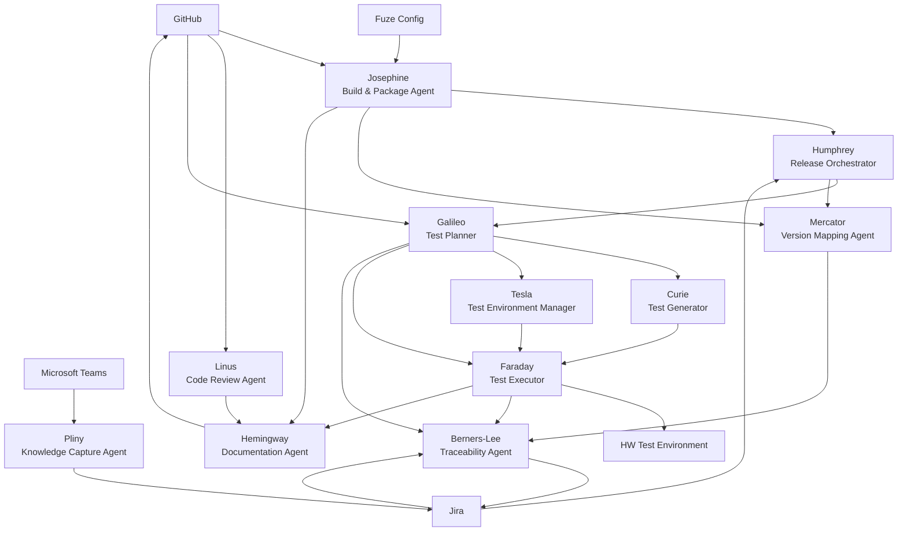
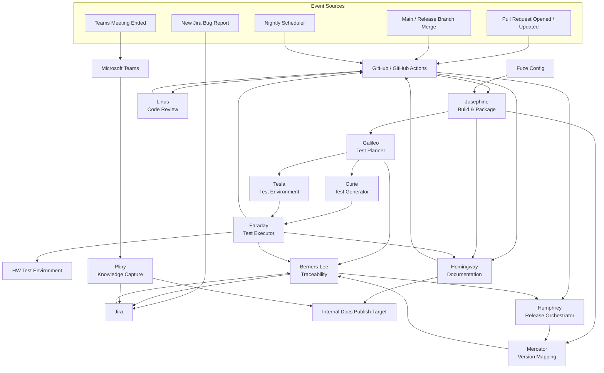

# AI Agent System Specification

Author: John N. Macdonald (Concept Origin) Generated:
2026-03-10T19:16:17.736254Z

------------------------------------------------------------------------

# 1. Overview

This document specifies the autonomous and semi‑autonomous AI agents
discussed in the design session. The goal is to create a coordinated
system of specialized agents that assist with:

-   Project management
-   Development alignment
-   Testing orchestration
-   Build and release management
-   Documentation generation
-   Knowledge capture
-   Code quality enforcement

The system assumes integration with:

-   **Jira**
-   **GitHub / GitHub Actions**
-   **Microsoft Teams**
-   **Fuze configuration system**
-   **Hardware‑in‑the‑loop test infrastructure**

Agents operate independently but communicate through shared state and
event triggers.

------------------------------------------------------------------------

# 2. System Architecture Principles

1.  **Event Driven**
    -   GitHub events
    -   Jira events
    -   Test environment signals
    -   Build completion signals
2.  **Human‑in‑the‑Loop**
    -   Agents suggest and guide
    -   Humans approve critical changes
3.  **Traceability**
    -   Every build tied to a Fuze build ID
    -   Jira issues reference exact builds
    -   Tests reference commits and builds
4.  **Progressive Testing**
    -   PR tests: fast
    -   Merge tests: moderate
    -   Nightly tests: exhaustive

------------------------------------------------------------------------

# 3. Agent Inventory

  -----------------------------------------------------------------------
  Agent                   Historical Name         Function
  ----------------------- ----------------------- -----------------------
  Build & Package Agent   Josephine               Build orchestration

  Release Orchestrator    Humphrey                    Release matrix
                                                  management

  Code Review Agent       Linus                   Code quality
                                                  enforcement

  Test Planner            Galileo                     Test planning

  Test Generator          Curie                   Executable test input
                                                  generation

  Test Executor           Faraday                 Test execution

  Test Environment        Tesla                   Environment reservation
  Manager                                         and lab state

  Documentation Agent     Hemingway                 Documentation
                                                  generation

  Knowledge Capture Agent Pliny               Meeting transcripts &
                                                  summaries

  Bug Investigation      Nightingale             Bug triage,
  Agent                                           analysis, and
                                                  reproduction

  Version Mapping Agent   Mercator                 Internal/external
                                                  version mapping

  Traceability Agent      Berners-Lee                Requirement and build
                                                  traceability
  -----------------------------------------------------------------------

------------------------------------------------------------------------

# 4. Agent Specifications

Detailed implementation plans currently available:

- Josephine: [JOSEPHINE_BUILD_AGENT_PLAN.md](../../agents/JOSEPHINE_BUILD_AGENT_PLAN.md)
- Humphrey: [PLAN.md](../../agents/humphrey/docs/PLAN.md)
- Linus: [LINUS_CODE_REVIEW_AGENT_PLAN.md](../../agents/LINUS_CODE_REVIEW_AGENT_PLAN.md)
- Hemingway: [PLAN.md](../../agents/hemingway/docs/PLAN.md)
- Mercator: [PLAN.md](../../agents/mercator/docs/PLAN.md)
- Berners-Lee: [PLAN.md](../../agents/bernerslee/docs/PLAN.md)
- Pliny: [PLAN.md](../../agents/pliny/docs/PLAN.md)
- Nightingale: [NIGHTINGALE_BUG_TRIAGE_REPRODUCTION_PLAN.md](../../agents/NIGHTINGALE_BUG_TRIAGE_REPRODUCTION_PLAN.md)
- Galileo: [PLAN.md](../../agents/galileo/docs/PLAN.md)
- Curie: [CURIE_TEST_GENERATOR_PLAN.md](../../agents/CURIE_TEST_GENERATOR_PLAN.md)
- Faraday: [FARADAY_TEST_EXECUTOR_PLAN.md](../../agents/FARADAY_TEST_EXECUTOR_PLAN.md)
- Tesla: [TESLA_TEST_ENVIRONMENT_MANAGER_PLAN.md](../../agents/TESLA_TEST_ENVIRONMENT_MANAGER_PLAN.md)

Project-management extension plans:

- Gantt: [GANTT_PROJECT_PLANNER_PLAN.md](../../agents/GANTT_PROJECT_PLANNER_PLAN.md)
- Shackleton: [PLAN.md](../../agents/shackleton/docs/PLAN.md)
- Drucker: [DRUCKER_JIRA_COORDINATOR_PLAN.md](../../agents/DRUCKER_JIRA_COORDINATOR_PLAN.md)

## 4.1 Build & Package Agent (Josephine)

### Purpose

Automate builds and packaging using the **Fuze configuration system**.

### Inputs

-   GitHub commits
-   Pull request events
-   Merge events
-   Fuze configuration JSON

### Outputs

-   Build artifacts
-   Unique build identifiers
-   Build metadata

### Responsibilities

-   Execute builds based on Fuze configuration
-   Generate reproducible artifacts
-   Tag builds with Fuze internal IDs

### Triggering Model

-   Always-on API and worker control plane
-   Work is triggered by build requests or upstream repository/build events
-   Humans can submit, retry, cancel, or inspect builds

------------------------------------------------------------------------

## 4.2 Release Orchestrator (Humphrey)

### Purpose

Manage release strategy across a **3D version matrix**:

-   Time
-   Hardware revisions
-   Customer variants

### Responsibilities

-   Coordinate builds into release candidates
-   Manage release branches
-   Map builds to hardware and customers
-   Coordinate deployment schedules

### Triggering Model

-   Always-on release control plane
-   Work is triggered by build completion, release evaluation requests, or promotion requests
-   Humans approve, block, promote, or deprecate releases

------------------------------------------------------------------------

## 4.3 Code Review Agent (Linus)

### Purpose

Automate code quality enforcement.

### Review Types

**Kernel Compliance** - Kernel coding style - Upstream compatibility

**Embedded Best Practices** - C/C++ safety - Memory usage - Concurrency
correctness

**Python Utilities** - Static analysis - Script correctness

### Integration

Triggered during GitHub Pull Requests.

### Triggering Model

-   Always-on review service
-   Work is triggered by pull request open, update, sync, or review-request events
-   Humans can re-run reviews and override or suppress findings under policy

------------------------------------------------------------------------

## 4.4 Test Planner (Galileo)

### Purpose

Define what should be tested, at what depth, and under what policy.

Galileo is no longer the umbrella name for the whole test domain. Galileo is specifically the planning agent.

### Components

1.  Trigger-to-plan selection
2.  Coverage-driven planning
3.  Environment-class intent selection

### Triggering Model

-   Always-on planning service
-   Work is triggered by PR, merge, nightly, build-completion, or release-validation events
-   Humans can preview plans or apply policy overrides where allowed

------------------------------------------------------------------------

## 4.5 Test Generator (Curie)

### Purpose

Turn Galileo's plan into executable Fuze Test inputs.

### Responsibilities

- Materialize explicit suite inputs
- Generate runtime overlays when needed
- Keep generated test inputs reproducible and auditable

### Triggering Model

- Always-on generation service with light persistent state
- Work is triggered by Galileo plan outputs or direct generation requests
- Humans can regenerate inputs for debugging or exceptional cases

------------------------------------------------------------------------

## 4.6 Test Executor (Faraday)

### Purpose

Execute planned tests through Fuze Test.

### Responsibilities

- Run test cycles through the ATF executive
- Capture logs, artifacts, and normalized result records
- Surface execution state and failure classes

### Triggering Model

- Always-on execution control plane with queued workers
- Work is triggered by accepted test-run requests and ready reservations
- Humans can cancel, rerun, or inspect executions

------------------------------------------------------------------------

## 4.7 Test Environment Manager (Tesla)

### Purpose

Expose environment state and manage reservations for scarce mock and HIL resources.

### Responsibilities

- Publish environment capability and availability
- Grant, renew, and release reservations
- Surface maintenance, quarantine, and utilization state

### Testing Levels

  Event           Testing Level
  --------------- ------------------------------
  Pull Request    Unit + fast functional tests
  Merge to main   extended functional tests
  Nightly         full test suite
  Release         certification suite

### Hardware Integration

Supports:

-   hardware‑in‑loop testing
-   network simulation
-   mock environments

### Triggering Model

-   Always-on shared environment-state and reservation service
-   Work is triggered by reservation, heartbeat, release, quarantine, and maintenance actions
-   Scheduled lease and health checks run continuously in the background
-   Humans can quarantine, maintain, or release environments manually

------------------------------------------------------------------------

## 4.8 Documentation Agent (Hemingway)

### Purpose

Generate living documentation.

### Documentation Types

**1. As‑Built Documentation** - README files - Design descriptions -
Repo structure explanations

**2. User Documentation** - API references - Tool documentation - Usage
guides

**3. Engineering Documentation** - architecture - system diagrams -
design rationale

### Tools

Potential integration with:

-   Sphinx
-   ReadTheDocs‑style internal publishing

### Triggering Model

-   Always-on documentation service
-   Work is triggered by documentation-impact signals from source, build, test, release, or meeting-summary changes
-   Humans review, publish, reject, or regenerate documentation outputs

------------------------------------------------------------------------

## 4.9 Knowledge Capture Agent (Pliny)

### Purpose

Automatically capture meeting knowledge.

### Integration

-   Microsoft Teams meetings
-   Transcript APIs

### Functions

-   Auto‑retrieve transcripts
-   Summarize technical discussions
-   Extract decisions
-   Produce meeting notes

### Triggering Model

-   Always-on transcript-ingest and summary service
-   Work is triggered by transcript-ready events or explicit ingest/summarize requests
-   Humans review, publish, redact, or retract summaries

------------------------------------------------------------------------

## 4.10 Version Mapping Agent (Mercator)

### Purpose

Connect **Fuze internal versioning** with **external release versions**.

### Responsibilities

-   Map build IDs to release versions
-   Track version lineage
-   Maintain compatibility records

### Triggering Model

-   Always-on version-mapping service
-   Work is triggered by build, release, and mapping requests or events
-   Humans can confirm, correct, or approve mappings where policy requires

------------------------------------------------------------------------

## 4.11 Traceability Agent (Berners-Lee)

### Purpose

Maintain traceability across system components.

### Responsibilities

-   Link Jira tickets to builds
-   Link tests to builds
-   Link requirements to code
-   Track bug origin builds

### Triggering Model

-   Always-on traceability service
-   Work is triggered by Jira, GitHub, build, test, release, and version events
-   Humans can assert, correct, or suppress specific relationship records with audit trail

------------------------------------------------------------------------

## 4.12 Bug Investigation Agent (Nightingale)

### Purpose

Turn Jira bug reports into actionable technical evidence.

### Responsibilities

-   Triage new bug reports for technical completeness
-   Assemble build, test, release, and traceability context
-   Coordinate targeted reproduction attempts
-   Produce investigation summaries and reproduction evidence

### Triggering Model

-   Always-on investigation service
-   Work is triggered by new bug reports, bug updates, reopen events, or explicit reproduction requests
-   Humans can escalate, approve expensive reproduction work, or close an investigation as inconclusive

------------------------------------------------------------------------

# 5. Integration Points

## GitHub

-   PR events
-   merge events
-   commit metadata

## Jira

-   ticket updates
-   bug reports
-   release tagging

## Microsoft Teams

-   meeting transcripts
-   notifications

## Fuze

-   configuration‑driven builds
-   build ID generation

------------------------------------------------------------------------

# 6. Recommended Implementation Order

1.  Build Agent (Josephine)
2.  Release Agent (Humphrey)
3.  Code Review Agent (Linus)
4.  Test Stack (Galileo / Curie / Faraday / Tesla)
5.  Documentation Agent (Hemingway)
6.  Version Mapping Agent (Mercator)
7.  Traceability Agent (Berners-Lee)
8.  Knowledge Capture Agent (Pliny)

------------------------------------------------------------------------

# 7. Future Extensions

Potential additional agents:

-   project planner agents such as Gantt
-   delivery-management agents such as Shackleton
-   Jira workflow coordinators such as Drucker
-   resource scheduling agents
-   system architecture analysis agents

Typical triggering models for likely extensions:

-   Gantt: primarily on-demand planning snapshots, with optional scheduled refreshes later; humans review and approve planning write-backs
-   Shackleton: on-demand and scheduled delivery summaries; humans request status views and acknowledge or dismiss risks
-   Drucker: always-on Jira coordination service reacting to Jira events plus scheduled hygiene scans; humans approve, apply, or suppress workflow changes

---

# 8. Agent Architecture Diagram



## Diagram Notes

- **GitHub** is the primary source of development events.
- **Fuze Config** drives configuration-aware build and package behavior.
- **Josephine** produces build artifacts and hands release-ready outputs to **Humphrey**.
- **Linus** evaluates pull requests and code quality policy.
- **Galileo** selects test intent and depth from trigger and policy.
- **Curie** turns selected plans into executable Fuze Test inputs.
- **Tesla** manages environment state and reservations.
- **Faraday** executes the planned tests, including hardware-in-the-loop flows.
- **Mercator** maps internal Fuze-generated build identities to external release versions.
- **Berners-Lee** maintains traceability from requirements and Jira tickets to builds, tests, and releases.
- **Hemingway** generates and updates repo-level, user, and engineering documentation.
- **Pliny** captures and summarizes meeting transcripts from Microsoft Teams.
- **Nightingale** turns bug reports into reproducible technical investigations and evidence packs.

---

# 9. Event Flow Diagram



## Event Flow Notes

### Pull Request Flow
- A pull request event enters through **GitHub / GitHub Actions**.
- **Linus** performs code review and policy checks.
- **Josephine** runs configuration-aware build and package steps using **Fuze Config**.
- **Galileo** selects the PR-level test plan.
- **Curie** materializes executable Fuze Test inputs from that plan.
- **Tesla** provides or reserves the required environment class.
- **Faraday** runs the PR-level suite, including unit tests and fast functional tests.
- Results flow back into GitHub status checks and associated development records.

### Merge and Release Flow
- A merge to main or a release branch triggers deeper release handling.
- **Humphrey** determines the release path for the build across release branches, hardware targets, and customer variants.
- **Mercator** maps the resulting internal build identities to external release versions.
- **Berners-Lee** pushes traceability data into Jira so that bugs, builds, tests, and releases stay linked.

### Nightly Flow
- The nightly scheduler triggers the same core path, but **Galileo** selects an expanded test plan.
- **Curie**, **Tesla**, and **Faraday** carry that plan through generation, reservation, and execution.
- This is where long-duration and broader hardware-in-the-loop coverage happens.

### Bug Intake Flow
- New Jira bug reports enter through **Jira**.
- **Drucker** keeps the issue operationally coherent in Jira.
- **Nightingale** triages the report, requests missing data, and drives reproduction work where warranted.
- **Berners-Lee** associates the issue with the exact build, test evidence, and release context where possible.
- That investigation and traceability data feeds **Humphrey** so release decisions can account for active defect status.

### Documentation Flow
- Source changes, builds, and test results feed **Hemingway**.
- **Hemingway** updates as-built documentation, user documentation, and engineering documentation.
- Outputs can be committed back to GitHub and published to the internal documentation target.

### Knowledge Capture Flow
- At the end of a Teams meeting, **Pliny** captures and summarizes the transcript.
- Key decisions, action items, and technical notes can be pushed into Jira and internal documentation.

---

# 10. Agent Interface Specification

This section defines the operational interfaces between agents, platforms, and shared system services.
The purpose is to make implementation concrete enough that engineering teams can assign ownership, define schemas, and begin staged delivery.

## 10.1 Interface Design Principles

### Canonical Rules

1. **Events are first-class**
   - Agents should react to typed events rather than polling where possible.
   - Polling is acceptable for systems that do not provide suitable event hooks.

2. **Every artifact has an identity**
   - Commits, pull requests, Jira issues, builds, test executions, releases, documents, and meeting summaries must all carry stable IDs.

3. **Internal build identity is authoritative**
   - Fuze-generated internal build IDs are the ground truth for technical traceability.
   - External versions are derived and mapped, not substituted.

4. **Interfaces should be typed and auditable**
   - Every agent action should produce a machine-readable record.
   - Every major decision should include provenance.

5. **Humans approve irreversible actions**
   - Agents may recommend, draft, annotate, classify, and orchestrate.
   - Production release approval and policy exceptions should remain human controlled.

## 10.2 Shared Canonical Objects

These objects should be normalized across the system, even if individual tools store richer native forms.

### Build Record

```json
{
  "build_id": "fuze:build:2026-03-10T22:14:11Z:abc123",
  "source_repo": "github.com/org/repo",
  "branch": "release/2.4",
  "commit_sha": "abc123def456",
  "trigger_type": "pull_request",
  "trigger_ref": "PR-1842",
  "fuze_config_id": "cfg-network-card-a1",
  "artifact_uris": [
    "s3://builds/fw.bin",
    "s3://builds/pkg.tar.gz"
  ],
  "status": "succeeded",
  "created_at": "2026-03-10T22:14:11Z"
}
```

### Test Execution Record

```json
{
  "test_run_id": "test:run:88921",
  "build_id": "fuze:build:2026-03-10T22:14:11Z:abc123",
  "test_plan_id": "pr-fast-functional-v3",
  "test_level": "pr",
  "environment_id": "hil-rack-03",
  "environment_mode": "hardware_in_loop",
  "status": "passed",
  "started_at": "2026-03-10T22:22:00Z",
  "ended_at": "2026-03-10T22:31:00Z",
  "coverage_summary": {
    "unit": 82.1,
    "functional": 64.4
  }
}
```

### Release Record

```json
{
  "release_id": "release:2.4.0-rc2",
  "build_id": "fuze:build:2026-03-10T22:14:11Z:abc123",
  "external_version": "2.4.0-rc2",
  "release_branch": "release/2.4",
  "hardware_targets": ["revC", "revD"],
  "customer_profiles": ["default", "customer-x"],
  "approval_state": "pending",
  "status": "candidate"
}
```

### Traceability Record

```json
{
  "trace_id": "trace:bug:PROJ-4421",
  "jira_issue_key": "PROJ-4421",
  "build_id": "fuze:build:2026-03-10T22:14:11Z:abc123",
  "release_id": "release:2.4.0-rc2",
  "commit_shas": ["abc123def456"],
  "test_run_ids": ["test:run:88921"],
  "requirements": ["REQ-NET-0042"]
}
```

### Documentation Record

```json
{
  "doc_id": "doc:engineering:interrupt-routing",
  "doc_type": "engineering",
  "source_refs": {
    "commit_shas": ["abc123def456"],
    "build_ids": ["fuze:build:2026-03-10T22:14:11Z:abc123"],
    "jira_keys": ["PROJ-4421"]
  },
  "publish_target": "internal-docs",
  "status": "published"
}
```

### Meeting Summary Record

```json
{
  "meeting_id": "teams:meeting:2026-03-10:embedded-release-review",
  "transcript_ref": "teams://transcripts/78421",
  "summary_id": "summary:2026-03-10:embedded-release-review",
  "decision_items": [
    "Keep PR HIL runtime under 10 minutes",
    "Add release branch gating for revD hardware"
  ],
  "action_items": [
    {
      "owner": "john.macdonald@4tlastech.com",
      "description": "Define release matrix policy"
    }
  ]
}
```

## 10.3 Platform Interfaces

### GitHub / GitHub Actions

GitHub is the primary development event source.

#### Consumed by Agents
- pull request opened
- pull request updated
- pull request review requested
- branch push
- main merge
- release branch merge
- tag creation
- workflow completion

#### Produced back to GitHub
- status checks
- review comments
- release notes drafts
- documentation commits
- traceability annotations
- links to build and test artifacts

#### Minimum payload fields
- repository
- branch
- commit SHA
- pull request number
- author
- changed files
- workflow run ID

### Jira

Jira is the primary work tracking and defect system.

#### Consumed by Agents
- new bug report
- ticket updated
- release field changed
- priority changed
- stale issue detection trigger

#### Produced back to Jira
- exact build linkage
- missing metadata flags
- release recommendations
- test evidence links
- summary comments
- traceability links

#### Minimum payload fields
- issue key
- issue type
- reporter
- assignee
- priority
- affected build ID
- release target
- custom fields for hardware/customer scope

### Microsoft Teams

Teams is the meeting and human notification channel.

#### Consumed by Agents
- meeting ended
- transcript ready
- direct message trigger
- adaptive card response

#### Produced back to Teams
- reporter prompts for missing bug data
- approval requests
- meeting summaries
- escalation messages
- release readiness summaries

#### Minimum payload fields
- meeting ID
- transcript URI
- user principal name
- team/channel or chat ID
- message correlation ID

### Fuze

Fuze is the source of build configuration truth and internal build identity.

#### Consumed by Agents
- build configuration JSON
- target definitions
- packaging definitions
- internal build IDs
- branch/build policy

#### Produced by Agents
- build requests
- build metadata association
- external version mapping references

#### Minimum payload fields
- fuze configuration ID
- target name
- package name
- build policy type
- generated build ID

### Hardware / Test Environment Manager

This service exposes the state of real and mocked test environments.
It may use a scheduler such as SLURM as an internal allocation backend, but agents should integrate with the manager's API and domain model rather than directly with SLURM.

#### Consumed by Agents
- rack availability
- target hardware identity
- environment capability matrix
- mock topology configuration
- reservation status

#### Produced by Agents
- reservation requests
- execution requests
- teardown requests
- environment utilization metrics

#### Minimum payload fields
- environment ID
- hardware profile
- topology profile
- reservation window
- test plan ID

## 10.4 Agent-by-Agent Interfaces

## 10.4.1 Josephine — Build & Package Agent

### Consumes
- GitHub PR and merge events
- Fuze configuration data
- release branch policy
- build requests from Humphrey

### Produces
- Build Record
- artifact manifests
- build status events
- package metadata
- documentation source signals to Hemingway
- version source signals to Mercator

### Key outbound interfaces
- `build.completed`
- `build.failed`
- `artifact.published`

### Minimal command surface
- `request_build(repo, branch, commit_sha, fuze_config_id, trigger_type)`
- `get_build_status(build_id)`
- `get_artifact_manifest(build_id)`

### Triggering model
- always-on API, scheduler, and worker control plane
- normal work starts from build requests or upstream repository/build events
- humans can submit, retry, cancel, and inspect jobs

## 10.4.2 Humphrey — Release Orchestrator

### Consumes
- build completion events from Josephine
- Jira release intent and defect state
- customer/hardware release matrix policy
- traceability and version mapping context

### Produces
- Release Record
- release candidate proposals
- deployment readiness summaries
- release approval requests
- downstream test requests for release validation

### Key outbound interfaces
- `release.candidate_created`
- `release.approval_requested`
- `release.promoted`
- `release.blocked`

### Minimal command surface
- `evaluate_release(build_id, release_branch, hardware_targets, customer_profiles)`
- `promote_release(release_id)`
- `block_release(release_id, reason)`

### Triggering model
- always-on release control plane
- normal work starts from build completion events or explicit release-evaluation/promotion requests
- humans approve, block, promote, or deprecate releases

## 10.4.3 Linus — Code Review Agent

### Consumes
- PR events from GitHub
- diff context
- review policy profiles:
  - kernel.org profile
  - embedded C/C++ profile
  - Python utility profile

### Produces
- structured review findings
- inline comments
- review summaries
- pass/fail advisory status
- documentation impact signals to Hemingway

### Key outbound interfaces
- `review.completed`
- `review.policy_failed`
- `review.documentation_impact_detected`

### Minimal command surface
- `review_pr(repo, pr_number, policy_profile)`
- `get_review_summary(repo, pr_number)`

### Triggering model
- always-on review service
- normal work starts from PR open, update, sync, or review-request events
- humans can re-run reviews and suppress or override findings under policy

## 10.4.4 Galileo — Test Planner

### Consumes
- build completion events from Josephine
- release validation requests from Humphrey
- environment state from Tesla
- coverage gaps from test quality analysis
- GitHub workflow context

### Produces
- Test Plan
- planning decisions
- coverage intent summaries
- defect candidate signals
- traceability signals to Berners-Lee
- generation requests for Curie
- execution requests for Faraday

### Key outbound interfaces
- `test.plan_selected`
- `test.coverage_gap_detected`

### Minimal command surface
- `select_test_plan(trigger_type, branch, hardware_profile)`
- `get_test_plan(test_plan_id)`
- `invalidate_test_plan(test_plan_id)`

Detailed execution-side responsibilities are split across Curie, Faraday, and Tesla.

### Triggering model
- always-on planning service
- normal work starts from build completion, PR/merge/nightly triggers, or release-validation requests
- humans can preview plans or apply policy overrides where allowed

## 10.4.5 Hemingway — Documentation Agent

### Consumes
- source changes from GitHub
- review findings from Linus
- build metadata from Josephine
- test outcomes from Faraday
- traceability context from Berners-Lee

### Produces
- repo-level as-built docs
- user docs
- engineering docs
- Documentation Record
- publish status events

### Key outbound interfaces
- `docs.generated`
- `docs.publish_requested`
- `docs.published`

### Minimal command surface
- `generate_as_built_docs(repo, commit_sha)`
- `generate_user_docs(source_scope)`
- `generate_engineering_docs(source_scope, trace_refs)`
- `publish_docs(doc_id, target)`

### Triggering model
- always-on documentation service
- normal work starts from documentation-impact signals caused by source, build, test, release, or approved meeting-summary changes
- humans review, publish, reject, or regenerate documentation outputs

## 10.4.6 Mercator — Version Mapping Agent

### Consumes
- internal build IDs from Josephine
- release context from Humphrey
- branch/version policy
- optional marketing or customer-facing version rules

### Produces
- version mapping tables
- external version proposals
- compatibility lineage records
- version lookup API results

### Key outbound interfaces
- `version.mapped`
- `version.mapping_conflict_detected`

### Minimal command surface
- `map_build_to_external_version(build_id, release_context)`
- `get_external_version(build_id)`
- `get_internal_builds(external_version)`

### Triggering model
- always-on version-mapping service
- normal work starts from build, release, or mapping requests and events
- humans can confirm or correct mappings where policy requires

## 10.4.7 Berners-Lee — Traceability Agent

### Consumes
- Jira issue events
- build records from Josephine
- test records from Faraday
- release records from Humphrey
- version mappings from Mercator
- requirement mappings from project artifacts

### Produces
- Traceability Record
- build-to-bug links
- requirement-to-code links
- test evidence associations
- release impact views

### Key outbound interfaces
- `trace.updated`
- `trace.issue_linked`
- `trace.requirement_linked`

### Minimal command surface
- `link_issue_to_build(jira_key, build_id)`
- `link_test_to_build(test_run_id, build_id)`
- `link_requirement_to_artifact(requirement_id, artifact_ref)`
- `get_trace_view(trace_id)`

### Triggering model
- always-on traceability service
- normal work starts from Jira, GitHub, build, test, release, and version events
- humans can assert or correct relationship records with audit trail

## 10.4.8 Pliny — Knowledge Capture Agent

### Consumes
- Teams transcript-ready events
- transcript text
- meeting metadata
- optional template or topic classification policy

### Produces
- Meeting Summary Record
- decision logs
- action item drafts
- Jira follow-up suggestions
- documentation update suggestions

### Key outbound interfaces
- `meeting.summary_created`
- `meeting.action_items_extracted`
- `meeting.documentation_update_suggested`

### Minimal command surface
- `summarize_meeting(meeting_id, transcript_ref)`
- `extract_actions(summary_id)`
- `publish_summary(summary_id, targets)`

### Triggering model
- always-on transcript-ingest and summary service
- normal work starts from transcript-ready events or explicit ingest/summarize requests
- humans review, publish, redact, or retract summaries

## 10.4.9 Nightingale — Bug Investigation Agent

### Consumes
- Jira bug events
- issue comments, attachments, and reproduction notes
- traceability context from Berners-Lee
- build context from Josephine
- test execution evidence from Faraday
- release context from Humphrey

### Produces
- Bug Investigation Record
- reproduction requests
- missing-information requests
- failure signature candidates
- investigation summaries

### Key outbound interfaces
- `bug.investigation_started`
- `bug.reproduction_requested`
- `bug.reproduced`
- `bug.investigation_summarized`

### Minimal command surface
- `investigate_bug(jira_key, policy_profile)`
- `request_reproduction(jira_key, scope)`
- `get_investigation_summary(jira_key)`

### Triggering model
- always-on investigation service
- normal work starts from new bug reports, relevant Jira updates, reopen events, or explicit reproduction requests
- humans can escalate investigations, approve costly repro attempts, or close a case as inconclusive

## 10.5 Cross-Agent Event Contracts

The system will work best if cross-agent communication is standardized around a common event envelope.

### Standard Event Envelope

```json
{
  "event_id": "evt-019284",
  "event_type": "build.completed",
  "producer": "josephine",
  "occurred_at": "2026-03-10T22:14:11Z",
  "correlation_id": "corr-pr-1842",
  "subject_id": "fuze:build:2026-03-10T22:14:11Z:abc123",
  "payload": {}
}
```

### Recommended common event types

- `build.completed`
- `build.failed`
- `review.completed`
- `review.policy_failed`
- `test.execution_completed`
- `test.coverage_gap_detected`
- `version.mapped`
- `trace.updated`
- `release.candidate_created`
- `release.promoted`
- `docs.published`
- `meeting.summary_created`

## 10.6 Storage and System of Record Guidance

Different data should have different authoritative stores.

| Data Type | System of Record | Notes |
|---|---|---|
| Source code / PR metadata | GitHub | authoritative for code and review state |
| Work items / bug workflow | Jira | authoritative for issue workflow |
| Build configuration / internal build IDs | Fuze | authoritative technical build identity |
| Test environment inventory | Environment Manager | authoritative HIL and mock capability state |
| Build and test artifacts | Artifact store | immutable retention strongly recommended |
| Release state | Release service owned by Humphrey | may also sync summaries into Jira |
| Documentation | Docs repository / publish target | generated outputs should still be versioned |
| Meeting summaries | Knowledge store | can also mirror into Jira/docs selectively |

## 10.7 Security and Access Boundaries

### Required boundaries
- agents should act using service principals, not shared human credentials
- production release promotion should require explicit approval
- transcript access should be scoped to authorized meetings and channels
- customer-specific release data should be partitioned if necessary
- audit logs should capture agent decisions and human overrides

### Recommended approval gates
- release promotion to customer-visible channels
- override of code review policy failures
- acceptance of missing traceability on regulated features
- publication of externally shared documentation

## 10.8 MVP Interface Cut

To keep implementation practical, the first cut should be narrow.

### MVP required interfaces
1. GitHub → Josephine / Linus / Galileo
2. Fuze → Josephine
3. Josephine → Mercator / Galileo
4. Galileo → Curie / Tesla / Faraday
5. Faraday → Berners-Lee
6. Mercator → Berners-Lee
7. Berners-Lee → Jira
8. Teams → Pliny
9. Pliny → Jira

### MVP deferred interfaces
- automated doc publishing to broad audiences
- advanced release promotion workflows
- adaptive test generation from coverage gaps
- customer-specific partition-aware release channels

## 10.9 Implementation Notes

The cleanest implementation shape is likely:

- event bus or queue for cross-agent events
- per-agent service with clear ownership
- shared schema package for canonical records
- append-only audit log for key decisions
- a traceability query layer for engineers and program managers

That keeps the agents independently deployable while preserving a coherent operational model.
