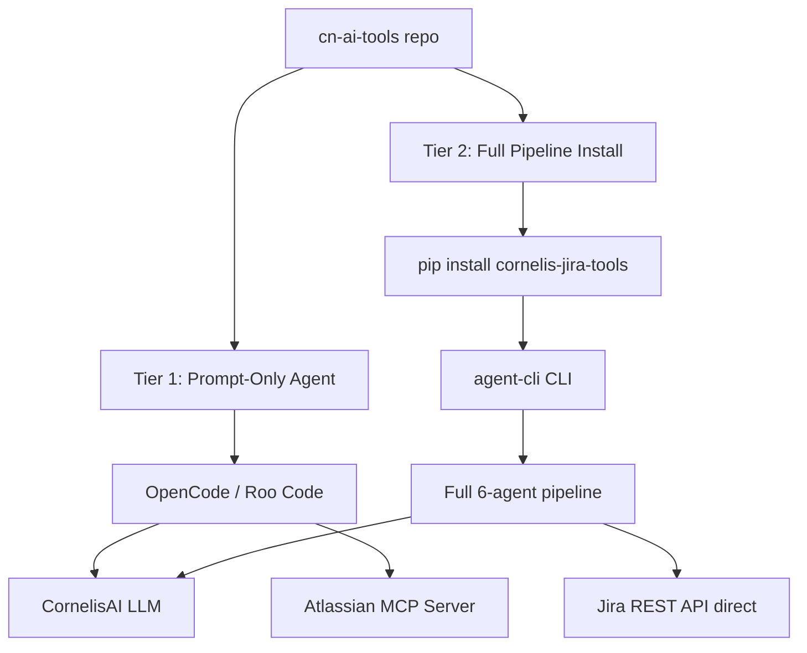

# Sharing the Project Planning Agent via cn-ai-tools

## 1. Assessment: Is cn-ai-tools the Right Mechanism?

### What cn-ai-tools is designed for

The `cn-ai-tools` repo is a **configuration and prompt sharing** platform. Its agents are lightweight — a `prompt.md`, an `agent.json` (model + tool flags), and a `README.md`. They are consumed by **OpenCode** (CLI) and **Roo Code** (VS Code extension) as system prompts that run against the CornelisAI backend. The agents have no runtime code of their own — they delegate to the LLM and optionally to MCP servers for tool access.

### What the project planning agent is

The `jira-utilities` planning pipeline is a **multi-agent Python application** with:

| Component | Files | Nature |
|-----------|-------|--------|
| 6 specialized agents | `agents/*.py` | Python classes with tool registration, state management, LLM orchestration |
| 6 system prompts | `config/prompts/*.md` | Markdown prompt files (compatible with cn-ai-tools format) |
| Tool implementations | `tools/*.py` | Jira API wrappers, MCP client, file tools, web search |
| LLM abstraction | `llm/*.py` | CornelisLLM client, LiteLLM fallback |
| State management | `state/*.py` | Session persistence, workflow state |
| Knowledge base | `data/knowledge/*.md` | Cornelis domain knowledge |
| CLI entry point | `agent_cli.py` | argparse CLI with workflow dispatch |
| Dependencies | `requirements.txt` | jira, openai, litellm, openpyxl, etc. |

This is fundamentally different from a cn-ai-tools agent (prompt + model config). The planning pipeline is a **standalone application** that happens to use LLMs, not a prompt that runs inside OpenCode/Roo Code.

### Verdict: Hybrid approach — YES, but with clear boundaries

cn-ai-tools is the right place for **discovery, documentation, and lightweight prompt-only access**. The full Python pipeline stays in `jira-utilities` as an installable package. cn-ai-tools provides the on-ramp.

---

## 2. Architecture: Two Tiers of Access



### Tier 1: Prompt-Only Agent (lives in cn-ai-tools)

A lightweight agent that any OpenCode or Roo Code user can invoke immediately — no Python install required. It uses the CornelisAI LLM + Atlassian MCP server to:

- Analyze a feature request
- Produce a structured scope and plan as Markdown/JSON
- Optionally create Jira tickets via the Atlassian MCP server

This is a **single-agent simplification** of the full pipeline. It won't have the multi-phase orchestration, but it gives 80% of the value for simple feature requests.

**Where it lives:**
```
common/agents/project-planner/
├── agent.json          # model: developer-opus, tools: cornelis-mcp + atlassian-mcp + write
├── prompt.md           # Consolidated prompt from all 6 agent prompts
├── README.md           # Usage guide, examples, link to full pipeline
└── examples/
    └── sample-plan.json  # Example output
```

### Tier 2: Full Pipeline (lives in jira-utilities, referenced from cn-ai-tools)

The complete multi-agent Python pipeline for users who need:
- Multi-phase orchestration (research → HW analysis → scoping → plan → review → execute)
- Direct Jira API access (bulk ticket creation, hierarchy management)
- Session persistence and resume
- `--plan-file` for re-executing plans
- Excel/CSV export

**Where it lives:** `jira-utilities` repo (unchanged), referenced from cn-ai-tools via:
```
common/agents/project-planner/README.md   # "For the full pipeline, see..."
teams/software/agents/project-planner/    # Symlink or reference to common
```

---

## 3. What Goes Into cn-ai-tools

### 3a. Agent definition: `common/agents/project-planner/agent.json`

```json
{
  "name": "project-planner",
  "description": "Feature-to-Jira planning agent. Analyzes a feature request, scopes SW/FW work, and generates a structured Jira plan with Epics and Stories.",
  "model": "cornelis/developer-opus",
  "mode": "standalone",
  "tools": {
    "cornelis-mcp": true,
    "atlassian-mcp": true,
    "bash": false,
    "edit": false,
    "write": true,
    "webfetch": true
  }
}
```

### 3b. Consolidated prompt: `common/agents/project-planner/prompt.md`

A single Markdown file that distills the key rules from all 6 prompts into one coherent system prompt. This is NOT a copy-paste of all 6 files — it's a purpose-built single-agent prompt that covers:

1. **Research phase** — Analyze the feature request, identify technologies, standards, prior art
2. **Hardware context** — Identify relevant hardware (MCU, ASIC, interfaces) from Cornelis product knowledge
3. **Scoping** — Break down into firmware, driver, tool, and library items with complexity/confidence
4. **Plan generation** — Group into functional-thread Epics, create Stories following Story=Branch rule
5. **Guardrails** — All the rules we've built (no validate items, no integration tickets, no debug-only items, etc.)
6. **Output format** — JSON schema for the plan

### 3c. README with usage examples

Shows how to invoke from both OpenCode and Roo Code:

```bash
# OpenCode
/agent project-planner "We need SPDM 1.2 attestation support on the JKR platform MCU"

# Roo Code — just describe the feature in chat
Plan the Jira project for: SPDM 1.2 attestation support on JKR platform MCU
```

And links to the full pipeline for advanced usage.

### 3d. Skill: `common/skills/run-project-planning/skill.md`

A step-by-step skill that walks users through the full planning workflow:

1. Gather the feature request (text or document)
2. Invoke the project-planner agent
3. Review the generated plan
4. Optionally install the full pipeline for Jira execution

### 3e. Custom command (optional): `common/tools/custom-commands/plan-feature/command.md`

A slash command for OpenCode:
```
/plan-feature "Feature description here"
```

---

## 4. What Stays in jira-utilities

Everything that requires Python runtime:

- All `agents/*.py` files (orchestrator, research, HW analyst, scoping, plan builder, review)
- All `tools/*.py` files (Jira API wrappers, MCP client)
- `agent_cli.py` CLI
- `llm/*.py`, `state/*.py`, `config/*.py`
- `data/knowledge/*.md` (though these could be duplicated or symlinked)
- `requirements.txt`, `pyproject.toml`

The `config/prompts/*.md` files are the **source of truth** for the full pipeline's agent prompts. The cn-ai-tools `prompt.md` is a **derived, consolidated** version for single-agent use.

---

## 5. Keeping Prompts in Sync

The biggest risk is prompt drift — the cn-ai-tools `prompt.md` diverging from the jira-utilities `config/prompts/*.md` files.

### Options

| Approach | Pros | Cons |
|----------|------|------|
| **A. Manual sync** — update cn-ai-tools when jira-utilities prompts change | Simple | Easy to forget |
| **B. Build script** — a script in jira-utilities that generates the consolidated prompt | Automated, single source of truth | Adds build step |
| **C. Reference only** — cn-ai-tools README just points to jira-utilities, no prompt copy | No drift possible | Users can't use Tier 1 without installing jira-utilities |

**Recommendation: Option B** — Add a `scripts/export-prompt.py` to jira-utilities that reads all 6 `config/prompts/*.md` files and produces a consolidated `project-planner-prompt.md`. Run it as part of the release process. The output is committed to cn-ai-tools.

---

## 6. Atlassian MCP Server Dependency

The Tier 1 agent needs the Atlassian MCP server to create Jira tickets. Currently `atlassian-mcp.json` in cn-ai-tools is disabled with a placeholder URL. For the project-planner agent to work end-to-end:

1. The Atlassian MCP server needs to be deployed and configured
2. Users need their Atlassian token in `.env`
3. The MCP server needs to support ticket creation (not just read)

If the Atlassian MCP server isn't ready, Tier 1 can still generate the plan as JSON — users just can't auto-create tickets. They'd use `--plan-file` in the full pipeline for that.

---

## 7. Implementation Plan

### Phase 1: cn-ai-tools agent entry (Tier 1)

- [ ] Write consolidated `prompt.md` from the 6 agent prompts
- [ ] Create `common/agents/project-planner/agent.json`
- [ ] Create `common/agents/project-planner/README.md` with usage examples
- [ ] Add example output `common/agents/project-planner/examples/sample-plan.json`
- [ ] Register in `AGENTS.md` catalog
- [ ] Create `common/skills/run-project-planning/skill.md`
- [ ] PR to cn-ai-tools

### Phase 2: jira-utilities packaging improvements

- [ ] Add `scripts/export-prompt.py` to generate consolidated prompt
- [ ] Improve `README.md` installation section for non-developers
- [ ] Add `--plan-file` usage to README
- [ ] Ensure `pipx install` works cleanly for the full pipeline
- [ ] Tag a release version

### Phase 3: Integration (optional, depends on Atlassian MCP)

- [ ] Enable Atlassian MCP server for ticket creation
- [ ] Add MCP-based ticket creation to the Tier 1 prompt
- [ ] Create custom command `/plan-feature` for OpenCode

---

## 8. Summary

| Question | Answer |
|----------|--------|
| Is cn-ai-tools the right place? | **Yes, for discovery and lightweight access** |
| Does the full pipeline move to cn-ai-tools? | **No** — it stays in jira-utilities as a pip-installable package |
| What goes in cn-ai-tools? | Agent definition, consolidated prompt, README, skill, examples |
| How do users get the full pipeline? | `pipx install /path/to/jira-utilities --editable --pip-args='.[agents]'` |
| How do we prevent prompt drift? | Build script in jira-utilities generates the consolidated prompt |
| What's the biggest dependency? | Atlassian MCP server for Tier 1 ticket creation |
